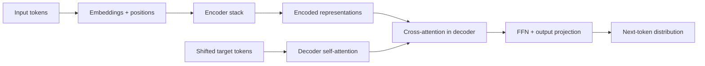
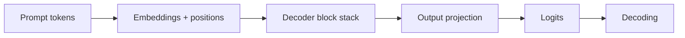
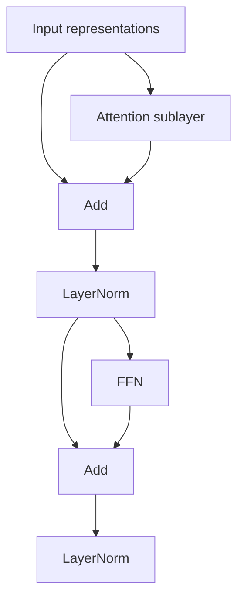
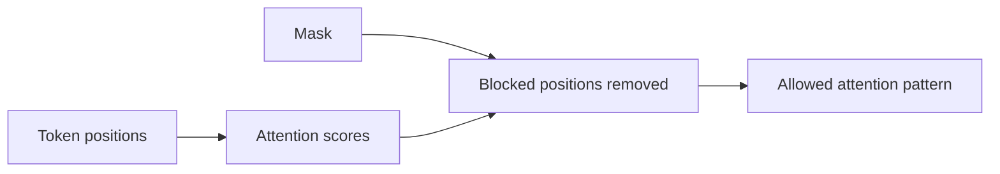
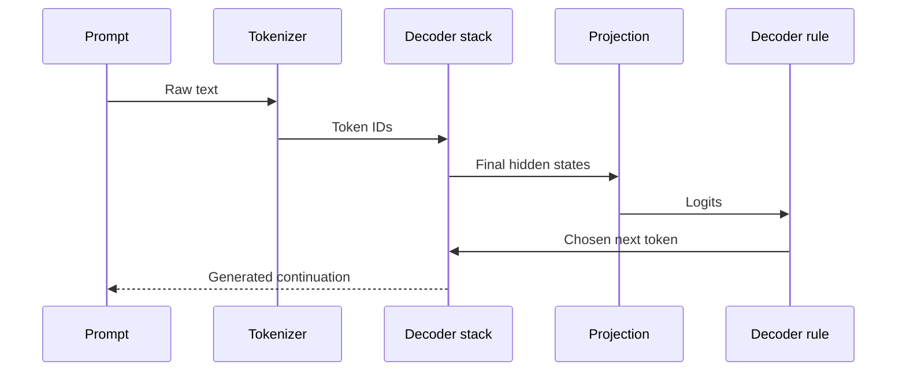

---
tags:
  - llm
  - transformer
  - attention
  - architecture
type: note
status: draft
source: "Google Research, Hugging Face"
parent_note: "[[LLM Foundations - MOC]]"
---

# สถาปัตยกรรม Transformer

---

## ขอบเขตของโน้ตนี้

โน้ตนี้อธิบาย **architecture-level view** ของ Transformer:
- ทำไม Transformer ถึงเป็นจุดเปลี่ยน
- encoder, decoder, encoder-decoder ต่างกันอย่างไร
- block หนึ่งก้อนมีอะไรบ้าง
- masking และ positional information คืออะไร

ถ้าต้องการคณิตศาสตร์ของ attention และ representation เชิงลึก ให้ดู [[06 - Attention และ Representations]]

---

## ทำไม Transformer ถึงเป็นจุดเปลี่ยน

งาน **Attention Is All You Need** ของ Google Research เสนอ architecture ที่พึ่ง attention เป็นแกนหลัก แทนการพึ่ง recurrence หรือ convolution

ผลสำคัญ:
- parallelize การฝึกได้ดีขึ้น
- จับ long-range dependencies ได้ดี
- scale ได้ดีมากเมื่อมี data และ compute เพียงพอ

---

## โครงสร้างระดับสูงของ Transformer ดั้งเดิม

Transformer ดั้งเดิมเป็น **encoder-decoder architecture**



สรุปหน้าที่:
- **Encoder** สร้าง representations ของ input
- **Decoder** ใช้ input representations และ generated prefix เพื่อทำนาย output

---

## แต่ LLM สมัยใหม่จำนวนมากเป็น Decoder-only

แม้ Transformer ดั้งเดิมจะเป็น encoder-decoder แต่ LLM สำหรับ chat และ text generation ปัจจุบันจำนวนมากเป็น **decoder-only**



เหตุผลที่สำคัญ:
- งาน generate text แบบ autoregressive เข้ากับ decoder-only ได้ตรง
- serving และ scaling ecosystem ส่วนใหญ่ของ LLM ไปทางนี้

---

## Transformer Block มีอะไรบ้าง

ถ้ามองระดับ architecture หนึ่ง block โดยทั่วไปจะประกอบด้วย:
- **Attention sublayer**
- **Residual connection**
- **Layer normalization**
- **Feed-forward network (FFN)**
- **Residual + normalization** อีกรอบ



architecture-level intuition:
- attention = ผสมข้อมูลข้ามตำแหน่ง
- FFN = แปลง representation ต่อแต่ละตำแหน่ง
- residual + norm = ทำให้ stack ลึกขึ้นได้โดยฝึกเสถียรขึ้น

---

## Self-attention vs Cross-attention

| ประเภท | มองข้อมูลจากไหน | ใช้ใน |
|---|---|---|
| **Self-attention** | ลำดับเดียวกัน | encoder และ decoder |
| **Cross-attention** | query จาก decoder, key/value จาก encoder | encoder-decoder models |

สรุป:
- decoder-only LLM ใช้ self-attention แบบ causal เป็นหลัก
- seq2seq models ใช้ทั้ง self-attention และ cross-attention

---

## Positional Information ทำไมต้องมี

attention เองไม่ได้บอกว่า token ใดมาก่อนหรือมาหลัง  
จึงต้องใส่ **positional information** เพิ่มเข้าไป

ตัวอย่างแนวทาง:
- **sinusoidal positional encoding** ใน Transformer ดั้งเดิม
- **learned positional embeddings**
- **RoPE (Rotary Position Embedding)** ในโมเดลสมัยใหม่หลายตัว

---

## Masking คืออะไร

masking เป็นกติกาว่า token หนึ่ง "มีสิทธิ์เห็น" token อื่นหรือไม่

| Mask type | ใช้ทำอะไร |
|---|---|
| **Causal mask** | ห้าม decoder เห็น future tokens |
| **Padding mask** | กันไม่ให้ padding มีผลต่อ attention |
| **MLM mask** | ใช้ใน masked language modeling แบบ BERT |



---

## Encoder-only, Decoder-only, Encoder-decoder

| Architecture | ตัวอย่าง | เหมาะกับ |
|---|---|---|
| **Encoder-only** | BERT | understanding-centric tasks |
| **Decoder-only** | GPT-style | generation, chat, completion |
| **Encoder-decoder** | T5 | translation, summarization, rewriting |

---

## Data Flow ของ Decoder-only LLM



นี่คือ architecture path ระดับสูง  
ส่วนกลไก attention ด้านในจะไปลงลึกใน [[06 - Attention และ Representations]]

---

## อย่าสับสนกับ 3 อย่างนี้

### 1. Architecture vs Checkpoint
- **Architecture** = โครงแบบการคำนวณ
- **Checkpoint** = weights ที่ฝึกแล้ว

### 2. Transformer ดั้งเดิม vs GPT-style LLM
- Transformer paper ดั้งเดิม = encoder-decoder
- GPT-style LLM ที่ใช้กันมาก = decoder-only

### 3. Attention vs Entire Transformer
- attention เป็นกลไกหลัก
- แต่ Transformer ยังมี FFN, residual, normalization, masking, positions ด้วย

---

## Mental Model

```text
Transformer is a stack of blocks that repeatedly mix context across tokens
and refine each token representation layer by layer.
```

---

## Official References

- Google Research, Attention Is All You Need  
  https://research.google/pubs/pub46201
- Hugging Face, Encoder-decoder models  
  https://huggingface.co/learn/llm-course/en/chapter1/6
- Hugging Face, Causal language modeling  
  https://huggingface.co/docs/transformers/en/tasks/language_modeling

---

## ดูต่อ

- [[06 - Attention และ Representations]] — attention และ representations เชิงลึก
- [[07 - Logits, Decoding และ Sampling]] — hidden states กลายเป็น output tokens อย่างไร
- [[LLM Foundations - MOC]]
