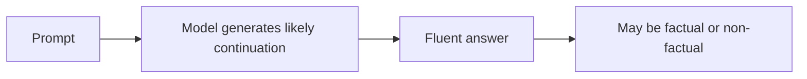
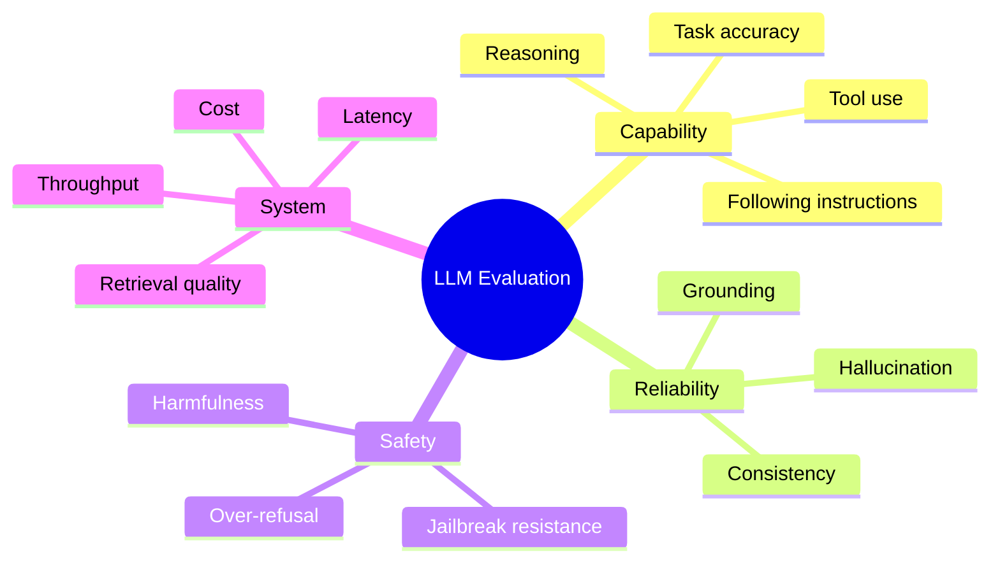

---
tags:
  - llm
  - hallucination
  - evaluation
  - bias
  - limitation
type: note
status: draft
source: "OpenAI, Anthropic"
parent_note: "[[LLM Foundations - MOC]]"
---

# ข้อจำกัดและการประเมินผล LLM

---

## ขอบเขตของโน้ตนี้

โน้ตนี้ตอบ 2 เรื่อง:
- LLM มีข้อจำกัดเชิงโครงสร้างอะไรบ้าง
- ถ้าจะประเมิน LLM ให้ดี ต้องดูมิติไหนบ้าง

เป้าคือแยกให้ออกระหว่าง:
- ปัญหาของ **model**
- ปัญหาของ **system**
- ปัญหาของ **evaluation setup**

---

## Hallucination คืออะไร

LLM ถูก optimize ให้สร้าง token ที่มี probability เหมาะสมตาม learned distribution ไม่ได้ถูก optimize ให้รับประกันความจริงเชิงข้อเท็จจริง

ผลคือมันอาจ:
- สร้างข้อมูลที่ฟังดูน่าเชื่อถือแต่ผิด
- ผสม fact จริงกับ fact เท็จ
- ตอบเกินหลักฐานที่มีใน prompt หรือ retrieved evidence



ประโยคที่ควรจำ:

```text
Fluency is not the same as factuality.
```

---

## Bias และ Data Dependence

โมเดลสะท้อน pattern จาก training data และ post-training pipeline

ความเสี่ยงที่พบบ่อย:
- cultural or language skew
- representation bias
- toxicity หรือ stereotype บางแบบ
- refusal behavior ที่มากไปหรือน้อยไป

alignment ช่วยปรับ behavior ได้บางส่วน แต่ไม่ใช่การลบ bias ออกหมด

---

## Long Context และ Context Failure

Anthropic ชี้ว่าการมี context window ใหญ่ ไม่ได้แปลว่าโมเดลจะใช้ข้อมูลยาว ๆ ได้สมบูรณ์เสมอ

อาการที่พบบ่อย:
- ลืมข้อมูลต้นเอกสาร
- เลือก evidence ผิดชิ้น
- ตอบจาก prior knowledge แทนที่จะตอบจาก context
- โดน noise จากข้อมูลที่ไม่เกี่ยวข้อง

นี่คือเหตุผลที่ **context engineering** และ **retrieval quality** สำคัญมาก

---

## Alignment Trade-offs

OpenAI และ Anthropic ต่างสะท้อนตรงกันว่าการปรับ behavior ให้ safe/helpful มากขึ้น มักมี trade-off

ตัวอย่าง trade-offs:
- safe ขึ้น แต่ตอบแคบลง
- refusal ดีขึ้น แต่บางครั้ง over-refuse
- helpful ขึ้น แต่บางครั้งยังตอบมั่นใจเกินจริง

ดังนั้น:
- alignment != factuality
- alignment != universal usefulness

---

## ข้อจำกัดของ Benchmark

benchmark score สูง ไม่ได้แปลว่าใช้งานจริงดีเสมอไป

ความเสี่ยงของ benchmark:
- contamination หรือ data leakage
- ไม่ตรงกับ workflow จริง
- วัดเฉพาะ final answer แต่ไม่วัด UX, latency, หรือ system robustness
- ไม่สะท้อน failure mode ใน production

---

## Evaluation ต้องดูหลายมิติ



หลักคิด:
- model eval อย่างเดียวไม่พอ
- system eval อย่างเดียวก็ไม่พอ
- ต้องดูทั้ง capability, reliability, safety, และ operational quality

---

## Model Risk vs System Risk

| ความเสี่ยง | ตัวอย่าง |
|---|---|
| **Model risk** | hallucination, bias, poor reasoning, unstable refusal |
| **System risk** | prompt injection, bad retrieval, context overflow, unsafe orchestration |

สรุป:
- บางคำตอบผิดเพราะ model
- บางคำตอบผิดเพราะระบบรอบ model
- ถ้าไม่แยกสองอย่างนี้ การแก้ปัญหาจะผิดจุด

---

## แนวทางประเมินที่ใช้งานได้จริง

- สร้าง evals ตาม use case จริง ไม่ใช่พึ่ง benchmark สาธารณะอย่างเดียว
- วัดทั้ง quality และ failure modes
- ทดสอบกับ adversarial inputs และ long-context cases
- วัด retrieval quality ถ้าใช้ RAG
- วัด latency และ cost ควบคู่ไปด้วย

---

## อย่าสับสนกับ 4 อย่างนี้

### 1. Hallucination vs Lying
- hallucination มักเป็น failure ของ generation
- ไม่จำเป็นต้องหมายถึงเจตนา "โกหก"

### 2. ปลอดภัย vs มีประโยชน์
- model ที่ปลอดภัยขึ้น อาจไม่ได้ useful ขึ้นทุกกรณี

### 3. Good benchmark vs Good product
- benchmark ดี ไม่ได้การันตี product quality

### 4. Model eval vs System eval
- system ที่ใช้ retrieval, tools, memory ต้องประเมินทั้ง stack

---

## Mental Model

```text
An LLM is a probabilistic generator inside a larger system.
To evaluate it well, you must test both the model and the system around it.
```

---

## Official References

- OpenAI, Working with evals  
  https://platform.openai.com/docs/guides/evals?lang=javascript
- OpenAI Cookbook, Getting Started with OpenAI Evals  
  https://cookbook.openai.com/examples/evaluation/getting_started_with_openai_evals
- Anthropic, Using the Evaluation Tool  
  https://docs.anthropic.com/en/docs/test-and-evaluate/eval-tool
- Anthropic, Long context prompting tips  
  https://docs.anthropic.com/en/docs/build-with-claude/prompt-engineering/long-context-tips

---

## ดูต่อ

- [[04 - Inference, Context และ RAG]] — runtime และ context-related failure modes
- [[09 - Serving Metrics และระบบ Production LLM]] — system metrics และ production trade-offs
- [[02 AI Systems/Evals/Evals - MOC|Evals - MOC]] — การประเมิน prompts, RAG, agents, และระบบ production
- [[02 AI Systems/Guardrails/Guardrails - MOC|Guardrails - MOC]] — การควบคุมความเสี่ยงและข้อจำกัดในระบบ AI จริง
- [[LLM Foundations - MOC]]
