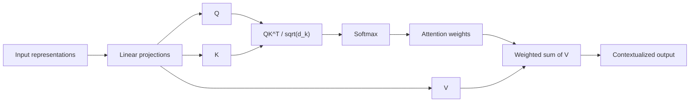
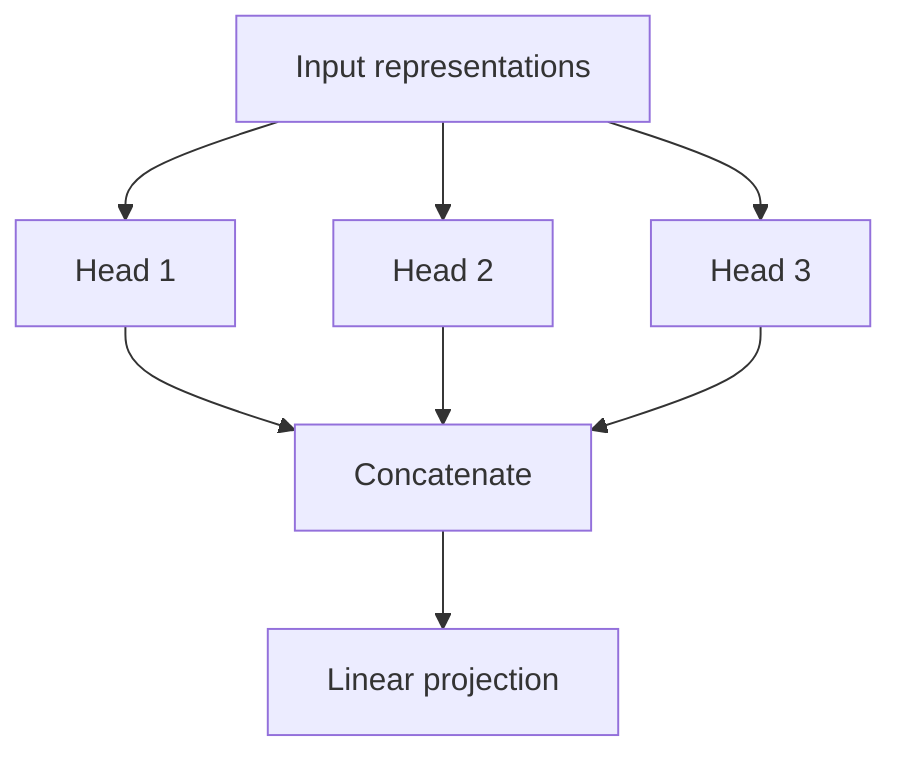
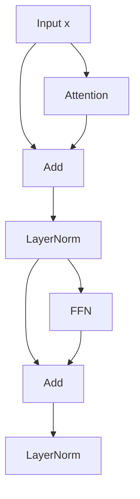
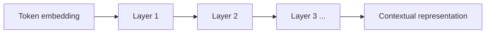

---
tags:
  - llm
  - attention
  - transformer
  - multihead
  - representation
type: note
status: evergreen
source: "Google Research, Hugging Face"
parent_note: "[[LLM Foundations - MOC]]"
---

# Attention และ Representations

---

## ขอบเขตของโน้ตนี้

โน้ตนี้ลงลึกที่ **mechanism-level view** ของ Transformer:
- scaled dot-product attention ทำงานอย่างไร
- Q, K, V คืออะไร
- multi-head attention เพิ่มอะไร
- FFN, residual, LayerNorm ช่วยอะไร
- ทำไม hidden states ถึงกลายเป็น contextual representations

ถ้าต้องการภาพ architecture ก่อน ให้ดู [[02 - สถาปัตยกรรม Transformer]]

---

## Scaled Dot-Product Attention

attention เวอร์ชันหลักใน Transformer นิยามได้เป็น:

```text
Attention(Q, K, V) = softmax(QK^T / sqrt(d_k)) V
```

ความหมายของแต่ละตัว:
- `Q` = **query**
- `K` = **key**
- `V` = **value**



Intuition:
- query ของตำแหน่งปัจจุบันใช้วัดว่า "ควรมอง token ไหนบ้าง"
- key ของทุกตำแหน่งใช้เป็นตัวเปรียบเทียบ
- value คือข้อมูลที่จะถูกนำมารวมตามน้ำหนัก attention

---

## ทำไมต้องหารด้วย sqrt(d_k)

Google อธิบายใน Transformer paper ว่าเมื่อ dimensionality โตขึ้น ค่า dot products อาจมี magnitude สูงจนทำให้ softmax ชันเกินไป

ผลที่ต้องระวัง:
- softmax saturation
- gradients ไม่เสถียร

การหารด้วย `sqrt(d_k)` จึงเป็น scaling factor เพื่อให้ optimization ดีขึ้น

---

## Self-attention ทำอะไร

ใน **self-attention**:
- Q, K, V มาจากลำดับเดียวกัน
- token แต่ละตัวสามารถผสมข้อมูลจาก token อื่นในลำดับเดียวกันได้

ผลที่ได้:
- ความหมายของ token ขึ้นกับบริบทจริง
- long-range dependencies ถูกเชื่อมโดยตรง
- คำเดียวกันในคนละประโยคมี representation ต่างกันได้

---

## Multi-head Attention ช่วยอะไร

แทนที่จะมี attention เพียงชุดเดียว Transformer ใช้หลายหัวพร้อมกัน



intuition เชิงหน้าที่:
- แต่ละ head สามารถเน้น pattern คนละแบบ
- เช่น local relation, long-range relation, co-reference, หรือ structural cues

ข้อสำคัญ:
- ไม่ควรตีความว่าแต่ละ head มี "หน้าที่ตายตัว" เสมอ
- แต่ multi-head ช่วยให้ model มีหลาย representation subspaces ให้เรียนรู้พร้อมกัน

---

## Feed-Forward Network ทำอะไร

หลัง attention แต่ละตำแหน่งจะผ่าน **feed-forward network (FFN)** ต่อ

บทบาทของ FFN:
- แปลง representation ภายในแต่ละตำแหน่ง
- เพิ่ม nonlinearity
- ช่วยให้ model ไม่ได้มีแต่การผสมข้อมูลข้ามตำแหน่งอย่างเดียว

สรุปสั้น:
- attention = communication across tokens
- FFN = transformation within each token position

---

## Residual Connection และ LayerNorm

Transformer stack ลึกมากได้เพราะยังมี:
- **Residual connections**
- **Layer normalization**



intuition:
- residual ช่วยให้สัญญาณเดิมไหลผ่านได้
- LayerNorm ช่วยให้ training เสถียรมากขึ้น

---

## Positional Information ทำให้ลำดับมีความหมาย

attention เพียงอย่างเดียวไม่บอก order  
จึงต้องผสม positional information เข้าไปก่อนหรือระหว่างการคำนวณ

สิ่งนี้ทำให้ representation รู้ว่า:
- token อยู่ตำแหน่งไหน
- token สองตัวห่างกันอย่างไรโดยประมาณ

---

## Contextual Representations คืออะไร

ก่อนเข้า Transformer:
- token มี embedding เริ่มต้น

หลังผ่านหลายชั้น:
- token แต่ละตัวกลายเป็น **contextual representation**



ผลที่ตามมา:
- token เดียวกันอาจมี hidden state ต่างกันมากตามบริบท
- representation สุดท้ายจึงพร้อมให้ output layer แปลงเป็น logits

---

## Encoder Attention vs Decoder Attention

| กลไก | มองอะไรได้ |
|---|---|
| **Encoder self-attention** | มองได้ทั้งซ้ายและขวา |
| **Decoder self-attention** | มองได้เฉพาะอดีต เพราะมี causal mask |
| **Cross-attention** | decoder query มอง encoder outputs |

---

## อย่าสับสนกับ 4 อย่างนี้

### 1. Attention weights vs Importance
- attention weights ช่วยอธิบายการรวมข้อมูล
- แต่ไม่ควรถูกตีความว่าเป็นคำอธิบายเชิงสาเหตุทั้งหมดของ model behavior

### 2. Embedding vs Contextual Representation
- embedding ยังไม่ผสมบริบท
- contextual representation ผสมบริบทแล้ว

### 3. Attention vs FFN
- attention ผสมข้อมูลข้ามตำแหน่ง
- FFN แปลงข้อมูลภายในตำแหน่ง

### 4. Transformer Block vs Whole Model
- block เป็นหน่วยย่อย
- model จริงคือ stack ของหลาย block

---

## Mental Model

```text
Attention decides what information each token should read from other tokens.
FFN transforms the resulting representation.
Stacking many such layers produces contextual meaning.
```

---

## Official References

- Google Research, Attention Is All You Need  
  https://research.google/pubs/pub46201
- Hugging Face, Encoder-decoder models  
  https://huggingface.co/learn/llm-course/en/chapter1/6

---

## ดูต่อ

- [[07 - Logits, Decoding และ Sampling]] — representations ถูกแปลงเป็น token outputs อย่างไร
- [[02 - สถาปัตยกรรม Transformer]] — architecture-level overview
- [[LLM Foundations - MOC]]
