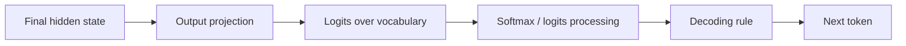
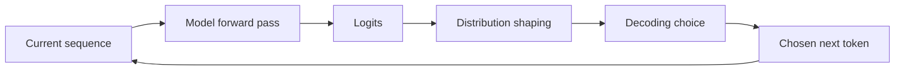
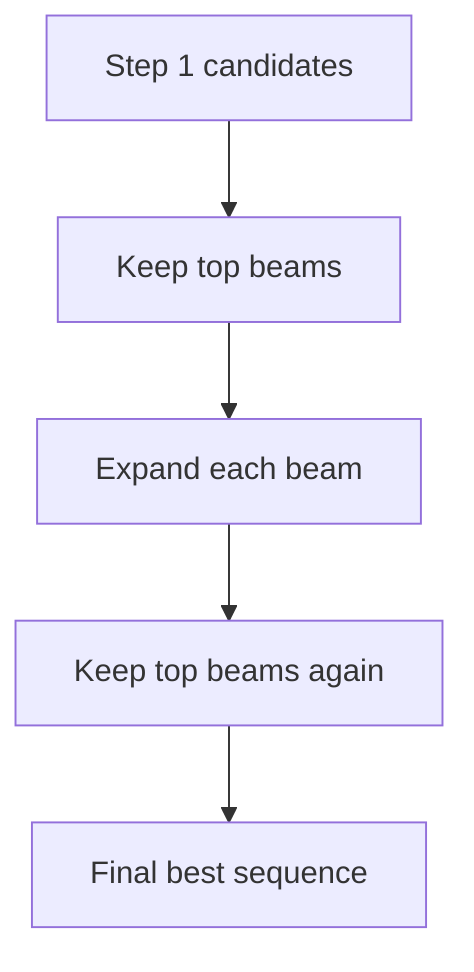

---
tags:
  - llm
  - decoding
  - sampling
  - temperature
  - logits
type: note
status: draft
source: "Hugging Face, OpenAI"
parent_note: "[[LLM Foundations - MOC]]"
---

# Logits, Decoding และ Sampling

---

## ขอบเขตของโน้ตนี้

โน้ตนี้ตอบว่า หลัง model ได้ hidden states แล้ว:
- logits คืออะไร
- softmax ทำอะไร
- greedy, sampling, beam search ต่างกันอย่างไร
- temperature, top-k, top-p เปลี่ยน output อย่างไร

นี่คือเรื่องของ **generation behavior at runtime**  
ไม่ใช่เรื่อง training weights

---

## Logits คืออะไร

หลัง model ประมวลผล sequence ปัจจุบันเสร็จ มันจะให้คะแนนหนึ่งชุดสำหรับ token ทุกตัวใน vocabulary คะแนนนี้เรียกว่า **logits**

สิ่งที่ควรเข้าใจ:
- logits ยังไม่ใช่ probabilities
- logits สูงกว่า หมายถึงโมเดลโน้มเอียงไปทาง token นั้นมากกว่า
- output layer จะใช้ logits เป็นฐานสำหรับการเลือก token ถัดไป



---

## Softmax ทำอะไร

softmax แปลง logits ให้เป็น probability distribution

ผลที่ได้:
- ทุกค่าจะอยู่ระหว่าง 0 และ 1
- ผลรวมของ probabilities เท่ากับ 1

softmax ไม่ได้สร้าง knowledge ใหม่  
มันแค่เปลี่ยนคะแนนดิบให้กลายเป็น distribution ที่สุ่มหรือเลือกได้

---

## Generation Loop



คำว่า **decoding** คือกฎที่ใช้เลือก token ถัดไปจาก logits/probabilities

---

## Greedy Decoding

**Greedy decoding** เลือก token ที่ probability สูงสุดทุก step

ข้อดี:
- simple
- deterministic
- latency ต่ำ

ข้อเสีย:
- มักติด repetitive patterns
- เลือก locally best token แต่ไม่ได้หมายถึง globally best sequence

---

## Sampling

**Sampling** หรือ multinomial sampling คือการสุ่ม token ตาม probability distribution

ข้อดี:
- diversity สูงขึ้น
- ลด determinism
- เหมาะกับ open-ended generation มากกว่า greedy ในหลายกรณี

ข้อเสีย:
- ถ้าปล่อย distribution กว้างเกินไป output อาจ noisy
- run เดียวกันอาจได้ผลต่างกัน

---

## Beam Search

**Beam search** เก็บหลาย candidate sequences พร้อมกัน แล้วเลือก sequence ที่มี cumulative score ดีกว่าในภาพรวม



เหมาะกับ:
- translation
- speech recognition
- tasks ที่ต้องการ output grounded กับ input สูง

ไม่ใช่ default ที่ดีที่สุดสำหรับ open-ended chat

---

## Temperature

temperature ใช้ปรับ shape ของ distribution ก่อน sampling

| ค่า | ผล |
|---|---|
| `temperature < 1` | distribution คมขึ้น, conservative มากขึ้น |
| `temperature = 1` | baseline |
| `temperature > 1` | distribution แบนขึ้น, exploratory มากขึ้น |

ประโยคที่ควรจำ:

```text
Temperature changes randomness in token selection.
It does not change the model's weights.
```

---

## Top-k และ Top-p

ทั้งสองอย่างใช้ตัด candidate tokens ก่อน sampling

| Parameter | ความหมาย |
|---|---|
| `top_k` | เก็บเฉพาะ token ที่คะแนนสูงสุด k ตัว |
| `top_p` | เก็บ token จำนวนน้อยที่สุดที่ cumulative probability ถึง p |

intuition:
- `top_k` คุมจำนวน candidate
- `top_p` คุมมวลความน่าจะเป็น

---

## Stopping Criteria

generation จะหยุดเมื่อ:
- ถึง `max_new_tokens`
- เจอ `eos` token
- เจอ stop sequence ที่ระบบกำหนด

ดังนั้น behavior ของ output ไม่ได้ขึ้นกับ decoding อย่างเดียว แต่ขึ้นกับ stopping policy ด้วย

---

## Decoding เปลี่ยนบุคลิกของ output ได้มาก

น้ำหนัก model เดิมตัวเดียวกันอาจให้ output ต่างกันชัดมาก ถ้าใช้ decoding settings ต่างกัน

```text
Observed behavior = model weights + prompt/context + decoding settings
```

นี่คือเหตุผลที่การเปรียบเทียบ model outputs ต้องระวัง:
- prompt เดียวกัน
- decoding ต่างกัน
- output อาจเปลี่ยนมาก

---

## อย่าสับสนกับ 4 อย่างนี้

### 1. Logits vs Probabilities
- logits เป็นคะแนนดิบ
- probabilities คือผลหลัง softmax

### 2. Greedy vs Beam Search
- greedy มองทีละ step
- beam search เก็บหลาย sequence candidates

### 3. Sampling vs Temperature
- sampling คือวิธีเลือก token แบบสุ่ม
- temperature คือ parameter ที่ปรับ distribution ก่อนสุ่ม

### 4. Decoding vs Training
- decoding เปลี่ยน runtime behavior
- มันไม่เปลี่ยน weights ของโมเดล

---

## Mental Model

```text
The model produces logits.
Decoding turns those logits into a concrete token choice.
Different decoding rules can make the same model behave very differently.
```

---

## Official References

- Hugging Face, Generation strategies  
  https://huggingface.co/docs/transformers/en/generation_strategies
- OpenAI, Text generation  
  https://developers.openai.com/api/docs/guides/text

---

## ดูต่อ

- [[04 - Inference, Context และ RAG]] — decoding loop inside inference
- [[06 - Attention และ Representations]] — hidden states before logits
- [[LLM Foundations - MOC]]
