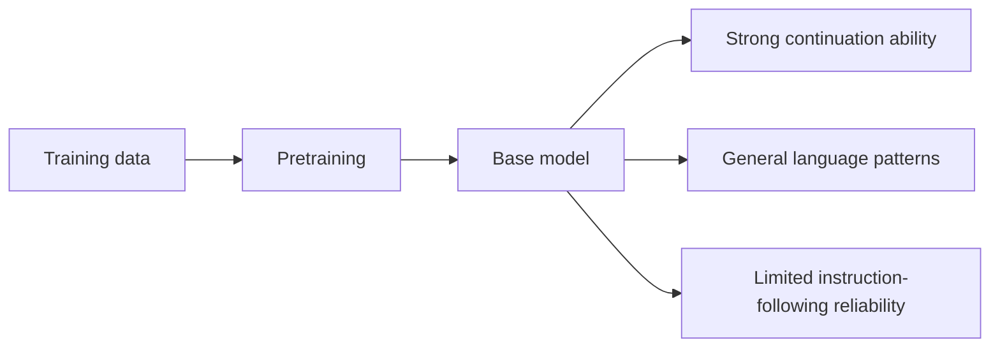
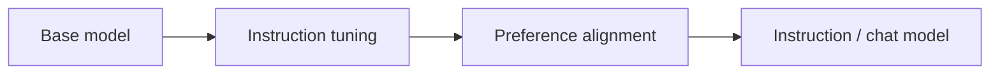
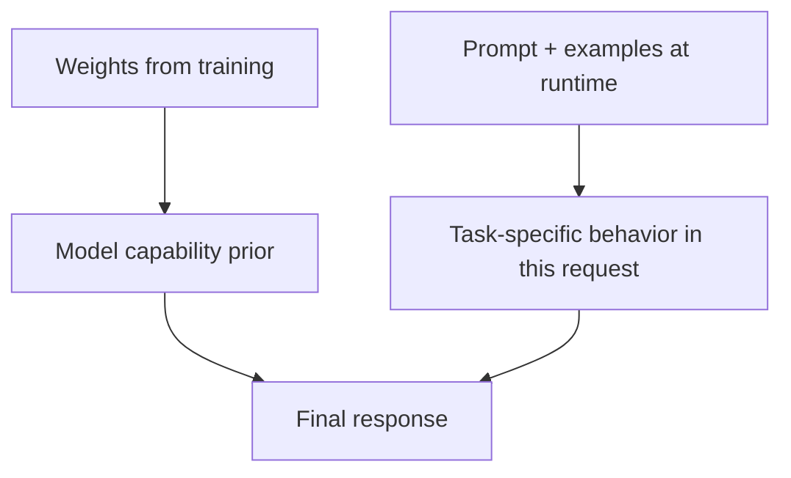

---
tags:
  - llm
  - pretraining
  - basemodel
  - instructiontuning
  - scaling
  - finetuning
type: note
status: draft
source: "OpenAI, Google Research, Google DeepMind"
parent_note: "[[LLM Foundations - MOC]]"
---

# Data, Pretraining และ Model Modes

---

## ขอบเขตของโน้ตนี้

โน้ตนี้ไม่ได้ลงลึก pipeline การฝึกทั้งหมด แต่จะตอบว่า:
- training data shape ความสามารถของโมเดลอย่างไร
- pretraining ทำให้เกิด **base model** แบบไหน
- post-training ทำให้เกิด **instruction model / chat model** อย่างไร
- **in-context learning** ต่างจากการเรียนรู้ใน weights อย่างไร

ถ้าต้องการ training lifecycle แบบเต็ม ให้ดู [[03 - การฝึกและ Post-Training]]

---

## Data สำคัญเพราะอะไร

โมเดลไม่ได้เรียน "ความจริงของโลก" แบบตรง ๆ แต่มันเรียน pattern จาก **training distribution** ที่ป้อนให้

องค์ประกอบสำคัญของ data mixture:
- **quantity** — ปริมาณข้อมูล
- **quality** — ความสะอาดและความน่าเชื่อถือ
- **deduplication** — ลดข้อมูลซ้ำที่บิด training signal
- **domain mixture** — web, books, code, math, instruction data
- **language coverage** — ภาษาไหนถูกแทนมากหรือน้อย
- **filtering** — toxicity, low-quality text, policy-violating content

ข้อสรุปเชิงปฏิบัติ:
- training data มีผลต่อความสามารถและพฤติกรรมพร้อมกัน
- โมเดลที่ architecture คล้ายกันอาจ behavior ต่างกันมากเพราะ data mixture ต่างกัน

---

## Pretraining สอนอะไรโมเดล

ในการ pretraining โมเดลจะ optimize objective ของภาษา เช่น next-token prediction สำหรับ GPT-like models

สิ่งที่ถูกเรียนรู้ไม่ใช่ fact database แบบตรงตัว แต่คือ:
- statistical regularities
- linguistic structure
- latent patterns ของข้อมูลที่เจอ
- ความสามารถบางส่วนที่โผล่มาในรูป few-shot / in-context behavior

สิ่งนี้อธิบายได้ว่าทำไม:
- โมเดลตอบได้หลายงาน
- แต่ยังตอบไม่ตรง intent ของผู้ใช้เสมอ

---

## Base Model คืออะไร

**Base model** คือโมเดลที่ผ่าน pretraining แล้ว แต่ยังไม่ได้ถูก post-train ให้ตอบในบทบาท assistant อย่างจริงจัง

ลักษณะทั่วไป:
- เก่ง continuation
- เก่งเติม pattern ให้สมบูรณ์
- อาจตอบแบบไม่ตรง task framing ของผู้ใช้
- อาจทำตาม instruction ได้บ้างจาก pretraining และ scale แต่ยังไม่เสถียร



OpenAI อธิบายในงาน InstructGPT ว่า GPT-3 ถูกฝึกให้ทำนาย next word บน Internet text ไม่ได้ถูกฝึกโดยตรงให้ทำสิ่งที่ผู้ใช้ต้องการอย่างปลอดภัยและ helpful

---

## Instruction Model / Chat Model คืออะไร

เมื่อเอา base model ไปผ่าน instruction tuning และ alignment ขั้นต่อมา โมเดลจะเปลี่ยน mode จากการ "เติมข้อความให้ต่อเนื่อง" ไปเป็นการ "รับคำสั่งแล้วตอบในรูปแบบผู้ช่วย"



ผลที่เปลี่ยนชัด:
- ตีความคำสั่งได้ดีขึ้น
- รักษา format คำตอบได้ดีขึ้น
- ปฏิเสธหรือระบุข้อจำกัดได้ดีขึ้นในบางกรณี
- ใช้งานผ่าน chat interface ได้เป็นธรรมชาติมากขึ้น

อย่าสรุปเกินจริง:
- chat model ไม่ได้แปลว่าเก่งกว่า base model ทุก task
- ในบางงานเชิง completion, style transfer, หรือ decoding control บางแบบ base model อาจคาดเดาพฤติกรรมง่ายกว่า

---

## อย่าสับสน: Base Model vs Chat Model

| ประเด็น | Base model | Instruction / chat model |
|---|---|---|
| Training stage | mainly pretraining | pretraining + post-training |
| พฤติกรรมเด่น | continuation | instruction following |
| ความเสถียรต่อ user intent | ต่ำกว่า | สูงกว่า |
| การปฏิเสธ / safety policy | จำกัด | โดยทั่วไปชัดกว่า |
| เหมาะกับ | research, completion-style control, adaptation | assistant UX, API/chat use cases |

---

## Fine-tuning, Instruction Tuning, RLHF ต่างกันอย่างไร

| เทคนิค | ทำอะไร |
|---|---|
| **Fine-tuning** | ปรับโมเดลต่อบน dataset เฉพาะงาน |
| **Instruction tuning** | fine-tune บนหลายงานที่เขียนในรูป instruction |
| **RLHF / preference alignment** | ใช้ preference signal เพื่อปรับ behavior ให้ตรงสิ่งที่ต้องการมากขึ้น |

ความสัมพันธ์:
- instruction tuning เป็น fine-tuning แบบหนึ่ง
- RLHF มักเกิดหลัง SFT / instruction tuning
- ทั้งหมดนี้คือ post-training แต่หน้าที่ไม่เหมือนกัน

---

## In-Context Learning คืออะไร

OpenAI GPT-3 แสดงให้เห็นว่าโมเดลสามารถทำงานใหม่จาก prompt และ examples ได้ โดย **ไม่ต้องอัปเดต weights**



แยกให้ขาด:
- **In-weight learning** — สิ่งที่โมเดลเรียนจาก training
- **In-context learning** — สิ่งที่โมเดลทำได้จากข้อมูลใน prompt ตอน runtime

ข้อสำคัญ:
- in-context learning ไม่ใช่ parameter update
- พอจบ request โมเดลไม่ได้ "จำถาวร" สิ่งนั้นลงใน weights

---

## Weights vs Context vs External Memory

นี่เป็นจุดที่คนมักสับสนมากที่สุด

| สิ่งนี้ | อยู่ที่ไหน | เปลี่ยนเมื่อไร |
|---|---|---|
| **Weights** | อยู่ในพารามิเตอร์ของโมเดล | เปลี่ยนตอน training / fine-tuning |
| **Context** | อยู่ใน prompt ของ request ปัจจุบัน | เปลี่ยนทุก request |
| **External memory / RAG** | อยู่ใน database, search index, documents | ถูกดึงเข้ามาตอน runtime |

สรุป:
- โมเดล "รู้" บางอย่างเพราะอยู่ใน weights
- โมเดล "เห็น" บางอย่างเพราะอยู่ใน context
- โมเดล "เข้าถึง" บางอย่างเพราะระบบ runtime ไปดึงมาให้

---

## Scaling Laws และ Chinchilla

OpenAI scaling laws ชี้ว่า loss มีความสัมพันธ์แบบ power law กับ:
- model size
- dataset size
- training compute

DeepMind Chinchilla เพิ่มมุมมองว่า:
- การเพิ่ม parameters อย่างเดียวไม่พอ
- training tokens ต้องสมดุลกับ model size ภายใต้ compute budget

ดังนั้นเวลาพูดว่าโมเดล "ใหญ่กว่า":
- ไม่ได้แปลว่า "ดีกว่า" โดยอัตโนมัติ
- ต้องถามต่อว่าใช้ข้อมูลเท่าไร และฝึกนานแค่ไหน

---

## Mental Model

```text
Data mixture shapes what patterns the model can learn
Pretraining creates a base model
Post-training changes that base model into an assistant-like model
Prompting activates behavior at runtime without changing weights
```

---

## Official References

- OpenAI, Language models are few-shot learners  
  https://openai.com/index/language-models-are-few-shot-learners/
- OpenAI, Aligning language models to follow instructions  
  https://openai.com/index/instruction-following/
- OpenAI paper, Training language models to follow instructions with human feedback  
  https://cdn.openai.com/papers/Training_language_models_to_follow_instructions_with_human_feedback.pdf
- Google Research, Introducing FLAN  
  https://research.google/blog/introducing-flan-more-generalizable-language-models-with-instruction-fine-tuning/
- Google DeepMind, An empirical analysis of compute-optimal large language model training  
  https://deepmind.google/en/blog/an-empirical-analysis-of-compute-optimal-large-language-model-training/

---

## ดูต่อ

- [[03 - การฝึกและ Post-Training]] — training lifecycle และ preference alignment
- [[04 - Inference, Context และ RAG]] — runtime behavior ของ request
- [[LLM Foundations - MOC]]
