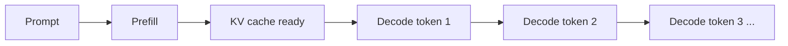
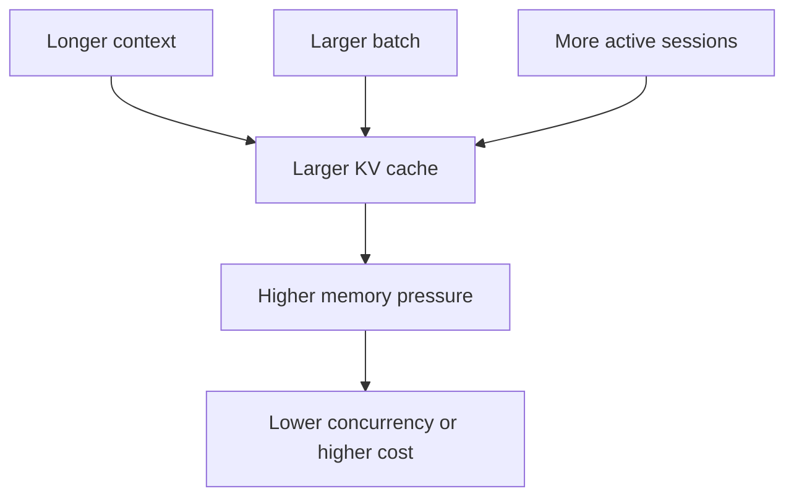
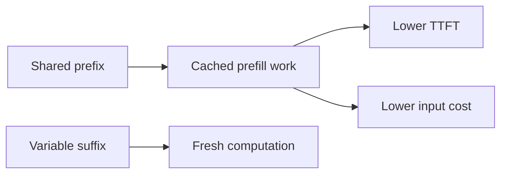
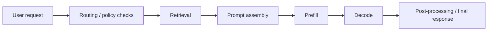

---
tags:
  - llm
  - serving
  - kvcache
  - ttft
  - production
  - rag
type: note
status: evergreen
source: "OpenAI, Anthropic, Hugging Face, NVIDIA"
parent_note: "[[LLM Foundations - MOC]]"
---

# Serving Metrics และระบบ Production LLM

---

## ขอบเขตของโน้ตนี้

ถ้า [[04 - Inference, Context และ RAG]] อธิบายว่า request หนึ่งรอบทำงานอย่างไร  
โน้ตนี้จะตอบว่า:
- ทำอย่างไรให้ระบบตอบเร็วขึ้น
- metric ไหนใช้ดูประสบการณ์ผู้ใช้
- memory, cache, batching, และ concurrency trade-off กันอย่างไร

นี่คือระดับ **serving engineering** ไม่ใช่แค่ model theory

---

## Serving Stack สำคัญเพราะอะไร

ในทางทฤษฎี LLM คือ next-token predictor  
แต่ในระบบจริง ประสบการณ์ผู้ใช้ถูกกำหนดร่วมกันโดย:
- model weights
- hardware
- scheduler
- batching strategy
- cache policy
- retrieval/orchestration pipeline

โมเดลที่ capability ใกล้กัน อาจให้ UX ต่างกันมากถ้า serving stack ต่างกัน

---

## Prefill และ Decode เป็นคนละ phase

| Phase | ทำอะไร | bottleneck หลัก |
|---|---|---|
| **Prefill** | อ่าน prompt ทั้งก้อนและสร้าง KV cache | prompt length, memory bandwidth, prefix reuse |
| **Decode** | สร้าง token ใหม่ทีละตัว | per-token latency, cache access, scheduling |



นัยเชิงระบบ:
- งานที่ prompt ยาวมาก มักเจ็บที่ prefill
- งานที่ตอบยาวมาก มักเจ็บที่ decode

---

## TTFT คืออะไร

**TTFT (Time To First Token)** คือเวลาตั้งแต่ request เริ่ม จน token แรกถูกส่งกลับ

มันสำคัญเพราะ:
- ผู้ใช้รับรู้ความเร็วจาก token แรกก่อนอย่างอื่น
- workflow เชิง interactive เจ็บมากถ้า TTFT สูง

ปัจจัยที่มีผล:
- prefill cost
- queueing / scheduling
- prefix cache hit
- retrieval latency
- memory bandwidth

---

## Throughput กับ Latency ไม่ใช่เรื่องเดียวกัน

| Metric | ใช้ดูอะไร |
|---|---|
| **TTFT** | responsiveness ช่วงเริ่มต้น |
| **Inter-token latency** | ความลื่นไหลระหว่าง generate |
| **Tokens/sec** | ความเร็วการสร้าง output |
| **Requests/sec** | ปริมาณงานรวมที่ระบบรับไหว |

ข้อสำคัญ:
- optimize throughput มากเกินไปอาจทำให้ latency แย่ลง
- optimize latency มากเกินไปอาจเสีย utilization

---

## KV Cache คือ bottleneck สำคัญของ production inference

ในระบบ long-context หรือ high-concurrency ปัญหาไม่ได้อยู่ที่ weights อย่างเดียว แต่รวมถึง KV cache ที่โตตาม:
- model size
- context length
- batch size
- number of concurrent sessions



นี่คือเหตุผลที่ serving engineering สนใจ cache management มากพอ ๆ กับ raw model speed

---

## Cache Strategies และ Trade-off

อิงตามเอกสาร Hugging Face และงานจาก NVIDIA / OpenAI แนวคิดหลักมีดังนี้

| Strategy | จุดเด่น | จุดแลกเปลี่ยน |
|---|---|---|
| **Dynamic cache** | ยืดหยุ่น โตตามจริง | compile/JIT optimization จำกัด |
| **Static cache** | เอื้อต่อ compile และ latency optimization | memory overhead สูงขึ้น |
| **Quantized cache** | ลด memory footprint | อาจเสีย latency หรือ quality บางกรณี |
| **Offloaded cache** | ลด GPU pressure โดยย้าย cache บางส่วนออก | มี transfer overhead |

สิ่งที่ต้องจำ:
- ไม่มี strategy เดียวที่ดีที่สุดทุก workload
- long-context, high-concurrency, และ short interactive chat ต้องการ tuning คนละแบบ

---

## Prefix Reuse และ Prompt Caching

OpenAI อธิบายว่า **prompt caching** คือการ reuse งานจาก prompt prefix ที่เหมือนเดิมเพื่อลด cost และ latency

หลักคิดเชิงระบบ:
- ถ้า prefix ต้น prompt ซ้ำบ่อย ระบบ reuse ได้มากขึ้น
- system prompt หรือ instructions ควรวางไว้ด้านหน้า
- ส่วนที่เปลี่ยนทุก request ควรวางไว้ท้ายกว่า



อย่าสับสน:
- prompt caching เป็น serving-level optimization
- มันไม่ใช่สิ่งเดียวกับ KV cache ภายใน decode loop แม้จะเกี่ยวข้องกัน

---

## RAG อยู่ใน Serving Pipeline ตรงไหน

RAG ไม่ใช่แค่ concept เชิง model แต่เป็นส่วนหนึ่งของ serving/orchestration จริง



ผลเชิงระบบ:
- retrieval latency เพิ่มเข้า path ของ request
- แต่ถ้า retrieval ดี อาจลด hallucination และลด context waste ได้
- RAG ที่แย่ทำให้ทั้งคุณภาพและ latency แย่พร้อมกัน

---

## Serving Metrics ที่ควรติดตาม

| Metric | ความหมาย |
|---|---|
| **TTFT** | เวลาถึง token แรก |
| **Inter-token latency** | เวลาระหว่าง token ต่อ token |
| **Output tokens/sec** | ความเร็ว generation |
| **Throughput** | ปริมาณงานรวมต่อเวลา |
| **Memory footprint** | weights + activations + KV cache |
| **Cache hit rate** | prefix/cache reuse ได้แค่ไหน |
| **Max context / concurrency** | รองรับ context ยาวและจำนวนผู้ใช้พร้อมกันได้เท่าไร |
| **Retrieval latency** | เวลาที่เสียใน RAG/search stage |

---

## Context Engineering ก็เป็นเรื่องของระบบ

Anthropic ชี้ว่า more context ไม่ได้แปลว่า better context  
ใน production นี่แปลว่า:
- ใส่ข้อมูลมากเกินไปอาจเพิ่ม cost โดยไม่เพิ่ม quality
- retrieval ควรคัดเฉพาะ evidence ที่เกี่ยวข้อง
- prompt structure มีผลต่อ cacheability, latency, และ groundedness

---

## Mental Model ของ Production LLM

```text
Capability comes from the model
Responsiveness comes from the serving stack
Groundedness often depends on retrieval and prompt assembly
Cost depends on token volume, cache reuse, and hardware efficiency
```

---

## Official References

- OpenAI, Prompt caching  
  https://developers.openai.com/api/docs/guides/prompt-caching
- OpenAI, Reasoning models  
  https://developers.openai.com/api/docs/guides/reasoning
- Anthropic, Context windows  
  https://docs.anthropic.com/en/docs/build-with-claude/context-windows
- Anthropic, Long context prompting tips  
  https://docs.anthropic.com/en/docs/build-with-claude/prompt-engineering/long-context-tips
- Hugging Face, KV cache strategies  
  https://huggingface.co/docs/transformers/en/kv_cache
- NVIDIA, How to Reduce KV Cache Bottlenecks with NVIDIA Dynamo  
  https://developer.nvidia.com/blog/how-to-reduce-kv-cache-bottlenecks-with-nvidia-dynamo/

---

## ดูต่อ

- [[04 - Inference, Context และ RAG]] — runtime concepts ระดับ request
- [[05 - ข้อจำกัดและการประเมินผล LLM]]
- [[02 AI Systems/RAG/RAG - MOC|RAG - MOC]] — ดูฝั่ง retrieval, context assembly, และ RAG evaluation ในระดับระบบ
- [[02 AI Systems/Evals/Evals - MOC|Evals - MOC]] — เชื่อม serving metrics กับ quality metrics และ regression tracking
- [[LLM Foundations - MOC]]
