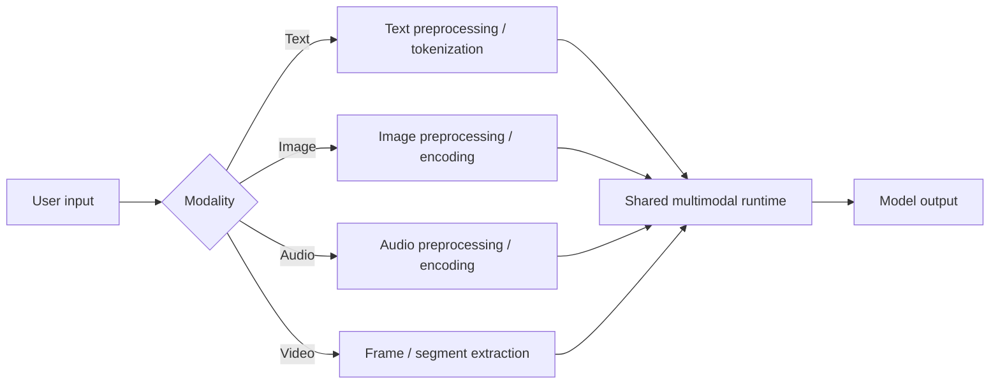
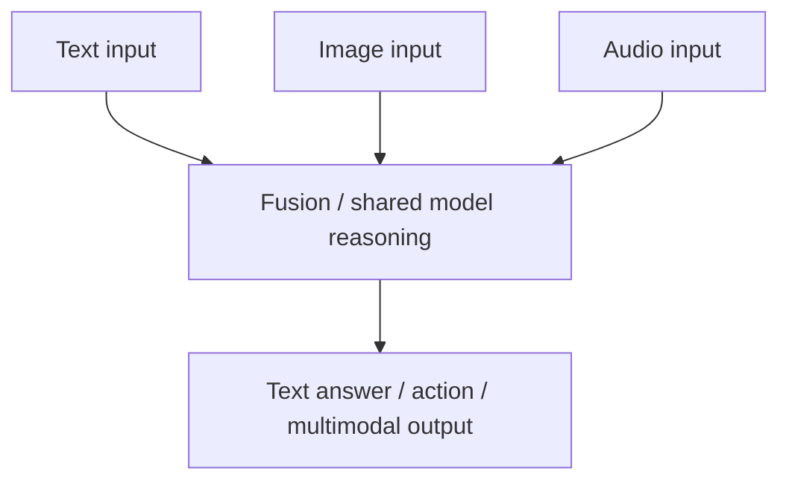

---
tags:
  - llm
  - multimodal
  - vision
  - audio
type: note
status: evergreen
source: "OpenAI, Google AI for Developers, Anthropic Docs, Microsoft Learn"
parent_note: "[[LLM Foundations - MOC]]"
---
# Multimodal Foundations

> โน้ตแกนสำหรับอธิบายว่าระบบ multimodal รับและเชื่อมข้อมูลหลาย modality อย่างไร เช่น text, image, audio, และ video และสิ่งนี้เปลี่ยนสถาปัตยกรรมของ LLM systems อย่างไร

---

## Summary

multimodal system คือระบบที่รับหรือสร้างข้อมูลได้มากกว่าหนึ่ง modality เช่น:
- text
- image
- audio
- video
- documents/PDFs

OpenAI อธิบาย vision และ image generation ในกรอบของ multimodal models  
Google ระบุว่า Gemini models ถูกออกแบบมาให้เป็น multimodal ตั้งแต่ต้น  
Anthropic รองรับ image/PDF understanding  
Microsoft ใช้คำว่า multimodal chat apps และ multimodal LLMs ในงานที่รับทั้งข้อความและภาพ

ในเชิงสถาปัตย์ multimodal ทำให้ input pipeline, token budgeting, latency, validation, และ evaluation ซับซ้อนขึ้นกว่าระบบ text-only อย่างมีนัยสำคัญ

---

## Multimodal ต่างจาก Text-Only อย่างไร

text-only LLM:
- รับข้อความเป็นหลัก
- แทน input เป็น token sequences
- reasoning และ generation อยู่บน text context เป็นหลัก

multimodal model:
- รับ input ได้หลาย modality
- ต้องมีวิธีแปลงแต่ละ modality ให้กลายเป็น internal representation ที่ model ใช้งานได้
- อาจ generate output ได้หลาย modality เช่น text, image, หรือ audio ขึ้นกับ model family

สรุป:
- text-only คือ special case หนึ่งของ broader multimodal systems
- multimodal ไม่ได้แปลว่า “เก่งทุก modality เท่ากัน” แต่แปลว่ามี runtime ที่รองรับมากกว่าหนึ่งรูปแบบข้อมูล

---

## Modalities ที่พบบ่อย

modalities ที่พบบ่อยในระบบสมัยใหม่:
- text
- image
- audio
- video
- PDF / document pages

การจัดกลุ่มนี้สำคัญเพราะแต่ละ modality มีผลต่อ:
- preprocessing
- storage format
- token counting
- latency
- evaluation criteria

---

## Input Pipeline เชิงสถาปัตย์

ภาพนี้ชี้ว่า multimodal architecture ต้องมีอย่างน้อย:
- modality-specific preprocessing
- representation layer
- shared runtime or fusion layer

นี่คือจุดที่ต่างจาก text-only systems อย่างชัดเจน

---

## Representation: แต่ละ Modality ถูกแปลงอย่างไร

ในระดับ conceptual architecture:
- text มักผ่าน tokenization
- image ต้องผ่าน visual encoding หรือ image understanding path
- audio ต้องผ่าน speech/audio representations
- video มักถูกย่อยเป็น frames หรือ segments ก่อนประมวลผล

Google ระบุว่าระบบ vision ของ Gemini รองรับงานอย่าง captioning, VQA, object detection, segmentation  
OpenAI ระบุว่าภาพสามารถถูกส่งเป็น input ให้ model วิเคราะห์ได้ และ image inputs ก็นับเป็น tokens / billed input  
Anthropic รองรับ image และ PDF understanding ซึ่งในทางสถาปัตย์หมายถึง model runtime ต้องรับ document/visual content ได้

สรุป:
- multimodal input ไม่ได้เข้าสู่ model “ดิบ ๆ”
- มันต้องถูกแปลงเป็น representation ที่ runtime ของ model รองรับก่อน

---

## Fusion: modality ต่าง ๆ มารวมกันตรงไหน

คำว่า fusion ในโน้ตนี้ใช้ในความหมายเชิงสถาปัตย์กว้าง ๆ คือการทำให้สัญญาณจากหลาย modality ถูกตีความร่วมกันใน task เดียว

ตัวอย่าง:
- image + text question -> visual question answering
- audio + system instruction -> voice assistant response
- PDF pages + user question -> document QA
- multiple images + text prompt -> comparison or grounding

ในทางปฏิบัติ vendor docs มักไม่ได้เปิดเผย low-level internal fusion design ทั้งหมด  
ดังนั้น section นี้ควรอ่านเป็น architectural abstraction ไม่ใช่ implementation claim ของผู้ให้บริการรายใดรายหนึ่ง

---

## Multimodal Context Budget

multimodal ไม่ได้ทำให้ปัญหา context หายไป แต่ขยายให้ซับซ้อนขึ้น

Google ระบุว่าภาพมี token accounting ของตัวเองและภาพขนาดใหญ่จะถูก tile เป็นหลายส่วน  
OpenAI ระบุว่าการส่งหลายภาพใน request เดียวใช้ tokens และถูกคิดค่าบริการตาม input ที่มากขึ้น  
ในเชิงระบบ multimodal payload ที่ใหญ่ขึ้นย่อมเพิ่ม runtime complexity และภาระของ input pipeline

สรุปเชิงระบบ:
- image, audio, และ video ไม่ได้ “ฟรี”
- multimodal inputs consume budget และเพิ่ม latency
- design ของระบบต้องเลือกว่าควรส่ง raw modality เข้ามาแค่ไหน และเมื่อไรควร preprocess ล่วงหน้า

---

## Use Cases ที่ Multimodal เด่นจริง

use cases หลัก:
- image understanding
- OCR/document understanding
- visual question answering
- object detection / segmentation
- voice assistants
- chart / diagram understanding
- multimodal search

Google ระบุชัดว่า Gemini รองรับ image captioning, visual question answering, object detection, segmentation และงาน image processing/computer vision ในภาพรวม  
OpenAI รองรับ vision analysis และ image generation  
Anthropic รองรับ image/PDF workflows  
Microsoft มีตัวอย่าง multimodal chat apps บน Azure OpenAI

---

## OCR, Vision-Language, และ Document Understanding ไม่เหมือนกัน

อย่าสับสน 3 อย่างนี้:

- **OCR**  
ดึงข้อความจากภาพหรือเอกสาร

- **vision-language understanding**  
เข้าใจความสัมพันธ์ระหว่างภาพกับคำถาม เช่น “ในภาพนี้กราฟสื่อว่าอะไร”

- **document understanding**  
ตีความเอกสารทั้งหน้า เช่น ตาราง, layout, sections, chart, และ text ร่วมกัน

Azure AI Vision แยก OCR ออกจาก image analysis ชัด  
Google และ OpenAI ฝั่ง multimodal models ชี้ให้เห็นว่าระบบเดียวอาจรองรับงานกว้างกว่า OCR เพียงอย่างเดียว

---

## Output Modalities

multimodal model บางกลุ่มรับหลาย modality แต่ output เป็น text  
บางกลุ่มรับ text/image และสร้าง image ได้  
บางกลุ่มรองรับ text-to-speech หรือ audio outputs ด้วย

OpenAI ระบุชัดว่าในบาง APIs:
- image ใช้เป็น input ได้
- image generation ใช้เป็น output ได้
- audio speech ใช้เป็น output ได้

เชิงสถาปัตย์จึงควรแยก:
- input modalities
- output modalities
- task interface

เพราะ model เดียวกันอาจไม่ได้รองรับทั้งสองฝั่งเท่ากัน

---

## Multimodal ไม่ได้แทน Specialized Models เสมอไป

Google ระบุว่า Gemini สามารถลดความจำเป็นในการใช้ specialized ML models บางกรณี  
ในเชิง architecture ของโน้ตนี้ การจะใช้ multimodal foundation model แทน specialized subsystem ยังขึ้นกับ quality/performance requirements

สรุป:
- multimodal foundation model ดีสำหรับ general-purpose reasoning across modalities
- แต่ specialized models ยังอาจเหมาะกว่าในงานที่ต้อง:
  - latency ต่ำมาก
  - accuracy เฉพาะทางสูง
  - deterministic outputs
  - domain-specific postprocessing

ดังนั้นการเลือกระหว่าง multimodal LLM กับ specialized subsystem เป็น design decision ไม่ใช่คำตอบตายตัว

---

## Cost, Latency, Reliability Trade-offs

ส่วนนี้เป็น **architectural inference** จาก behavior ที่เอกสารทางการอธิบาย

trade-offs หลัก:
- modality เยอะขึ้น -> payload ใหญ่ขึ้น
- payload ใหญ่ขึ้น -> latency/cost สูงขึ้น
- image/audio/video understanding -> evaluation ยากขึ้น
- multimodal UX ดีขึ้น -> system validation ซับซ้อนขึ้น

ความเสี่ยงที่พบบ่อย:
- image quality แย่
- orientation ผิด
- OCR noise
- ambiguous visual context
- mismatch ระหว่าง user intent กับ modality ที่ส่งมา

---

## Design Rules

- แยก preprocessing ตาม modality ให้ชัด
- อย่าคิดว่า multimodal model แปลว่าไม่ต้องมี OCR / preprocessing อีกเลย
- คิดเรื่อง token budget ของ images/audio/video ตั้งแต่ต้น
- แยก task ให้ชัดว่าเป็น understanding, extraction, generation, หรือ action
- ถ้าต้องการ reliability สูง ให้มี post-processing และ validation layer
- เลือก multimodal model หรือ specialized subsystem ตาม requirement จริง ไม่ใช่ตามความสามารถสูงสุดบนหน้า product

---

## ความสัมพันธ์กับโน้ตอื่น

- [[01 - LLM คืออะไรและพื้นฐาน]]
- [[02 - สถาปัตยกรรม Transformer]]
- [[04 - Inference, Context และ RAG]]
- [[09 - Serving Metrics และระบบ Production LLM]]
- [[10 - Embeddings และ Semantic Similarity]]
- [[01 Foundations/Context Windows/Context Windows - MOC|Context Windows]]
- [[02 AI Systems/RAG/RAG - MOC|RAG - MOC]]

---

## คำถามที่มักสับสน

- multimodal model = model เดียวที่เก่งทุก modality หรือไม่
- image token กับ text token เหมือนกันหรือไม่
- OCR, VLM, และ document understanding ต่างกันอย่างไร
- multimodal model ควรแทน specialized vision model เสมอหรือไม่
- image input หลายภาพควรส่งพร้อมกันหรือ preprocess ก่อน

---

## Official References

- OpenAI: Images and Vision  
  https://platform.openai.com/docs/guides/images-vision
- OpenAI: Image Generation  
  https://platform.openai.com/docs/guides/image-generation
- OpenAI: Text to Speech  
  https://platform.openai.com/docs/guides/text-to-speech
- Google AI for Developers: Gemini Image Understanding  
  https://ai.google.dev/gemini-api/docs/vision
- Google Cloud Vertex AI: Embeddings APIs Overview  
  https://cloud.google.com/vertex-ai/generative-ai/docs/embeddings
- Google Cloud Vertex AI: Get Multimodal Embeddings  
  https://cloud.google.com/vertex-ai/generative-ai/docs/embeddings/get-multimodal-embeddings
- Anthropic Docs: Vision  
  https://docs.anthropic.com/en/docs/build-with-claude/vision
- Anthropic Docs: PDF Support  
  https://docs.anthropic.com/en/docs/build-with-claude/pdf-support
- Microsoft Learn: Get started with multimodal vision chat apps using Azure OpenAI  
  https://learn.microsoft.com/en-us/azure/developer/ai/get-started-app-chat-vision
- Microsoft Learn: Azure AI Vision  
  https://learn.microsoft.com/en-us/azure/ai-services/computer-vision/overview

---

## Next Notes To Create

- Vision-Language Models พื้นฐาน
- Audio and Speech Interfaces
- Multimodal Evaluation
