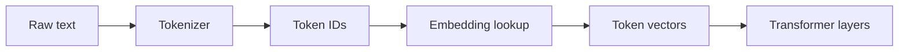
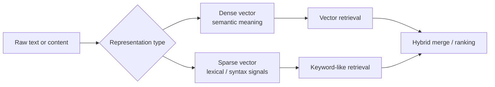
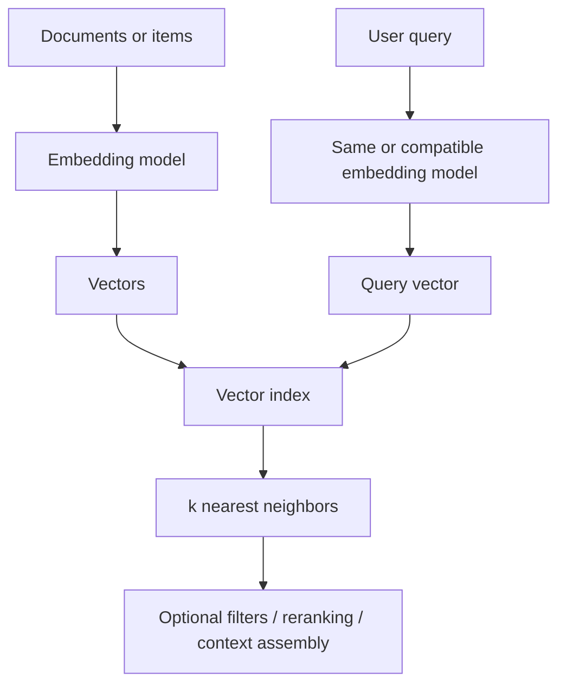
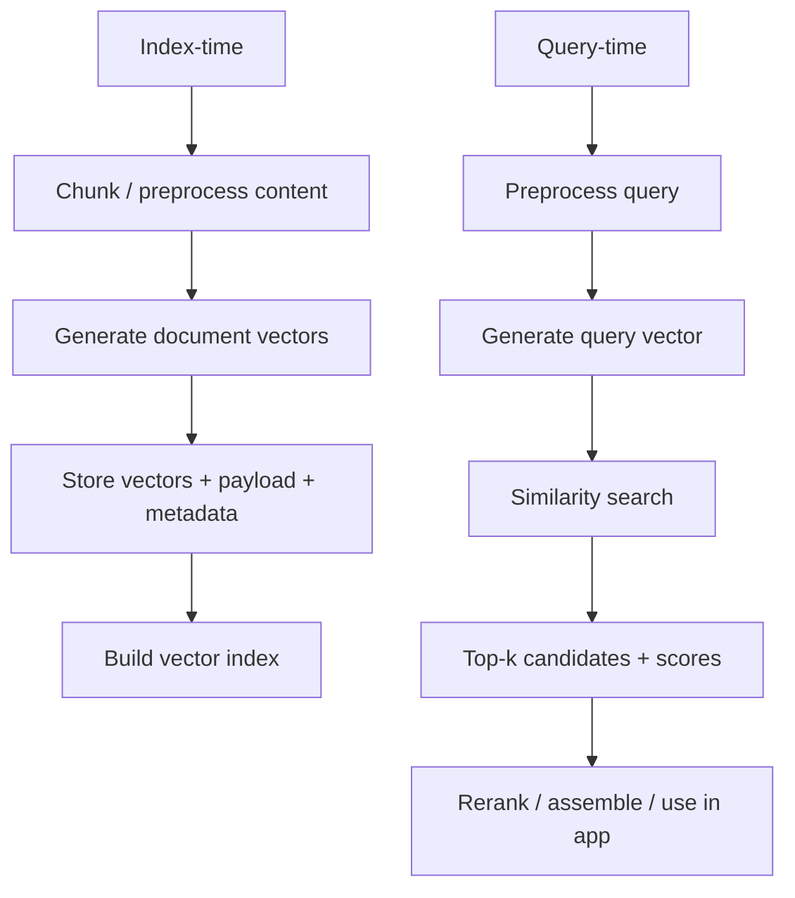

---
tags:
  - llm
  - vector
  - similarity
  - retrieval
type: note
status: evergreen
source: "OpenAI Docs, Google Cloud Vertex AI, Microsoft Learn, Cohere Docs"
parent_note: "[[LLM Foundations - MOC]]"
---
# Vector Representations และ Similarity Search

> โน้ตแกนสำหรับอธิบายว่า vector คืออะไร, similarity search ทำงานอย่างไร, และทำไมเรื่องนี้จึงเป็นฐานสำคัญของ embeddings, retrieval, RAG, และ memory systems

---

## Summary

ในระบบ AI สมัยใหม่ `vector` คือรูปแทนข้อมูลในเชิงตัวเลขที่ทำให้ระบบคำนวณ “ความใกล้” ระหว่าง items ต่าง ๆ ได้  
เมื่อ combined กับ nearest-neighbor search มันกลายเป็นฐานของ:
- semantic search
- vector databases
- RAG retrieval
- recommendation
- memory retrieval บางแบบ

สิ่งสำคัญคือ vector ไม่ใช่ database, ไม่ใช่ embedding model, และไม่ใช่คำตอบของระบบเอง  
มันเป็น representation layer ที่อยู่กลางระหว่าง raw data กับ retrieval/ranking logic

---

## Scope Boundary

โน้ตนี้เน้น `vector` ในฐานะ system primitive ของ retrieval:
- vector representations
- similarity search
- vector indexes และ vector-capable systems
- index/query pipelines
- metadata, payloads, และ retrieval outputs

ส่วนเรื่อง `embeddings` ในฐานะ semantic representation quality เช่น:
- semantic similarity
- query/document embedding modes
- multilingual / multimodal embedding behavior
- design trade-offs ของ embedding models

ให้ดูคู่กับ [[10 - Embeddings และ Semantic Similarity]]

---

## Vector คืออะไร

Cohere อธิบายว่า embeddings คือการแทนความหมายของ text, image, หรือ information เป็นลิสต์ของตัวเลข และใช้ similarity function เพื่อวัดว่าข้อมูลสองชิ้นเกี่ยวกันแค่ไหน  
OpenAI ก็อธิบายในทิศเดียวกันว่า embedding endpoint คืน vector representation ของ input ที่นำไปใช้กับ machine learning models และ algorithms ได้

ในเชิงสถาปัตย์ของโน้ตนี้:
- `vector` = array ของตัวเลข
- `embedding` = วิธีสร้าง vector จากข้อมูล
- `similarity search` = วิธีค้น vector ที่ใกล้กับ query vector

ดังนั้น vector เป็นชั้น representation ส่วน embedding model เป็นชั้น transformation

---

## Embedding Layer As Lookup Table

ในระบบ language model ระดับพื้นฐาน input text จะถูกแปลงเป็น token IDs ก่อน  
จากนั้น embedding layer จะ map token IDs เหล่านั้นไปเป็น vectors ที่ model ใช้งานต่อได้

มุมนี้สำคัญเพราะทำให้เห็น data flow ระดับต้น:
- raw text
- tokenization
- token IDs
- embedding lookup
- token vectors

ดังนั้น “vector” ในระบบ LLM ไม่ได้เริ่มจาก retrieval อย่างเดียว แต่เริ่มตั้งแต่ input representation ภายในตัวโมเดลแล้ว

---

## Static Embeddings vs Contextual Representations

จุดที่คนสับสนบ่อยคือคำว่า `embedding` ถูกใช้กว้างเกินไป

ในเชิงสถาปัตย์ควรแยกอย่างน้อย 2 ชั้น:

### Static token embeddings

คือ vectors ที่ได้ทันทีหลัง embedding lookup  
token เดียวกันมักเริ่มจาก representation เดิมก่อนเข้าชั้น reasoning ของ model

### Contextual representations

คือ vectors ที่ผ่าน transformer layers แล้ว  
representation ของ token เดียวกันอาจเปลี่ยนไปตามบริบทของประโยค

ผลคือ:
- token embeddings เป็น representation เริ่มต้น
- contextual representations เป็น representation ที่ model “ตีความแล้ว”

นี่เป็นเหตุผลว่าทำไม retrieval embeddings, token embeddings, และ hidden states ไม่ควรถูกปนกัน

---

## คำว่า Embedding ใช้ได้หลายความหมาย

ในระบบ AI คำว่า `embedding` มักถูกใช้ในอย่างน้อย 3 ความหมาย:

1. token embeddings ภายใน model  
ใช้แปลง token IDs เป็น input vectors

2. retrieval embeddings  
ใช้แทน text, image, หรือ documents เพื่อ similarity search

3. learned representations ในชั้นลึกของ model  
แม้หลายคนจะเรียกรวม ๆ ว่า embeddings แต่ในเชิงสถาปัตย์มันใกล้กับ hidden/contextual representations มากกว่า

ดังนั้นเวลาอ่านเอกสารหรือออกแบบระบบ ควรถามเสมอว่า:
- embedding นี้เกิดขึ้นตรงไหนของ stack
- ใช้เพื่อ input representation, retrieval, หรือ downstream ML task

---

## Dense Vectors กับ Sparse Vectors

Google Vertex AI Vector Search แยกคำสำคัญไว้ชัด:
- `dense embeddings` แทน semantic meaning ของ text โดยใช้ arrays ที่ส่วนใหญ่ไม่เป็นศูนย์
- `sparse embeddings` แทน text syntax โดยใช้ arrays มิติสูงที่มีค่าไม่เป็นศูนย์น้อยมาก
- `hybrid search` ใช้ทั้ง dense และ sparse embeddings ร่วมกัน

สรุปเชิงระบบ:
- dense vectors มักใช้กับ semantic retrieval
- sparse vectors มักใกล้กับ keyword/lexical behavior มากกว่า
- hybrid retrieval มีประโยชน์เมื่อ exact terms และ semantic similarity สำคัญพร้อมกัน

---

## Similarity Search คืออะไร

Microsoft Learn อธิบายว่า vector search เป็น information retrieval approach ที่ index และ query ข้อมูลผ่าน numeric representations ของ content แทน plain text และ matching จะอิงกับ vectors ที่คล้าย query vector มากที่สุด  
หน้าเดียวกันยังอธิบายว่า query จะถูก vectorize แล้วระบบคืน `k` nearest neighbors กลับมา

ความหมายเชิงระบบ:
- เราไม่ได้หา “คำตรงกัน”
- เราหา “items ที่อยู่ใกล้กันใน vector space”
- ผลลัพธ์จึงขึ้นกับทั้ง embedding model และ search/index strategy

---

## Similarity Metrics

metric ที่ใช้กันบ่อยในระบบ vector search:
- cosine similarity
- dot product
- Euclidean distance

OpenAI embeddings docs ระบุว่า embedding models ถูกออกแบบมาให้ใช้กับ similarity-based tasks ได้  
ใน practice ของหลายระบบ ถ้า vectors ถูก normalize การใช้ cosine กับ dot product มักให้ลำดับผลที่ใกล้กันมาก

มุมที่สำคัญคือ:
- metric เป็นส่วนหนึ่งของ retrieval contract
- อย่าเปลี่ยน metric แบบไม่มีเหตุผลแล้วหวังว่าระบบจะเหมือนเดิม
- similarity score ไม่ใช่ factual correctness score

---

## Dimensionality และ Intuition

Google ระบุว่าความยาวของ vector เรียกว่า dimensionality  
OpenAI ก็รองรับ embedding outputs ที่มี dimensions ต่างกันในบางรุ่นหรือบาง configuration

มุมคิดแบบ intuitive:
- dimensions ต่ำกว่า มักช่วยเรื่อง storage, bandwidth, และ latency
- dimensions สูงกว่า อาจเก็บสัญญาณได้ละเอียดขึ้น แต่แลกกับต้นทุนระบบสูงขึ้น

อย่างไรก็ตาม dimensionality ไม่ได้แปลว่า “ยิ่งสูงยิ่งดีกว่า” เสมอ  
มันเป็น trade-off ระหว่าง:
- quality
- cost
- retrieval latency
- memory footprint ของ index

ดังนั้น dimension ควรถูกมองเป็น system design parameter ไม่ใช่แค่ output property ของ model

---

## Similarity Search ทำงานอย่างไร

Microsoft Learn ระบุว่า Azure AI Search ใช้ nearest neighbors algorithm เพื่อวาง similar vectors ไว้ใกล้กันใน index  
จากนั้น query side จะ vectorize input แล้วดึง `k` nearest neighbors ออกมา  
Google Vertex AI ก็อธิบาย vector search ในกรอบเดียวกัน คือใช้ index ของ vectors เพื่อค้น nearest neighbors อย่างมีประสิทธิภาพ

---

## Vector Database ต่างจาก SQL / NoSQL / Search Engine อย่างไร

จาก Microsoft Learn ฝั่ง Azure AI Search, vector search คือ retrieval approach ที่ query เหนือ numeric representations ของ content แทน plain text และเหมาะกับ similarity-based retrieval  
ความต่างสำคัญจึงไม่ใช่แค่ “ชนิดของฐานข้อมูล” แต่คือ primitive การค้นหาหลักของระบบ

มองแบบสถาปัตย์ได้ดังนี้:
- SQL/transactional databases เด่นที่ exact match, joins, constraints, transactional correctness
- NoSQL databases เด่นที่ flexible schema, key-based access, document storage, scalability patterns
- Search engines เด่นที่ inverted index, keyword/full-text search, filters, lexical ranking
- Vector databases / vector-capable systems เด่นที่ similarity search ผ่าน embeddings และ nearest-neighbor retrieval

สรุป:
- vector database ไม่ได้แทน SQL หรือ NoSQL ทุกกรณี
- มันแก้โจทย์คนละชั้น คือ “หาอะไรที่คล้ายกันเชิงความหมาย”
- ระบบจริงมักใช้หลาย storage/retrieval primitives ร่วมกัน

---

## Purpose-Built Vector DB vs Search Engine ที่เพิ่ม Vector ภายหลัง

Microsoft Learn ระบุว่า Azure AI Search รองรับทั้ง:
- vector search
- keyword search
- hybrid search
- multimodal search

และ hybrid search ของ Azure AI Search คือการรัน text/keyword query กับ vector query ใน request เดียว แล้ว merge ผลลัพธ์เข้าด้วยกัน  
นั่นหมายความว่าในทางปฏิบัติ มีอย่างน้อย 2 แนวทางในตลาด:

### 1. Purpose-built vector systems

ระบบถูกออกแบบรอบ vector index และ nearest-neighbor retrieval เป็นแกนหลัก

### 2. Search engines หรือ data platforms ที่เพิ่ม vector capability

ระบบเดิมอาจเด่นด้าน:
- full-text search
- metadata filters
- operational tooling
- enterprise content integration

แล้วเพิ่ม vector fields, vector indexes, และ hybrid ranking เข้ามา

มุมที่สำคัญคือ:
- ทั้งสองแบบ “ทำ vector search ได้”
- แต่สถาปัตยกรรมหลักและจุดแข็งอาจต่างกัน
- สำหรับหลายระบบ production, hybrid engine ที่รวม lexical + vector + filtering ได้ดี อาจ practical กว่า purpose-built vector-only stack

ดังนั้นเวลาออกแบบระบบ อย่าถามแค่ว่า “ต้องใช้ vector DB ไหม”
แต่ให้ถามว่า:
- เราต้องการ semantic search อย่างเดียวหรือ hybrid retrieval
- ระบบต้องพึ่ง full-text / metadata / filters หนักแค่ไหน
- ต้องการ platform search features ด้วยหรือไม่

---

## Index-Time vs Query-Time Pipeline

อีกจุดที่ควรแยกให้ชัดคือ vector system มี 2 lifecycle หลัก

### Index-time

- เตรียม raw content
- clean / normalize / chunk
- generate embeddings
- เก็บ vectors พร้อม metadata และ payload
- build or update vector index

### Query-time

- รับ user query
- preprocess query
- generate query embedding
- run similarity search
- คืน top-k candidates พร้อม scores และ metadata
- ส่งต่อไปยัง reranking หรือ application layer

นี่เป็นจุดสำคัญมาก เพราะหลายคนเข้าใจ vector search แค่ฝั่ง query แต่ลืมว่าคุณภาพของระบบขึ้นกับ indexing pipeline มากพอ ๆ กัน

---

## Vector Search อยู่ตรงไหนใน AI Stack

vector search มักอยู่ระหว่าง data layer กับ application layer

บทบาทที่พบบ่อย:
- ใน `RAG`: retrieve chunks หรือ passages ที่ใกล้ query
- ใน `recommendation`: หา items ที่คล้ายกัน
- ใน `memory systems`: recall user-specific facts หรือ prior states
- ใน `multimodal systems`: ค้นหาข้าม text-image space

ดังนั้น vector layer มักเชื่อมกับ:
- embeddings
- chunking
- reranking
- context assembly
- evaluation

---

## Vector ไม่ได้เท่ากับ Embedding Model

จุดที่คนสับสนบ่อย:

### Embedding model

ทำหน้าที่แปลง input -> vector

### Vector index / vector database

ทำหน้าที่เก็บ vectors และทำ nearest-neighbor search

### Similarity search

ทำหน้าที่ retrieve candidates ที่ใกล้ query vector

### Application layer

ทำหน้าที่ใช้ candidates เหล่านั้นต่อ เช่น RAG, recommendation, memory recall

ถ้าแยก 4 ชั้นนี้ไม่ออก จะออกแบบระบบ retrieval ได้ยาก

---

## Metadata, Payloads, และ Outputs ของ Vector Retrieval

ระบบ vector จริงไม่ได้เก็บแค่ vectors อย่างเดียว มักต้องมีอย่างน้อย:
- ID
- original content หรือ chunk text
- metadata เช่น source, language, timestamp, document type
- embedding model / dimension / metric contract

และ output ของ vector retrieval มักไม่ใช่ “คำตอบสุดท้าย” แต่เป็น:
- candidate IDs
- similarity scores
- payloads หรือ texts ที่เกี่ยวข้อง
- metadata สำหรับ filtering / ranking / citations

นี่ทำให้ vector retrieval เป็น retrieval primitive ไม่ใช่ answer generator

---

## Embedding Space Compatibility และ Dimension Mismatch

OpenAI ระบุว่า embeddings เป็น vectors ของ floating point numbers และแต่ละ model อาจมีขนาด vector หรือ `dimensions` ต่างกัน  
Google Vertex AI Vector Search ก็แยก dense/sparse embeddings ตาม representation type และ retrieval setup  
Cohere ยังระบุเพิ่มว่า embedding behavior ขึ้นกับ task mode เช่น `search_query` และ `search_document`

สิ่งนี้นำไปสู่กฎสำคัญ:
- query vector กับ document vectors ต้องอยู่ใน embedding space ที่ compatible กัน
- dimensions ต้องตรงกันจึงจะคำนวณ similarity ได้อย่างถูกต้อง
- การเปลี่ยน model, task mode, หรือ dimensionality โดยไม่ reindex ทำให้ retrieval contract พังได้

สรุปเชิงระบบ:
- อย่าเอา vectors จาก model คนละตระกูลมาเทียบกันตรง ๆ โดยไม่มีเหตุผล
- อย่าสลับ `query encoder` กับ `document encoder` แบบไม่มี contract
- ถ้าเปลี่ยน embedding model หรือ dimension ควรถือว่าเป็น index schema change

นี่เป็นหนึ่งในสาเหตุที่ระบบ vector retrieval ควรมี metadata ชัดว่า:
- model อะไร
- dimension เท่าไร
- task mode อะไร
- similarity metric อะไร

---

## Exact Search vs Approximate Search

Microsoft Learn อธิบายว่า vector systems ใช้ nearest-neighbor search ใน index  
Google Vertex AI อ้างถึง ScaNN และ nearest neighbor retrieval ในการทำ vector search ที่เร็วขึ้น

มุมคิดเชิงสถาปัตย์:
- exact search เหมาะกับ datasets เล็กหรือ evaluation
- approximate search เหมาะกับ production scale ที่ต้อง balance latency กับ recall

ดังนั้น vector search ไม่ใช่แค่เรื่อง “หาใกล้ที่สุด” แต่เป็นเรื่อง trade-off ด้วย

---

## Multilingual และ Multimodal Implications

Microsoft ระบุว่า vector search รองรับ:
- conceptual similarity
- multilingual content
- multiple content types

ผลเชิงระบบคือ:
- vector space ทำให้ query คนละภาษายัง match กันได้ ถ้า embedding model รองรับ
- text query อาจค้น image space ได้ ถ้าใช้ multimodal embeddings
- retrieval quality จึงขึ้นกับ representation choice มากกว่าการ match keyword อย่างเดียว

---

## สิ่งที่ Vector Search ทำไม่ได้เอง

vector layer อย่างเดียวไม่รับประกันว่า:
- ข้อมูลที่ retrieve มาถูก factual
- ข้อมูลนั้นใหม่ที่สุด
- chunk นั้นตอบคำถามจริง
- answer ที่ model สร้างจะ grounded

เพราะฉะนั้นระบบจริงมักต้องมี:
- metadata filters
- hybrid retrieval
- reranking
- grounding / citation
- evals

นี่คือเหตุผลว่าทำไม vector search เป็น “core primitive” แต่ไม่ใช่ระบบสำเร็จรูปทั้งก้อน

---

## อย่าสับสน

### Vector ไม่เท่ากับ Embedding

embedding คือกระบวนการสร้าง vector  
vector คือ representation ที่ได้ออกมา

### Vector Search ไม่เท่ากับ RAG

RAG ใช้ vector search บ่อย แต่ยังมี chunking, context assembly, generation, citation, และ evals ต่ออีกหลายชั้น

### Similarity ไม่เท่ากับ Relevance

items ที่คล้ายใน vector space อาจยังไม่ใช่ answer ที่ดีที่สุด

---

## Design Rules

- มอง vector เป็น representation layer ไม่ใช่ end product
- แยก dense, sparse, และ hybrid ให้ชัดเมื่อออกแบบ retrieval
- similarity metric และ index strategy เป็นส่วนหนึ่งของ system contract
- อย่าตีความ similarity score เป็น quality score ของคำตอบ
- ถ้าระบบพึ่ง vector search มาก ควรออกแบบ evals สำหรับ retrieval โดยเฉพาะ

---

## Cross Links

- [[01 Foundations/LLM Foundations/10 - Embeddings และ Semantic Similarity]]
- [[01 Foundations/Tokenizer in AI/06 - ทำไม Tokenization ถึงสำคัญ]]
- [[01 Foundations/LLM Foundations/11 - Multimodal Foundations]]
- [[04 Synthesis/Synthesis - Weights, Context, Retrieval และ Tools]]
- [[02 AI Systems/RAG/RAG - MOC]]
- [[02 AI Systems/Memory Systems/Memory Systems - MOC]]
- [[Home]]

---

## Official References

- OpenAI Embeddings API Reference: https://platform.openai.com/docs/api-reference/embeddings/object
- OpenAI Embeddings Guide: https://platform.openai.com/docs/guides/embeddings
- Google Cloud Vertex AI Vector Search Overview: https://cloud.google.com/vertex-ai/docs/vector-search/overview
- Microsoft Learn - Vector Search in Azure AI Search: https://learn.microsoft.com/en-us/azure/search/vector-search-overview
- Cohere - Introduction to Embeddings: https://docs.cohere.com/docs/embeddings
