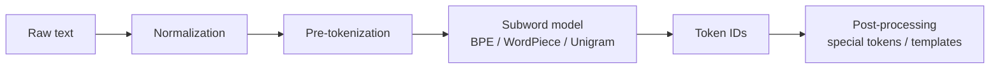
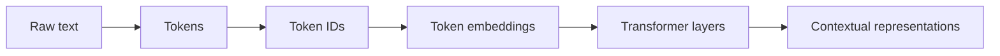
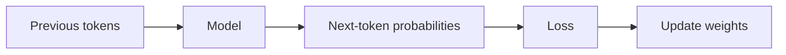

---
tags:
  - llm
  - foundation
  - token
  - embedding
  - pretraining
type: note
status: evergreen
source: "OpenAI, Hugging Face, Google Research, Google DeepMind"
parent_note: "[[LLM Foundations - MOC]]"
created: "2026-04-18"
updated: ""
---

# LLM คืออะไรและพื้นฐาน

---

## ขอบเขตของโน้ตนี้

โน้ตนี้เป็นภาพรวมระดับต้นของ LLM:
- LLM คืออะไร
- token และ tokenization คืออะไร
- embeddings กับ representations ต่างกันอย่างไร
- model families หลักมีอะไรบ้าง
- scaling สำคัญอย่างไร

โน้ตนี้ยังไม่ลงลึก architecture ภายใน  
ถ้าต้องการกลไกของ Transformer โดยตรง ให้ดู [[02 - สถาปัตยกรรม Transformer]]

---

## LLM คืออะไร

**Large Language Model (LLM)** คือโมเดลที่ถูกฝึกบนข้อความจำนวนมากเพื่อทำนาย token ถัดไป หรือ objective ของภาษาในรูปแบบใกล้เคียงกัน ทำให้มันสามารถสร้างข้อความ, สรุป, แปล, ตอบคำถาม, หรือทำงานผ่าน natural-language instructions ได้

มี 2 มุมมองที่ควรแยก:
- **Model view** — LLM คือ probabilistic model บนลำดับ token
- **System view** — LLM มักเป็นแกนกลางของ application ที่มี retrieval, tools, memory, safety layers, และ orchestration ครอบอยู่

ประโยคที่ควรจำ:

```text
An LLM is not the whole application.
It is the core model inside a larger system.
```

---

## จาก NLP แบบเดิมสู่ LLM

ใน NLP แบบดั้งเดิม แต่ละงานมักมีโมเดลเฉพาะทางแยกกัน เช่น classification, translation, NER

แนวคิดของ LLM เปลี่ยนภาพนี้เพราะ:
- ใช้ pretrained model ตัวเดียวรองรับหลายงาน
- ใช้ self-supervised learning บนข้อความดิบก่อน
- แล้วค่อยอาศัย prompting, fine-tuning, หรือ post-training เพิ่มภายหลัง

---

## Token คือหน่วยพื้นฐานของ LLM

LLM ไม่ได้มอง input เป็น "คำ" ตามภาษามนุษย์โดยตรง แต่มองเป็น **tokens**

token อาจเป็น:
- คำเต็ม
- ส่วนย่อยของคำ
- เครื่องหมายวรรคตอน
- ตัวเลข
- special tokens

Rule of thumb สำหรับภาษาอังกฤษ:
- `1 token` มักใกล้เคียง `~4 characters`
- หรือประมาณ `~0.75 word`

แต่กับภาษาไทย:
- token ต่อข้อความมักสูงกว่าอังกฤษ
- เพราะการแบ่งชิ้นของ tokenizer ไม่ตรงกับ notion ของ "คำ" ในภาษาไทยเสมอ

---

## Tokenization Pipeline

Hugging Face อธิบาย tokenization เป็น pipeline ที่มีหลายขั้น ไม่ใช่แค่การ split text แบบง่าย ๆ



สรุปแต่ละขั้น:
- **Normalization** — ทำ text ให้สม่ำเสมอ
- **Pre-tokenization** — แบ่ง text เป็นชิ้นหยาบ
- **Subword model** — map ชิ้นข้อความไปเป็น token vocabulary
- **Post-processing** — เติม special tokens หรือ chat template ตาม model format

---

## Token IDs, Embeddings, และ Representations

หลัง tokenization โมเดลไม่ได้คำนวณบน text โดยตรง แต่ทำงานกับตัวเลขและเวกเตอร์

ลำดับคือ:



แยกคำให้ชัด:
- **Token ID** — เลข integer ที่อ้างถึง token ใน vocabulary
- **Token embedding** — เวกเตอร์เริ่มต้นของ token ก่อนผ่าน layers
- **Contextual representation** — เวกเตอร์หลังผ่าน Transformer หลายชั้นแล้ว จึงขึ้นกับบริบทจริง

---

## 3 Model Families หลัก

| Family | ตัวอย่าง | เด่นเรื่อง |
|---|---|---|
| **Decoder-only** | GPT-style models | next-token generation, chat, completion |
| **Encoder-only** | BERT-style models | understanding-heavy tasks |
| **Encoder-decoder** | T5-style models | text-to-text tasks เช่น translation, summarization |

จุดสำคัญ:
- LLM ที่ใช้ใน chat ปัจจุบันจำนวนมากเป็น **decoder-only**
- แต่ ecosystem ของ Transformer ไม่ได้มีแค่ decoder-only

---

## Pretraining สอนอะไรโมเดล

สำหรับ GPT-like models แกนหลักคือ **next-token prediction**



สิ่งที่ pretraining มักสร้าง:
- pattern completion
- syntax และ semantics บางระดับ
- few-shot / in-context behavior เมื่อ scale ใหญ่ขึ้น

สิ่งที่ pretraining ไม่ได้รับประกัน:
- instruction following ที่ดี
- safety behavior
- factual accuracy ที่เสถียร

---

## Scaling สำคัญอย่างไร

OpenAI อธิบาย scaling laws ว่า loss เปลี่ยนตามความสัมพันธ์แบบ power law กับ:
- model size
- dataset size
- training compute

DeepMind Chinchilla เพิ่มมุมมองว่า:
- model ที่ใหญ่ขึ้นอย่างเดียวไม่พอ
- ต้องมี training tokens ที่สมดุลกับขนาดโมเดลด้วย

ดังนั้นคำว่า "โมเดลใหญ่กว่า" ยังไม่พอ ต้องถามต่อว่า:
- ใหญ่ขึ้นเท่าไร
- ฝึกกับข้อมูลเท่าไร
- ใช้ compute เท่าไร

---

## อย่าสับสนกับ 3 อย่างนี้

### 1. LLM vs Chatbot
- **LLM** คือโมเดล
- **Chatbot** คือ application ที่ใช้ LLM เป็นแกนกลาง

### 2. Token vs Word
- token ไม่เท่ากับคำเสมอไป
- tokenizer แต่ละตัวแบ่งต่างกันได้

### 3. Embedding vs Contextual Representation
- embedding เป็นจุดเริ่มต้น
- contextual representation คือสิ่งที่ผ่านบริบทแล้ว

---

## Mental Model

```text
Tokenization turns text into model-readable units
Embeddings turn token IDs into vectors
Transformer layers turn vectors into contextual representations
Pretraining turns the model into a general language engine
```

---

## Official References

- OpenAI, Language models are few-shot learners  
  https://openai.com/index/language-models-are-few-shot-learners/
- Hugging Face, Tokenizer summary  
  https://huggingface.co/docs/transformers/en/tokenizer_summary
- Google Research, Attention Is All You Need  
  https://research.google/pubs/pub46201
- Google DeepMind, An empirical analysis of compute-optimal large language model training  
  https://deepmind.google/en/blog/an-empirical-analysis-of-compute-optimal-large-language-model-training/

---

## ดูต่อ

- [[02 - สถาปัตยกรรม Transformer]] — architecture ของ Transformer
- [[03 - การฝึกและ Post-Training]] — training lifecycle และ alignment
- [[01 Foundations/Tokenizer in AI/Tokenizer in AI - MOC|Tokenizer in AI]] — ลงลึกเรื่อง tokenization, tokenizer families, และ practical trade-offs
- [[LLM Foundations - MOC]]
