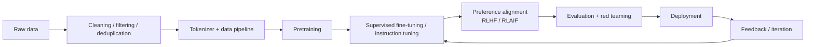
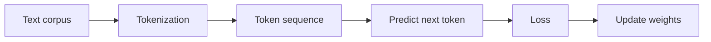
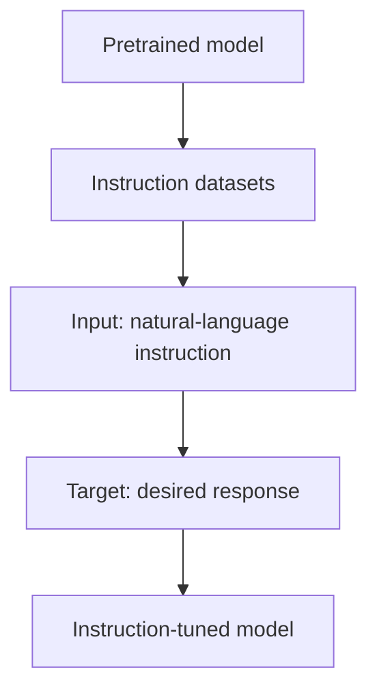
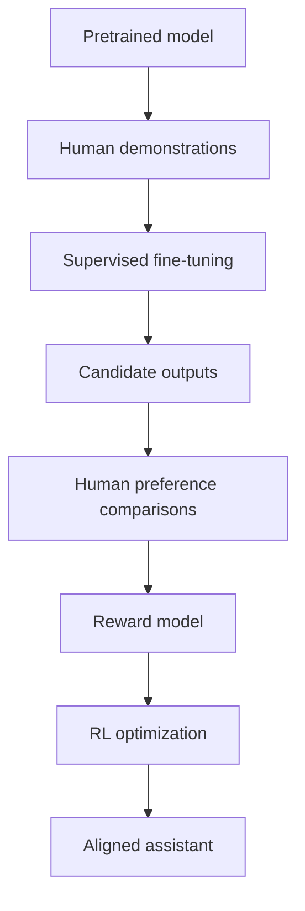
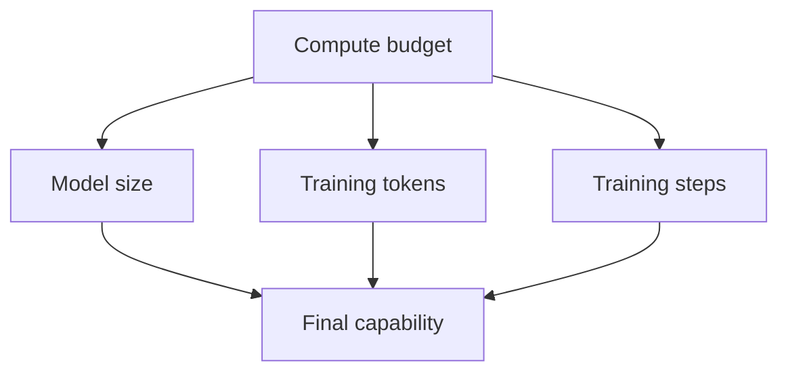
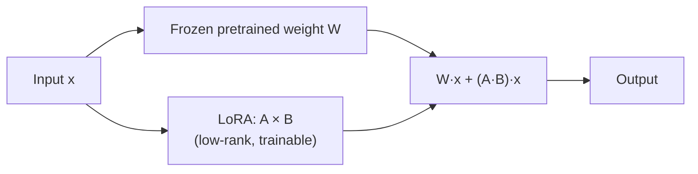
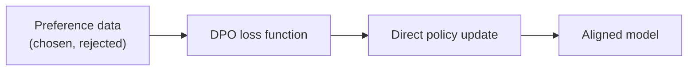
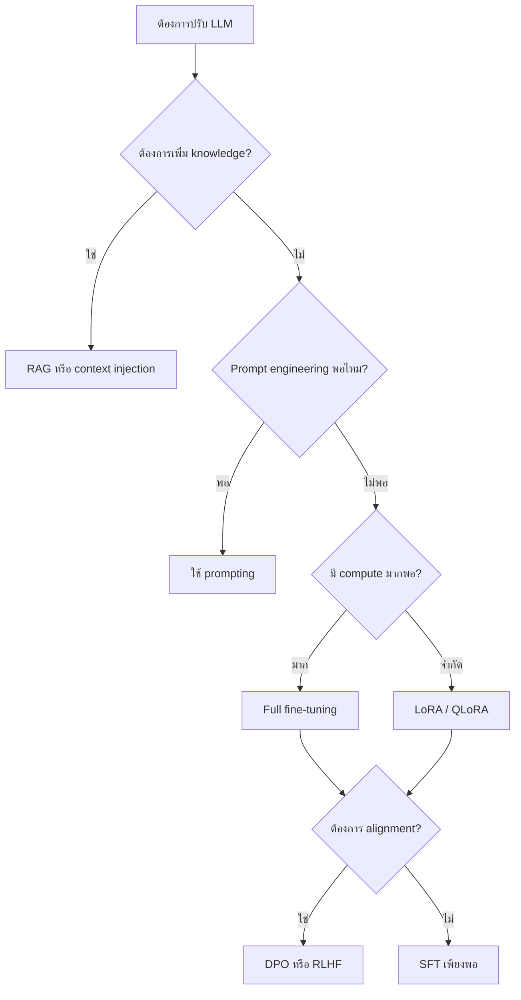

---
tags:
  - llm
  - training
  - rlhf
  - alignment
  - pretraining
  - fine-tuning
  - lora
  - dpo
  - peft
type: note
status: evergreen
source: "OpenAI, Google Research, Google DeepMind, Anthropic, Hugging Face, Rafailov et al. (DPO), Hu et al. (LoRA), Dettmers et al. (QLoRA)"
parent_note: "[[LLM Foundations - MOC]]"
---

# การฝึกและ Post-Training

---

## ขอบเขตของโน้ตนี้

โน้ตนี้ตอบคำถามว่า:
- โมเดลถูกฝึกตั้งแต่ต้นอย่างไร
- ทำไม **base model** ถึงยังไม่ใช่ assistant ที่ทำตามคำสั่งได้ดี
- **post-training** เปลี่ยนพฤติกรรมโมเดลอย่างไร

โน้ตนี้จะเน้น **training lifecycle** เป็นหลัก  
ส่วนเรื่องความต่างระหว่าง **base model / instruction model / chat model** จะไปลงลึกต่อใน [[08 - Data, Pretraining และ Model Modes]]

---

## ภาพรวมวงจรชีวิตของ LLM



แนวคิดหลัก:
- **Pretraining** สร้างความสามารถทั่วไปของโมเดล
- **Post-training** ปรับพฤติกรรมให้ตอบในรูปแบบที่ผู้ใช้ต้องการมากขึ้น
- หลัง deploy แล้วระบบจริงยังต้องวนกลับมาเก็บ feedback, eval, และปรับ pipeline ต่อ

---

## Pretraining คืออะไร

Pretraining คือการฝึกโมเดลจากค่าน้ำหนักเริ่มต้นบนข้อมูลมหาศาล เพื่อให้โมเดลเรียนรู้ pattern ของภาษาและข้อมูลที่พบใน training distribution

สำหรับโมเดลตระกูล GPT แนวคิดหลักคือ:
- รับลำดับ token ก่อนหน้า
- ทำนาย token ถัดไป
- ปรับ weights เพื่อลด prediction error



สิ่งที่ pretraining มักให้:
- pattern completion
- syntax และ semantic regularities
- ความสามารถ general-purpose บางส่วน
- พื้นฐานสำหรับ few-shot / in-context behavior ในภายหลัง

สิ่งที่ pretraining ไม่ได้รับประกัน:
- การทำตาม intent ของผู้ใช้
- การปฏิเสธอย่างเหมาะสม
- factuality
- safety behavior

---

## อย่าสับสน: Pretraining กับ Fine-tuning

| แนวคิด | จุดประสงค์ |
|---|---|
| **Pretraining** | ฝึกบนข้อมูลปริมาณมากเพื่อสร้าง general language model |
| **Fine-tuning** | ปรับโมเดลต่อบนข้อมูลเฉพาะงานหรือเฉพาะพฤติกรรม |

Transfer learning สำคัญตรงที่:
- ไม่ต้องฝึกจากศูนย์ทุกครั้ง
- ใช้ data และ compute น้อยกว่าการ pretrain มาก
- ทำให้ pretrained checkpoint กลายเป็นฐานสำคัญของงาน downstream

---

## Instruction Tuning คืออะไร

Google Research อธิบายว่า **instruction tuning** คือการ fine-tune โมเดลบนชุดข้อมูลที่งานต่าง ๆ ถูกเขียนให้อยู่ในรูปคำสั่งธรรมชาติ ทำให้โมเดล generalize ไปยัง instructions ใหม่ได้ดีขึ้น

สรุปสั้นที่สุด:

```text
pretraining         -> โมเดลเรียนรู้ continuation ของภาษา
instruction tuning  -> โมเดลเรียนรู้รูปแบบ "ผู้ใช้ขออะไร -> ควรตอบอย่างไร"
```



ผลที่มักเห็น:
- zero-shot performance ดีขึ้น
- few-shot prompting ใช้ง่ายขึ้น
- พฤติกรรมใกล้ assistant มากขึ้น

ข้อสำคัญ:
- instruction tuning ไม่ได้แปลว่าโมเดล "รู้จริง" มากขึ้นโดยอัตโนมัติ
- มันเปลี่ยนรูปแบบการตอบและการตีความงาน มากกว่าการใส่ knowledge ใหม่แบบตรง ๆ

---

## RLHF คืออะไร

OpenAI อธิบาย **RLHF (Reinforcement Learning from Human Feedback)** เป็นกระบวนการใช้ feedback ของมนุษย์เพื่อปรับโมเดลให้ตอบได้ helpful, truthful, และ less toxic มากขึ้น

ลำดับงานระดับสูง:
1. เก็บตัวอย่างคำตอบที่มนุษย์อยากได้
2. ทำ **Supervised Fine-Tuning (SFT)** ให้โมเดลตอบตามตัวอย่าง
3. สร้างคำตอบหลายแบบจากโมเดล
4. ให้มนุษย์จัดอันดับหรือเปรียบเทียบคำตอบ
5. ฝึก **reward model** จาก preference data
6. ใช้ reinforcement learning ปรับ policy ให้ได้ reward สูงขึ้น



สิ่งที่ RLHF ทำได้ดี:
- ปรับพฤติกรรมให้ตอบตาม user intent มากขึ้น
- ลดคำตอบที่ไม่ helpful หรือไม่ปลอดภัยบางแบบ
- ทำให้ output style เสถียรกว่า base model

สิ่งที่ RLHF ไม่ได้รับประกัน:
- factual correctness
- elimination ของ hallucination
- alignment ที่สมบูรณ์

---

## RLAIF และ Constitutional AI

Anthropic เสนออีกแนวทางคือ **Constitutional AI** ซึ่งใช้ชุดหลักการหรือ constitution มากำกับการ critique และ revise คำตอบของโมเดล แล้วจึงใช้ preference optimization ต่อ

แนวคิดหลักมี 2 ช่วง:
- **Supervised phase**: โมเดลวิจารณ์และแก้คำตอบของตัวเองตามหลักการ
- **Preference / RL phase**: ใช้ AI feedback เป็นส่วนหนึ่งของ preference signal แทนการพึ่งมนุษย์ทุกขั้น

สิ่งที่ควรเข้าใจ:
- RLHF = preference signal มาจากมนุษย์เป็นหลัก
- RLAIF / Constitutional AI = preference signal บางส่วนมาจาก AI ที่ถูกกำกับด้วยหลักการ

---

## คุณภาพข้อมูลฝึกสำคัญอย่างไร

ทั้ง OpenAI, Google, DeepMind, และ Hugging Face ล้วนสอดคล้องกันว่า model quality ไม่ได้ขึ้นกับ parameter count อย่างเดียว แต่ขึ้นกับ data pipeline อย่างมาก

ตัวแปรสำคัญ:
- **data quality**
- **deduplication**
- **mixture of domains**
- **language coverage**
- **filtering and safety processing**
- **contamination risk**

สรุปง่าย ๆ:
- ข้อมูลมากแต่สกปรก อาจทำให้โมเดลจำ pattern ที่ไม่ต้องการ
- ข้อมูลสะอาดแต่แคบเกินไป อาจทำให้ generalization แย่
- data mixture มีผลต่อ behavior พอ ๆ กับ architecture ในหลายกรณี

---

## Compute-Optimal Training และ Chinchilla

DeepMind แสดงว่า ภายใต้ compute budget เดียวกัน โมเดลจำนวนมากในยุคก่อนหน้านั้นมีแนวโน้ม **undertrained** คือมีพารามิเตอร์เยอะ แต่ใช้ training tokens น้อยเกินไป

ข้อสรุปสำคัญของ Chinchilla:
- การเพิ่ม model size อย่างเดียวไม่พอ
- จำนวน training tokens ต้องขยายตามอย่างเหมาะสม
- บางกรณีโมเดลที่เล็กลง แต่ฝึกบนข้อมูลมากขึ้น จะดีกว่าโมเดลที่ใหญ่กว่าแต่ข้อมูลน้อยกว่า

> ดู scaling laws เชิงลึก (Kaplan vs Chinchilla, emergence, capability prediction) ที่ [[08 - Data, Pretraining และ Model Modes]]



Mental model:
- อย่าดูแค่ `parameters`
- ต้องมอง `parameters + data + compute` เป็นชุดเดียว

---

## Fine-tuning Deep Dive: เทคนิคและการตัดสินใจ

### เมื่อไรควร Fine-tune

Fine-tuning เหมาะเมื่อ:
- ต้องการเปลี่ยน **behavior pattern** ของโมเดลอย่างเป็นระบบ เช่น output format, tone, domain-specific reasoning
- prompting อย่างเดียวไม่เพียงพอ เพราะ task ซับซ้อนเกินกว่า in-context examples จะครอบคลุม
- ต้องการลด latency โดยไม่ต้องใส่ few-shot examples ยาว ๆ ทุก request
- มี labeled data คุณภาพดีเพียงพอสำหรับ domain เป้าหมาย

Fine-tuning ไม่เหมาะเมื่อ:
- ต้องการเพิ่ม **factual knowledge** ใหม่ → ใช้ RAG แทน
- data น้อยเกินไปหรือคุณภาพต่ำ → อาจทำให้โมเดลเรียน noise
- ต้องการแค่เปลี่ยน format → ลอง prompt engineering ก่อน

> ดูเปรียบเทียบเชิงตัดสินใจเพิ่มเติมที่ [[04 Synthesis/Decision/Synthesis - Prompting vs Fine-tuning vs RAG]]

### Full Fine-tuning vs Parameter-Efficient Fine-tuning (PEFT)

| แนวทาง | อัปเดตอะไร | Compute / Memory | เหมาะกับ |
|---|---|---|---|
| **Full fine-tuning** | ทุก parameter | สูงมาก | มี compute เหลือเฟือ, ต้องการ maximum adaptation |
| **LoRA** | low-rank matrices ที่ inject เข้า attention layers | ต่ำกว่ามาก | ใช้งานทั่วไป, single GPU ได้ |
| **QLoRA** | LoRA + quantized base weights (4-bit) | ต่ำสุด | resource-constrained, prototyping |
| **Adapter layers** | small modules แทรกระหว่าง layers | ปานกลาง | multi-task adaptation |

### LoRA (Low-Rank Adaptation)

แนวคิดหลักของ LoRA:
- **freeze** weights เดิมของ pretrained model ทั้งหมด
- **inject** trainable low-rank decomposition matrices (A × B) เข้าไปใน target layers (มักเป็น attention projection)
- ตอน inference รวม LoRA weights กลับเข้า base weights ได้ → ไม่มี latency overhead



ข้อดี:
- ลด trainable parameters ได้ 99%+ เทียบกับ full fine-tuning
- สามารถสลับ LoRA adapters หลายชุดบน base model เดียวกัน
- merge กลับเข้า weights ได้ → ไม่เพิ่ม inference cost

QLoRA ต่อยอดโดย quantize base model เป็น 4-bit ก่อน แล้วฝึก LoRA adapters บน quantized model ทำให้ fine-tune โมเดลขนาดใหญ่บน GPU เดียวได้

### DPO (Direct Preference Optimization)

DPO เป็นทางเลือกของ RLHF ที่ตัด reward model ออก:
- แทนที่จะฝึก reward model แยก แล้วใช้ RL optimize policy
- DPO optimize policy โดยตรงจาก preference pairs (chosen vs rejected)
- ใช้ implicit reward ที่ derive จาก policy เอง



เปรียบเทียบ RLHF กับ DPO:

| ประเด็น | RLHF (PPO) | DPO |
|---|---|---|
| ต้องฝึก reward model แยก | ใช่ | ไม่ |
| Training stability | ซับซ้อนกว่า, ต้อง tune hyperparams มาก | เสถียรกว่า, คล้าย supervised learning |
| Performance ceiling | สูงกว่าในบาง benchmark (เช่น code) | ใกล้เคียง, บางกรณีต่ำกว่าเล็กน้อย |
| Compute cost | สูงกว่า (reward model + RL loop) | ต่ำกว่า |
| Distribution shift risk | จัดการได้ผ่าน online sampling | มี เพราะใช้ offline data |

ในทางปฏิบัติ DPO ได้รับความนิยมมากขึ้นเพราะง่ายกว่า แต่ RLHF (PPO) ยังมีข้อได้เปรียบในงานที่ต้องการ exploration เช่น code generation

### Preference Optimization Landscape

นอกจาก RLHF และ DPO ยังมีเทคนิคอื่น ๆ ที่พัฒนาต่อ:
- **IPO (Identity Preference Optimization)** — แก้ปัญหา overfitting ของ DPO
- **KTO (Kahneman-Tversky Optimization)** — ใช้ได้กับ unpaired preference data
- **SimPO (Simple Preference Optimization)** — ลดความซับซ้อนลงอีก

แนวโน้มคือ preference optimization กำลังกลายเป็น spectrum ที่กว้างขึ้น ไม่ใช่แค่ RLHF vs DPO อีกต่อไป

### สรุป Fine-tuning Decision Tree



---

## ข้อจำกัดของ Post-Training

Post-training ช่วยมาก แต่มี trade-off จริง:
- โมเดลอาจ helpful ขึ้น แต่ยัง hallucinate ได้
- โมเดลอาจปลอดภัยขึ้น แต่ตอบแคบลง
- reward model อาจถูก optimize เกินจนเกิด reward hacking
- การทำตามคำสั่งได้ดี ไม่ได้แปลว่าโมเดลมี grounded knowledge ดีขึ้นเสมอไป

---

## อย่าสับสนกับ 3 คู่หลัก

### 1. Pretraining vs Post-training
- **Pretraining** สร้างความสามารถกว้าง
- **Post-training** ปรับพฤติกรรมการตอบ

### 2. SFT vs Instruction Tuning
- **SFT** เป็นคำกว้างสำหรับ supervised fine-tuning
- **Instruction tuning** คือ SFT แบบหนึ่งที่ใช้ instruction-response pairs หลายงาน

### 3. Alignment vs Factuality
- **Alignment** = ตอบตาม intent และ policy ได้ดีขึ้น
- **Factuality** = ข้อเท็จจริงถูกต้อง
- สองอย่างนี้เกี่ยวข้องกัน แต่ไม่ใช่เรื่องเดียวกัน

---

## Mental Model

```text
Pretraining   = สร้าง engine ของภาษา
Instruction tuning = สอนให้รับงานในรูปคำสั่ง
Preference alignment = ปรับพฤติกรรมให้ตอบแบบ assistant มากขึ้น
```

---

## Official References

- OpenAI, Language models are few-shot learners  
  https://openai.com/index/language-models-are-few-shot-learners/
- OpenAI, Aligning language models to follow instructions  
  https://openai.com/index/instruction-following/
- OpenAI paper, Training language models to follow instructions with human feedback  
  https://cdn.openai.com/papers/Training_language_models_to_follow_instructions_with_human_feedback.pdf
- Google Research, Introducing FLAN  
  https://research.google/blog/introducing-flan-more-generalizable-language-models-with-instruction-fine-tuning/
- Google Research, The Flan Collection  
  https://research.google/pubs/the-flan-collection-designing-data-and-methods-for-effective-instruction-tuning/
- Google DeepMind, An empirical analysis of compute-optimal large language model training  
  https://deepmind.google/en/blog/an-empirical-analysis-of-compute-optimal-large-language-model-training/
- Anthropic, Constitutional AI  
  https://www.anthropic.com/news/constitutional-ai-harmlessness-from-ai-feedback
- Hu et al., LoRA: Low-Rank Adaptation of Large Language Models  
  https://arxiv.org/abs/2106.05615
- Dettmers et al., QLoRA: Efficient Finetuning of Quantized Language Models  
  https://arxiv.org/abs/2305.14314
- Rafailov et al., Direct Preference Optimization: Your Language Model is Secretly a Reward Model  
  https://arxiv.org/abs/2305.18290
- Hugging Face, PEFT documentation  
  https://huggingface.co/docs/peft
- OpenAI, Fine-tuning documentation  
  https://platform.openai.com/docs/guides/fine-tuning

---

## ดูต่อ

- [[08 - Data, Pretraining และ Model Modes]] — ความต่างระหว่าง base model, instruction model, chat model
- [[16 - Model Compression และ Inference Optimization]] — quantization, distillation, pruning, KV cache optimization
- [[04 - Inference, Context และ RAG]] — หลังฝึกเสร็จแล้ว runtime ทำงานอย่างไร
- [[05 - ข้อจำกัดและการประเมินผล LLM]]
- [[04 Synthesis/Decision/Synthesis - Prompting vs Fine-tuning vs RAG]] — เปรียบเทียบว่าเมื่อไรควรแก้ที่ prompt, RAG, หรือ fine-tuning
- [[LLM Foundations - MOC]]
