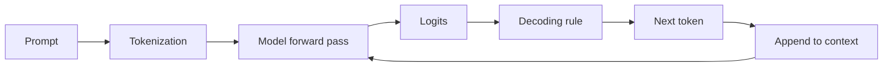
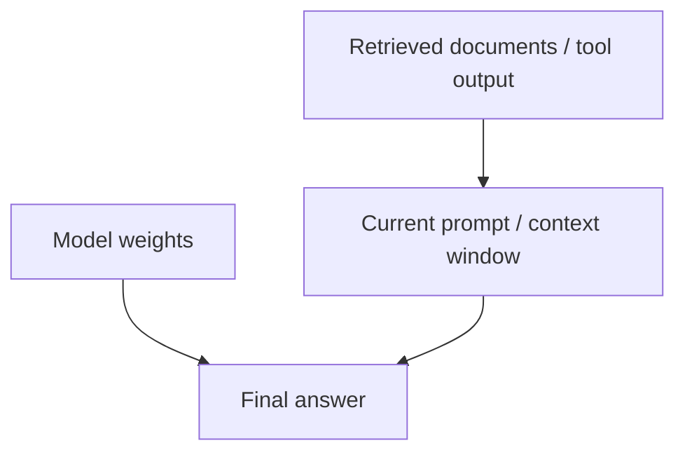
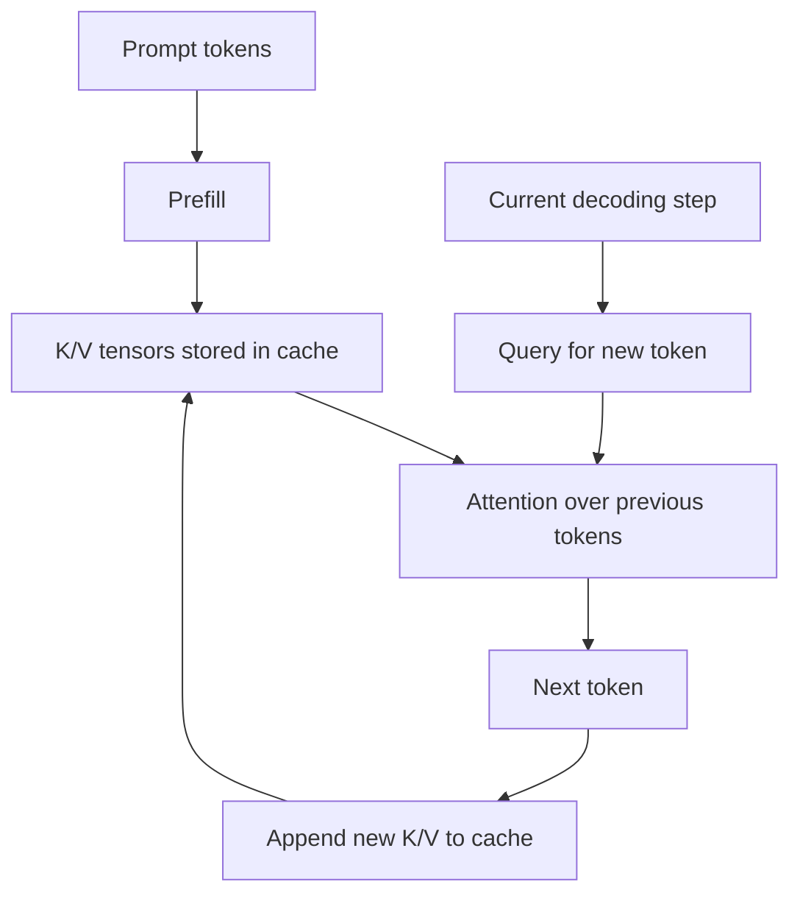
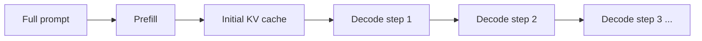
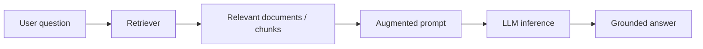
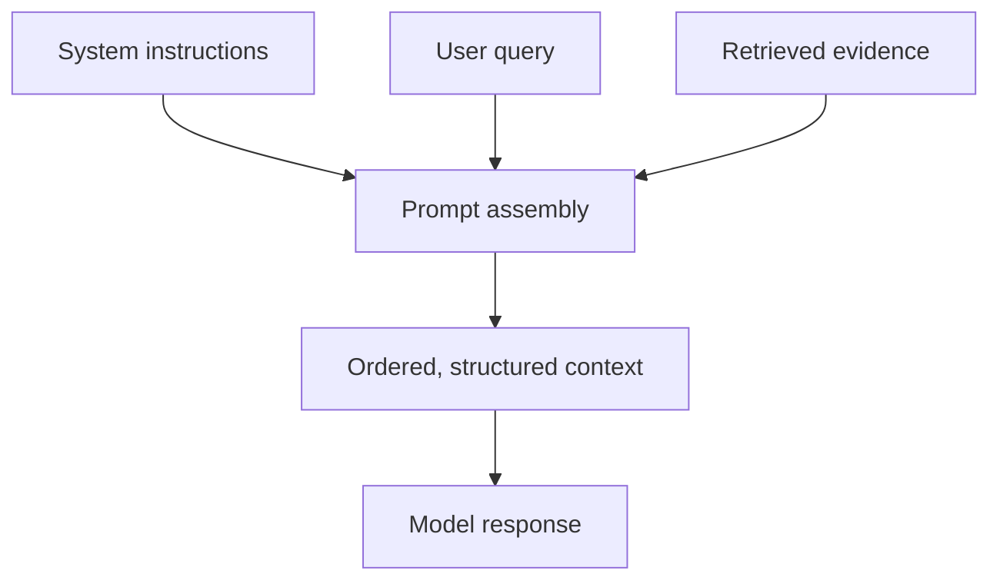

---
tags:
  - llm
  - inference
  - rag
  - kvcache
  - context
type: note
status: evergreen
source: "Anthropic, OpenAI, Hugging Face"
parent_note: "[[LLM Foundations - MOC]]"
---

# Inference, Context และ RAG

---

## ขอบเขตของโน้ตนี้

โน้ตนี้ตอบว่า ในหนึ่ง request ของ LLM:
- โมเดลสร้างคำตอบอย่างไร
- context window ทำหน้าที่อะไร
- KV cache ช่วยอะไรใน runtime
- RAG เชื่อมกับ inference อย่างไร

โน้ตนี้เน้น **runtime concepts**  
ส่วน **metrics, batching, cache strategy, production trade-offs** จะไปลงลึกใน [[09 - Serving Metrics และระบบ Production LLM]]

---

## Inference คืออะไร

หลังจากโมเดลถูกฝึกเสร็จแล้ว การใช้งานจริงส่วนใหญ่เกิดในโหมด **inference**

ความหมายเชิงระบบ:
- weights ของโมเดลไม่ถูกอัปเดตทุก request
- ระบบรับ input prompt
- โมเดลคำนวณ token ถัดไป
- วนซ้ำจนจบคำตอบหรือถึง stopping condition



สำหรับ GPT-style models นี่คือ autoregressive generation: ทำนาย token ถัดไปจาก token ก่อนหน้าทั้งหมดที่อยู่ในลำดับปัจจุบัน

---

## Context Window คืออะไร

Anthropic อธิบายว่า **context window** คือข้อความทั้งหมดที่โมเดลสามารถมองย้อนกลับและอ้างอิงได้ใน request ปัจจุบัน รวมทั้ง output ที่กำลังสร้างอยู่ มันคือ **working memory** ไม่ใช่ training corpus

อย่าสับสน:
- **Weights** = สิ่งที่โมเดลเรียนตอน training
- **Context window** = สิ่งที่โมเดลเห็นตอนนี้
- **External memory** = สิ่งที่ระบบภายนอกดึงเข้ามาเพิ่ม



---

## Context Window ไม่ใช่ Knowledge Base

ประโยคที่ควรจำ:

```text
Longer context does not mean the model learned new facts.
It means the model can see more tokens in this request.
```

ผลเชิงปฏิบัติ:
- ใส่ข้อมูลใหม่เข้า context ได้ แม้โมเดลไม่เคยฝึกบนข้อมูลนั้น
- แต่ context ที่ยาวขึ้นก็เพิ่ม cost และ memory pressure
- context ที่เยอะเกินไปอาจเพิ่ม noise และทำให้ retrieval quality แย่ลงได้

---

## Token Types ที่มักเจอใน API

ในระบบ API สมัยใหม่มักแยก token usage ออกเป็น:
- **input tokens** — token ที่ผู้ใช้และ system ส่งเข้าไป
- **output tokens** — token ที่โมเดลส่งกลับ
- **cached tokens** — prefix ที่ระบบ reuse ได้ในบางระบบ
- **reasoning tokens** — token ภายในที่ reasoning models ใช้คิดก่อนตอบ

ข้อสำคัญจาก OpenAI:
- reasoning tokens ถูกนับใน context budget และค่าใช้จ่าย
- แต่ reasoning tokens ไม่ถูกเก็บเป็น visible conversation content ในเทิร์นถัดไป

---

## KV Cache คืออะไร

ใน autoregressive inference โมเดลต้องสนใจ token ก่อนหน้าอยู่เรื่อย ๆ ถ้าคำนวณ attention state ซ้ำตั้งแต่ต้นทุก step จะช้ามาก

**KV cache** จึงเก็บ key/value tensors ของ token ก่อนหน้าไว้ เพื่อนำกลับมาใช้ตอน generate token ถัดไป



ผลลัพธ์:
- ลดการคำนวณซ้ำ
- ลด latency ต่อ token
- ทำให้ generation ต่อเนื่องมีประสิทธิภาพมากขึ้น

ข้อแลกเปลี่ยน:
- cache โตตาม context length
- ใช้ memory มาก
- กลายเป็น bottleneck สำคัญใน long-context inference

---

## Prefill และ Decode

runtime ของ request หนึ่งชุดมักแยกเป็น 2 ช่วงใหญ่:

| Phase | คืออะไร |
|---|---|
| **Prefill** | ประมวลผล input prompt ทั้งก้อนและสร้าง initial KV cache |
| **Decode** | สร้าง output ทีละ token โดย reuse KV cache |



ความต่างที่ต้องจำ:
- prompt ยาว -> prefill แพง
- output ยาว -> decode แพง

---

## RAG คืออะไร

**Retrieval-Augmented Generation (RAG)** คือการดึงข้อมูลภายนอกจาก search index, vector database, document store หรือระบบความรู้ แล้วใส่กลับเข้ามาใน prompt ตอน runtime



แก่นของ RAG:
- ไม่ได้เปลี่ยน weights ของโมเดล
- เพิ่ม evidence เข้ามาใน context window ของ request นี้
- ทำให้โมเดลตอบจากข้อมูลล่าสุดหรือข้อมูลเฉพาะองค์กรได้ดีขึ้น

---

## RAG กับ Fine-tuning ต่างกันอย่างไร

| แนวคิด | เปลี่ยนอะไร |
|---|---|
| **Fine-tuning** | เปลี่ยน weights |
| **RAG** | เปลี่ยน context ที่ส่งเข้า request |

สรุป:
- ถ้าอยากให้โมเดล "จำ pattern พฤติกรรม" ระยะยาว -> fine-tuning / post-training
- ถ้าอยากให้โมเดล "ใช้ข้อมูลเฉพาะหน้า" -> RAG

---

## Long Context vs RAG

| ประเด็น | Long context | RAG |
|---|---|---|
| วิธีหลัก | ยัดข้อมูลจำนวนมากเข้า prompt | เลือกเฉพาะข้อมูลที่เกี่ยวข้อง |
| ข้อดี | ง่ายต่อ mental model | ประหยัด context และลด noise |
| ความเสี่ยง | cost สูง, recall ลด, noise สูง | retriever พลาดแล้ว downstream พลาด |

ระบบจริงมักใช้ร่วมกัน:
- ใช้ retrieval เลือกข้อมูล
- แล้วใส่ข้อมูลที่เลือกเข้า long context อีกที

---

## Context Engineering สำคัญอย่างไร

Anthropic เตือนชัดว่า more context ไม่ได้ดีกว่าเสมอไป

หลักปฏิบัติที่เชื่อถือได้:
- แยก instructions ออกจาก evidence ให้ชัด
- ลดข้อมูลที่ไม่เกี่ยวข้อง
- ใส่ metadata หรือ structure ให้เอกสารถูกตีความง่าย
- ถ้าต้องการ grounded answer ให้บังคับอ้าง evidence จาก context



---

## อย่าสับสนกับ 4 อย่างนี้

### 1. Training knowledge vs runtime context
- ความรู้ใน weights มาจาก training
- ข้อมูลใน prompt มาจาก request ปัจจุบัน

### 2. KV cache vs prompt caching
- **KV cache** คือ tensor state ภายใน model inference
- **prompt caching** คือระบบ reuse prefix หรือ prefill work ระดับ serving/API

### 3. Long context vs memory
- context window คือ working memory ชั่วคราว
- ไม่ใช่ persistent memory ระยะยาวแบบ database

### 4. RAG vs search answer engine
- RAG เป็น pattern หนึ่งของระบบ
- คุณภาพไม่ได้ขึ้นกับ LLM อย่างเดียว แต่ขึ้นกับ retrieval ด้วย

---

## Official References

- Anthropic, Context windows  
  https://docs.anthropic.com/en/docs/build-with-claude/context-windows
- Anthropic, Long context prompting tips  
  https://docs.anthropic.com/en/docs/build-with-claude/prompt-engineering/long-context-tips
- OpenAI, Prompt caching  
  https://developers.openai.com/api/docs/guides/prompt-caching
- OpenAI, Reasoning models  
  https://developers.openai.com/api/docs/guides/reasoning
- Hugging Face, KV cache strategies  
  https://huggingface.co/docs/transformers/en/kv_cache

---

## ดูต่อ

- [[09 - Serving Metrics และระบบ Production LLM]] — batching, TTFT, cache strategy, throughput
- [[05 - ข้อจำกัดและการประเมินผล LLM]]
- [[01 Foundations/Context Windows/Core/01 - Context Window คืออะไร|Context Window คืออะไร]]
- [[02 AI Systems/RAG/RAG - MOC|RAG - MOC]] — แยกดูโครงสร้าง RAG, retrieval, chunking, reranking, และ evaluation
- [[LLM Foundations - MOC]]
