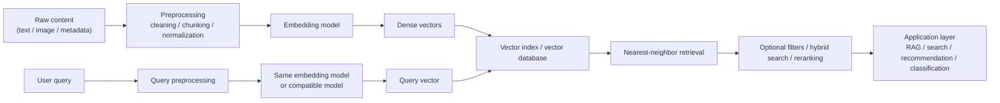
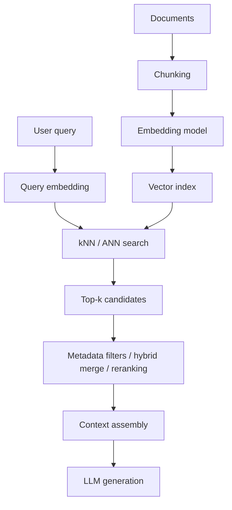
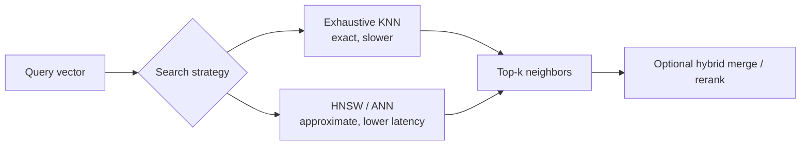

---
tags:
  - llm
  - embeddings
  - retrieval
  - similarity
type: note
status: evergreen
source: "OpenAI, Google Cloud Vertex AI, Cohere Docs, Microsoft Learn"
parent_note: "[[LLM Foundations - MOC]]"
---
# Embeddings และ Semantic Similarity

> โน้ตแกนสำหรับอธิบายว่า embeddings คืออะไร, อยู่ตรงไหนในสถาปัตยกรรม LLM systems, similarity ทำงานอย่างไร, และทำไมจึงเป็นฐานของ semantic retrieval, hybrid search, และ knowledge systems

---

## Summary

embedding คือเวกเตอร์ตัวเลขที่ใช้แทนความหมายของ input เช่น text, image, หรือ video เพื่อให้ระบบวัด “ความใกล้เชิงความหมาย” ได้ใน vector space แทนการเทียบคำแบบตรงตัว

ในเชิงสถาปัตย์ embeddings มักเป็นชั้นกลางระหว่าง:
- raw content
- retrieval/indexing system
- ranking layer
- application layer เช่น RAG, recommendation, clustering, classification

ข้อสำคัญคือ embedding ไม่ได้ให้ “คำตอบ” โดยตรง แต่มันทำให้ระบบหา context หรือ items ที่เกี่ยวข้องได้ดีขึ้นก่อนส่งต่อไปยังขั้นตอนถัดไป

---

## Scope Boundary

โน้ตนี้เน้น `embeddings` ในฐานะชั้น semantic representation:
- embedding model สร้างความหมายเชิงตัวเลขอย่างไร
- semantic similarity ช่วย retrieval และ ranking อย่างไร
- embedding choices กระทบคุณภาพระบบอย่างไร

ส่วนหัวข้อที่เน้น `vector` ในฐานะ retrieval primitive และ search system เช่น:
- vector databases
- index-time vs query-time pipeline
- nearest-neighbor search
- metadata payloads และ outputs ของ vector retrieval

ให้ดูต่อที่ [[14 - Vector Representations และ Similarity Search]]

---

## Embedding คืออะไร

จากเอกสารของ OpenAI, Google Cloud, และ Cohere แนวคิดตรงกันคือ embeddings เป็น vector ของ floating-point numbers ที่ออกแบบมาเพื่อเก็บความสัมพันธ์หรือความหมายของ input ไว้ในรูปเชิงตัวเลข ทำให้สามารถวัด similarity ระหว่าง inputs ได้

OpenAI ใช้ embeddings สำหรับงานอย่าง search, clustering, recommendations, anomaly detection, และ classification  
Google อธิบายว่า embeddings ใช้กับ text, images, และ videos ได้  
Cohere แยกการใช้งานตาม task ชัด เช่น search, classification, clustering

---

## Embeddings อยู่ตรงไหนในระบบ

ในทางปฏิบัติ embedding system มักมี 2 phase:
- indexing phase: แปลง documents/chunks เป็น vectors แล้วเก็บลง index
- query phase: แปลง query เป็น vector แล้วหา neighbors ที่ใกล้ที่สุดใน embedding space เดียวกัน

Microsoft อธิบายชัดว่า vector search ทำงานจาก numeric representations ของ content และ query แล้วคืนผลด้วย nearest-neighbor search

---

## Dense Vectors และ Vector Space

Google อธิบายว่า embeddings ทำงานโดยแปลง text, image, หรือ video เป็น arrays ของ floating point numbers และความยาวของ array นี้เรียกว่า dimensionality

มุมที่สำคัญเชิงสถาปัตย์:
- vector แต่ละมิติไม่ได้ตีความตรง ๆ แบบ human-readable feature
- ความหมายใช้งานจริงอยู่ที่ “ตำแหน่งสัมพัทธ์” ของ vectors ใน space
- similarity จึงไม่ใช่การ match keyword ตรงตัว แต่เป็นการวัดความใกล้ของความหมาย

ผลที่ตามมา:
- คำคนละคำอาจอยู่ใกล้กันถ้าหมายถึงเรื่องเดียวกัน
- query คนละภาษาอาจ match กันได้ ถ้า model รองรับ multilingual embeddings
- text query อาจค้น image space ได้ ถ้าใช้ multimodal embeddings

---

## Similarity วัดอย่างไร

metric ที่พบบ่อย:
- cosine similarity
- dot product
- Euclidean distance

OpenAI ระบุว่า embeddings ของตนถูก normalized เป็นความยาว 1 ทำให้ cosine similarity กับ Euclidean distance ให้ ranking เดียวกัน และ dot product สามารถใช้แทน cosine ได้

Google ก็ระบุในเอกสาร text embeddings ว่า vectors ของบางรุ่นถูก normalized ทำให้ cosine similarity, dot product, และ Euclidean distance ให้ similarity ranking เดียวกัน

Microsoft อธิบายว่าใน production vector search:
- `cosine` วัดมุมระหว่าง vectors
- `dotProduct` พิจารณาทั้งขนาดและมุม แต่ถ้า vectors normalized จะเทียบเท่า cosine
- `euclidean` วัดระยะห่างเชิงเรขาคณิต

สรุปเชิงระบบ:
- ถ้า embedding model คืน normalized vectors metric choice จะมีผลกับ performance/implementation มากกว่าลำดับผลลัพธ์
- ถ้า vectors ไม่ normalized metric choice สำคัญขึ้น
- similarity score ไม่ควรถูกตีความเป็น factual correctness โดยตรง

---

## Semantic Similarity ไม่เท่ากับ Factual Relevance

embedding similarity บอกว่า:
- query กับ chunk มีความใกล้เชิงความหมายแค่ไหน

แต่มันไม่ได้รับประกันว่า:
- chunk นั้นตอบคำถามจริง
- chunk มี fact ล่าสุด
- chunk ครบพอสำหรับ answer synthesis
- chunk นั้นเป็น source ที่เชื่อถือได้

ดังนั้น retrieval stack ที่ดีมักต้องมีมากกว่า embeddings อย่างเดียว เช่น:
- metadata filters
- hybrid search
- reranking
- citation / grounding layer
- downstream evaluation

Microsoft ระบุชัดว่า filtered vector search, hybrid search, และ semantic ranking มักช่วยยกระดับ relevance ในระบบจริง

---

## Embeddings ใน Retrieval Architecture

ลำดับนี้ทำให้เห็นว่า embedding เป็นชั้น retrieval primitive ไม่ใช่ชั้น generation

บทบาทของ embedding ใน architecture:
- map ทั้ง query และ documents ให้อยู่ใน space เดียวกัน
- เปิดทางให้ nearest-neighbor search
- ลด dependence ต่อ exact keyword overlap
- รองรับ multilingual และ multimodal search ถ้า model รองรับ

---

## Query Embedding กับ Document Embedding ไม่จำเป็นต้องเหมือนกันทุกทาง

Cohere ระบุชัดว่า embedding model บางตระกูลถูก optimize ต่างกันตาม `input_type` เช่น:
- `search_query`
- `search_document`
- `classification`
- `clustering`

ความหมายเชิงสถาปัตย์คือ:
- query representation กับ document representation อาจมี optimization คนละแบบ
- production system ควรแยก ingestion pipeline กับ query pipeline ให้ชัด
- ห้ามสลับ task mode แบบไม่มีหลักการ เพราะจะทำให้ retrieval quality เสีย

นี่เป็นเหตุผลว่าทำไม embedding system ที่ดีต้องกำหนด contract ให้ชัด:
- ใช้ model ไหน
- ใช้ input_type ไหน
- ใช้ dimension เท่าไร
- ใช้ metric ไหน
- reindex เมื่อไร

---

## Dimension, Latency, Storage

Google และ OpenAI ต่างมีแนวคิดตรงกันว่า dimension ของ embeddings เป็น parameter เชิงระบบที่มีผลต่อ:
- quality
- latency
- storage cost
- index memory footprint

OpenAI ระบุว่า embedding models มี default dimensions ต่างกัน และรองรับการลด dimensions ในบางรุ่น  
Google ระบุว่ารุ่น multimodal บางตัวรองรับ lower-dimension embeddings เพื่อ trade latency/storage กับ quality

หลักคิดเชิงสถาปัตย์:
- dimensions สูงขึ้นมักเก็บสัญญาณได้ละเอียดขึ้น
- แต่จะเพิ่ม storage, bandwidth, และ indexing/search cost
- การเลือก dimension ควรทำร่วมกับ eval ไม่ใช่เดา

---

## Vector Index และ Retrieval Algorithms

Microsoft อธิบาย vector search algorithm ที่สำคัญ 2 กลุ่ม:
- exhaustive KNN: scan ทั้ง space ได้ exact nearest neighbors แต่ช้า
- HNSW: approximate nearest neighbor ที่เร็วกว่าและเหมาะกับข้อมูลขนาดใหญ่

Trade-off หลัก:
- exact search ดีต่อ evaluation, ground truth, datasets เล็ก
- ANN/HNSW ดีต่อ production scale
- tuning ของ index ส่งผลต่อ recall, latency, memory

Microsoft ยังระบุเพิ่มว่าขนาด chunk, overlap, `k`, และ hybrid search มีผลต่อ relevance จริงในระบบ production

---

## Hybrid Search สำคัญกว่าที่คิด

Azure AI Search ระบุว่า hybrid search คือการรัน vector search และ keyword search คู่กันใน request เดียว แล้ว merge ผลลัพธ์กลับมารวมกัน

เชิงระบบ hybrid search มีประโยชน์เมื่อ:
- semantic match อย่างเดียวไม่พอ
- query มี entity names, IDs, version strings, หรือ exact terms
- ต้องการ balance ระหว่าง semantic recall กับ lexical precision

ในระบบ knowledge retrieval จริง มักใช้ pattern นี้:
- vector retrieval เพื่อ recall
- keyword search เพื่อ exact terms
- reranker เพื่อจัดลำดับสุดท้าย

---

## Multilingual และ Multimodal

Google ระบุว่า embeddings ใช้ได้กับ text, image, และ video และรองรับ multimodal embeddings ใน Vertex AI  
Cohere ระบุว่าบาง embedding models รองรับ multilingual usage กว้างมาก  
Azure AI Search ก็รองรับ multimodal search และ multilingual search ถ้า embedding model รองรับ

สรุปเชิงสถาปัตย์:
- multilingual embeddings ทำให้ query คนละภาษายังหา content ที่เกี่ยวกันได้
- multimodal embeddings ทำให้ text query ค้น image/video space ได้
- แต่ capability เหล่านี้ขึ้นกับ model family และ ingestion/query pipeline ที่สอดคล้องกัน

---

## ขอบเขตและข้อจำกัด

embedding systems มีข้อจำกัดเชิงสถาปัตย์ที่ต้องระวัง:

1. Domain mismatch  
model ที่ดีบน benchmark ทั่วไปอาจไม่ดีบนเอกสาร domain เฉพาะ

2. Chunk quality  
retrieval quality มักพังเพราะ chunking ไม่ดี ไม่ใช่เพราะ embedding model อย่างเดียว

3. Freshness  
embedding ไม่แก้ปัญหาข้อมูลล้าสมัยเอง ต้องพึ่ง data pipeline และ reindexing

4. Similarity != truth  
semantic proximity ไม่เท่ากับ correctness

5. Schema drift / model migration  
เปลี่ยน model, dimension, หรือ preprocessing เมื่อไร มักต้อง re-embed และ reindex

6. Cost and memory  
dimensions สูง + corpus ใหญ่ = storage/indexing/search cost สูง

---

## Embeddings vs Token IDs vs Contextual Representations

อย่าสับสน 3 อย่างนี้:

- token IDs  
เป็นตัวแทนเชิงดัชนีของ token หลัง tokenizer แทบไม่มี semantic meaning ในตัวเอง

- contextual representations  
เป็น hidden states ภายใน model ระหว่างประมวลผล ซึ่งเปลี่ยนตามบริบท

- embeddings สำหรับ retrieval  
เป็น vector representation ที่ออกแบบให้เอาไปเทียบ similarity ระหว่าง objects ได้

ในทางปฏิบัติ retrieval embeddings มักเป็น application-facing representation ส่วน hidden states ภายในโมเดลเป็น model-internal representation

---

## Design Rules

- ใช้ embedding model เดียวกันหรือ compatible space เดียวกันระหว่าง index กับ query
- กำหนด preprocessing contract ให้คงที่
- เลือก metric ให้สอดคล้องกับ model properties
- ประเมิน model + chunking + `k` + hybrid strategy เป็นระบบเดียว
- อย่าตีความ similarity score เป็น factual confidence
- ถ้าระบบต้องการ exact identifiers ให้ใช้ hybrid retrieval แทนหวังพึ่ง vector อย่างเดียว
- ถ้ามี metadata สำคัญ ให้ใช้ filtered vector search ร่วมด้วย

---

## ความสัมพันธ์กับโน้ตอื่น

- [[01 - LLM คืออะไรและพื้นฐาน]]
- [[06 - Attention และ Representations]]
- [[08 - Data, Pretraining และ Model Modes]]
- [[04 Synthesis/Bridge/Synthesis - Weights, Context, Retrieval และ Tools]]
- [[02 AI Systems/RAG/RAG - MOC|RAG - MOC]]
- [[02 AI Systems/RAG/Retrieval/03 - Embeddings and Vector Databases|RAG - Embeddings and Vector Databases]]
- [[02 AI Systems/Evals/Evals - MOC|Evals - MOC]]

---

## คำถามที่มักสับสน

- embeddings = “ความหมาย” แบบสมบูรณ์หรือไม่
- embedding model กับ generation model เหมือนกันหรือไม่
- similarity สูงแปลว่า factual relevance สูงเสมอหรือไม่
- retrieval quality พังเพราะ embeddings หรือ chunking หรือ query formulation
- vector search ควรใช้เดี่ยว ๆ หรือ hybrid search ดีกว่า

---

## Official References

- OpenAI Embeddings Guide  
  https://platform.openai.com/docs/guides/embeddings
- OpenAI Embeddings FAQ  
  https://help.openai.com/en/articles/6824809-embeddings-faq
- Google Cloud Vertex AI: Embeddings APIs Overview  
  https://cloud.google.com/vertex-ai/generative-ai/docs/embeddings
- Google Cloud Vertex AI: Get Text Embeddings  
  https://cloud.google.com/vertex-ai/generative-ai/docs/embeddings/get-text-embeddings
- Google Cloud Vertex AI: Text Embeddings API  
  https://cloud.google.com/vertex-ai/generative-ai/docs/model-reference/text-embeddings-api
- Google Cloud Vertex AI: Get Multimodal Embeddings  
  https://cloud.google.com/vertex-ai/generative-ai/docs/embeddings/get-multimodal-embeddings
- Cohere Docs: Introduction to Embeddings  
  https://docs.cohere.com/docs/embeddings
- Cohere Docs: Embed Models  
  https://docs.cohere.com/docs/cohere-embed
- Azure AI Search: Vector Search Overview  
  https://learn.microsoft.com/en-us/azure/search/vector-search-overview
- Azure AI Search: Relevance in Vector Search  
  https://learn.microsoft.com/en-us/azure/search/vector-search-ranking

---

## Next Notes To Create

- Embedding Models และ Benchmark
- Vector Search: ANN, HNSW, IVF
- Query Expansion และ Hybrid Retrieval
