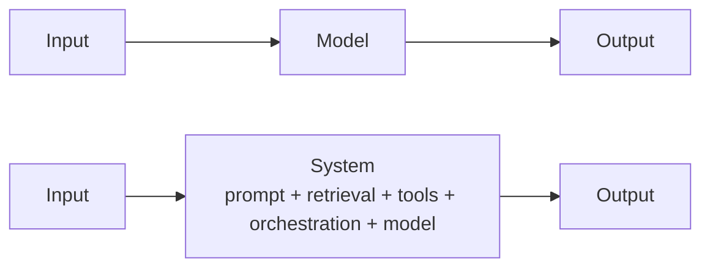
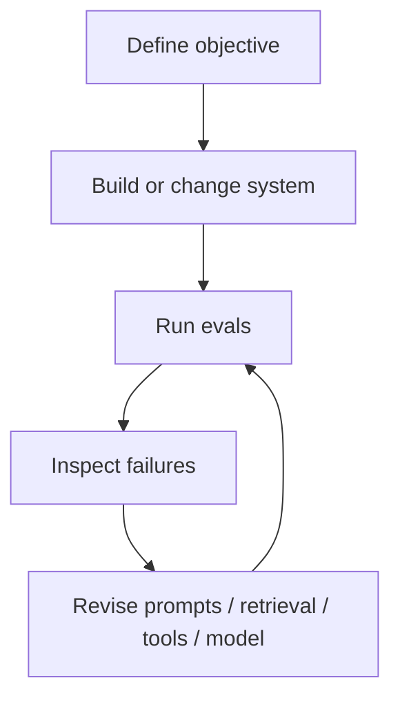

---
tags:
  - llm
  - evaluation
  - evals
  - reliability
type: note
status: evergreen
source: "OpenAI, Anthropic, Google Cloud Vertex AI, Microsoft Learn"
parent_note: "[[LLM Foundations - MOC]]"
---
# Evaluation Foundations

> โน้ตแกนสำหรับอธิบายว่า evaluation ในระบบ LLM คืออะไร, ต่างจาก benchmark อย่างไร, และควรคิด evaluation เป็นส่วนหนึ่งของ system design ตั้งแต่แรกอย่างไร

---

## Summary

evaluation ในระบบ LLM ไม่ใช่แค่การวัดคะแนนโมเดล แต่คือการออกแบบชุดการทดสอบเพื่อวัดว่า model หรือ system ทำงานได้ตรง objective ที่ต้องการหรือไม่ ภายใต้ความไม่ deterministic ของ generative AI

OpenAI ระบุชัดว่า evals เป็น structured tests สำหรับวัด performance ของ AI systems ใน production-like settings  
Google Vertex AI อธิบาย evaluation service ว่าใช้ประเมิน model responses ตาม metrics หรือ rubrics ที่กำหนด  
Microsoft อธิบาย evaluation flow ว่าเป็น flow ที่ใช้ประเมิน outputs ของ flow อื่นตาม criteria ที่กำหนด  
Anthropic มี eval tool และ guidance ฝั่ง consistency / guardrails ซึ่งสัมพันธ์กับแนวคิดว่าการประเมินควรอยู่ใน loop การพัฒนา

---

## Evaluation คืออะไร

ในเชิงสถาปัตย์ของ vault นี้ evaluation คือกระบวนการตอบคำถาม 3 อย่าง:
- เราต้องการให้ระบบสำเร็จเรื่องอะไร
- เราจะวัดความสำเร็จนั้นอย่างไร
- เมื่อระบบเปลี่ยน เราจะรู้ได้อย่างไรว่าดีขึ้นหรือแย่ลง

สิ่งสำคัญคือ generative systems มี variability  
ดังนั้น evaluation ต้องรองรับ output ที่ไม่ deterministic และควรออกแบบให้สะท้อนงานจริงมากกว่าดูแค่ intuition

---

## Benchmark, Metric, Evaluator, และ Eval ไม่เหมือนกัน

แยกคำให้ชัด:

- **benchmark**  
  ชุดทดสอบมาตรฐานสำหรับเปรียบเทียบ model หรือ systems ในงานบางแบบ

- **metric**  
  วิธีให้คะแนน เช่น accuracy, ROUGE, pass/fail, rubric score, tool-call accuracy

- **evaluator**  
  ตัวที่ใช้ให้คะแนน อาจเป็นโค้ด, rules, human, หรือ LLM-as-judge

- **eval**  
  ระบบการทดสอบที่รวม objective, dataset, evaluator, metrics, และ comparison loop

OpenAI ระบุชัดว่าเวลาพูดถึง evals อาจหมายถึง benchmark, numerical scores, หรือ task-specific tests แต่สำหรับการพัฒนาระบบจริงควรเน้น use-case-specific evals

---

## Model Eval vs System Eval

แยกให้ชัด:
- **model eval** วัดตัว model หรือ prompt/model pair ใน isolation
- **system eval** วัดทั้ง pipeline เช่น retrieval, routing, tool use, orchestration, post-processing, และ final response

OpenAI อธิบายว่า complexity และ nondeterminism เพิ่มตาม architecture ตั้งแต่ single-turn ไป workflow, agent, multi-agent  
ดังนั้น evaluation ที่ดีต้องวัดในระดับที่สอดคล้องกับ architecture จริงของระบบ

---

## Offline Eval vs Online Eval

- **offline eval**  
  ใช้ dataset ที่เตรียมไว้ล่วงหน้า, run ได้ซ้ำ, เหมาะกับ regression และ model comparison

- **online eval**  
  ใช้ production traffic, user feedback, live experiments, หรือ telemetry

OpenAI แนะนำให้ log everything, mine production data, และ continuously evaluate  
Microsoft evaluation flows ก็สะท้อนแนวคิดว่าต้องรับ outputs จาก runs จริงมาตรวจ  

สรุป:
- offline eval ดีสำหรับควบคุมและเปรียบเทียบ
- online eval ดีสำหรับความจริงของ usage จริง
- ระบบ mature มักต้องใช้ทั้งสองแบบ

---

## Objective มาก่อน Metric

การออกแบบ eval ควรเริ่มจาก objective ไม่ใช่จาก metric

ลำดับที่เหมาะ:
1. define objective
2. เลือก dataset
3. เลือก evaluators และ metrics
4. run และ compare
5. iterate และ continuously evaluate

นี่สอดคล้องกับ flow ที่ OpenAI อธิบายใน evaluation best practices และสอดคล้องกับ evaluation flow model ของ Microsoft

---

## Evaluator Types

ประเภท evaluator ที่สำคัญ:

1. **rule-based / executable evaluators**
- exact match
- schema validation
- unit-test-like checks
- tool-call correctness

2. **metric-based evaluators**
- ROUGE / BLEU / similarity metrics
- numerical scoring

3. **human evaluators**
- expert review
- pairwise preference
- rubric scoring

4. **LLM-as-a-judge**
- pairwise comparison
- single-response grading
- reference-guided grading

OpenAI ระบุข้อดีข้อเสียของ human evals และ LLM-as-judge ไว้ชัด และแนะนำให้ calibrate automated metrics กับ human judgment

---

## Architecture-Aware Evaluation

OpenAI แบ่งพื้นที่ที่ควร eval ตาม architecture:
- single-turn interactions
- workflows
- single-agent
- multi-agent

ความหมายเชิงสถาปัตย์คือจุดที่มี nondeterminism เพิ่มขึ้น คือจุดที่ควรมี eval เพิ่มขึ้นด้วย เช่น:
- instruction following
- functional correctness
- retrieval quality
- tool selection
- tool argument accuracy
- agent handoff correctness

ดังนั้น evaluation ไม่ควรเป็น layer ที่แยกจาก architecture แต่ควร map กับ architecture โดยตรง

---

## Dataset Design สำคัญพอ ๆ กับ Metric

dataset ที่ดีควรมี:
- common cases
- edge cases
- adversarial cases
- representative production cases

OpenAI เตือนชัดเรื่อง anti-patterns เช่น:
- eval ที่ generic เกินไป
- dataset bias
- vibe-based evals
- ไม่ calibrate กับ human feedback

ในเชิง design inference ของโน้ตนี้ Anthropic docs ฝั่ง guardrails ก็สะท้อนแนวคิดคล้ายกัน: ถ้าจะ strengthen systems ต้องมี monitoring, testing, และ iterative refinement

---

## Evaluation เป็น Development Loop ไม่ใช่ Phase สุดท้าย

OpenAI ใช้คำว่า eval-driven development  
Google evaluation service รองรับการประเมิน model responses ภายใต้ metrics หรือ rubrics ที่กำหนด  
Microsoft evaluation flows ก็วาง evaluation เป็น flow ที่เอาไปผูกกับระบบพัฒนาได้

สรุป:
- eval ต้องอยู่ใน iteration loop
- ไม่ใช่เอกสารที่ทำครั้งเดียวหลัง build เสร็จ

---

## Cost, Latency, Reliability

ส่วนนี้เป็น **architectural inference** จากสิ่งที่แหล่งอ้างอิงอธิบาย

trade-offs หลัก:
- eval ลึกขึ้น -> confidence สูงขึ้น
- eval มากขึ้น -> cost/time สูงขึ้น
- automated eval scale ได้ -> แต่อาจ miss nuance
- human eval คุณภาพสูง -> แต่ช้าและแพง

ระบบที่ดีต้อง balance:
- automation
- human calibration
- regression safety
- iteration speed

---

## Design Rules

- เริ่มจาก objective ไม่ใช่ metric
- แยก model eval ออกจาก system eval
- ใช้ offline eval สำหรับ regression และ comparison
- ใช้ online signals เพื่อสะท้อน reality
- map evals ให้ตรงกับ architecture
- include edge cases และ adversarial cases เสมอ
- calibrate automated evaluators กับ human judgment
- treat evaluation as a continuous workflow

---

## ความสัมพันธ์กับโน้ตอื่น

- [[05 - ข้อจำกัดและการประเมินผล LLM]]
- [[04 Synthesis/Bridge/Synthesis - Weights, Context, Retrieval และ Tools]]
- [[01 Foundations/Prompt Engineering/Core/05 - Evaluation และ Failure Modes|Prompt Engineering - Evaluation และ Failure Modes]]
- [[01 Foundations/Prompt Engineering/Core/07 - Structured Generation และ Output Formats|Structured Generation และ Output Formats]]
- [[02 AI Systems/Evals/Evals - MOC|Evals - MOC]]
- [[02 AI Systems/Evals/Core/01 - Success Criteria|Evals - Success Criteria]]
- [[02 AI Systems/Evals/Application/08 - Agent Evals|Evals - Agent Evals]]

---

## คำถามที่มักสับสน

- benchmark ดี แปลว่าระบบจริงดีด้วยไหม
- metric สูง แต่ผู้ใช้ยังไม่พอใจ เกิดจากอะไร
- LLM-as-judge แทน human eval ได้แค่ไหน
- eval ควรเริ่มตอน prompt stage หรือหลังมีระบบครบแล้ว
- ควรวัด model หรือวัด system กันแน่

---

## Official References

- OpenAI: Evaluation Best Practices  
  https://platform.openai.com/docs/guides/evaluation-best-practices
- Anthropic: Using the Evaluation Tool  
  https://docs.anthropic.com/en/docs/test-and-evaluate/eval-tool
- Anthropic: Increase Output Consistency  
  https://docs.anthropic.com/en/docs/test-and-evaluate/strengthen-guardrails/increase-consistency
- Google Cloud Vertex AI: Gen AI Evaluation Service Overview  
  https://cloud.google.com/vertex-ai/generative-ai/docs/models/evaluation-overview
- Google Cloud Vertex AI: Gen AI Evaluation Service API  
  https://cloud.google.com/vertex-ai/generative-ai/docs/model-reference/evaluation
- Microsoft Learn: Develop an Evaluation Flow in Azure AI Foundry  
  https://learn.microsoft.com/en-us/azure/ai-studio/how-to/flow-develop-evaluation

---

## Next Notes To Create

- Evaluation Metrics and Rubrics
- LLM-as-a-Judge Foundations
- Offline vs Online Evaluation
- Evaluation Dataset Design
