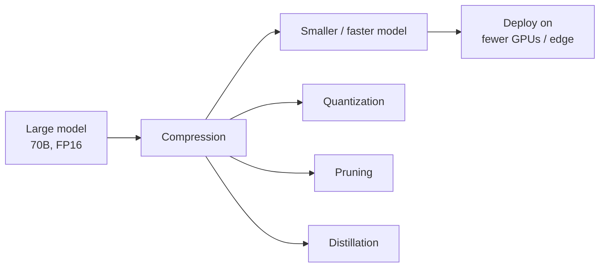
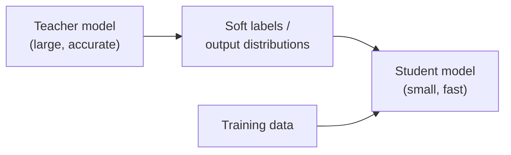
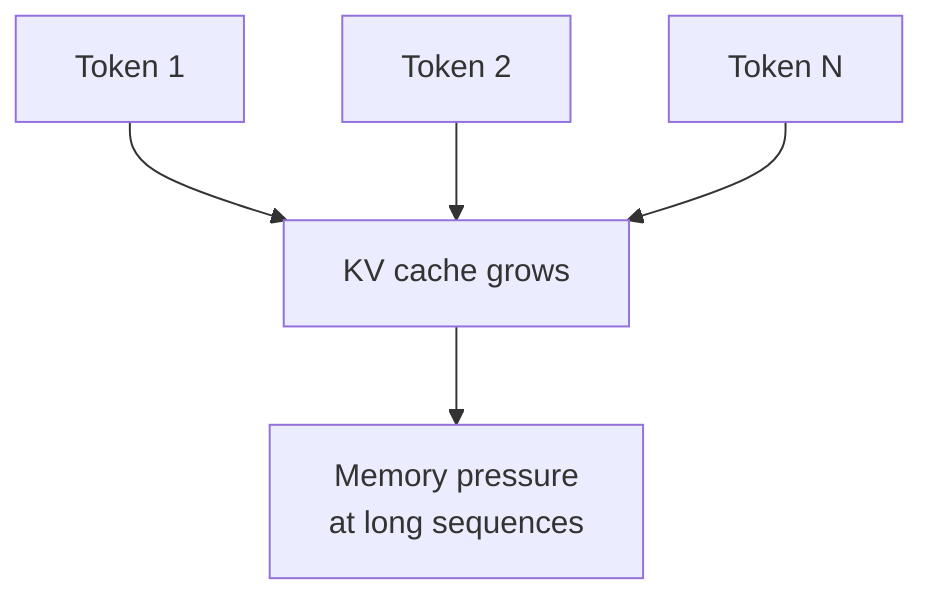
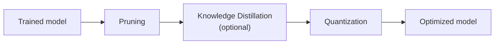

---
tags:
  - llm
  - compression
  - quantization
  - distillation
  - pruning
  - inference
  - optimization
  - kv-cache
type: note
status: evergreen
source: "Hugging Face, NVIDIA, Google DeepMind, Meta AI, Dettmers et al. (QLoRA/GPTQ), Frantar et al. (SparseGPT)"
parent_note: "[[LLM Foundations - MOC]]"
created: "2026-04-23"
updated: "2026-04-23"
---

# Model Compression และ Inference Optimization

---

## ขอบเขตของโน้ตนี้

โน้ตนี้ตอบคำถามว่า:
- ทำไมต้อง compress โมเดลก่อน deploy
- เทคนิคหลัก 3 อย่าง (quantization, pruning, distillation) ทำงานอย่างไร
- KV cache optimization ช่วย inference อย่างไร
- trade-off ระหว่าง compression กับ quality คืออะไร

โน้ตนี้เน้น **เทคนิคระดับ model** เป็นหลัก  
ส่วน serving-level optimization (batching, scheduling, caching strategies) ให้ดู [[09 - Serving Metrics และระบบ Production LLM]]  
ส่วน fine-tuning techniques (LoRA, QLoRA, DPO) ให้ดู [[03 - การฝึกและ Post-Training]]

---

## ทำไมต้อง Compress

LLM ขนาดใหญ่มีปัญหาเชิงปฏิบัติ:
- **Memory** — โมเดล 70B parameters ใน FP16 ใช้ ~140 GB VRAM
- **Latency** — memory bandwidth เป็น bottleneck หลักของ autoregressive decoding
- **Cost** — GPU hours สำหรับ inference แพงตามขนาดโมเดล
- **Accessibility** — ไม่ใช่ทุกคนมี multi-GPU cluster

เป้าหมายของ compression คือ **ลดขนาดและ compute ที่ต้องใช้ โดยรักษา quality ให้มากที่สุด**



---

## Quantization

### แนวคิดหลัก

Quantization คือการลด **numerical precision** ของ weights และ/หรือ activations จาก FP32/FP16 ลงเป็น INT8, INT4, หรือต่ำกว่า

```text
FP16 weight: 1.2345 (16 bits)
INT8 weight: 1.23   (8 bits)  → ลด memory ~50%
INT4 weight: 1.2    (4 bits)  → ลด memory ~75%
```

### ประเภทของ Quantization

| ประเภท | ทำเมื่อไร | ข้อดี | ข้อเสีย |
|---|---|---|---|
| **Post-Training Quantization (PTQ)** | หลัง training เสร็จ ไม่ต้องฝึกใหม่ | เร็ว, ง่าย | quality drop มากกว่าถ้า precision ต่ำมาก |
| **Quantization-Aware Training (QAT)** | ระหว่าง training/fine-tuning | quality ดีกว่า PTQ ที่ precision เดียวกัน | ต้องฝึกใหม่, ใช้ compute มากกว่า |

### เทคนิค Quantization ที่สำคัญ

- **GPTQ** — PTQ สำหรับ LLM ที่ใช้ approximate second-order information เพื่อ quantize ทีละ layer อย่างแม่นยำ รองรับ 4-bit/3-bit
- **AWQ (Activation-Aware Weight Quantization)** — ให้ความสำคัญกับ weights ที่มีผลต่อ activation มาก ไม่ quantize ทุก weight เท่ากัน
- **GGUF / llama.cpp quantization** — format สำหรับ CPU/edge inference รองรับหลายระดับ precision (Q4_K_M, Q5_K_S, etc.)
- **bitsandbytes** — library ที่ Hugging Face ใช้สำหรับ 8-bit และ 4-bit quantization (ใช้ใน QLoRA)

### ผลกระทบต่อ Quality

- INT8 quantization มักสูญเสีย quality น้อยมากสำหรับ LLM ส่วนใหญ่
- INT4 quantization เริ่มมี degradation ที่วัดได้ แต่ยังใช้งานได้ดีในหลาย task
- ต่ำกว่า 4-bit (เช่น 2-bit, 1-bit) ยังเป็นงานวิจัยที่ quality drop ชัดเจน
- โมเดลใหญ่กว่ามักทน quantization ได้ดีกว่าโมเดลเล็ก

---

## Knowledge Distillation

### แนวคิดหลัก

Knowledge distillation คือการฝึก **student model** (เล็กกว่า) ให้เลียนแบบ behavior ของ **teacher model** (ใหญ่กว่า)



### วิธีการ Distillation

| วิธี | อธิบาย |
|---|---|
| **Output distillation** | student เรียนจาก soft probability distribution ของ teacher |
| **Feature distillation** | student เรียนจาก intermediate representations ของ teacher |
| **Data augmentation via teacher** | ใช้ teacher สร้าง synthetic training data ให้ student |

### ตัวอย่างในทางปฏิบัติ

- **Alpaca** — ใช้ GPT-4 สร้าง instruction data แล้วฝึก LLaMA 7B
- **Orca** — ใช้ reasoning traces จาก GPT-4 เป็น training signal
- **Phi series (Microsoft)** — ใช้ curated synthetic data จาก larger models
- **Gemma / Gemini Nano** — Google ใช้ distillation จาก larger Gemini models

ข้อควรระวัง:
- student ไม่สามารถเกิน teacher ได้ในทุก dimension
- quality ของ distillation ขึ้นกับ quality ของ teacher outputs
- licensing ของ teacher model อาจจำกัดการใช้ distilled model ในเชิงพาณิชย์

---

## Pruning

### แนวคิดหลัก

Pruning คือการ **ตัด weights หรือ structures ที่ไม่จำเป็นออก** จากโมเดล

```text
Before pruning: [0.5, 0.001, -0.3, 0.0002, 0.8]
After pruning:  [0.5, 0,     -0.3, 0,      0.8]  → sparse
```

### ประเภทของ Pruning

| ประเภท | ตัดอะไร | ผลลัพธ์ |
|---|---|---|
| **Unstructured pruning** | individual weights (set to zero) | sparse matrix, ต้อง hardware/software รองรับ |
| **Structured pruning** | entire neurons, heads, หรือ layers | dense matrix ที่เล็กลง, ใช้ hardware ปกติได้ |
| **Semi-structured (N:M sparsity)** | pattern เช่น 2:4 (2 จาก 4 weights เป็น zero) | NVIDIA Ampere+ รองรับ hardware acceleration |

### เทคนิคที่สำคัญ

- **SparseGPT** — one-shot pruning สำหรับ LLM ที่ไม่ต้อง retraining ใช้ approximate inverse Hessian
- **Wanda (Weights and Activations)** — pruning โดยพิจารณาทั้ง weight magnitude และ activation magnitude
- **Layer pruning** — ตัดทั้ง layer ออก (เช่น ตัด Transformer layers ที่ redundant)

### ข้อจำกัด

- unstructured sparsity ยังไม่ได้ speedup จริงบน hardware ส่วนใหญ่ (ยกเว้น N:M sparsity บน NVIDIA)
- structured pruning ให้ speedup จริง แต่ quality drop มากกว่า
- pruning + quantization ร่วมกันมักให้ compression ratio ที่ดีที่สุด

---

## KV Cache Optimization

### ทำไม KV Cache สำคัญ

ในระหว่าง autoregressive decoding โมเดลต้องคำนวณ attention กับ token ก่อนหน้าทุกตัว KV cache เก็บ key-value pairs ที่คำนวณแล้วเพื่อไม่ต้องคำนวณซ้ำ

ปัญหา: KV cache โตตาม sequence length × batch size × num layers × head dimension



### เทคนิค Optimization

| เทคนิค | แนวคิด |
|---|---|
| **Multi-Query Attention (MQA)** | ใช้ key-value head เดียวร่วมกันทุก query head → ลด KV cache ลงมาก |
| **Grouped-Query Attention (GQA)** | ใช้ key-value heads น้อยกว่า query heads (compromise ระหว่าง MHA กับ MQA) |
| **KV cache quantization** | quantize cached keys/values เป็น FP8 หรือ INT8 |
| **Sliding window attention** | จำกัด attention range → KV cache ไม่โตไม่จำกัด (เช่น Mistral) |
| **PagedAttention (vLLM)** | จัดการ KV cache เป็น pages คล้าย virtual memory → ลด fragmentation |

### ความสัมพันธ์กับ Serving

KV cache optimization เป็นจุดเชื่อมระหว่าง model-level กับ serving-level:
- model architecture (MQA/GQA) กำหนดขนาด KV cache ตั้งแต่ design
- serving system (vLLM, TensorRT-LLM) จัดการ memory allocation ของ KV cache
- ทั้งสองต้องทำงานร่วมกันเพื่อ maximize throughput

> ดูรายละเอียด serving pipeline ที่ [[09 - Serving Metrics และระบบ Production LLM]]

---

## การรวมเทคนิค (Compression Pipeline)

ในทางปฏิบัติมักใช้หลายเทคนิคร่วมกัน:



งานวิจัยชี้ว่าลำดับ **Pruning → Distillation → Quantization** มักให้ผลดีที่สุดในแง่ compression ratio ต่อ quality ที่สูญเสีย

ตัวอย่างในทางปฏิบัติ:
- **Llama 3.1 8B + GPTQ 4-bit** — ลด memory ~75%, quality drop น้อย
- **Mistral 7B + AWQ 4-bit** — ใช้งานบน single consumer GPU ได้
- **Phi-3 mini** — distilled + quantized สำหรับ on-device inference

---

## อย่าสับสน: Compression vs Fine-tuning

| ประเด็น | Compression | Fine-tuning |
|---|---|---|
| เป้าหมาย | ลดขนาด/ลด compute | เปลี่ยน behavior |
| เปลี่ยน weights? | ใช่ (quantize/prune) | ใช่ (update) |
| ต้อง training data? | PTQ ไม่ต้อง, distillation ต้อง | ต้อง |
| ใช้ร่วมกันได้? | ได้ (fine-tune ก่อน แล้ว compress) | ได้ |

QLoRA เป็นตัวอย่างที่ compression (quantization) กับ fine-tuning (LoRA) ทำงานร่วมกัน

---

## Mental Model

```text
Quantization  = ลด precision ของตัวเลข → ลด memory + เร็วขึ้น
Pruning       = ตัด weights ที่ไม่จำเป็นออก → sparse/smaller model
Distillation  = สอนโมเดลเล็กให้เลียนแบบโมเดลใหญ่ → smaller architecture
KV cache opt  = ลด memory ที่ใช้ระหว่าง inference → longer sequences, higher throughput
```

---

## Official References

- Dettmers et al., QLoRA: Efficient Finetuning of Quantized Language Models  
  https://arxiv.org/abs/2305.14314
- Frantar et al., GPTQ: Accurate Post-Training Quantization for Generative Pre-trained Transformers  
  https://arxiv.org/abs/2210.17323
- Frantar & Alistarh, SparseGPT: Massive Language Models Can Be Accurately Pruned in One-Shot  
  https://arxiv.org/abs/2301.00774
- Sun et al., A Simple and Effective Pruning Approach for Large Language Models (Wanda)  
  https://arxiv.org/abs/2306.11695
- Lin et al., AWQ: Activation-aware Weight Quantization  
  https://arxiv.org/abs/2306.00978
- Kwon et al., Efficient Memory Management for Large Language Model Serving with PagedAttention  
  https://arxiv.org/abs/2309.06180
- Ainslie et al., GQA: Training Generalized Multi-Query Transformer Models from Multi-Head Checkpoints  
  https://arxiv.org/abs/2305.13245
- Hinton et al., Distilling the Knowledge in a Neural Network  
  https://arxiv.org/abs/1503.02531
- Hugging Face, Quantization documentation  
  https://huggingface.co/docs/transformers/quantization
- NVIDIA, TensorRT-LLM documentation  
  https://nvidia.github.io/TensorRT-LLM/

---

## ดูต่อ

- [[03 - การฝึกและ Post-Training]] — fine-tuning techniques (LoRA, QLoRA, DPO) ที่เกี่ยวข้องกับ compression
- [[09 - Serving Metrics และระบบ Production LLM]] — serving-level optimization ที่ต่อยอดจาก model compression
- [[04 - Inference, Context และ RAG]] — inference loop และ KV cache ในบริบท runtime
- [[06 - Attention และ Representations]] — attention mechanism ที่เป็นพื้นฐานของ MQA/GQA
- [[08 - Data, Pretraining และ Model Modes]] — scaling laws ที่เกี่ยวข้องกับ model size decisions
- [[LLM Foundations - MOC]]
