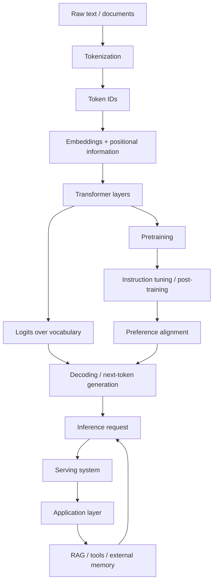

---
tags:
  - llm
  - moc
  - foundation
type: moc
status: evergreen
source: ""
parent_note: "[[Home]]"
---
# LLM Foundations - Map of Content

> แผนที่ความรู้ของชุด LLM Foundations โดยแยกตามระดับความเข้าใจ: model basics, training, inference, production, limitations
> Main official sources: OpenAI, Google Research, Google DeepMind, Anthropic, Hugging Face, NVIDIA

---

## ใช้อ่านชุดนี้อย่างไร

ชุดนี้ตั้งใจแยกคำอธิบายออกเป็น 5 ชั้น:
- **Model Basics** — LLM คืออะไร, token, embedding, Transformer
- **Training** — pretraining, instruction tuning, RLHF, model modes
- **Inference** — request หนึ่งรอบทำงานอย่างไร
- **Production Systems** — latency, throughput, cache, serving trade-offs
- **Limitations and Evaluation** — hallucination, bias, system risk, evals

ถ้าอ่านแบบลำดับนี้ จะสับสนน้อยที่สุด

---

## แผนที่ภาพรวม

---

## 1. Model Basics

- [[01 - LLM คืออะไรและพื้นฐาน]] — นิยามของ LLM, tokenization, embeddings, model families, scaling basics
- [[02 - สถาปัตยกรรม Transformer]] — high-level architecture ของ Transformer, encoder/decoder, masking, positional information
- [[06 - Attention และ Representations]] — scaled dot-product attention, multi-head attention, FFN, residuals, contextual representations
- [[07 - Logits, Decoding และ Sampling]] — logits, softmax, greedy, sampling, beam search, temperature, top-k, top-p
- [[10 - Embeddings และ Semantic Similarity]] — embeddings, vector space intuition, similarity metrics, retrieval foundations
- [[11 - Multimodal Foundations]] — ภาพรวมของ text, image, audio, และ multimodal model design
- [[14 - Vector Representations และ Similarity Search]] — dense/sparse vectors, nearest-neighbor search, และ vector layer ใน AI systems

---

## 2. Training

- [[03 - การฝึกและ Post-Training]] — training lifecycle, pretraining, instruction tuning, RLHF, RLAIF, Constitutional AI, Chinchilla
- [[08 - Data, Pretraining และ Model Modes]] — data mixture, base model vs instruction model, in-context learning, weights vs context vs external memory

---

## 3. Inference

- [[04 - Inference, Context และ RAG]] — inference loop, context window, token types, prefill/decode, KV cache, RAG, context engineering
- [[12 - Weights, Context, Retrieval และ Tools]] — แยกบทบาทของ model knowledge, prompt context, retrieval, และ tool use

---

## 4. Production Systems

- [[09 - Serving Metrics และระบบ Production LLM]] — TTFT, latency vs throughput, cache strategies, prompt caching, serving pipeline, production metrics

---

## 5. Limitations and Evaluation

- [[05 - ข้อจำกัดและการประเมินผล LLM]] — hallucination, bias, alignment trade-offs, benchmark limits, system risks, evaluation dimensions
- [[13 - Evaluation Foundations]] — benchmark vs metric vs evaluator vs eval, model eval vs system eval, และ eval-driven development

---

## เส้นทางการอ่าน

- **ภาพรวม LLM สำหรับเริ่มต้น**: `01 -> 02 -> 03`
- **อยากเข้าใจกลไกภายในโมเดล**: `02 -> 06 -> 07`
- **อยากเข้าใจว่าทำไม assistant model ตอบต่างจาก base model**: `03 -> 08`
- **อยากเข้าใจ runtime และ RAG**: `04`
- **อยากเข้าใจ production trade-offs**: `04 -> 09`
- **อยากเข้าใจความเสี่ยงและการประเมิน**: `05`
- **อยากปูพื้นฐาน evals ก่อนเข้า systems**: `05 -> 13 -> Evals`
- **อยากเข้าใจ retrieval foundations**: `10 -> 04 -> RAG`
- **อยากเข้าใจ vector search ก่อนเข้า vector DB และ RAG**: `10 -> 14 -> RAG`
- **อยากแยก weights, context, retrieval, tools ให้ขาด**: `08 -> 12`
- **อยากเริ่มเข้าใจ multimodal systems**: `11`

---

## คำถามที่มักสับสน

- **Weights vs Context vs RAG** -> เริ่มที่ [[08 - Data, Pretraining และ Model Modes]] แล้วต่อ [[04 - Inference, Context และ RAG]]
- **Weights vs Context vs Retrieval vs Tools** -> อ่าน [[12 - Weights, Context, Retrieval และ Tools]]
- **Attention vs KV Cache** -> อ่าน [[06 - Attention และ Representations]] แล้วต่อ [[04 - Inference, Context และ RAG]]
- **Pretraining vs Instruction Tuning vs RLHF** -> อ่าน [[03 - การฝึกและ Post-Training]]
- **Inference vs Serving** -> อ่าน [[04 - Inference, Context และ RAG]] แล้วต่อ [[09 - Serving Metrics และระบบ Production LLM]]

---

## ความสัมพันธ์กับ Topic อื่น

- [[01 Foundations/Context Windows/Context Windows - MOC|Context Windows]] — ลงลึกเรื่อง working memory, long context, prompt structure
- [[01 Foundations/Prompt Engineering/Prompt Engineering - MOC|Prompt Engineering]] — prompting มีผลต่อ in-context behavior และ decoding outcomes
- [[02 AI Systems/AI Agent Fundamentals/AI Agent Fundamentals - MOC|AI Agent Fundamentals]] — agents พึ่งพา context management, tool use, and orchestration
- [[02 AI Systems/MCP/MCP - MOC|MCP]] — protocol สำหรับเชื่อม tools เข้ากับ LLM applications
- [[02 AI Systems/RAG/RAG - MOC|RAG]] — ระบบ retrieval เชิงปฏิบัติที่ต่อยอดจาก embeddings, context assembly, และ grounding
- [[02 AI Systems/Evals/Evals - MOC|Evals]] — ใช้วัดคุณภาพทั้ง model behavior และ downstream system outcomes
- [[02 AI Systems/Guardrails/Guardrails - MOC|Guardrails]] — reliability, validation, fallback, และ safety controls
- [[02 AI Systems/Memory Systems/Memory Systems - MOC|Memory Systems]] — บาง memory retrieval patterns ใช้ vector search เป็น recall layer

---

## Notes Design Rules

กติกาของชุดนี้หลังการปรับ:
- แต่ละโน้ตต้องมี **ขอบเขตชัด**
- ศัพท์เฉพาะใช้ภาษาอังกฤษได้ตรง ๆ
- ถ้าจุดไหนคนชอบสับสน จะมีหัวข้อ **อย่าสับสน**
- อ้างอิงท้ายไฟล์ใช้เฉพาะ **official docs / papers / company research pages**
