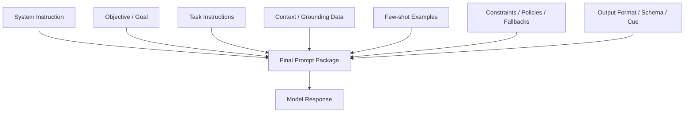

---
tags:
  - prompting
  - promptanatomy
  - components
  - structure
type: note
status: evergreen
source: "Prompt Engineering/prompt-engineering-knowledge-base.md"
parent_note: "[[Prompt Engineering - MOC]]"
---

# องค์ประกอบของ Prompt


---

## องค์ประกอบหลัก

Google Cloud และ AWS อธิบายสอดคล้องกันว่า prompt ที่ดีประกอบด้วย:

| องค์ประกอบ | ความหมาย | แหล่งอ้างอิง |
|---|---|---|
| **Objective / Goal** | ต้องการให้โมเดลทำอะไร | Google Cloud, AWS |
| **Instructions** | ขั้นตอนหรือข้อกำหนดที่ต้องทำตาม | Google Cloud, Microsoft |
| **Context** | ข้อมูลฉากหลัง ขอบเขต ข้อมูลประกอบ | Google Cloud, AWS, OpenAI |
| **Examples** | ตัวอย่าง input-output ที่ต้องการ | OpenAI, Google Cloud, AWS, Anthropic |
| **Role / System Instruction** | กำหนดบทบาทหรือพฤติกรรมระดับสูง | OpenAI, Google Cloud, Anthropic |
| **Constraints** | ความยาว, รูปแบบ, ข้อห้าม | Google Cloud, Microsoft |
| **Output Format** | รูปแบบที่ต้องการ: bullet, JSON, table | Microsoft, OpenAI |
| **Delimiters / Tags / Structure** | จัดโครง prompt ด้วย XML tags, Markdown | OpenAI, Google Cloud, Anthropic |

---

## องค์ประกอบเสริม (Microsoft)

| องค์ประกอบ | ความหมาย |
|---|---|
| **Primary Content** | เนื้อหาหลักที่ให้โมเดลประมวลผล เช่น บทความ, ตาราง |
| **Cue / Prefill** | ข้อความตั้งต้นที่ชี้ทิศทางรูปแบบคำตอบ |

---

## Prompt Anatomy แบบเต็ม



---

## Role และ System Instructions

- ใช้ system instruction สำหรับ **กติกา/พฤติกรรมระดับสูง** (ไม่เปลี่ยนทุก request)
- ใช้ user prompt สำหรับ **งานเฉพาะครั้ง**
- Role/persona ช่วยกำหนด style, tone, expertise และขอบเขต

**ข้อควรระวัง:** role ไม่ควรแทน facts — ถ้า role ขัดกับ task หรือ examples โมเดลอาจสับสน

---

## Output Design

| ผู้อ่านต่อ | Format ที่แนะนำ |
|---|---|
| คนอ่าน | bullet, heading, table |
| ระบบอ่าน | JSON, XML, YAML, schema ที่ชัดเจน |

few-shot examples ควรสะท้อน format ที่ต้องการจริง

---

## สรุปเชิงปฏิบัติ

ถ้างานคือ "ให้โมเดลทำอะไรกับข้อมูลบางอย่าง" มักแยกได้เป็น:
```
instruction + primary content + expected format
```

---

## ดูต่อ

- [[03 - Prompt Patterns พื้นฐาน]] — แพตเทิร์นการเขียน prompt
- [[04 - หลักการจากหลายบริษัท]] — best practices
- [[Prompt Engineering - MOC]]
