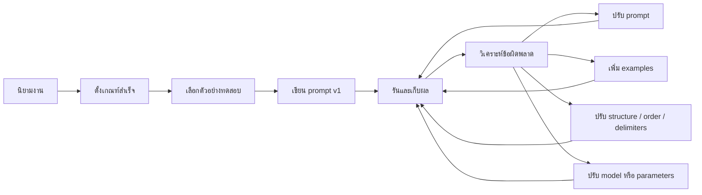

---
tags:
  - prompting
  - template
  - checklist
  - troubleshooting
  - aws
  - microsoft
type: note
status: evergreen
source: "Prompt Engineering/prompt-engineering-knowledge-base.md"
parent_note: "[[Prompt Engineering - MOC]]"
---

# Template, Checklist และ Common Problems


---

## Best Practices เพิ่มเติมจาก Microsoft

- ถ้าต้องการลด hallucination → กำหนด fallback เช่น `ไม่พบข้อมูลในเอกสาร`
- การย้ำข้อกำหนดสำคัญก่อนและหลังเนื้อหาหลัก อาจช่วยบังคับทิศทางได้
- ลำดับของ instructions, content และ examples มีผลจริง

---

## Best Practices เพิ่มเติมจาก AWS Bedrock

- Prompt ประกอบด้วย instruction, context, examples, input text ตาม use case
- โมเดลไม่มีความจำข้าม request ถ้าไม่ส่งบริบทเดิมไปด้วย
- **Prompt template** คือ "recipe" ที่ reusable ได้ — ถ้าทำงานเดิมซ้ำ ควรเปลี่ยนเป็น template ที่มี placeholder
- Conversational continuity ต้องส่งประวัติหรือบริบทเดิมกลับเข้าไปเอง ถ้า API/model ไม่เก็บ state ให้

---

## Template กลางที่สังเคราะห์จากหลายแหล่ง

*(สังเคราะห์จาก OpenAI, Google Cloud, Anthropic, Microsoft, AWS)*

```
[Role / System Behavior]
คุณเป็น...

[Objective]
เป้าหมายของงานนี้คือ...

[Context]
ข้อมูลพื้นฐาน / เอกสารอ้างอิง / ข้อจำกัดของโดเมน...

[Instructions]
1. ทำ...
2. หลีกเลี่ยง...
3. ถ้าไม่พบข้อมูล...

[Examples]
Input: ...
Output: ...

[User Input]
...

[Required Output Format]
- ตอบเป็น...
- ความยาวไม่เกิน...
- ใช้เฉพาะข้อมูลจาก...
```

---

## เลือกวิธีให้ถูก: Zero-shot vs Few-shot vs Chaining

| วิธี | เหมาะเมื่อ | หมายเหตุ |
|---|---|---|
| **Zero-shot** | งานตรงไปตรงมา กติกาไม่ซับซ้อน | ได้ผลดีถ้าคำสั่งชัดและ context พอ |
| **Few-shot** | ต้องการบังคับ style, format, labeling, edge case | หลายค่ายแนะนำตรงกัน |
| **Prompt chaining** | งานใหญ่หลายขั้นตอน | Anthropic ย้ำเทคนิคนี้เป็นทางเลือกสำคัญ |

---

## แก้ปัญหาที่พบบ่อย

| ปัญหา | แนวทาง |
|---|---|
| ตอบไม่ตรงโจทย์ | เพิ่ม objective และ instructions ให้เฉพาะเจาะจงขึ้น |
| รูปแบบคำตอบไม่คงที่ | ระบุ output format ชัดเจน, เพิ่ม examples, หรือใช้ structured output |
| Hallucination | ใส่ context ที่เชื่อถือได้, กำหนด fallback, ใช้ RAG, หรือเปลี่ยน model |
| ใช้โทนผิด | แยก role/tone guidance ไว้ส่วนต้นของ prompt |
| ทำงานซับซ้อนแล้วหลุดขั้นตอน | แตกงานเป็นหลายขั้น หรือใช้ prompt chaining |
| คำตอบไม่เสถียร | ทำ eval หลายเคส, version prompt, iterate แบบมีบันทึก |
| Prompt ยาวแต่ยังไม่ดี | ตรวจ writing issues, ambiguity, conflicting instructions, information order |
| ตอบเลยเถิดนอกข้อมูล | เพิ่ม grounding context และกำหนด `ตอบเฉพาะจากข้อมูลที่ให้` |
| Parse ต่อไม่ได้ | บังคับใช้ format มาตรฐานและยกตัวอย่าง output ที่ถูกต้อง |

---

## Iterative Improvement Workflow



---

## ข้อควรระวัง

- Prompt engineering ไม่รับประกันความจริงของคำตอบเสมอไป
- Prompt ที่ดีในโมเดลหนึ่ง อาจไม่ดีที่สุดในอีกโมเดลหนึ่ง
- การเปลี่ยน model version อาจทำให้ behavior เปลี่ยน → ควรมี eval รองรับ
- ถ้างานพึ่งข้อมูลเฉพาะองค์กรหรือข้อมูลล่าสุด ควรใช้ retrieval, tools, หรือ context injection ร่วม

---

## สรุปสั้นที่สุด

> Prompt engineering ที่ดีคือการกำหนดเป้าหมายให้ชัด ใส่บริบทที่จำเป็น จัดโครง prompt ให้อ่านง่าย ใช้ตัวอย่างเมื่อจำเป็น และวัดผลปรับปรุงแบบ iterative ด้วย eval จริง

---

## ดูต่อ

- [[04 - หลักการจากหลายบริษัท]] — Best practices จาก OpenAI/Anthropic/Google
- [[05 - Evaluation และ Failure Modes]] — Failure mode taxonomy
- [[02 AI Systems/Evals/Evals - MOC|Evals - MOC]] — เชื่อม checklist กับการตั้ง success criteria และ regression tracking
- [[02 AI Systems/Guardrails/Guardrails - MOC|Guardrails - MOC]] — กรณีที่ prompt อย่างเดียวไม่พอและต้องมีข้อจำกัดเชิงระบบ
- [[Prompt Engineering - MOC]]
