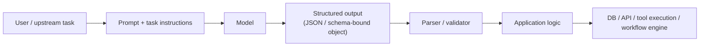
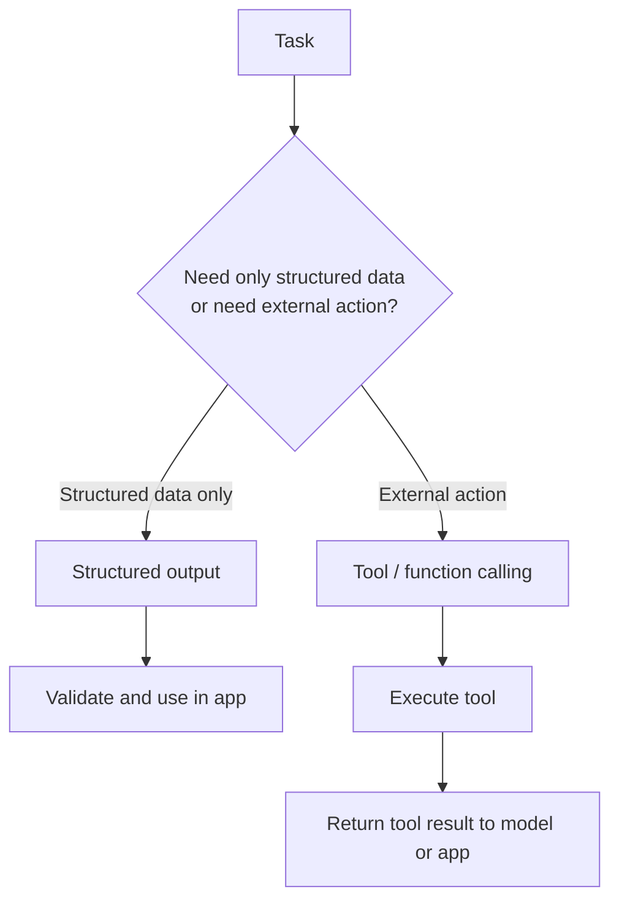
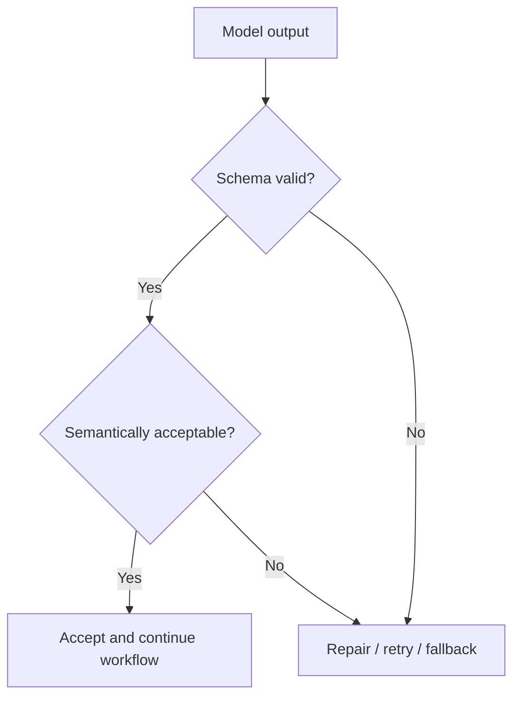

---
tags:
  - promptengineering
  - structured-output
  - json
  - reliability
type: note
status: evergreen
source: "OpenAI, Anthropic, Google Cloud Vertex AI, Microsoft Learn"
parent_note: "[[Prompt Engineering - MOC]]"
---
# Structured Generation และ Output Formats

> โน้ตแกนสำหรับอธิบายว่าทำไม output ที่มี schema ชัด เช่น JSON, fields, enums, และ constrained formats จึงสำคัญต่อระบบ production และมันต่างจากการ “บอกโมเดลให้ตอบเป็น JSON” อย่างไร

---

## Summary

structured generation คือการออกแบบให้ model ส่ง output ในรูปแบบที่ระบบ downstream สามารถ parse, validate, และนำไปใช้งานต่อได้อย่างเชื่อถือได้

ในเชิงระบบ ความแตกต่างสำคัญคือ:
- **free-form text** เหมาะกับการสื่อสารกับมนุษย์
- **structured output** เหมาะกับการต่อเข้าระบบ, automation, tool execution, และ multi-step workflows

OpenAI และ Azure OpenAI ระบุชัดว่า structured outputs ทำให้ model ยึดตาม JSON Schema ที่ผู้ใช้กำหนด ซึ่งเข้มกว่าการใช้ JSON mode แบบเดิม  
Anthropic เน้นแนวทางเพิ่ม consistency ของ output ด้วย format specification, examples, และ prefilling  
Google Vertex AI มี schema references และ structured output capabilities สำหรับกำหนดรูปแบบ input/output ใน ecosystem ของตน

---

## ปัญหาของ Free-Form Output ในระบบ Production

free-form text มีปัญหาเชิงระบบหลายอย่าง:
- parse ยาก
- field names ไม่คงที่
- required values อาจหาย
- enum values อาจ hallucinate
- output หนึ่งรอบใช้ได้ แต่อีกรอบแตก format

สิ่งเหล่านี้ทำให้ downstream systems เปราะบาง เช่น:
- automation pipelines
- database writes
- tool execution
- evaluators
- orchestrators

สรุป:
- ถ้าระบบต้อง “อ่าน” output แบบเชิงโปรแกรม ควรเริ่มคิดจาก schema ไม่ใช่ prose

---

## Structured Generation อยู่ตรงไหนในสถาปัตยกรรม

ชั้นสำคัญมี 4 ส่วน:
- prompt or task spec
- schema / format contract
- model generation
- validation and enforcement

หากขาด schema หรือ validation ระบบจะกลับไปเสี่ยงแบบ free-form อีกครั้ง

---

## Structured Output vs JSON Mode vs Schema Enforcement

แยก 3 อย่างนี้ให้ชัด:

1. **Format instruction ใน prompt**  
เช่น “ตอบเป็น JSON” หรือ “ส่งออกเป็น XML”

2. **JSON mode**  
บังคับให้ output เป็น JSON ที่ syntactically valid แต่ไม่ได้รับประกันว่า field จะตรง schema ที่คาด

3. **Structured outputs / schema enforcement**  
ผูก generation กับ schema ที่กำหนด เช่น required fields, enums, nested objects

Azure OpenAI ระบุชัดว่า structured outputs เข้มกว่า JSON mode เพราะยึดตาม JSON Schema ที่ผู้ใช้ส่งเข้าไป  
OpenAI ก็อธิบาย structured outputs ในทิศทางเดียวกัน คือช่วยให้ output ยึด schema ได้เชื่อถือกว่า prompt-only formatting

---

## Output Contract คืออะไร

ในเชิงสถาปัตย์ structured generation คือการสร้าง **output contract** ระหว่าง model กับระบบ downstream

contract นี้ควรระบุ:
- object shape
- required fields
- field types
- enum values
- nullable / optional behavior
- nesting rules

ตัวอย่าง contract ที่ดี:
- `intent`: enum
- `confidence`: number
- `citations`: array
- `next_action`: enum

ประโยชน์:
- parser เขียนง่ายขึ้น
- validation ชัด
- retries ทำได้เป็นระบบ
- logs และ evals ตรวจ regression ได้ง่ายขึ้น

---

## การออกแบบ Schema ที่ดี

ส่วนนี้เป็น design inference ของโน้ตนี้ โดยอิงจากรูปแบบ schema enforcement และ schema references ที่ผู้ให้บริการอธิบาย

หลักออกแบบ schema:
- ใช้ field names ที่ชัดและมีความหมาย
- แยก required กับ optional ให้ชัด
- ใช้ enums เมื่อ domain ปิด
- อย่าให้ object ใหญ่เกินจำเป็น
- แยก nested objects ตาม domain boundaries
- ออกแบบให้ downstream อ่านได้ง่าย ไม่ใช่ให้ model “ดูฉลาด”

อย่าสับสน:
- schema ที่ใหญ่เกินไปไม่ได้แปลว่าดีกว่า
- schema ที่ดีคือ schema ที่ระบบใช้งานต่อได้ง่ายและ validate ได้จริง

---

## Structured Generation กับ Tool Calling

OpenAI และ Azure OpenAI อธิบายว่า function calling/tool calling ใช้ schema เพื่อกำหนด arguments ของ function  
ในเชิงสถาปัตย์ของ vault นี้ จึงมองได้ว่า tool calling เป็น structured interface pattern แบบหนึ่ง

สรุป:
- structured output เหมาะเมื่อคุณต้องการ object/data ที่ระบบจะอ่านต่อ
- tool calling เหมาะเมื่อ model ต้องร้องขอ external action หรือ structured arguments ให้ runtime execute

ทั้งสองอย่างมีความเกี่ยวข้องกัน แต่ไม่เหมือนกัน

---

## Common Failure Modes

failure modes ที่พบบ่อย:
- malformed JSON
- missing required field
- wrong type
- invalid enum
- extra unexpected fields
- partial object
- semantically wrong but structurally valid output

ข้อสำคัญ:
- valid schema ไม่ได้แปลว่าถูกเชิงความหมาย
- structured generation ลด format failures ได้ แต่ไม่แทน semantic evaluation

ดังนั้น production system มักต้องมีทั้ง:
- schema validation
- semantic checks
- retries or repair
- fallback behavior

---

## Validation Layer สำคัญพอ ๆ กับ Prompt

Anthropic เน้นให้ใช้ examples, explicit formats, และ prefilling เพื่อเพิ่ม consistency  
OpenAI/Azure เพิ่มความเข้มด้วย structured outputs ที่ยึด schema  
แต่ในเชิงระบบ ยังควรมี validation layer อยู่ดี

validation layer ช่วยแยกปัญหาเป็น 2 ชั้น:
- format correctness
- semantic correctness

---

## เมื่อไรควรใช้ Structured Generation

ใช้เมื่อ:
- output จะถูก parse ด้วยโค้ด
- ต้องต่อเข้าระบบ downstream
- ต้องมี field consistency
- ต้องใช้ใน automation / orchestrations
- ต้องทำ evals เชิง field-level

ไม่จำเป็นต้อง strict มากเมื่อ:
- output ตั้งใจให้มนุษย์อ่านอย่างเดียว
- งานเป็น open-ended writing
- ไม่มี parser หรือ downstream contract

---

## Cost, Latency, Reliability

ส่วนนี้เป็น **architectural inference** จากรูปแบบระบบที่แหล่งอ้างอิงอธิบาย

trade-offs หลัก:
- schema ชัดขึ้น -> reliability สูงขึ้น
- validation เพิ่มขึ้น -> orchestration complexity สูงขึ้น
- retry/repair loops -> latency เพิ่มขึ้น
- strict contracts -> downstream integration ง่ายขึ้น

ในระบบจริง structured generation อาจช่วยให้ downstream debugging เป็นระบบขึ้น แม้จะเพิ่มความซับซ้อนใน design phase

---

## Design Rules

- เริ่มจาก output contract ก่อน แล้วค่อยเขียน prompt
- ใช้ enums เมื่อค่าที่เป็นไปได้มีจำกัด
- แยก required และ optional ให้ชัด
- อย่าพึ่ง prompt อย่างเดียวถ้างานต้อง reliable
- ใส่ validation layer เสมอเมื่อ output จะถูกใช้ต่อโดยระบบ
- แยก format validity ออกจาก semantic correctness
- ถ้างานต้อง action ต่อ ให้พิจารณา tool calling แทน plain structured output

---

## ความสัมพันธ์กับโน้ตอื่น

- [[02 - องค์ประกอบของ Prompt]]
- [[03 - Prompt Patterns พื้นฐาน]]
- [[05 - Evaluation และ Failure Modes]]
- [[06 - Template และ Common Problems]]
- [[01 Foundations/LLM Foundations/12 - Weights, Context, Retrieval และ Tools|Weights, Context, Retrieval และ Tools]]
- [[02 AI Systems/Guardrails/Guardrails - MOC|Guardrails - MOC]]
- [[02 AI Systems/Evals/Evals - MOC|Evals - MOC]]
- [[02 AI Systems/MCP/14 - Tools: การออกแบบและทำงาน|Tools: การออกแบบและทำงาน]]
- [[02 AI Systems/MCP/MCP - MOC|MCP - MOC]]

---

## คำถามที่มักสับสน

- prompt ระบุว่า “ตอบเป็น JSON” เพียงพอหรือไม่
- structured output ต่างจาก tool calling อย่างไร
- schema strict มากไปทำให้โมเดลตอบแย่ลงไหม
- valid JSON แปลว่าพร้อมใช้ใน production แล้วหรือยัง
- field ถูกต้องตาม schema แต่ semantic ผิด ควรจัดการอย่างไร

---

## Official References

- OpenAI: Structured Outputs  
  https://platform.openai.com/docs/guides/structured-outputs
- OpenAI: Function Calling  
  https://platform.openai.com/docs/guides/function-calling
- Azure OpenAI: Structured Outputs  
  https://learn.microsoft.com/en-us/azure/ai-services/openai/how-to/structured-outputs
- Azure OpenAI: Function Calling  
  https://learn.microsoft.com/en-us/azure/ai-services/openai/how-to/assistant-functions
- Anthropic: Increase Output Consistency (JSON mode and format control)  
  https://docs.anthropic.com/en/docs/test-and-evaluate/strengthen-guardrails/increase-consistency
- Anthropic: Tool Use Overview  
  https://docs.anthropic.com/en/docs/agents-and-tools/tool-use/overview
- Google Cloud Vertex AI: Schema Reference  
  https://cloud.google.com/vertex-ai/generative-ai/docs/reference/rest/v1/Schema
- Google Cloud Vertex AI: Generate Structured Output  
  https://cloud.google.com/vertex-ai/generative-ai/docs/maas/capabilities/structured-output

---

## Next Notes To Create

- JSON Schema และ Validation Patterns
- Retry, Repair, and Fallback Strategies
- Tool Calling Output Contracts
