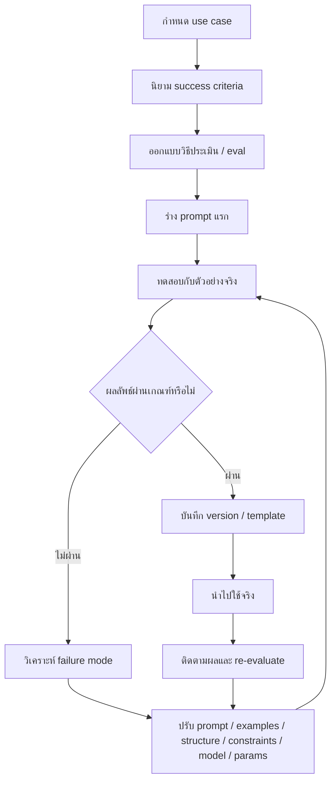

---
tags:
  - prompting
  - promptengineering
  - definition
  - evaluation
type: note
status: evergreen
source: "Prompt Engineering/prompt-engineering-knowledge-base.md"
parent_note: "[[Prompt Engineering - MOC]]"
---

# Prompt Engineering คืออะไร

---

## นิยาม

**Prompt Engineering** คือกระบวนการออกแบบ ปรับแต่ง และทดสอบ prompt เพื่อให้โมเดลสร้างผลลัพธ์ที่ตรงตามเป้าหมายอย่างสม่ำเสมอ

ไม่ใช่แค่ "เขียนคำสั่งให้ยาวขึ้น" แต่เป็นงานที่ครอบคลุม:
- กำหนดวัตถุประสงค์
- ใส่บริบทที่จำเป็น
- ออกแบบตัวอย่าง
- กำหนดโครงสร้างผลลัพธ์
- ประเมินผลแบบวนซ้ำ

---

## มุมของแต่ละบริษัท

| บริษัท | เน้น |
|---|---|
| **OpenAI** | Prompting เป็นทั้ง art และ science — ควร version, reuse, และ eval อย่างเป็นระบบ |
| **Google Cloud** | กระบวนการแบบ test-driven และ iterative |
| **Anthropic** | กำหนด success criteria และวิธีวัดผลเชิงประจักษ์ก่อนเริ่มปรับ |
| **Microsoft** | Specific, descriptive, order matters, ให้โมเดลมีทางออกเมื่อข้อมูลไม่พอ |
| **AWS** | องค์ประกอบของ prompt, template, few-shot vs zero-shot, ลด hallucination |

---

## คำศัพท์ที่ควรแยกให้ออก

| คำ | ความหมาย |
|---|---|
| Prompt | ข้อความ/อินพุตที่ส่งให้โมเดล |
| Prompt Design | การร่าง prompt ให้มีโครงสร้างและเนื้อหาที่เหมาะกับงาน |
| Prompt Engineering | กระบวนการ iterative ที่รวมการออกแบบ, ทดลอง, วัดผล, และปรับปรุง |
| System Instruction | คำสั่งระดับสูงที่กำหนดพฤติกรรมของโมเดลก่อน user input |
| Context | ข้อมูลประกอบที่โมเดลต้องใช้ตอบ |
| Few-shot Examples | ตัวอย่าง input-output ที่บอกว่า "ทำถูก" หน้าตาอย่างไร |
| Prompt Template | แบบฟอร์ม prompt ที่มีส่วนคงที่และ placeholder สำหรับนำกลับมาใช้ซ้ำ |

---

## Workflow ของ Prompt Engineering

---

## Prompt Engineering ≠ คำตอบของทุกปัญหา

Anthropic: บางปัญหาไม่ควรแก้ด้วย prompt engineering อย่างเดียว
- latency/cost → อาจแก้ได้ด้วยการเปลี่ยน model
- hallucination → ต้องการ RAG หรือ retrieval
- output format ไม่เสถียร → ต้องการ structured output / schema

> Prompt engineering เป็นเพียงหนึ่งในเครื่องมือของ LLM application design

---

## ดูต่อ

- [[02 - องค์ประกอบของ Prompt]] — anatomy ของ prompt ที่ดี
- [[03 - Prompt Patterns พื้นฐาน]] — แพตเทิร์นที่ใช้บ่อย
- [[01 Foundations/LLM Foundations/Core/08 - Data, Pretraining และ Model Modes|Data, Pretraining และ Model Modes]] — ทำความเข้าใจ in-context learning และข้อจำกัดของการแก้ปัญหาด้วย prompt อย่างเดียว
- [[01 Foundations/LLM Foundations/Core/04 - Inference, Context และ RAG|Inference, Context และ RAG]] — งานที่ต้องพึ่ง grounding หรือ retrieval
- [[02 AI Systems/Evals/Evals - MOC|Evals - MOC]] — ดูการประเมินว่า prompt ที่ออกแบบแล้วใช้งานได้ดีจริงหรือไม่
- [[Prompt Engineering - MOC]]
