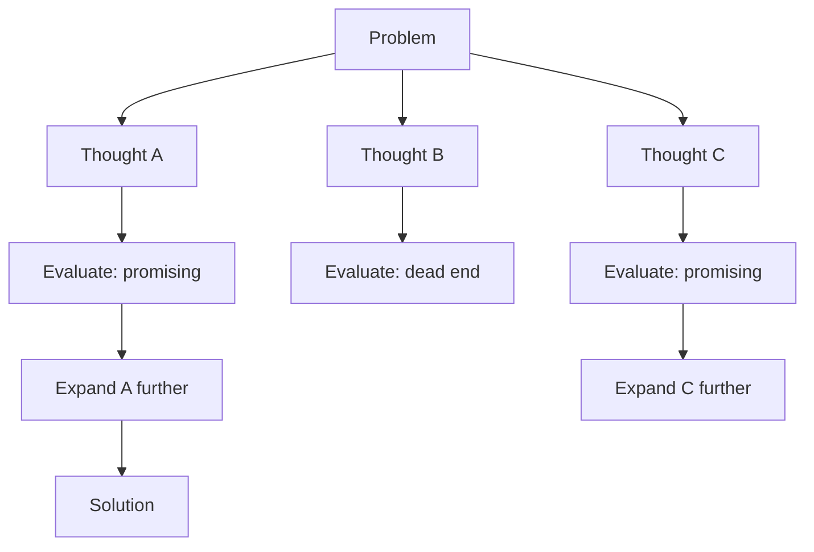

---
tags:
  - prompting
  - patterns
  - fewshot
  - zeroshot
  - chainofthought
type: note
status: evergreen
source: "Prompt Engineering/prompt-engineering-knowledge-base.md"
parent_note: "[[Prompt Engineering - MOC]]"
---

# Prompt Patterns พื้นฐาน


---

## แพตเทิร์นพื้นฐานที่พบบ่อย

| Pattern | อธิบายสั้น ๆ | แหล่งรองรับ |
|---|---|---|
| **Zero-shot / Instruction-only** | บอกงานตรง ๆ ไม่มีตัวอย่าง | AWS, Microsoft |
| **Few-shot / Multi-shot** | มีตัวอย่าง input-output ประกอบ | OpenAI, Google Cloud, AWS, Anthropic |
| **Role / Persona** | กำหนดว่าโมเดลควรทำตัวเป็นใคร | Google Cloud, Anthropic |
| **Structured** | แบ่ง prompt เป็น section, XML tags, Markdown | OpenAI, Google Cloud, Anthropic |
| **Constrained** | ระบุข้อจำกัด, output rules, fallback | Google Cloud, Microsoft |
| **Chained** | แตกงานซับซ้อนเป็นหลาย prompt หรือขั้น | Microsoft, Anthropic |
| **Grounded** | ให้โมเดลอิงเอกสาร/ตาราง/แหล่งข้อมูลที่แนบ | Microsoft, Google Cloud, AWS |
| **Template** | ทำ prompt ให้ reusable ด้วย placeholders | AWS, OpenAI |

---

## Few-shot เหมาะเมื่อไร

ใช้เมื่อต้องการควบคุม:
- **Style** ของคำตอบ
- **Format** ที่ต้องการ
- **Decision boundary** (เช่น จัดหมวดหมู่)
- **Edge cases** ที่ zero-shot อาจพลาด

---

## Prompt Chaining เหมาะเมื่อไร

Anthropic และ Microsoft ให้สัญญาณตรงกันว่างานที่มีหลาย cognitive steps ทำได้ดีกว่าเมื่อแยกขั้น

**ตัวอย่าง:**
1. Extract facts จากเอกสาร
2. Classify/reason over facts
3. Generate final answer ใน format ที่ต้องการ

**ข้อดี:** ลดความกำกวม, debug ง่าย, ประเมินแต่ละขั้นแยกได้
**ข้อแลกเปลี่ยน:** เพิ่ม latency, เพิ่ม orchestration complexity

> ถ้างานเดียวต้อง "สรุป + ดึงข้อมูล + จัดหมวด + เขียนอีเมล" ควรพิจารณาแยกเป็นหลายขั้น

---

## Structured Prompting (XML Tags / Delimiters)

- **OpenAI** — แบ่งบทบาทและ task-specific details ออกจากกัน
- **Anthropic** — แนะนำ XML tags
- **Google Cloud** — เน้น ordering, labeling, delimiters
- **Microsoft** — "order matters"

ตัวอย่างโครงสร้างที่ดี:
```
Role | Goal | Context | Rules | Examples | Input | Output format
```

---

## Constrained Prompting

ระบุข้อจำกัดที่มีประโยชน์:
- ตอบไม่เกินจำนวนคำ/ย่อหน้า
- ตอบเป็น bullet list เท่านั้น
- ถ้าไม่พบข้อมูล ให้ตอบ `not found`
- ห้ามใช้ข้อมูลนอกเอกสารที่ให้

---

## Template Prompting

AWS และ OpenAI เน้น prompt template สำหรับ reuse:
- แยกส่วนคงที่ออกจากตัวแปร
- บันทึก version, owner, วันที่แก้ และผล eval
- prompt production ไม่ควรเป็นข้อความแก้ด้วยมือทุกครั้ง

---

## Advanced Prompting Techniques

> เพิ่มจาก research literature + official docs

เทคนิคเหล่านี้ต่อยอดจาก patterns พื้นฐาน โดยเน้นให้ model ทำ reasoning ที่ซับซ้อนขึ้น:

### Chain-of-Thought (CoT)

ให้ model แสดงขั้นตอนการคิดก่อนตอบ:
- **Zero-shot CoT** — เพิ่ม "Let's think step by step" ท้าย prompt
- **Few-shot CoT** — ให้ตัวอย่างที่มี reasoning steps ประกอบ
- ช่วยมากใน math, logic, multi-step reasoning
- ไม่ช่วยมากใน tasks ที่ไม่ต้องการ reasoning (เช่น simple classification)

```text
Q: Roger has 5 tennis balls. He buys 2 cans of 3. How many does he have?
A: Roger started with 5 balls. 2 cans of 3 = 6 balls. 5 + 6 = 11. The answer is 11.
```

### Tree-of-Thoughts (ToT)

ขยาย CoT ให้ model สำรวจหลาย reasoning paths พร้อมกัน:
- แต่ละ step สร้างหลาย candidates (branches)
- ประเมินแต่ละ branch ด้วย heuristic หรือ self-evaluation
- เลือก branch ที่ดีที่สุดหรือ backtrack ถ้าติดตัน
- เหมาะกับ planning, puzzle solving, creative tasks ที่ต้อง exploration



### Graph-of-Thoughts (GoT)

ขยาย ToT อีกขั้น — ให้ thoughts เชื่อมกันเป็น graph ไม่ใช่แค่ tree:
- thoughts สามารถ merge, refine, หรือ combine ข้าม branches ได้
- เหมาะกับงานที่ต้อง aggregate ข้อมูลจากหลาย perspectives
- ซับซ้อนกว่า ToT มาก — มักใช้ใน research มากกว่า production

### Self-Consistency

ใช้ sampling หลายครั้งแล้วเลือกคำตอบที่ consistent ที่สุด:
- สร้าง CoT reasoning หลายชุดจาก prompt เดียวกัน (ใช้ temperature > 0)
- เลือกคำตอบสุดท้ายที่ปรากฏบ่อยที่สุด (majority vote)
- ช่วยลด variance ของ CoT ที่บางครั้งให้ reasoning ผิด
- trade-off: ใช้ tokens/cost มากขึ้นตามจำนวน samples

### เปรียบเทียบ Advanced Techniques

| เทคนิค | แนวคิด | จุดแข็ง | จุดอ่อน | เหมาะกับ |
|---|---|---|---|---|
| **CoT** | คิดทีละ step | ง่าย, ใช้ได้ทันที | single path อาจผิด | math, logic, multi-step |
| **ToT** | สำรวจหลาย paths | exploration, backtracking | ช้า, ใช้ tokens มาก | planning, puzzles |
| **GoT** | thoughts เชื่อมเป็น graph | aggregate, refine | ซับซ้อนมาก | research, complex synthesis |
| **Self-Consistency** | majority vote จากหลาย samples | ลด variance | cost สูงขึ้น | tasks ที่ต้องการ reliability |

> CoT เป็นเทคนิคที่ใช้ได้จริงใน production มากที่สุด ส่วน ToT/GoT/Self-Consistency มักใช้ใน research หรือ high-stakes tasks ที่ยอมจ่าย cost เพิ่ม

---

## Agentic Prompting

> เพิ่มจาก IBM Prompt Engineering Hub + Anthropic "Building Effective Agents"

เมื่อ prompt ถูกใช้ใน agent systems ไม่ใช่แค่ single model call อีกต่อไป — prompt ต้อง guide agent ให้ plan, use tools, self-reflect, และ delegate:

### Agentic Prompt Patterns

| Pattern | หน้าที่ | ตัวอย่าง |
|---|---|---|
| **Planning prompt** | ให้ agent แตกงานเป็น steps ก่อนทำ | "Break this task into steps. For each step, identify what tools you need." |
| **Tool-use prompt** | guide agent ให้เลือกและใช้ tools ถูกต้อง | "Use the search tool to find relevant documents before answering." |
| **Self-evaluation prompt** | ให้ agent ตรวจงานตัวเอง | "Review your work against the original requirements. What's missing?" |
| **Delegation prompt** | ให้ agent มอบหมายงานย่อย | "Delegate the security review to the security subagent." |
| **Continuation prompt** | บังคับให้ agent ทำต่อเมื่อพยายามหยุด | "You haven't completed all requirements. Continue working." |

### Anthropic Workflow Patterns

Anthropic ระบุ 5 composable workflow patterns สำหรับ agentic systems:

1. **Prompt Chaining** — output ของ step หนึ่งเป็น input ของ step ถัดไป
2. **Routing** — classify input แล้ว route ไป specialized prompt/model
3. **Parallelization** — รัน multiple prompts พร้อมกัน แล้วรวมผล
4. **Orchestrator-Workers** — orchestrator แตกงาน, workers ทำ, orchestrator รวมผล
5. **Evaluator-Optimizer** — generator สร้าง output, evaluator ให้ feedback, loop จนผ่าน

### จาก Prompt → Context → Harness

agentic prompting เป็นจุดเชื่อมระหว่าง 3 layers ของ AI engineering:
- **Prompt** กำหนดว่า agent คิดอย่างไรใน 1 turn
- **Context** กำหนดว่า agent เห็นอะไรใน 1 session
- **Harness** กำหนดว่า agent ทำงานอย่างไรข้าม sessions

→ ดูเพิ่มที่ [[02 AI Systems/AI Agent Fundamentals/Core/08 - Harness Engineering|Harness Engineering]] สำหรับ 3 layers
→ ดูเพิ่มที่ [[02 AI Systems/Agent Frameworks/Core/08 - Harness Patterns|Harness Patterns]] สำหรับ patterns เชิง harness

---

## ดูต่อ

- [[04 - หลักการจากหลายบริษัท]] — best practices เชิงหลักการ
- [[05 - Evaluation และ Failure Modes]] — วิธีประเมินและแก้ปัญหา
- [[Prompt Engineering - MOC]]
