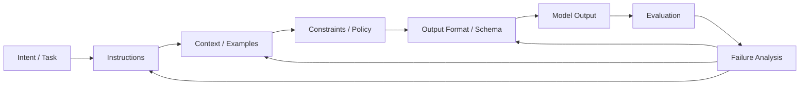

---
tags:
  - promptengineering
  - moc
  - prompting
type: moc
status: evergreen
source: ""
parent_note: "[[Home]]"
---
# Prompt Engineering — Map of Content

> แหล่งความรู้รวมทุกหัวข้อเกี่ยวกับ Prompt Engineering
> Sources: OpenAI · Google Cloud / Vertex AI · Anthropic · Microsoft Learn · AWS Bedrock

หมวดนี้เป็น canonical home ของ prompt anatomy, prompt patterns, structured generation, และ output formats  
โน้ต `01 Foundations/Prompt Engineering/Bridge/13 - Messages, System Prompt และ Chat Templates` ใช้เป็น runtime bridge เท่านั้น ไม่ใช่ที่อธิบาย prompt design หลัก


---

## Prompt Lifecycle Map



prompt engineering ที่ใช้ใน production ควรเป็น loop: นิยาม intent, instruction, context, constraints, output format แล้ววัดผลจาก eval/failure analysis ไม่ใช่แก้ถ้อยคำแบบ ad hoc.

---

## Notes

- [[01 - Prompt Engineering คืออะไร]] — นิยาม, คำศัพท์พื้นฐาน, Workflow, ขอบเขต
- [[02 - องค์ประกอบของ Prompt]] — Anatomy เต็ม, Role/System, Output Design
- [[03 - Prompt Patterns พื้นฐาน]] — Zero-shot, Few-shot, Role, Structured, Chained, Grounded, Template
- [[04 - หลักการจากหลายบริษัท]] — Best practices จาก OpenAI, Anthropic, Google, Microsoft
- [[05 - Evaluation และ Failure Modes]] — Success Criteria, Eval Design, Failure Mode taxonomy
- [[06 - Template และ Common Problems]] — AWS Bedrock, Template สังเคราะห์, Zero/Few-shot/Chaining เลือกอย่างไร, แก้ปัญหาพบบ่อย, Pre-deployment checklist
- [[07 - Structured Generation และ Output Formats]] — JSON/schema-first design, output contracts, validation, และ parsing reliability

---

## ความสัมพันธ์กับ Topic อื่น

- [[01 Foundations/LLM Foundations/LLM Foundations - MOC|LLM Foundations]] — Prompt ส่งผลต่อ decoding, in-context learning, และ model behavior โดยตรง
- [[01 Foundations/LLM Foundations/Core/07 - Logits, Decoding และ Sampling|Logits, Decoding และ Sampling]] — decoding settings ทำให้ prompt เดียวกันให้ output ต่างกันได้
- [[01 Foundations/LLM Foundations/Core/08 - Data, Pretraining และ Model Modes|Data, Pretraining และ Model Modes]] — few-shot prompting และ in-context learning เชื่อมกับ model modes โดยตรง
- [[01 Foundations/Prompt Engineering/Bridge/13 - Messages, System Prompt และ Chat Templates|13 - Messages, System Prompt และ Chat Templates]] — bridge note สำหรับ runtime message layer
- [[02 AI Systems/AI Agent Fundamentals/AI Agent Fundamentals - MOC|AI Agent Fundamentals]] — Agent ใช้ prompt engineering สำหรับ reasoning (ReAct, CoT) และ system prompt ควบคุม agent behavior
- [[01 Foundations/Context Windows/Context Windows - MOC|Context Windows]] — Context engineering เป็นส่วนหนึ่งของ prompt engineering — จัดลำดับ, caching, noise reduction
- [[02 AI Systems/MCP/MCP - MOC|MCP]] — MCP Prompts (server feature) คือ reusable prompt templates ที่ server expose ให้ user
- [[02 AI Systems/Evals/Evals - MOC|Evals]] — prompt ที่ดีต้องผูกกับ success criteria, eval loop, และ regression checks
- [[02 AI Systems/Guardrails/Guardrails - MOC|Guardrails]] — หลายปัญหาต้องแก้ด้วย validation, fallback, หรือ policy ไม่ใช่ prompt อย่างเดียว
- [[02 AI Systems/RAG/RAG - MOC|RAG]] — งาน factual หรือ knowledge-intensive มักต้องพึ่ง retrieval ร่วมกับ prompting
- [[04 Synthesis/Bridge/Synthesis - Weights, Context, Retrieval และ Tools|Weights, Context, Retrieval และ Tools]] — ช่วยตัดสินว่าเมื่อไรควรแก้ด้วย prompt, retrieval, หรือ tools
- [[06 Engineering/README]] — implementation layer สำหรับ prompt-dependent recipes, framework-specific patterns, และ engineering decisions
- [[Knowledge Topic Registry]]

---

## เส้นทางอ่านต่อที่แนะนำ

- ถ้าจะทำ prompt ให้ parse ได้และต่อระบบได้ -> [[07 - Structured Generation และ Output Formats]]
- ถ้าสับสนว่าปัญหานี้ควรแก้ด้วย prompt หรือ retrieval -> [[04 Synthesis/Bridge/Synthesis - Weights, Context, Retrieval และ Tools|Weights, Context, Retrieval และ Tools]]
- ถ้าจะทำ prompt ให้ reliable ใน production -> [[05 - Evaluation และ Failure Modes]] -> [[07 - Structured Generation และ Output Formats]]

---

## หลักคิดสรุป

```
กำหนด success criteria → ออกแบบ eval → ร่าง prompt → ทดสอบ → วิเคราะห์ failure → ปรับ → บันทึก version
```

- Prompt ที่ดี = Specific + Structured + Grounded + Testable
- Prompt engineering ≠ คำตอบทุกปัญหา (บางปัญหาต้องการ model change หรือ RAG)
