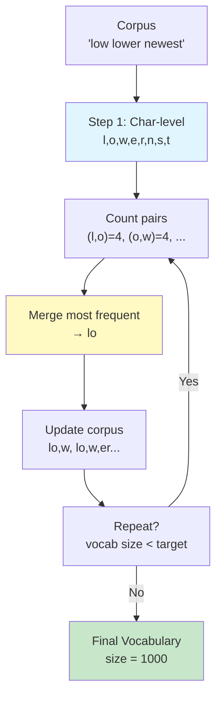

---
tags:
  - tokenizer
  - bpe
  - llm
  - nlp
type: note
status: draft
source: "Tokenizer in AI/Tokenizer-Knowledge-Base.md — ส่วนที่ 6.1–6.2, 11"
parent_note: "[[Tokenizer in AI - MOC]]"
---
# อัลกอริทึม BPE และ Byte-level BPE

## BPE (Byte-Pair Encoding)

BPE เดิมเป็นอัลกอริทึมสำหรับ **บีบอัดข้อความ** และต่อมาถูกนำมาใช้ใน tokenization สำหรับ neural networks

**ประวัติศาสตร์:**
- **Sennrich, Haddow, Birch (2016)**: เสนอ BPE สำหรับ Neural Machine Translation ในงานวิจัย *"Neural Machine Translation of Rare Words with Subword Units"* (ACL 2016)
- **OpenAI (2019)**: ใช้ Byte-level BPE สำหรับ GPT-2
- **ปัจจุบัน**: เป็นมาตรฐาน — ใช้ใน LLaMA, Gemma, Qwen2, Mistral และอื่น ๆ อีกมากมาย

### วิธีทำงาน

1. เริ่มจาก vocabulary พื้นฐานระดับตัวอักษร
2. นับคู่ token ที่เกิดติดกันบ่อยที่สุดใน corpus
3. merge คู่ที่พบบ่อยที่สุดให้เป็น token ใหม่
4. ทำซ้ำจนได้ vocabulary ขนาดที่ต้องการ

**ตัวอย่างประกอบการณ์:**

```
Corpus: "low low low lower newest newest"

Iteration 0 (Character-level):
  Tokens: l, o, w, e, r, n, s, t
  Frequencies: (l,o)=4, (o,w)=4, (w,_ )=3, (e,r)=2, (r,_)=1, ...

Iteration 1 → Merge (l,o) most frequent:
  Vocabulary: l, o, w, e, r, n, s, t, lo
  New text: "lo w lo w lo w lo w er ne w est ne w est"
  Frequencies: (lo,w)=4, (w,e)=1, ...

Iteration 2 → Merge (lo,w):
  Vocabulary: l, o, w, e, r, n, s, t, lo, low
  New text: "low low low low er new est new est"
  Frequencies: (low,_)=3, (e,r)=2, ...

... (repeat until target vocab size reached)
```



### จุดสำคัญ

- คำที่พบบ่อย → ถูกแทนอย่างกะทัดรัด
- คำที่หายาก → ยังแทนด้วย subwords ได้
- ถ้า base vocabulary ไม่ครอบคลุมอักขระบางตัว อาจกลายเป็น `[UNK]`

**โมเดลที่ใช้:** GPT family

---

## Byte-level BPE

GPT-2 และ RoBERTa ใช้แนวคิด **byte-level BPE** ซึ่งไม่ได้เริ่มจาก Unicode characters โดยตรง แต่เริ่มจาก **bytes** (Sennrich, Haddow, Birch 2016; นำเสนอโดย OpenAI ใน GPT-2)

### ความต่างจาก BPE ปกติ

| | BPE ปกติ | Byte-level BPE |
|---|---|---|
| หน่วยเริ่มต้น | Unicode characters | Bytes (256 values) |
| Base vocabulary | ขึ้นกับ charset ของ corpus | Fixed 256 bytes |
| Total vocabulary | base + merges | ตัวอย่าง GPT-2: 256 + 50,000 merges + 1 EOS = **50,257** |
| Coverage | ขึ้นกับ corpus | ครอบคลุมทุก input ได้ |

### ข้อได้เปรียบ

- ลดปัญหา unknown characters ได้ทั้งหมด → ไม่มี `[UNK]` token
- รองรับสัญลักษณ์หลากหลายได้ดีกว่า character-based ธรรมดา
- Base vocabulary ขนาดคงที่ → ไม่ต้องคิดเรื่อง charset ก่อน training

> [!note]
> **GPT-2 tokenizer ไวต่อ leading spaces** — `"Hello"` กับ `" Hello"` อาจได้ token ต่างกัน
> เพราะ space เป็นส่วนหนึ่งของ token ใน byte-level BPE

## เปรียบเทียบใน Context ของอัลกอริทึมทั้งหมด

| Algorithm | แนวคิดหลัก | จุดแข็ง | ข้อควรระวัง |
|---|---|---|---|
| BPE | merge คู่ที่พบบ่อยซ้ำ ๆ | compact, เข้าใจง่าย | coverage ขึ้นกับ base symbols |
| Byte-level BPE | ใช้ bytes เป็นฐานก่อน merge | coverage ดีกับอักขระหลากหลาย | กฎอาจเข้าใจยากขึ้น |

## ลิงก์ที่เกี่ยวข้อง

- [[02 - ประเภทของ Tokenization]]
- [[04 - WordPiece และ SentencePiece]]
- [[07 - เปรียบเทียบ Tokenizer รายโมเดล]]
- [[01 Foundations/LLM Foundations/02 - สถาปัตยกรรม Transformer]]
