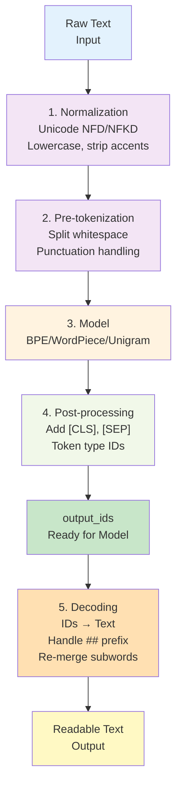

---
tags:
  - tokenizer
  - llm
  - nlp
  - huggingface
type: note
status: evergreen
source: "Tokenizer in AI/Tokenizer-Knowledge-Base.md — ส่วนที่ 7, 15"
parent_note: "[[Tokenizer in AI - MOC]]"
---
# Tokenizer Pipeline

Hugging Face อธิบาย pipeline ของ `Tokenizer.encode()` ไว้เป็น **4 ขั้นหลัก** + **1 ขั้นย้อนกลับ**



---

## 1. Normalization

ทำให้ข้อความ "เป็นระเบียบขึ้น" ก่อนเข้า model — เปลี่ยนรูปแบบให้สม่ำเสมอ

**สิ่งที่ทำได้:**
- Unicode normalization (`NFD`, `NFKD`, `NFC`, `NFKC`) — ตัวอักษรเดียวกันแต่ encoding ต่างกันให้เป็นเหมือนกัน
- Lowercasing — `HELLO` → `hello`
- Strip whitespace / accents — `café` → `cafe`
- Replace string หรือ regex บางแบบ — `&` → `and`

**📌 Alignment Tracking (Hugging Face feature)**

```
Original text:  "Hello WORLD"
After normalize: "hello world"

Hugging Face เก็บ mapping:
  - token "hello" ↔ position [0:5] ของ original text
  - token "world" ↔ position [6:11] ของ original text
```

ทำให้ **map token IDs กลับไปยัง span ต้นฉบับได้** แม้ว่า normalization ที่ destructive ก็ตาม

> [!important]
> ถ้าเปลี่ยน normalization หลังเทรน tokenizer แล้ว ควร **เทรน tokenizer ใหม่** — เพราะ alignment ต้องจับคู่กับ token vocab ที่เรียนรู้มา

---

## 2. Pre-tokenization

แยกข้อความเบื้องต้นตามกฎบางอย่าง **ก่อน** ที่ subword model จะทำงาน

ใช้เพื่อ "บังคับขอบเขต" — เช่น ถ้าไม่ต้องการให้ token ข้าม whitespace ใช้ pre-tokenizer ที่ split ตาม whitespace

Component ที่พบบ่อย: `Whitespace`, `Punctuation`, `Digits`, `ByteLevel`, `Metaspace`

- `ByteLevel` → map bytes เป็น visible characters ก่อน (เหมาะกับ GPT-2 style)
- `Metaspace` → ใช้ `▁` แทน space (สัมพันธ์กับ SentencePiece)

---

## 3. Model

หัวใจของ tokenizer — เรียนรู้กฎการแตก token และแมป token → ID

Hugging Face รองรับ model: `BPE`, `Unigram`, `WordLevel`, `WordPiece`

ขั้นนี้ตัดสินว่า:
- subword ใดจะเป็น token
- token ไหนอยู่ใน vocabulary
- unknown token จัดการอย่างไร

---

## 4. Post-processing

เพิ่มเติมก่อนคืน `Encoding` — ส่วนนี้ทำให้ tokenizer "ประกอบ input" ให้ตรงกับที่ architecture ต้องการ

สิ่งที่ทำ:
- เติม special tokens
- สร้างลำดับสำหรับ single / pair sequence
- กำหนด `token_type_ids`

ตัวอย่าง BERT:
```
single:  [CLS] $A [SEP]
pair:    [CLS] $A [SEP] $B:1 [SEP]:1
```

---

## 5. Decoding

ย้อนกลับ artifact ของ tokenizer แต่ละชนิด:

- `ByteLevel` decoder → ย้อน byte-level mapping
- `Metaspace` decoder → แปลง `▁` กลับเป็น space
- `WordPiece` decoder → รวม subwords ที่มี prefix `##`

> [!note]
> Tokenizer ต่างกัน แม้ได้ token IDs ใกล้เคียงกัน ก็อาจ decode กลับต่างกันได้

---

## API พื้นฐานของ Hugging Face

```python
tokenizer.tokenize(text)           # Text → Tokens
tokenizer.convert_tokens_to_ids()  # Tokens → IDs
tokenizer.decode(ids)              # IDs → Text
```

## ลิงก์ที่เกี่ยวข้อง

- [[01 - Tokenization คืออะไร]]
- [[03 - อัลกอริทึม BPE และ Byte-level BPE]]
- [[04 - WordPiece และ SentencePiece]]
- [[07 - เปรียบเทียบ Tokenizer รายโมเดล]]
- [[01 Foundations/LLM Foundations/02 - สถาปัตยกรรม Transformer]]
