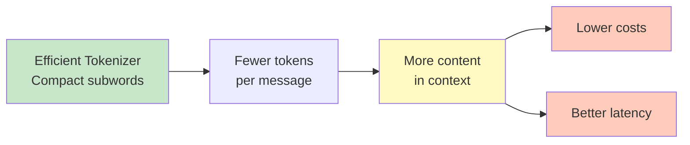
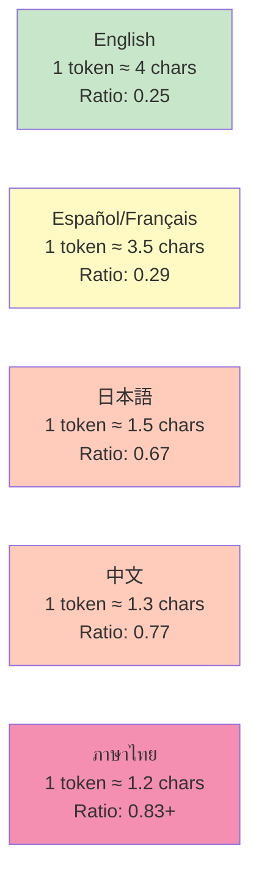

---
tags:
  - tokenizer
  - llm
  - nlp
  - cost
  - multilingual
type: note
status: draft
source: "Tokenizer in AI/Tokenizer-Knowledge-Base.md — ส่วนที่ 8–10"
parent_note: "[[Tokenizer in AI - MOC]]"
---
# ทำไม Tokenization ถึงสำคัญ

Tokenization ไม่ใช่แค่ preprocessing — มีผลโดยตรงต่อประสิทธิภาพ ค่าใช้จ่าย และความสามารถของโมเดล

---

## 1. มีผลต่อ Efficiency และ Cost

OpenAI, Anthropic และ tech companies อื่น ๆ นับ token เป็นหน่วยที่ใช้ประมวลผลและคิดค่าใช้งานจริง

**ระดับการแปลงอ้างอิง (English — Byte-level BPE)**

อ้างอิงจาก OpenAI documentation และ practical observations:
- **1 token ≈ 4 ตัวอักษร** (4 chars/token)
- **1 token ≈ 0.75 คำ** (roughly 3 tokens per 4 words)
- **100 tokens ≈ 75 คำ**

> [!note]
> ค่าเหล่านี้เป็นการประมาณคร่าว ๆ สำหรับภาษาอังกฤษ และขึ้นอยู่กับเนื้อหา
> - Code มักใช้ token **มากกว่า** (whitespace, symbols)
> - ข้อความธรรมชาติใช้ token **น้อยกว่า**

**สำเร็จผลต่อระบบ:**

- **จำนวนข้อความที่ใส่ได้ใน context window** — token น้อย = ใส่ได้มากขึ้น
- **ค่าใช้จ่าย API** — billing อิงจาก token counts
- **Latency** — processing time ขึ้นกับ sequence length

---

## 2. มีผลต่อความสามารถใน Generalize

Subword tokenization ช่วยให้โมเดลรับมือกับ:
- คำที่ไม่คุ้นเคย
- คำผสม / คำผันรูป
- คำเฉพาะทาง

เพราะยังแตกเป็นส่วนย่อยที่เคยพบในการ pretrain ได้ — ต่างจาก word-level ที่จะเป็น `[UNK]` ทันที

---

## 3. มีผลต่อ Multilingual Behavior

> [!warning]
> ข้อความที่ไม่ใช่ภาษาอังกฤษมักมีอัตรา **token ต่ออักขระสูงกว่า** — มีผลต่อ cost, latency และ context window limits โดยตรง

**สาเหตุ:** โมเดล LLM ส่วนใหญ่ (GPT-2 tokenizer, SentencePiece) ได้รับการ train ด้วยข้อมูล English-dominant → tokenizer ถูก optimize สำหรับภาษาอังกฤษ
- ภาษาอังกฤษ: frequent words = single tokens
- ภาษาอื่น: less frequent → split into more subwords

**ตัวอย่าง Token-per-Character Ratio (ข้อมูลจาก Hugging Face docs, OpenAI observations):**

**ความหมายในทางปฏิบัติ:** 
- ข้อความภาษาไทย 1,000 ตัวอักษร ≈ **830+ tokens**
- ข้อความภาษาอังกฤษ 1,000 ตัวอักษร ≈ **250 tokens**
- **ภาษาไทยใช้ token 3-4 เท่า มากกว่า** สำหรับเนื้อหาเท่ากัน

**สำหรับ ภาษาไทย** (และภาษาที่ไม่ใช้ space คั่นคำชัดเจน เช่น Chinese, Japanese):
- ❌ การพึ่ง whitespace เพียงอย่างเดียวไม่พอ (ไทยไม่ได้ใช้ space คั่นคำในวลี)
- ✓ **SentencePiece** หรือ tokenizer ที่มี preprocessing เฉพาะภาษา มักเหมาะกว่า
  - เก็บ whitespace เป็น ▁ → lossless detokenization
  - ไม่ต้องพึ่ง pre-tokenization หลักภาษา
- ✓ อาจพิจารณา word segmentation rule เพิ่มเติม (เช่น ใช้ PyThaiNLP)

**ผลกระทบต่อ production system:**
- **Budget limitation**: Thai text → 3-4x more tokens → 3-4x higher cost
- **Context limit**: เนื้อหา Thai ยาวสัดส่วนเดียวกับ English แต่ได้ token น้อยกว่า → ต้อง chunking ละเอียดขึ้น
- **Latency**: throughput ไม่แปรตามตัวอักษร แต่ตามจำนวน token

---

## 4. มีผลต่อ Reversibility และความสม่ำเสมอ

- SentencePiece เน้นเก็บ whitespace เพื่อ detokenize ได้อย่างไม่กำกวม
- ต้องใช้ tokenizer **ชุดเดียวกัน** ทั้งตอน train และ inference — เพราะ token ID แต่ละตัวมีความหมายตาม embedding ที่โมเดลเรียนรู้ไปแล้ว

---

## หลักการออกแบบหรือฝึก Tokenizer สำหรับงานจริง

1. ใช้ corpus ที่เป็นตัวแทนของโดเมนจริง
2. เลือก algorithm ให้เหมาะ (BPE, WordPiece, Unigram)
3. กำหนด vocabulary size อย่างมีเหตุผล
4. ตัดสินใจเรื่อง normalization ให้ชัดเจน
5. กำหนด special tokens ให้ตรงกับงานและ architecture
6. ใช้ tokenizer ชุดเดียวกันทั้งตอน train และ inference

### ข้อควรระวังเชิงวิศวกรรม

- ถ้าเปลี่ยน tokenizer โดยไม่เทรนโมเดลใหม่ → ความหมายของ token IDs จะไม่ตรงกับ embedding เดิม
- ถ้าภาษาเป้าหมายไม่มีช่องว่างคั่นคำชัดเจน → SentencePiece มักเหมาะกว่า
- ถ้าต้องรองรับสัญลักษณ์หลากหลาย → byte-level BPE มีข้อได้เปรียบด้าน coverage

---

## Unknown Token — สัญญาณอันตราย

> [!warning]
> ถ้า tokenizer สร้าง `[UNK]` จำนวนมาก มักเป็นสัญญาณไม่ดี เพราะข้อมูลบางส่วนจากข้อความต้นฉบับหายไประหว่าง preprocessing

ไม่มี tokenizer แบบเดียวที่ดีที่สุดสำหรับทุกงาน — ต้องเลือกให้สอดคล้องกับ:
- ชนิดของโมเดล
- ภาษาและลักษณะ corpus
- ขนาด vocabulary ที่ต้องการ
- trade-off ระหว่าง compactness, coverage, reversibility และ complexity

## ลิงก์ที่เกี่ยวข้อง

- [[01 - Tokenization คืออะไร]]
- [[04 - WordPiece และ SentencePiece]]
- [[01 Foundations/Context Windows/Context Windows - MOC]]
- [[01 Foundations/LLM Foundations/04 - Inference, Context และ RAG]]
