---
tags:
  - tokenizer
  - llm
  - nlp
type: note
status: evergreen
source: "Tokenizer in AI/Tokenizer-Knowledge-Base.md — ส่วนที่ 1–3, 12"
parent_note: "[[Tokenizer in AI - MOC]]"
---

# Tokenization คืออะไร

**Tokenization** คือกระบวนการแปลงข้อความดิบ (raw text) ให้เป็นหน่วยย่อยที่เรียกว่า `token` แล้วแปลง token เหล่านั้นเป็นตัวเลข (`token IDs`) เพื่อให้โมเดลสามารถประมวลผลได้ — เพราะโมเดลทำงานกับตัวเลข ไม่ได้อ่านตัวอักษรโดยตรง

## ลำดับการทำงานของ Tokenizer

1. รับข้อความเข้า
2. แบ่งข้อความเป็น token ตามกฎของ tokenizer นั้น
3. แปลง token เป็น `input IDs` โดย lookup จาก vocabulary
4. เติม special tokens ตามที่โมเดลต้องการ
5. ส่งลำดับตัวเลขให้โมเดล

กระบวนการย้อนกลับเรียกว่า **decoding** — แปลง token IDs กลับเป็นข้อความที่อ่านได้

```mermaid
graph LR
    A["Raw Text<br/>'Hello world'"] 
    B["Normalization<br/>ลดให้เป็นระเบียบ"]
    C["Pre-tokenization<br/>split whitespace/punctuation"]
    D["Model<br/>BPE/WordPiece/Unigram"]
    E["Token List<br/>['He','llo','world']"]
    F["Vocabulary Lookup<br/>token → ID"]
    G["Input IDs<br/>[1234, 5678, 9012]"]
    H["Special Tokens<br/>Add [CLS], [SEP], etc"]
    I["Final Output<br/>Ready for Model"]
    J["Decoding<br/>IDs → Text"]
    
    A --> B --> C --> D --> E --> F --> G --> H --> I
    I --> J
    
    style A fill:#e1f5ff
    style I fill:#c8e6c9
    style J fill:#ffe0b2
```

## คำสำคัญ

| คำ | ความหมาย |
|---|---|
| **Token** | หน่วยย่อยที่ tokenizer ใช้แทนข้อความ (อาจเป็นคำ, subword, อักขระ, เครื่องหมาย) |
| **Vocabulary** | ตารางแมป token → token ID ต้องตรงกับที่ใช้ตอน pretrain เสมอ |
| **Token ID** | เลขแทน token ที่เป็น input จริงของโมเดล |
| **Special Tokens** | token พิเศษที่บอกโครงสร้าง input เช่น `[CLS]`, `[SEP]`, `<s>`, `</s>`, `[PAD]`, `[MASK]` |

## Special Tokens ที่พบบ่อย

- `unk_token` — token ที่ไม่รู้จัก
- `bos_token` / `eos_token` — ต้นลำดับและท้ายลำดับ
- `cls_token` / `sep_token` — สำหรับโมเดลตระกูล BERT
- `pad_token` — เติมความยาวให้เท่ากัน
- `mask_token` — สำหรับ masked language modeling

> [!important]
> Special tokens โดยปกติ "ไม่ถูก split" ระหว่างการ tokenize — จัดการแยกเป็นพิเศษ

## ข้อควรจำสำหรับการใช้งาน LLM จริง

- โมเดลไม่ได้ "อ่านคำ" แบบมนุษย์ แต่รับเป็นลำดับ token IDs
- **token count ≠ word count**
- ภาษาเดียวกันแต่เขียนต่างรูปแบบอาจใช้จำนวน token ต่างกัน
- tokenizer เป็นส่วนหนึ่งของ model interface — เปลี่ยนแทนกันอิสระไม่ได้

## ลิงก์ที่เกี่ยวข้อง

- [[02 - ประเภทของ Tokenization]]
- [[03 - อัลกอริทึม BPE และ Byte-level BPE]]
- [[04 - WordPiece และ SentencePiece]]
- [[05 - Tokenizer Pipeline]]
- [[06 - ทำไม Tokenization ถึงสำคัญ]]
- [[01 Foundations/LLM Foundations/Core/01 - LLM คืออะไรและพื้นฐาน]]
- [[01 Foundations/LLM Foundations/Core/06 - Attention และ Representations|Attention และ Representations]]
- [[01 Foundations/Context Windows/Core/01 - Context Window คืออะไร|Context Window คืออะไร]]
