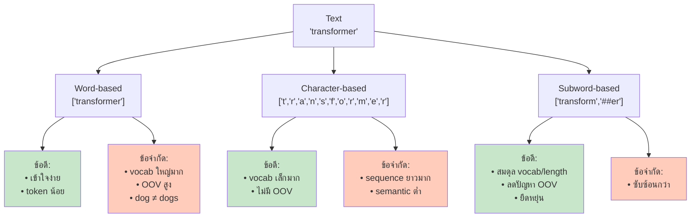

---
tags:
  - tokenizer
  - llm
  - nlp
type: note
status: evergreen
source: "Tokenizer in AI/Tokenizer-Knowledge-Base.md — ส่วนที่ 4–5"
parent_note: "[[Tokenizer in AI - MOC]]"
---

# ประเภทของ Tokenization

Tokenizer แบ่งได้เป็น **3 ประเภทหลัก** ตามหน่วยที่ใช้แทนข้อความ

## 1. Word-based Tokenization (Word-level)

ใช้คำเป็นหน่วยหลัก แบ่งตามช่องว่างและจุด/เครื่องหมายวรรคตอน

```
"Do n't you love Transformers?"
→ ["Do", "n't", "you", "love", "Transformers", "?"]
```

ตัวอย่างอื่น:
```
"Jim Henson was a puppeteer"
→ ["Jim", "Henson", "was", "a", "puppeteer"]
```

**ข้อดี**
- เข้าใจง่าย กฎไม่ซับซ้อน
- แต่ละ token มีความหมายชัดเจน (semantic meaning)

**ข้อจำกัด**
- **Vocabulary ใหญ่มาก** — ต้องเก็บ word variations ทั้งหมด: `love`, `loving`, `loved`, `lovingly`
- **Out-of-Vocabulary (OOV) สูง** — คำผันรูปต่างกัน เช่น `dog` ≠ `dogs` (2 tokens) ถูกมองเป็นคนละ token
- **Memory/Compute expensive** — embedding matrix ต้องใหญ่มาก สำหรับทุก unique word
- **ต้องมี unknown token** สำหรับคำนอก vocabulary
- **ไม่ดีกับภาษาที่ต่อคำได้** เช่น Turkish, Finnish ที่สร้างคำใหม่จากการต่อ subword

## 2. Character-based Tokenization

ใช้ตัวอักษรเป็นหน่วย

```
"AI" → ["A", "I"]
```

**ข้อดี**
- vocabulary เล็กมาก
- แทบไม่มีปัญหา out-of-vocabulary

**ข้อจำกัด**
- sequence ยาวขึ้นมาก
- หน่วยระดับตัวอักษรมี semantic meaning ต่ำ

## 3. Subword Tokenization

เป็นแนวทางที่ใช้กว้างขวางที่สุดใน LLM และ Transformer รุ่นสำคัญ

หลักคิด:
- คำที่พบบ่อย → เก็บเป็น token เดียว
- คำที่หายาก → แตกเป็นส่วนย่อยที่มีความหมาย

```
transformer → transform + ##er
tokenization → token + ization
```

**ข้อดี**
- balance ระหว่าง vocabulary size และความยืดหยุ่น
- ลดปัญหา unknown tokens ได้มาก
- รองรับคำหายาก คำผสม และภาษาที่ต่อคำยาวได้ดี

## เปรียบเทียบทั้ง 3 แบบ



| วิธี | จุดเด่น | ข้อจำกัด | เหมาะกับ |
|---|---|---|---|
| Word-level | เข้าใจง่าย | vocabulary ใหญ่, OOV สูง | ระบบ NLP แบบดั้งเดิม |
| Character-level | vocabulary เล็ก, แทบไม่มี OOV | sequence ยาว, semantic ต่ำ | งานที่ต้องครอบคลุมอักขระทุกแบบ |
| Subword-level | สมดุลที่สุดในงานสมัยใหม่ | ซับซ้อนกว่าแบบอื่น | **Transformer และ LLM ส่วนใหญ่** ✓ |

## ลิงก์ที่เกี่ยวข้อง

- [[01 - Tokenization คืออะไร]]
- [[03 - อัลกอริทึม BPE และ Byte-level BPE]]
- [[04 - WordPiece และ SentencePiece]]
- [[01 Foundations/LLM Foundations/Core/02 - สถาปัตยกรรม Transformer]]
