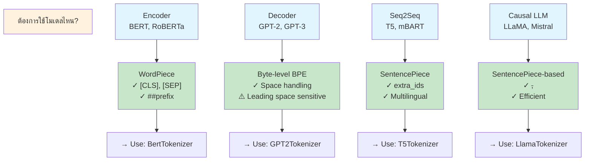

---
tags:
  - tokenizer
  - bert
  - gpt
  - t5
  - llama
  - llm
type: note
status: evergreen
source: "Tokenizer in AI/Tokenizer-Knowledge-Base.md — ส่วนที่ 16"
parent_note: "[[Tokenizer in AI - MOC]]"
---
# เปรียบเทียบ Tokenizer รายโมเดล

แต่ละ model family ใช้ tokenizer ต่างกัน — เข้าใจความต่างนี้สำคัญมากสำหรับการใช้งานจริง

## ภาพรวม

| Model family | Tokenizer | จุดเด่น | สิ่งที่ควรจำ |
|---|---|---|---|
| BERT | WordPiece | `##` สำหรับ continuing subwords | มี `[CLS]`, `[SEP]`, `[MASK]`, `[PAD]`, `[UNK]` |
| GPT-2 | Byte-level BPE | space เป็นส่วนหนึ่งของ token | ไวต่อ leading space |
| T5 | SentencePiece / Unigram | `.spm` file, `extra_ids` สำหรับ sentinel | เหมาะกับ text-to-text |
| LLaMA | SentencePiece-based | `.model` file, `<s>` `</s>` `<unk>` | ใช้กว้างขวางใน causal LLM |

---

## BERT Tokenizer (WordPiece)

**Algorithm:** WordPiece (likelihood-based merging)

- ใช้ `BertTokenizer` / `BertTokenizerFast` (Hugging Face Transformers)
- **Key options:** 
  - `do_lower_case` — default True
  - `tokenize_chinese_chars` — handle CJK characters separately
  - `strip_accents` — remove diacritics
- **Special tokens:** `[CLS]`, `[SEP]`, `[PAD]`, `[MASK]`, `[UNK]`

**เหมาะกับ:** encoder-style models, classification, QA, MLM

**Tokenization example:**
```
Input:  "I love NLP"
Process: [CLS] + I + love + NLP + [SEP]
Output: [CLS] I love NLP [SEP]
IDs:    [101] [1045] [2572] [17953] [102]
```

**Decoding note:**
- `##word` มีอักษร `##` ← บอกว่าคำนี้คือ continuation (ต่อจากคำก่อนหน้า)
```
wordpiece → word + ##piece
```

---

## GPT-2 Tokenizer (Byte-level BPE)

**Algorithm:** Byte-level BPE (256 base + 50,000 merges)

- ใช้ `GPT2Tokenizer` / `GPT2TokenizerFast`
- **space เป็นส่วนหนึ่งของ token** — ไม่ใช่ separator

**Critical behavior — Leading spaces matter:**

```
Text 1: "Hello world"
Tokens: ["Hello", "Ġworld"]  (Ġ = space)

Text 2: " Hello world"  (leading space)
Tokens: ["ĠHello", "Ġworld"]  (different!)

Practical implication: 
  prompt = "User: " + user_input
  ↓
  If user_input starts with space → different tokens
  → affect model output!
```

> [!warning]
> **GPT-like tokenizers ไวต่อ leading/trailing spaces** — ระวังตอนสร้าง prompt template
> - Don't strip whitespace ที่ model ต้องการ
> - Test tokenization เมื่อสร้าง template

**Note:** `add_prefix_space=True` มีอยู่แต่โมเดลไม่ได้ pretrain แบบนั้น → อาจกระทบ performance

---

## T5 Tokenizer (SentencePiece / Unigram)

**Algorithm:** SentencePiece + Unigram (probabilistic pruning)

- ใช้ `T5Tokenizer` อ่าน SentencePiece file (`.spm`)
- **Based on Unigram** — start large vocab, prune down
- **`extra_ids=100`** โดย default สำหรับ sentinel tokens

**Sentinel tokens** — unique to T5 denoising objectives:

```
Original: "The cat sat on the mat"
Corrupted: "The <extra_id_0> sat <extra_id_1> mat"
           (masked portions)

T5 learns to fill in: "<extra_id_0> cat on the <extra_id_1>"
```

ใช้ใน text-to-text tasks (summarization, translation, QA)

**Special characteristic:**
- Whitespace ถูกเก็บเป็น `▁` → lossless detokenization
- ไม่ต้อง pre-tokenize ก่อน training

---

## LLaMA Tokenizer (SentencePiece-based)

**Algorithm:** SentencePiece + BPE (not Unigram)

- ใช้ `LlamaTokenizerFast` อ่าน SentencePiece `.model` file
- **Special tokens:** `<unk>`, `<s>` (BOS), `</s>` (EOS)
- **Options:** `add_bos_token`, `add_eos_token`
- Vocabulary size: **32,000 tokens** (tuned for multilingual + code)

**Prompt formatting consideration:**

```python
# Without BOS:
prompt = "User: Hello"
tokens = [User, :, Ġ, Hello]

# With BOS:
prompt = "User: Hello"
tokens = [<s>, User, :, Ġ, Hello]  ← different!
```

> [!important]
> **BOS/EOS token presence มีผลต่อ**: 
> - Sequence length (เพิ่ม 1-2 tokens)
> - Model output distribution (trained with/without)
> - การ reproduce inference behavior

**Ecosystem:** LLaMA, LLaMA 2, LLaMA 3, Mistral, Phi ต่างๆ ล้วนใช้ SentencePiece-based tokenizer แนวนี้

---

## การเลือก Tokenizer ให้ตรงกับงานจริง



## ⚠️ สิ่งที่ต้องระวังเมื่อสลับโมเดล/Tokenizer

### ❌ โปรดอย่าทำ

1. **ห้ามใช้ tokenizer ของ BERT กับ GPT-2 หรือกลับกัน**
   ```python
   # WRONG:
   bert_model = AutoModel.from_pretrained("bert-base")
   gpt_tokenizer = AutoTokenizer.from_pretrained("gpt2")
   tokens = gpt_tokenizer(text)
   outputs = bert_model(tokens)  # ❌ Token IDs ไม่ตรงกับ embedding
   ```

2. **ห้ามเปลี่ยน tokenizer โดยไม่ retrain โมเดล**
   - Token ID นั้นมีความหมายขึ้นอยู่กับ embedding layer ที่เรียนรู้ไป
   - เปลี่ยน tokenizer → embedding lookup table ผิด

### ✓ ต้องทำ

1. **เสมอใช้ tokenizer ชุดเดียวกับที่ bundled กับโมเดล**
   ```python
   # CORRECT:
   model = AutoModel.from_pretrained("bert-base")
   tokenizer = AutoTokenizer.from_pretrained("bert-base")  # match!
   ```

2. **เข้าใจพฤติกรรม tokenizer ของแต่ละโมเดล**
   - BERT: `[CLS]` token ต้องมี
   - GPT-2: ระวัง leading spaces
   - LLaMA: check `add_bos_token` setting

### Token ID Mismatch Example

| Model | Token "hello" | Token "world" |
|---|---|---|
| BERT | 7592 | 1090 |
| GPT-2 | 31373 | 995 |
| LLaMA | 7378 | 3686 |

เนื่องจากแต่ละ tokenizer มี vocabulary ต่างกัน

## ลิงก์ที่เกี่ยวข้อง

- [[03 - อัลกอริทึม BPE และ Byte-level BPE]]
- [[04 - WordPiece และ SentencePiece]]
- [[05 - Tokenizer Pipeline]]
- [[01 Foundations/LLM Foundations/Core/02 - สถาปัตยกรรม Transformer]]
- [[01 Foundations/LLM Foundations/Core/08 - Data, Pretraining และ Model Modes]]
