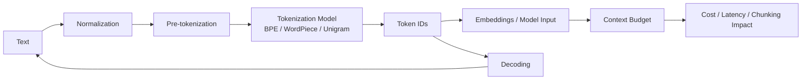

---
tags:
  - tokenizer
  - moc
  - llm
  - nlp
type: moc
status: evergreen
source: "Tokenizer in AI/Tokenizer-Knowledge-Base.md"
parent_note: "[[Home]]"
---
# Tokenizer in AI — Map of Content

**Tokenization** คือกระบวนการแปลงข้อความเป็น token IDs ที่โมเดลใช้จริง เป็นองค์ประกอบแกนกลางของ NLP pipeline ทุกชนิด

---

## Tokenizer Learning Path



แผนที่นี้วาง tokenizer เป็นสะพานจาก text ไปสู่ token IDs ที่กระทบ model input, context budget, cost, latency, และ chunking ใน RAG โดยตรง.

---

## Notes ในหัวข้อนี้

| # | Note | เนื้อหาหลัก |
|---|---|---|
| 01 | [[01 - Tokenization คืออะไร]] | ภาพรวม, vocabulary, token IDs, special tokens |
| 02 | [[02 - ประเภทของ Tokenization]] | Word-based, Character-based, Subword |
| 03 | [[03 - อัลกอริทึม BPE และ Byte-level BPE]] | BPE, Byte-level BPE, GPT family |
| 04 | [[04 - WordPiece และ SentencePiece]] | WordPiece (BERT), SentencePiece, Unigram |
| 05 | [[05 - Tokenizer Pipeline]] | Normalization → Pre-tokenization → Model → Post-processing → Decoding |
| 06 | [[06 - ทำไม Tokenization ถึงสำคัญ]] | Cost, Generalization, Multilingual, Engineering rules |
| 07 | [[07 - เปรียบเทียบ Tokenizer รายโมเดล]] | BERT, GPT-2, T5, LLaMA — ความต่างในทางปฏิบัติ |

---

## แผนที่ความสัมพันธ์ (มี Diagram)

```
Tokenization
├── ประเภท (02 - มี Diagram: Word vs Char vs Subword)
│   ├── Word-based
│   ├── Character-based
│   └── Subword ← ใช้งานจริงมากที่สุด
│
├── อัลกอริทึม (03, 04 - มี Step-by-step + Comparison)
│   ├── BPE (03) → GPT family
│   ├── Byte-level BPE (03) → GPT-2, RoBERTa
│   ├── WordPiece (04) → BERT family
│   ├── SentencePiece (04) → T5, LLaMA
│   └── Unigram (04) → ALBERT, T5, XLNet
│
├── Pipeline (05 - มี Flowchart Diagram)
│   ├── Normalization
│   ├── Pre-tokenization
│   ├── Model (BPE/WordPiece/Unigram/WordLevel)
│   ├── Post-processing
│   └── Decoding
│
├── ความสำคัญ (06 - มี Cost Comparison Chart)
│   ├── Efficiency & Cost
│   ├── Generalization
│   ├── Multilingual Behavior (Token ratio diagram)
│   └── Reversibility
│
└── การเลือก (07 - มี Decision Tree)
    ├── BERT → WordPiece
    ├── GPT-2 → Byte-level BPE
    ├── T5 → SentencePiece
    └── LLaMA → SentencePiece-based
```

---

## Cross-topic Links

- [[01 Foundations/LLM Foundations/Core/01 - LLM คืออะไรและพื้นฐาน]] — Tokenization เป็นขั้นตอนแรกใน LLM pipeline
- [[01 Foundations/LLM Foundations/Core/02 - สถาปัตยกรรม Transformer]] — Transformer รับ token IDs เป็น input
- [[01 Foundations/LLM Foundations/Core/06 - Attention และ Representations]] — token embeddings ถูกแปลงต่อเป็น contextual representations
- [[01 Foundations/LLM Foundations/Core/07 - Logits, Decoding และ Sampling]] — Output ของโมเดลยังเป็น token IDs ก่อน decode
- [[01 Foundations/Context Windows/Context Windows - MOC]] — Token count กำหนดว่าข้อความใส่ใน context window ได้เท่าไร
- [[01 Foundations/Prompt Engineering/Prompt Engineering - MOC]] — Prompt ที่ดีต้องคำนึงถึง token count ด้วย
- [[02 AI Systems/RAG/RAG - MOC|RAG]] — chunking, retrieval payload size, และ context assembly ล้วนได้รับผลจาก tokenization
- [[01 Foundations/Prompt Engineering/Bridge/13 - Messages, System Prompt และ Chat Templates|Messages, System Prompt และ Chat Templates]] — Special tokens และ message formatting ใน agent systems
- [[06 Engineering/README]] — implementation layer สำหรับ token budgets, chunking, caching, และ framework-specific runtime behavior
- [[Knowledge Topic Registry]]
