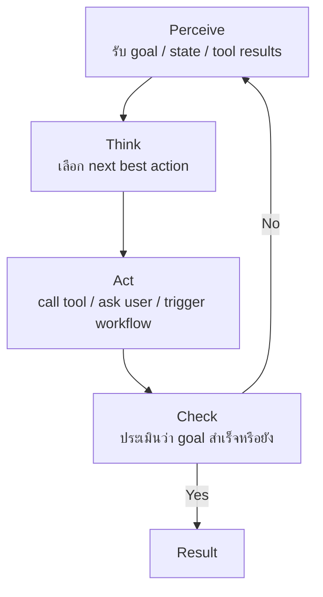

---
tags:
  - agent
  - loop
  - orchestration
type: note
status: evergreen
source: "Google Skills — Agent Fundamentals (Module 3) · OpenAI Agents Guide · Hugging Face Agents Course"
parent_note: "[[AI Agent Fundamentals - MOC]]"
---

# วงจร Perceive → Think → Act → Check


---

## ภาพรวม

Orchestration ของ agent คือ **cyclical process** ที่วนซ้ำจนกว่าจะบรรลุเป้าหมาย

```
Perceive → Think → Act → Check → (ยังไม่เสร็จ → กลับไป Perceive) → Result
```



---

## 4 ขั้นตอนในวงจร

### Perceive — รับรู้สถานการณ์
- ผู้ใช้ต้องการอะไร?
- มีอะไรเกิดขึ้นแล้วบ้าง?
- tool ตอบอะไรกลับมา?
- state ปัจจุบันของโลกคืออะไร?

### Think — วิเคราะห์ next best action
- ต้องถามเพิ่มหรือไม่?
- ใช้ tool ไหน?
- ควรเปลี่ยน strategy หรือไม่?

### Act — ลงมือทำ
- tool call
- API call
- database query
- message to user
- trigger workflow

### Check — ประเมินผล
- goal สำเร็จแล้วหรือยัง?
- ขาดข้อมูลอะไร?
- มี error หรือ blocker หรือไม่?
- ต้องวนรอบต่อไปอย่างไร?

---

## Reasoning Frameworks ภายใน Loop

model สามารถใช้ reasoning frameworks หลายแบบภายใน loop เดียวกัน:
- `ReAct` (Reasoning + Acting)
- `Chain-of-thought`
- `Tree-of-thoughts`

frameworks เหล่านี้เป็น "วิธีคิดภายใน" ส่วน pattern ระดับสถาปัตยกรรมยังคงเป็น Perceive → Think → Act → Check เสมอ

---

## ตัวอย่างเต็ม: Agent จองเที่ยวบินไป Paris

**Goal:** `Book me a flight to Paris next week`

| Loop | Perceive | Think | Act | Check |
|---|---|---|---|---|
| 1 | ต้องการจอง flight สัปดาห์หน้า | ยังไม่รู้ Paris ไหน วันไหนแน่ | ถาม clarifying question | ยังไม่เสร็จ |
| 2 | Paris France, flexible on dates | ควรเช็ก calendar ก่อน | เรียก calendar tool | ยังไม่เสร็จ |
| 3 | ว่าง Mon-Wed สัปดาห์หน้า | ควรค้นหา flight ตามวันเหล่านี้ | เรียก flight search tool | ยังไม่เสร็จ (รอผู้ใช้เลือก) |
| 4 | ผู้ใช้เลือก direct $450 | พร้อมจอง | เรียก booking tool | **Goal สำเร็จ** ✓ |

**ประเด็นสำคัญ:**
- Orchestration คุม loop
- Model ตัดสินใจแต่ละรอบ
- Tools ทำ action จริง
- ทั้งสามส่วนรวมกันจึงเกิด autonomy

---

## เปรียบเทียบกับ TAO Cycle

[[06 - วงจร Thought-Action-Observation (TAO)]] จาก Medium มีแนวคิดเดียวกัน แต่ใช้ชื่อต่างกัน:

| Google (PTAC) | Medium (TAO) |
|---|---|
| Perceive + Think | Thought |
| Act | Action |
| Check | Observation |

---

## ดูต่อ

- [[06 - วงจร Thought-Action-Observation (TAO)]]
- [[04 - สถาปัตยกรรม Agent: Model + Tools + Orchestration]]

## ตัวอย่าง Implementation จริง

- [[03 Tools/Claude Code/01 - Claude Code คืออะไร|Claude Code Agentic Loop]] — Agentic Loop ของ Claude Code เป็น PTAC จริง: วางแผน → Read → วิเคราะห์ → Edit → Bash รัน test → ตรวจว่าเสร็จไหม → วนซ้ำ

## Official References

- OpenAI: Agents  
  https://platform.openai.com/docs/guides/agents
- Hugging Face Agents Course: Introduction to Agents  
  https://huggingface.co/learn/agents-course/en/unit1/introduction
