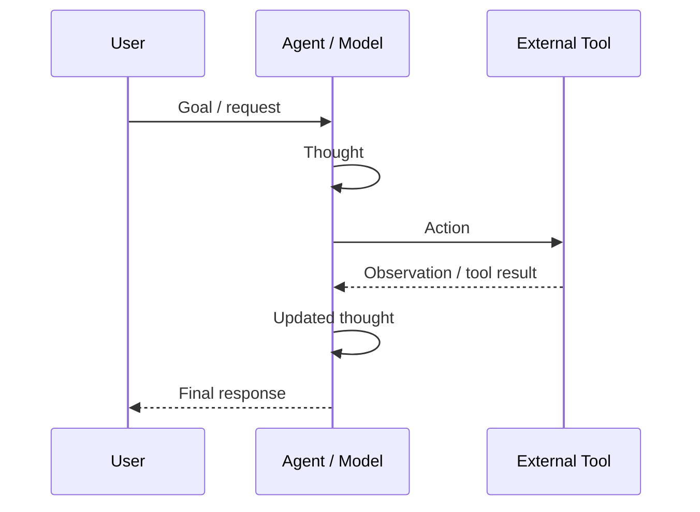
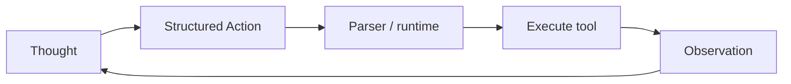

---
tags:
  - agent
  - loop
  - tao
  - react
  - cot
type: note
status: draft
source: "Hugging Face Agents Course — Unit 1 · Anthropic Tool Use Overview · OpenAI Function Calling"
parent_note: "[[AI Agent Fundamentals - MOC]]"
---

# วงจร Thought → Action → Observation (TAO)


---

## ภาพรวม

TAO cycle คือกลไกหลักที่ทำให้ agent ไม่ใช่แค่ระบบถาม-ตอบธรรมดา Agent ทำงานเป็น **while loop** — วนซ้ำจนกว่า objective จะสำเร็จ

```
Thought → Action → Observation → (ยังไม่พอ → กลับไป Thought) → Respond
```



**Rules และ guidelines ของ cycle ถูก embed ไว้ใน system prompt** — ทุก cycle จึงเป็นไปตาม logic ที่กำหนด

---

## 1. Thought — ช่วงคิด วิเคราะห์ และวางแผน

Thought คือ **internal reasoning และ planning** ของ agent ใช้ LLM capacity วิเคราะห์ข้อมูลใน prompt — เป็น inner monologue ขณะแก้ปัญหา

หน้าที่:
- แตก complex problem เป็น steps ย่อย ๆ
- ทบทวนสิ่งที่รู้และสิ่งที่ขาดอยู่
- ตัดสินใจว่า action ถัดไปควรเป็นอะไร

### 8 ประเภทของ Thought

| ประเภท | ตัวอย่าง |
|---|---|
| **Planning** | "I need to break this task into 3 steps: 1) gather data, 2) analyze trends, 3) generate report" |
| **Analysis** | "Based on the error message, the issue appears to be with the database connection parameters" |
| **Decision Making** | "Given the user's budget constraints, I should recommend the mid-tier option" |
| **Problem Solving** | "To optimize this code, I should first profile it to identify bottlenecks" |
| **Memory Integration** | "The user mentioned preference for Python earlier, so I'll provide examples in Python" |
| **Self-Reflection** | "My last approach didn't work well, I should try a different strategy" |
| **Goal Setting** | "To complete this task, I need to first establish the acceptance criteria" |
| **Prioritization** | "The security vulnerability should be addressed before adding new features" |

> Note: ใน LLM ที่ fine-tuned สำหรับ function-calling โดยเฉพาะ thought process อาจเป็น optional

---

## Chain-of-Thought (CoT)

**CoT** คือ prompting technique ที่นำ model ให้คิดทีละ step ก่อนตอบ เริ่มด้วย: *"Let's think step by step."*

เหมาะกับงานที่ใช้ internal reasoning เพียงอย่างเดียว ไม่ต้องใช้ external tools

```
Question: What is 15% of 200?
Thought: Let's think step by step. 10% of 200 is 20, and 5% of 200 is 10, so 15% is 30.
Answer: 30
```

---

## 2. Action — ช่วงลงมือทำจริง

Action คือ **concrete steps ที่ agent ทำ** เพื่อ interact กับ environment

### ประเภทของ Action

| ประเภท | คำอธิบาย |
|---|---|
| **Information Gathering** | Web search, database query, document retrieval |
| **Tool Usage** | API calls, calculations, code execution |
| **Environment Interaction** | Manipulate digital interfaces, control physical devices |
| **Communication** | ตอบ user, collaborate กับ agent อื่น |

### ประเภทของ Agent ตามวิธี Action

| Agent Type | วิธีการ |
|---|---|
| **JSON Agent** | กำหนด action ในรูป JSON format |
| **Code Agent** | เขียน executable code block (เช่น Python) |
| **Function-calling Agent** | subcategory ของ JSON Agent ที่ fine-tuned สร้าง message ใหม่ต่อหนึ่ง action |

### Stop and Parse Approach

กลไกสำคัญที่ทำให้ action มีโครงสร้างชัดเจน:

1. **Generation in Structured Format** — LLM output action ใน format ที่กำหนด (JSON หรือ code)
2. **Halting Further Generation** — LLM หยุดสร้าง tokens เมื่อ action ครบถ้วนแล้ว
3. **Parsing the Output** — external parser อ่าน action, ระบุ tool ที่เรียก, ดึง parameters

ตัวอย่าง JSON Agent action:
```json
Thought: I need to check the current weather for New York.
Action:
{
  "action": "get_weather",
  "action_input": {"location": "New York"}
}
```

### Code Agent

แทนที่จะ output JSON, Code Agent สร้าง **executable code block**

ข้อดีของ Code Agent:
- **Expressiveness** — code แสดง logic ซับซ้อนได้ (loops, conditionals, functions)
- **Modularity** — code ที่สร้างสามารถ reuse ข้าม action ได้
- **Debuggability** — error ใน code ชัดเจนกว่า JSON
- **Direct Integration** — เชื่อมกับ libraries และ APIs ได้โดยตรง

> ⚠️ การ execute code จาก LLM มีความเสี่ยง (prompt injection, harmful code) — ควรใช้ framework ที่มี safeguards เช่น `smolagents`

---

## 3. Observation — ช่วงรับผลและปรับตัว

Observation คือ **สัญญาณจาก environment** หลัง agent ทำ action — เหมือน "tool logs" ที่ให้ textual feedback

agent ทำ 3 สิ่งในช่วงนี้:
1. **Collects Feedback** — รับ data หรือยืนยันว่า action สำเร็จหรือไม่
2. **Appends Results** — รวม information ใหม่เข้า context (memory)
3. **Adapts Strategy** — ใช้ context ที่อัปเดตแล้วปรับ thought และ action ถัดไป

### ประเภทของ Observation

| ประเภท | ตัวอย่าง |
|---|---|
| **System Feedback** | Error messages, success notifications, status codes |
| **Data Changes** | Database updates, file modifications, state changes |
| **Environmental Data** | Sensor readings, system metrics, resource usage |
| **Response Analysis** | API responses, query results, computation outputs |
| **Time-based Events** | Deadlines reached, scheduled tasks completed |

### ขั้นตอนหลัง Action (Framework จัดการ)

```
1. Parse the action → ระบุ function และ arguments
2. Execute the action
3. Append the result as Observation
```



---

## ตัวอย่างเต็ม: Alfred the Weather Agent

**(จาก HuggingFace Agents Course)**

**User:** "What's the current weather in New York?"

**Thought:**
> "The user needs current weather info for New York. I have access to `get_weather` tool. I need to call it first."

**Action:**
```json
{
  "action": "get_weather",
  "action_input": {"location": "New York"}
}
```

**Observation:**
> "Current weather in New York: partly cloudy, 15°C, 60% humidity."

**Updated Thought:**
> "Now that I have the weather data, I can compile an answer."

**Final Action:**
> "The current weather in New York is partly cloudy with 15°C and 60% humidity."

---

## ReAct = Reason + Act

ReAct คือ prompting technique ที่ combine TAO cycle ไว้ด้วยกัน — agent คิดทีละ step, ลงมือทำ, เรียนรู้จากผลลัพธ์, คิดต่อ

```
Thought: I need to find the latest weather in Paris.
Action: Search["weather in Paris"]
Observation: It's 18°C and cloudy.
Thought: Now that I know the weather...
Action: Finish["It's 18°C and cloudy in Paris."]
```

### CoT vs ReAct

| คุณลักษณะ | Chain-of-Thought (CoT) | ReAct |
|---|---|---|
| Step-by-step logic | ✅ Yes | ✅ Yes |
| External tools | ❌ No | ✅ Yes (Actions + Observations) |
| เหมาะกับ | Logic, math, internal tasks | Info-seeking, dynamic multi-step tasks |

> Models รุ่นใหม่เช่น **Deepseek R1** หรือ **OpenAI o1** ถูก fine-tuned ให้ "think before answering" ด้วย structured tokens `<think>` และ `</think>` — นี่คือ **training-level technique** ต่างจาก ReAct/CoT ที่เป็นแค่ prompting strategy

---

## ทำไม TAO จึงสำคัญ

วงจรนี้ทำให้ agent:
- ทำงานหลายขั้นตอนได้
- ปรับตัวตามผลลัพธ์จริง
- ใช้ข้อมูลจากโลกภายนอกมาช่วยตอบ
- ไม่จำเป็นต้องรู้ทุกอย่างตั้งแต่แรก

---

## Components ของ Agentic System

5 องค์ประกอบที่ agent มักมีบางส่วนหรือทั้งหมด:
1. **Multiple LLM Calls** — เรียกหลายรอบ ไม่ใช่แค่ครั้งเดียว
2. **Ability to Use Tools** — web search, calculator, API, database, calendar
3. **An Environment Where LLMs Interact** — เว็บไซต์, ไฟล์, ระบบภายใน
4. **A Planner to Coordinate Activities** — วางแผนว่าควรเริ่มจากอะไร
5. **Autonomy** — ดำเนินงานได้ด้วยตัวเองในระดับหนึ่ง

---

## เปรียบเทียบกับ PTAC Loop

[[05 - วงจร Perceive-Think-Act-Check]] จาก Google Skills ใช้ชื่อต่างกันแต่แนวคิดเดียวกัน

## Official References

- Hugging Face Agents Course: Introduction to Agents  
  https://huggingface.co/learn/agents-course/en/unit1/introduction
- Anthropic: Tool Use Overview  
  https://docs.anthropic.com/en/docs/agents-and-tools/tool-use/overview
- OpenAI: Function Calling  
  https://platform.openai.com/docs/guides/function-calling

| TAO (HuggingFace / Medium) | PTAC (Google) |
|---|---|
| Thought | Perceive + Think |
| Action | Act |
| Observation | Check |

---

## ดูต่อ

- [[07 - รูปแบบ Agent Architectures]] — ReAct ใช้แนวคิด TAO เป็นแกนกลาง
- [[05 - วงจร Perceive-Think-Act-Check]]
- [[14 - Tools: การออกแบบและทำงาน]]
- [[13 - Messages, System Prompt และ Chat Templates]]
