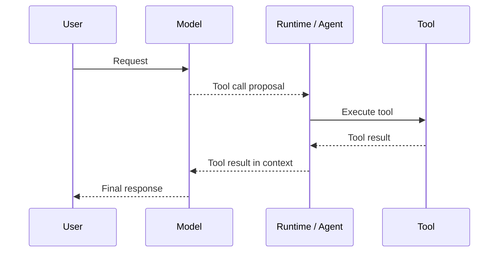
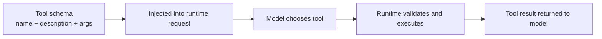

---
tags:
  - agent
  - tools
  - design
  - mcp
type: note
status: evergreen
source: "OpenAI Docs, Anthropic Docs, MCP Official Docs"
parent_note: "[[AI Agent Fundamentals - MOC]]"
---

# Tools: การออกแบบและทำงาน


---

## Tool คืออะไร

> **Tool คือ function ที่ถูกมอบให้ LLM** — เพื่อให้ LLM สามารถทำงานที่เกินกว่าความสามารถ text generation

Tool ที่ดีต้อง **เสริมพลังของ LLM** ไม่ใช่ทำซ้ำสิ่งที่ LLM ทำได้อยู่แล้ว

ตัวอย่าง: ถ้าต้องการคำนวณ arithmetic → ให้ calculator tool แทนการพึ่ง LLM คำนวณเอง เพราะ LLM อาจผิดพลาดได้

---

## Tools ที่ใช้กันทั่วไป

| Tool | หน้าที่ |
|---|---|
| Web Search | ดึงข้อมูลล่าสุดจากอินเทอร์เน็ต |
| Image Generation | สร้างภาพจาก text description |
| Retrieval | ดึงข้อมูลจาก external source |
| API Interface | เชื่อมต่อ external API (GitHub, YouTube, Spotify ฯลฯ) |
| Calculator | คำนวณ arithmetic |
| Calendar | ดูและจัดการตารางเวลา |

> สามารถสร้าง tool สำหรับ use case ใดก็ได้ ไม่จำกัด

---

## ทำไม LLM ถึงต้องการ Tools

1. **LLM มี knowledge ตัดอยู่ที่ training cutoff** — ถ้าต้องการข้อมูล real-time ต้องมี tool
2. **LLM อาจ hallucinate** เมื่อถามข้อมูลปัจจุบัน เช่น พยากรณ์อากาศวันนี้
3. **บาง task เฉพาะทางทำได้แม่นยำกว่าด้วย tool** เช่น arithmetic, code execution

---

## โครงสร้างของ Tool

Tool ต้องมี 4 องค์ประกอบ:

| องค์ประกอบ | ความหมาย | จำเป็น |
|---|---|---|
| **Name** | ชื่อ function | ✅ |
| **Description** | อธิบายว่า tool ทำอะไร | ✅ |
| **Arguments** | input parameters + types | ✅ |
| **Outputs** | output type | Optional |

ตัวอย่าง text description ที่ LLM เข้าใจ:
```
Tool Name: calculator, Description: Multiply two integers., Arguments: a: int, b: int, Outputs: int
```

---

## Tool ทำงานอย่างไร

OpenAI และ Anthropic อธิบายตรงกันว่า model ไม่ได้ execute code เองโดยตรง แต่จะสร้าง tool call ตาม schema ที่ถูกส่งเข้า runtime request แล้ว application/runtime เป็นฝ่าย validate, execute, และส่งผลลัพธ์กลับเข้า context

```
1. Application ส่ง tool definitions หรือ tool schemas เข้า runtime request
2. Model ตัดสินใจว่าจะเรียก tool หรือไม่
3. Runtime ตรวจสอบ arguments และ execute tool จริง
4. Runtime ส่ง tool result กลับเข้า conversation/context
5. Model ใช้ผลลัพธ์นั้นสร้าง response สุดท้าย
```



> Tool-calling steps **ไม่แสดงให้ผู้ใช้เห็น** — ทุกอย่างเกิดใน background

---

## Tool Schema และ Runtime Contract

ในเชิงสถาปัตย์ แกนสำคัญคือ contract ระหว่าง model กับ runtime:
- tool name
- description
- argument schema
- execution boundary
- tool result ที่ส่งกลับเข้าบริบทของโมเดล

SDK หรือ framework อาจมี helper abstractions ต่างกัน แต่แกนกลางยังเหมือนเดิม คือ model เห็น tool schema, runtime execute, แล้วผลลัพธ์ถูกส่งกลับเข้า conversation

> ถ้าต้องการรายละเอียดเรื่อง schema, runtime integration, และ execution boundary ให้ดู [[06 Engineering/Architecture to Code/Architecture - Tool Schemas and Runtime Integration]]

---

## การใส่ Tools เข้า Runtime Request

tools หรือ tool schemas ต้องถูกส่งเข้า runtime request/context เพื่อให้ model รู้จักก่อนเริ่มทำงาน

- OpenAI ใช้ `tools` parameter ใน Responses API
- Anthropic ใช้ `tools` parameter และ content blocks สำหรับ `tool_use` / `tool_result`

```
Application request
- model
- messages / input
- tools
- tool_choice policy

Runtime
- validate arguments
- execute tool
- append tool result

Model
- continues reasoning with tool result in context
```

> ดูรายละเอียด System Prompt ได้ที่ [[13 - Messages, System Prompt และ Chat Templates]]



---

## Actions ≠ Tools

> **Action** ไม่เหมือนกับ **Tool**

- **Tool** = function ที่ให้ LLM ใช้
- **Action** = ขั้นตอนที่ agent ทำ — ซึ่งอาจใช้ **หลาย tools** ประกอบกันก็ได้

---

## Model Context Protocol (MCP)

**MCP** คือ open protocol มาตรฐานที่ standardize วิธีที่ applications ให้ tools กับ LLMs

ประโยชน์:
- Pre-built integrations ที่ LLM เชื่อมต่อได้ทันที
- ยืดหยุ่น: เปลี่ยน LLM provider ได้โดยไม่ต้อง reimplement tool
- Best practices สำหรับ data security

> framework ใดก็ตามที่ implement MCP สามารถใช้ tools ที่กำหนดไว้ใน protocol ได้เลย โดยไม่ต้องเขียนใหม่

---

## ดูต่อ

- [[13 - Messages, System Prompt และ Chat Templates]]
- [[06 - วงจร Thought-Action-Observation (TAO)]]
- [[04 - สถาปัตยกรรม Agent: Model + Tools + Orchestration]]
- [[06 Engineering/Architecture to Code/Architecture - Tool Schemas and Runtime Integration]]
- [[06 Engineering/README]]
- [[02 AI Systems/MCP/MCP - MOC|MCP - MOC]] — ดู protocol layer สำหรับ tools, resources, prompts, และ consent
- [[02 AI Systems/Agent Frameworks/Agent Frameworks - MOC|Agent Frameworks - MOC]] — ดูว่า framework ต่าง ๆ จัดการ tool orchestration และ state อย่างไร
- [[03 Tools/Claude Code/01 - Claude Code คืออะไร|Claude Code Tools]] — ตัวอย่าง production tools
- [[03 Tools/Claude Code/17 - Agent Tool|Agent Tool]] — ตัวอย่าง tool ที่ output เป็น subagent

## Official References

- OpenAI: Using tools  
  https://platform.openai.com/docs/guides/tools?api-mode=responses
- OpenAI: Responses API  
  https://platform.openai.com/docs/api-reference/responses/compact?api-mode=responses
- Anthropic: Tool Use Overview  
  https://docs.anthropic.com/en/docs/agents-and-tools/tool-use/overview
- MCP: Architecture  
  https://modelcontextprotocol.io/docs/learn/architecture
