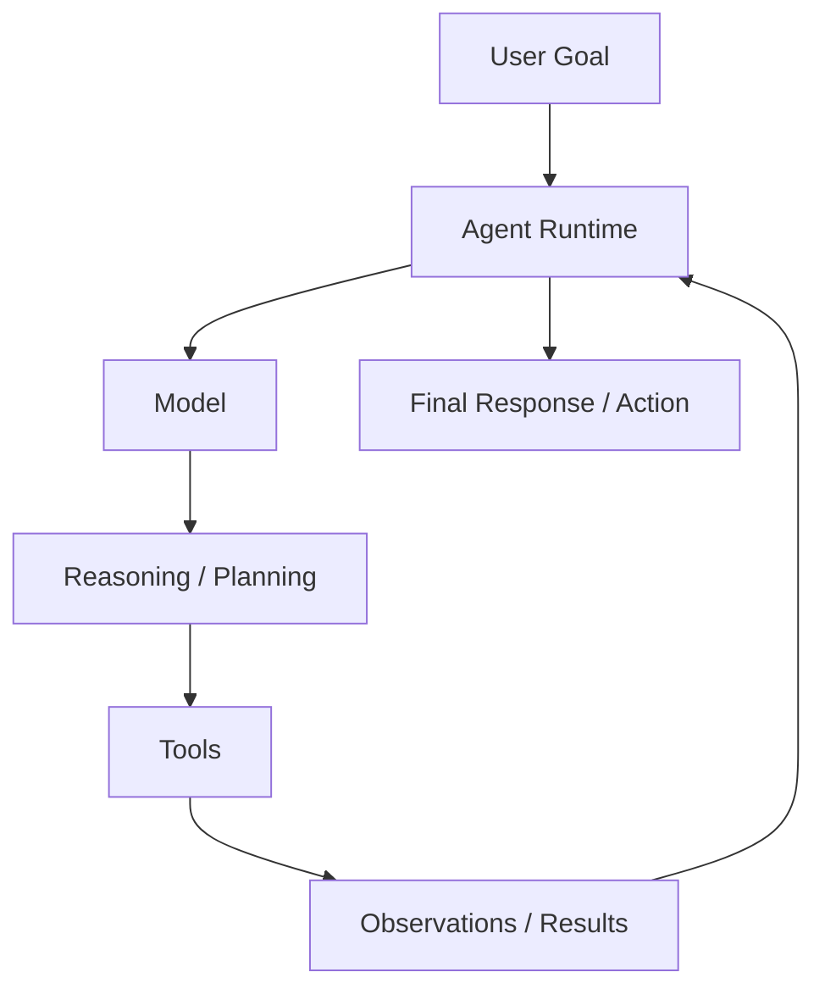
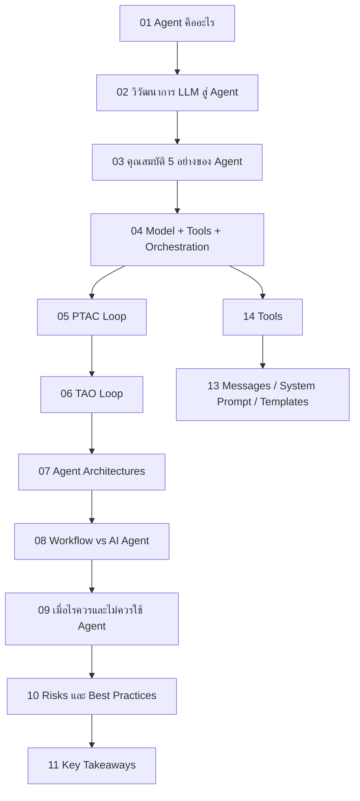

---
tags:
  - agent
  - moc
  - ai
type: moc
status: evergreen
source: ""
parent_note: "[[Home]]"
---
# AI Agent Fundamentals - MOC

> แหล่งความรู้รวมทุกหัวข้อเกี่ยวกับ AI Agent Fundamentals
> Sources: Google Skills "Agent Fundamentals" course (Module 1–4) · Medium/Nishan Jain

---

## Scope

หมวดนี้ครอบนิยามของ agent, runtime loops, architecture patterns, การเลือกใช้ agent เทียบกับ workflow, ความเสี่ยง, และชั้น runtime ที่เกี่ยวกับ messages กับ tools

กติกาการอ่าน:
- ไฟล์ที่มีเลข `01, 02, 03...` คือ core learning path ของหมวดนี้
- ลำดับด้านล่างเรียงจาก concept พื้นฐาน -> runtime loops -> architecture decisions -> risks/tools

---

## ภาพรวมหมวดนี้

diagram นี้เป็น conceptual overview ของหมวดนี้ เพื่อสรุปว่า agent systems ต่างจาก prompt-response ทั่วไปตรงที่มี loop, tools, และ orchestration

---

## Notes Map

- [[01 - AI Agent คืออะไร]] — นิยาม ช่องว่างระหว่าง LLM กับ Agent
- [[02 - วิวัฒนาการ LLM สู่ Agent]] — 3 ระยะ: LLM → Function Calling → Agent
- [[03 - คุณสมบัติ 5 อย่างของ Agent]] — Goal-directed · Autonomous · Proactive · Environmental awareness · Tool use
- [[04 - สถาปัตยกรรม Agent: Model + Tools + Orchestration]] — 3 องค์ประกอบแกนกลาง
- [[05 - วงจร Perceive-Think-Act-Check]] — Agent loop ระดับสูง
- [[06 - วงจร Thought-Action-Observation (TAO)]] — TAO / ReAct style loop
- [[07 - รูปแบบ Agent Architectures]] — architecture patterns
- [[08 - Workflow vs AI Agent]] — ความต่าง และเมื่อไรควรใช้อะไร
- [[09 - เมื่อไรควรและไม่ควรใช้ Agent]] — decision framework
- [[10 - Risks และ Best Practices]] — risks, tradeoffs, mitigations
- [[11 - Key Takeaways และ Quick Reference]] — summary และ quick reference
- [[12 - LLM พื้นฐาน]] — LLM prerequisites
- [[13 - Messages, System Prompt และ Chat Templates]] — runtime prompt/message layer
- [[14 - Tools: การออกแบบและทำงาน]] — tools, schemas, MCP connection
- [[06 Engineering/Architecture to Code/Architecture - Tool Schemas and Runtime Integration]] — runtime contract ของ tool schemas, validation, execution, และ tool results

---

## Learning Path Overview

ใช้ flow นี้ถ้าต้องการอ่านหมวดนี้แบบเป็นระบบตั้งแต่ concept จนถึง decision-making และ practical tool layer

---
## Learning Path

### 1. Agent Foundations

1. [[01 - AI Agent คืออะไร]]
2. [[02 - วิวัฒนาการ LLM สู่ Agent]]
3. [[03 - คุณสมบัติ 5 อย่างของ Agent]]
4. [[04 - สถาปัตยกรรม Agent: Model + Tools + Orchestration]]

### 2. Agent Runtime Loops

1. [[05 - วงจร Perceive-Think-Act-Check]]
2. [[06 - วงจร Thought-Action-Observation (TAO)]]

### 3. Architectures and Decisions

1. [[07 - รูปแบบ Agent Architectures]]
2. [[08 - Workflow vs AI Agent]]
3. [[09 - เมื่อไรควรและไม่ควรใช้ Agent]]

### 4. Risks and Practical Runtime Layers

1. [[10 - Risks และ Best Practices]]
2. [[14 - Tools: การออกแบบและทำงาน]]
3. [[13 - Messages, System Prompt และ Chat Templates]]

### 5. Reference

1. [[11 - Key Takeaways และ Quick Reference]]
2. [[12 - LLM พื้นฐาน]]

---

## Related Notes

1. [[02 AI Systems/MCP/MCP - MOC]]
2. [[02 AI Systems/Memory Systems/Memory Systems - MOC]]
3. [[02 AI Systems/Guardrails/Guardrails - MOC]]
4. [[02 AI Systems/Evals/Evals - MOC]]
5. [[02 AI Systems/Agent Frameworks/Agent Frameworks - MOC]]
6. [[04 Synthesis/Synthesis - Agent Runtime Layers]]
