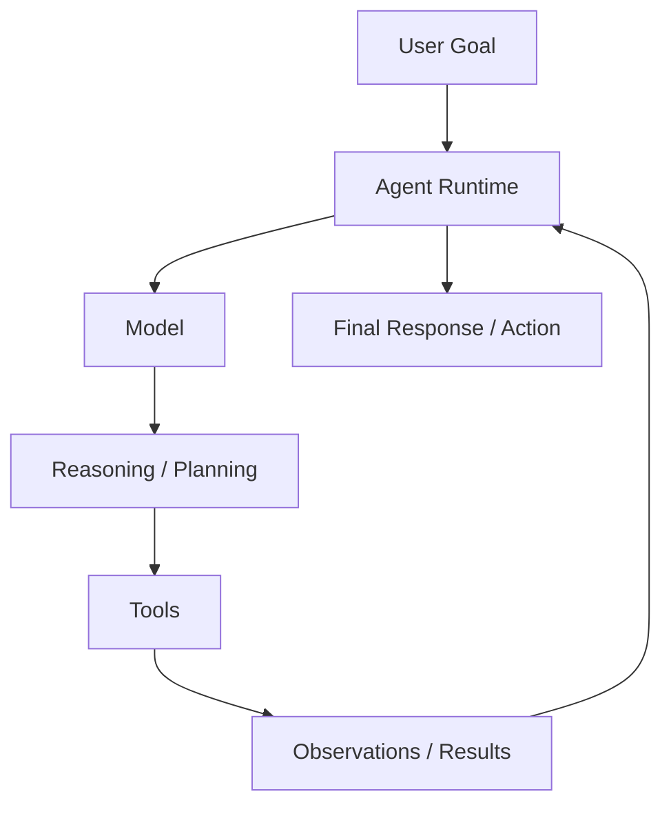
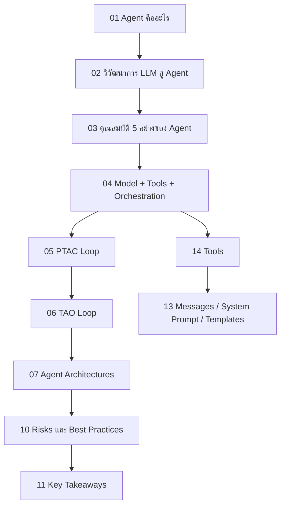

---
tags:
  - agent
  - moc
  - ai
type: moc
status: evergreen
source: ""
parent_note: "[[Home]]"
---
# AI Agent Fundamentals - MOC

> แหล่งความรู้รวมทุกหัวข้อเกี่ยวกับ AI Agent Fundamentals
> Sources: Google Skills "Agent Fundamentals" course (Module 1–4) · Medium/Nishan Jain

---

## Scope

หมวดนี้ครอบนิยามของ agent, runtime loops, architecture patterns, การเลือกใช้ agent เทียบกับ workflow, ความเสี่ยง, และชั้น runtime ที่เกี่ยวกับ messages กับ tools

หมายเหตุการจัดโครง:
- หมวดนี้เป็น canonical learning path สำหรับพื้นฐานของ agent
- โน้ตใน `04 Synthesis` ทำหน้าที่เป็น bridge / comparison / synthesis layer และไม่ควรเล่าพื้นฐานซ้ำเกินจำเป็น
- ถ้าเป็น decision path หรือ application-oriented example ให้เริ่มที่ `05 Use Cases` ก่อน แล้วค่อยย้อนกลับมาอ่าน note canonical ของหมวดนี้
- หัวข้อ LLM / prompt / context primitives เป็นของ `01 Foundations` เป็นหลัก
- โน้ต `12`, `13`, และ `14` ในหมวดนี้ทำหน้าที่เป็น bridge notes สำหรับ agent-facing runtime เท่านั้น
- ถ้า topic เดียวมี canonical home อยู่แล้ว ให้ใช้ canonical home นั้นก่อน แล้วค่อยใช้ bridge note ในหมวดนี้เป็นจุดอ่านต่อ

กติกาการอ่าน:
- ไฟล์ที่มีเลข `01, 02, 03...` คือ core learning path ของหมวดนี้
- ลำดับด้านล่างเรียงจาก concept พื้นฐาน -> runtime loops -> architecture decisions -> risks/tools

---

## ภาพรวมหมวดนี้

diagram นี้เป็น conceptual overview ของหมวดนี้ เพื่อสรุปว่า agent systems ต่างจาก prompt-response ทั่วไปตรงที่มี loop, tools, และ orchestration

---

## Notes Map

### Core learning path

- [[01 - AI Agent คืออะไร]] — นิยาม ช่องว่างระหว่าง LLM กับ Agent
- [[02 - วิวัฒนาการ LLM สู่ Agent]] — 3 ระยะ: LLM → Function Calling → Agent
- [[03 - คุณสมบัติ 5 อย่างของ Agent]] — Goal-directed · Autonomous · Proactive · Environmental awareness · Tool use
- [[04 - สถาปัตยกรรม Agent: Model + Tools + Orchestration]] — 3 องค์ประกอบแกนกลาง
- [[05 - วงจร Perceive-Think-Act-Check]] — Agent loop ระดับสูง
- [[06 - วงจร Thought-Action-Observation (TAO)]] — TAO / ReAct style loop
- [[07 - รูปแบบ Agent Architectures]] — architecture patterns
- [[10 - Risks และ Best Practices]] — risks, tradeoffs, mitigations
- [[11 - Key Takeaways และ Quick Reference]] — summary และ quick reference

### Bridge notes

- [[01 Foundations/LLM Foundations/Bridge/12 - LLM พื้นฐาน|12 - LLM พื้นฐาน]] — bridge note: agent-facing LLM primer
- [[01 Foundations/Prompt Engineering/Bridge/13 - Messages, System Prompt และ Chat Templates|13 - Messages, System Prompt และ Chat Templates]] — runtime message layer; bridge to Prompt Engineering / Context Windows
- [[02 AI Systems/MCP/Bridge/14 - Tools: การออกแบบและทำงาน|14 - Tools: การออกแบบและทำงาน]] — tools, schemas, MCP connection; bridge to engineering runtime
- [[04 Synthesis/Decision/Synthesis - Workflow vs AI Agent|Workflow vs AI Agent]] — comparison / bridge note สำหรับ workflow vs agent
- [[05 Use Cases/Decision/Use Cases - When to Use an Agent|When to Use an Agent]] — decision-oriented bridge note
- [[06 Engineering/Architecture to Code/Architecture - Tool Schemas and Runtime Integration]] — runtime contract ของ tool schemas, validation, execution, และ tool results
- [[05 Use Cases/Application/Use Cases - Build an AI Agent]] — decision-oriented entry point สำหรับออกแบบ agent
- [[05 Use Cases/Decision/Use Cases - Move from Single to Multi-Agent]] — decision-oriented entry point สำหรับขยายเป็น multi-agent
- [[05 Use Cases/Application/Use Cases - Evaluate an AI Agent]] — decision-oriented entry point สำหรับ evaluation

---

## Learning Path Overview

ใช้ flow นี้ถ้าต้องการอ่านหมวดนี้แบบเป็นระบบตั้งแต่ concept จนถึง decision-making และ practical tool layer

---
## Learning Path

### 1. Agent Foundations

1. [[01 - AI Agent คืออะไร]]
2. [[02 - วิวัฒนาการ LLM สู่ Agent]]
3. [[03 - คุณสมบัติ 5 อย่างของ Agent]]
4. [[04 - สถาปัตยกรรม Agent: Model + Tools + Orchestration]]

### 2. Agent Runtime Loops

1. [[05 - วงจร Perceive-Think-Act-Check]]
2. [[06 - วงจร Thought-Action-Observation (TAO)]]

### 3. Architectures and Decisions

1. [[07 - รูปแบบ Agent Architectures]]
2. [[04 Synthesis/Decision/Synthesis - Workflow vs AI Agent|Workflow vs AI Agent]]
3. [[05 Use Cases/Decision/Use Cases - When to Use an Agent|When to Use an Agent]]

### 4. Risks and Practical Runtime Layers

1. [[10 - Risks และ Best Practices]]
2. [[02 AI Systems/MCP/Bridge/14 - Tools: การออกแบบและทำงาน|14 - Tools: การออกแบบและทำงาน]]
3. [[01 Foundations/Prompt Engineering/Bridge/13 - Messages, System Prompt และ Chat Templates|13 - Messages, System Prompt และ Chat Templates]]

### 5. Reference

1. [[11 - Key Takeaways และ Quick Reference]]
2. [[01 Foundations/LLM Foundations/Bridge/12 - LLM พื้นฐาน|12 - LLM พื้นฐาน]]

---

## Related Notes

1. [[02 AI Systems/MCP/MCP - MOC]]
2. [[02 AI Systems/Memory Systems/Memory Systems - MOC]]
3. [[02 AI Systems/Guardrails/Guardrails - MOC]]
4. [[02 AI Systems/Evals/Evals - MOC]]
5. [[02 AI Systems/Agent Frameworks/Agent Frameworks - MOC]]
6. [[04 Synthesis/Bridge/Synthesis - Agent Runtime Layers]]
7. [[06 Engineering/README]]
