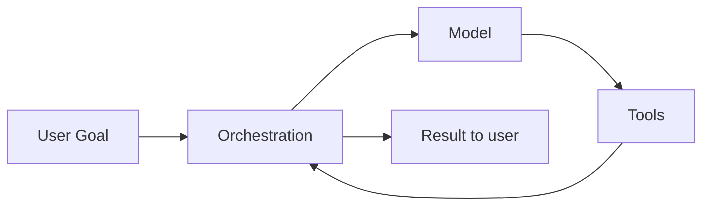
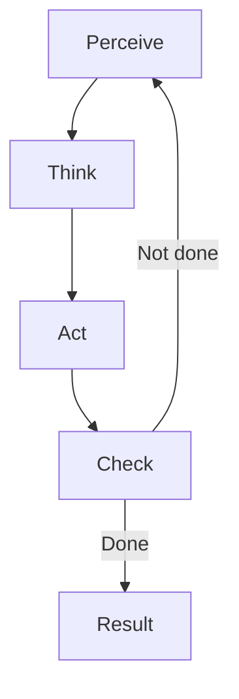

---
tags:
  - agent
  - architecture
type: note
status: evergreen
source: "Google Skills — Agent Fundamentals (Module 2–3) · OpenAI Agents Guide · Anthropic Tool Use Overview"
parent_note: "[[AI Agent Fundamentals - MOC]]"
---

# สถาปัตยกรรม Agent: Model + Tools + Orchestration


---

## Agent Equation

```
Agent = Model + Tools + Orchestration
```



ในเชิงสถาปัตย์ของโน้ตนี้ ใช้กรอบ `Model + Tools + Orchestration` เพื่ออธิบาย agent architecture ให้เห็นบทบาทของแต่ละส่วนอย่างชัดเจน

---

## Component 1: Model (การคิด)

Model คือ **centralized decision maker** ของ agent

หน้าที่หลัก 3 ด้าน:

### 1. Understanding intent
- รับ natural language แล้วแปลงเป็น goal ที่มีโครงสร้าง

### 2. Making decisions
- ในแต่ละ step ตัดสินใจว่า: ควรหา flight ก่อนหรือโรงแรมก่อน? ถามเพิ่มหรือใช้ default?

### 3. Learning from feedback
- เมื่อ tool ส่งผลกลับมา ตีความและปรับแผน เช่น:
  - flight แพงเกินไป → ลองเปลี่ยนวัน
  - API error → ลอง service อื่น
  - ไม่มีห้องว่าง → เปลี่ยนย่านหรือเวลา

---

## Component 2: Tools (การลงมือทำ)

ถ้า model คือสมอง **tools คือมือ** — ถ้าไม่มี tools แม้ model จะฉลาดก็แค่บอกว่าจะทำอะไร แต่ทำจริงไม่ได้

### ประเภทของ Tools

| ประเภท | ลักษณะ | เหมาะเมื่อ |
|---|---|---|
| Pre-built integrations | Integration สำเร็จรูป เช่น Google Flights, weather API | ต้องการความสะดวกและ agent แค่ระบุว่าต้องการอะไร |
| Custom functions | ใช้ application code ที่มีอยู่แล้วใน org | ต้องการ control สูง, มี human approval, reuse business logic |
| Information retrieval | เข้าถึง knowledge ที่อยู่นอก training data | เอกสารบริษัท, ประวัติลูกค้า, internal knowledge base |

**หลักคิด:** Agent ไม่จำเป็นต้อง "รู้ทุกอย่างล่วงหน้า" แต่ต้อง **"รู้วิธีไปหาให้เจอเมื่อจำเป็น"**

### Tool Chaining

จุดทรงพลังของ agent ไม่ใช่การเรียก tool เดียว แต่คือการ **chain** หลาย tool เข้าหากันเพื่อ goal ที่ใหญ่กว่า:

```
ดึง preference จาก DB → หาเที่ยวบิน (pre-built) → เตรียม booking request (custom fn) → Human approve → จอง
```

---

## Component 3: Orchestration (กระบวนการ)

Orchestration คือ layer ที่ควบคุมวัฏจักรการทำงาน — นี่คือสิ่งที่เรียกว่า **agent loop**

```
Perceive → Think → Act → Check → (loop back) → Result
```



ดูรายละเอียดวงจรได้ที่ [[05 - วงจร Perceive-Think-Act-Check]]

---

## ทำไมต้องมี 3 ส่วนพร้อมกัน

ถ้าไม่มี architecture ที่ชัดเจน ระบบจะลงเอยด้วย:
- if-then-else จำนวนมาก
- โค้ด branch ตามทุกกรณี
- maintenance ยาก
- เปราะเมื่อเจอ variation ใหม่

ตัวอย่าง: `Schedule a meeting with Sarah next week` ต้องจัดการ edge cases มากมาย เช่น Sarah ไม่ว่าง, ปฏิทินเต็ม, อีเมลส่งไม่สำเร็จ — ถ้าไม่มี unified architecture จะต้องเขียน flow แข็ง ๆ สำหรับทุก case

---

## ดูต่อ

- [[05 - วงจร Perceive-Think-Act-Check]]
- [[06 - วงจร Thought-Action-Observation (TAO)]]
- [[07 - รูปแบบ Agent Architectures]]

## ตัวอย่าง Implementation จริง

- [[03 Tools/Claude Code/Core/03 - Orchestrator Pattern|Orchestrator Pattern]] — Orchestration component ใน Claude Code: Main Agent (Orchestrator) สั่ง Subagents (Workers) ตาม architecture นี้
- [[03 Tools/Claude Code/Core/01 - Claude Code คืออะไร|Claude Code Tools]] — ตัวอย่าง Tools จริง: Read, Write, Edit, Bash, Grep, Glob
- [[06 Engineering/Architecture to Code/Architecture - Tool Schemas and Runtime Integration]] — runtime contract และ execution boundary ของ tool layer

## Official References

- OpenAI: Agents  
  https://platform.openai.com/docs/guides/agents
- Anthropic: Tool Use Overview  
  https://docs.anthropic.com/en/docs/agents-and-tools/tool-use/overview
- Hugging Face Agents Course: Introduction to Agents  
  https://huggingface.co/learn/agents-course/en/unit1/introduction
