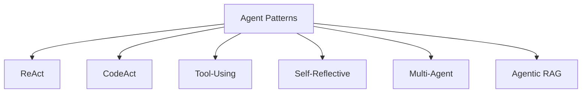

---
tags:
  - agent
  - architecture
  - patterns
type: note
status: evergreen
source: "Hugging Face Agents Course · OpenAI Agents Guide · Anthropic Tool Use Overview"
parent_note: "[[AI Agent Fundamentals - MOC]]"
---

# รูปแบบ Agent Architectures


---

## 6 รูปแบบ Agent ที่สำคัญ

รายการ 6 แบบด้านล่างเป็น working taxonomy ของโน้ตนี้ เพื่อช่วยจัดกลุ่ม pattern ที่พบบ่อย ไม่ใช่ canonical taxonomy ชุดเดียวจาก official source รายใดรายหนึ่ง



---

## 1. ReAct Agents

**ReAct = Reason + Act**

แนวคิด:
- Agent ไม่พยายามแก้ปัญหาทั้งก้อนในครั้งเดียว
- คิดทีละ step → ลงมือทำทีละ step → เรียนรู้จากผลลัพธ์ → คิดต่อ

เหมาะกับ:
- งานที่ต้องค้นข้อมูล ตัดสินใจ และปรับแผนระหว่างทาง

ข้อดี:
- เพิ่มความแม่นยำ
- เหมาะกับงานที่ซับซ้อน
- ทำให้ reasoning มีโครงสร้างมากขึ้น

> ดูกลไกการทำงาน รายละเอียด CoT vs ReAct และ Stop & Parse approach ได้ที่ [[06 - วงจร Thought-Action-Observation (TAO)]]

---

## 2. CodeAct Agents

Agent ที่ทำงานกับ code ได้แบบลงมือจริง (**Code Agent** ในคำศัพท์ของ HuggingFace):
- เขียน code → รัน code → เจอ error → แก้ไข → ปรับปรุงต่อจนใช้งานได้
- แทนที่จะ output JSON, Code Agent สร้าง **executable code block** (เช่น Python) เป็น action

เหมาะกับ:
- Coding automation
- Data analysis
- Creating small tools
- ช่วยคนที่ไม่ได้เขียนโปรแกรมเก่งมาก

> ⚠️ การ execute code จาก LLM มีความเสี่ยง (prompt injection, harmful code) — ดูรายละเอียดการ implement ที่ [[06 - วงจร Thought-Action-Observation (TAO)]]

---

## 3. Tool-Using Agents

Agent ที่เชื่อมต่อกับ external tools และใช้จริง:
- Web search, Calculators, Calendars, APIs, Databases

ความสำคัญ:
- ทำให้ agent ตรวจสอบข้อมูลจริงได้
- ลดการตอบจากความจำเพียงอย่างเดียว
- เพิ่มความน่าเชื่อถือของ output

---

## 4. Self-Reflective Agents

Agent ที่ประเมินงานของตัวเองหลังทำเสร็จ:

```
ทำงาน → หยุดประเมินผล → ถามตัวเองว่า "Did this work?" → ปรับถ้าจำเป็น
```

เหมาะกับ:
- งาน reasoning ที่ซับซ้อน
- งานเขียน
- งานแก้ปัญหา
- ยกระดับคุณภาพผลลัพธ์

---

## 5. Multi-Agent Workflows

ใช้หลาย agent ที่มีบทบาทเฉพาะทางมาทำงานร่วมกัน

**ตัวอย่างบทบาท:**
- Research agent
- Writing agent
- Fact-checking agent

ข้อดี:
- แบ่งงานตาม specialization
- เพิ่ม efficiency + accuracy
- เร่งความเร็วโดยรวม

> เหมือนมีทีมย่อยหลายคนที่เก่งคนละอย่างแล้วทำงานร่วมกัน

---

## 6. Agentic RAG

**RAG** = Retrieval-Augmented Generation — ดึงข้อมูลภายนอกก่อนแล้วค่อยสร้างคำตอบ

**Agentic RAG** คือ agent ที่ไม่ได้แค่ retrieve แต่ **ตัดสินใจเชิงกลยุทธ์เองได้ว่า:**
- จะค้นหาอะไร
- จะค้นจากแหล่งไหน
- จะเปรียบเทียบข้อมูลอย่างไร
- จะคัดกรองข้อมูลอย่างไร
- จะใช้ข้อมูลชิ้นไหนในการตอบ

เหมาะกับ:
- Legal help
- Medical info
- Enterprise use cases ที่ต้องการความน่าเชื่อถือสูง

---

## เลือก Pattern อย่างไร

| Pattern | ใช้เมื่อ |
|---|---|
| ReAct | งานที่ต้องค้นหาข้อมูลและตัดสินใจเป็น step |
| CodeAct | งาน automation ที่เกี่ยวกับ code |
| Tool-Using | งานที่ต้องดึงข้อมูลจริงจาก external system |
| Self-Reflective | งานที่ต้องการ quality check ตัวเอง |
| Multi-Agent | งานใหญ่ที่แบ่ง specialization ได้ชัด |
| Agentic RAG | งานที่ต้องใช้ข้อมูลเฉพาะ domain ที่น่าเชื่อถือ |

---

## ดูต่อ

- [[06 - วงจร Thought-Action-Observation (TAO)]] — Action types (JSON / Code / Function-calling) + Stop and Parse
- [[04 Synthesis/Decision/Synthesis - Workflow vs AI Agent|Workflow vs AI Agent]]
- [[05 Use Cases/Decision/Use Cases - When to Use an Agent|When to Use an Agent]]
- [[02 AI Systems/RAG/RAG - MOC|RAG - MOC]] — ต่อเส้นทาง Agentic RAG ไปยัง retrieval, chunking, และ RAG evaluation
- [[02 AI Systems/Agent Frameworks/Agent Frameworks - MOC|Agent Frameworks - MOC]] — ดูว่า pattern เหล่านี้ถูก implement ใน framework ต่าง ๆ อย่างไร
- [[06 Engineering/README]] — implementation layer สำหรับ pattern/recipe/decision ที่ลง code จริง

## ตัวอย่าง Implementation จริง

- [[03 Tools/Claude Code/Core/03 - Orchestrator Pattern|Orchestrator Pattern]] — Multi-Agent Workflows ใน Claude Code: Main Agent + Subagents หรือ Team Lead + Teammates
- [[03 Tools/Claude Code/Core/05 - รูปแบบการใช้งาน Multi-Agent|รูปแบบ Multi-Agent]] — Sequential (Subagents) และ Parallel (Agent Teams) patterns ในทางปฏิบัติ
- [[03 Tools/Claude Code/Core/21 - กรณีศึกษา|กรณีศึกษา]] — ตัวอย่าง code review parallel (Multi-Agent) และ JS→TS conversion sequential (Tool-Using)

## Harness Patterns ที่เสริม Agent Architectures

> เพิ่มจาก harness engineering sources (Anthropic, OpenAI, LangChain, Martin Fowler)

agent architecture patterns ข้างบนอธิบาย **วิธีที่ agent คิดและทำงาน** (ReAct, CodeAct, Multi-Agent ฯลฯ) แต่ในระบบ production ยังต้องมี **harness patterns** ที่ควบคุมว่า agent ทำงานได้ดีและต่อเนื่อง:

| Harness Pattern | เสริม Agent Pattern ไหน | หน้าที่ |
|---|---|---|
| Generator-Evaluator | Self-Reflective, Multi-Agent | แยก agent ที่ทำงานออกจาก agent ที่ตัดสิน |
| Ralph Loop | ReAct, CodeAct | บังคับให้ agent ทำต่อเมื่อพยายามหยุดก่อนเสร็จ |
| Decompose-Solve-Merge | Multi-Agent | แตกงานใหญ่เป็น subtasks แล้วรวมผล |
| Sprint Contract | Multi-Agent | negotiate "done" criteria ก่อน implement |
| Context Reset | ทุก pattern | ล้าง context เมื่อเสื่อม แล้ว handoff state |
| Speculative Execution | ทุก pattern | รัน multiple solutions ขนานกัน เลือก best |

→ ดูรายละเอียดที่ [[02 AI Systems/Agent Frameworks/Core/08 - Harness Patterns|Harness Patterns]]
→ ดู harness engineering concept ที่ [[02 AI Systems/AI Agent Fundamentals/Core/08 - Harness Engineering|Harness Engineering]]

## Official References

- OpenAI: Agents  
  https://platform.openai.com/docs/guides/agents
- Anthropic: Tool Use Overview  
  https://docs.anthropic.com/en/docs/agents-and-tools/tool-use/overview
- Hugging Face Agents Course: Introduction to Agents  
  https://huggingface.co/learn/agents-course/en/unit1/introduction
