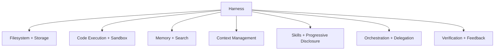

---
tags:
  - agent
  - harness
  - architecture
  - engineering
type: note
status: evergreen
source: "Anthropic Harness Design · OpenAI Harness Engineering · Martin Fowler Harness Engineering · LangChain Anatomy of Agent Harness · Philipp Schmid Agent Harness 2026"
parent_note: "[[AI Agent Fundamentals - MOC]]"
created: "2026-04-23"
updated: ""
---

# Harness Engineering

---

## Definition

**Agent = Model + Harness**

harness คือทุกสิ่งที่ไม่ใช่ model — code, configuration, execution logic ที่ทำให้ raw model กลายเป็น agent ที่ทำงานได้จริง

model เดี่ยว ๆ ทำได้แค่รับ input แล้ว output text ไม่สามารถ:
- เก็บ state ข้าม interactions
- execute code
- เข้าถึง realtime knowledge
- ตั้ง environment และ install packages

harness คือ machinery ที่ wrap model เพื่อให้ทำสิ่งเหล่านี้ได้

> "If you're not the model, you're the harness." — LangChain

---

## 3 Layers ของ AI Engineering

harness engineering เป็น layer ที่ 3 ที่วิวัฒนาการมาจาก prompt และ context engineering:

| Layer | โฟกัส | ขอบเขต |
|---|---|---|
| **Prompt Engineering** | คำสั่งที่ให้ model | single model call, stateless |
| **Context Engineering** | ข้อมูลรอบ ๆ model | single session, context window |
| **Harness Engineering** | ระบบรอบ ๆ model | multi-session, multi-agent, lifecycle |

prompt engineering ยังสำคัญ แต่เป็น input เข้า harness ไม่ใช่ทั้งระบบ
context engineering จัดการ context window ของ session เดียว
harness engineering จัดการ coordination ข้าม sessions, agents, และ lifecycle ทั้งหมด

---

## OS Analogy

Philipp Schmid เปรียบเทียบ harness กับ operating system:

| Component | เปรียบเทียบ |
|---|---|
| Model | CPU — raw processing power |
| Context Window | RAM — volatile working memory |
| Harness | OS — curate context, handle boot sequence, provide drivers |
| Agent | Application — user logic ที่รันบน OS |

harness implement "context engineering" strategies เช่น compaction, state offloading, sub-agent isolation เหมือน OS จัดการ memory, processes, I/O

---

## Harness Components

harness ประกอบจาก components หลายตัวที่ทำงานร่วมกัน:

| Component | หน้าที่ | ตัวอย่าง |
|---|---|---|
| **Filesystem + Storage** | durable storage, workspace, git versioning | อ่าน/เขียนไฟล์, track work ข้าม sessions |
| **Code Execution + Sandbox** | execute code safely, isolated environment | bash tool, Docker sandbox, network isolation |
| **Memory + Search** | continual learning, up-to-date knowledge | AGENTS.md/CLAUDE.md, web search, MCP tools |
| **Context Management** | จัดการ context rot, compaction | budget reduction, snip, auto-compact |
| **Skills + Progressive Disclosure** | ลด context pollution จาก tools มากเกิน | skill frontmatter, deferred tool schemas |
| **Orchestration + Delegation** | multi-agent coordination | subagent spawning, handoffs, sprint contracts |
| **Verification + Feedback** | self-correction, quality assurance | test runners, linters, evaluator agents |

→ ดูตัวอย่าง production implementation ที่ [[03 Tools/Claude Code/Core/01 - Claude Code คืออะไร|Claude Code]] ซึ่ง ~98.4% ของ code เป็น harness ไม่ใช่ decision logic

---

## ทำไม Harness ถึงสำคัญกว่า Model

เมื่อ model ชั้นนำมี capability ใกล้เคียงกันบน static benchmarks ความแตกต่างจริงอยู่ที่ **durability** — model ทำงานได้ดีแค่ไหนหลัง tool call ที่ 50 หรือ 100

OpenAI ทดลองสร้าง product ด้วย 0 lines of human-written code (~1M LOC ทั้งหมดเขียนโดย Codex agents) และพบว่า:
- ปัญหาหลักไม่ใช่ model capability แต่เป็น **environment ที่ underspecified**
- งานหลักของ engineers คือ **enabling agents to do useful work** ไม่ใช่เขียน code เอง
- "humans steer, agents execute"

> "The agent was not the hard part — the harness was." — OpenAI

---

## Harness กับ Framework

harness ไม่ใช่สิ่งเดียวกับ framework:

| | Framework | Harness |
|---|---|---|
| ระดับ | building blocks (tools, loops, state) | ระบบครบวงจร (prompt presets, lifecycle hooks, capabilities) |
| เปรียบเทียบ | library/SDK | operating system |
| ตัวอย่าง | LangGraph, AutoGen, CrewAI | Claude Code, Codex harness, custom production harness |

framework ให้ primitives สำหรับสร้าง harness
harness คือ opinionated system ที่ประกอบ primitives เข้าด้วยกันเพื่อ use case เฉพาะ

→ ดูเพิ่มที่ [[02 AI Systems/Agent Frameworks/Core/02 - Framework vs Custom Build|Framework vs Custom Build]]

---

## ความสัมพันธ์กับโน้ตอื่น

- [[02 AI Systems/AI Agent Fundamentals/Core/01 - AI Agent คืออะไร|AI Agent คืออะไร]] — agent definition ที่ harness เป็นส่วนประกอบ
- [[02 AI Systems/AI Agent Fundamentals/Core/07 - รูปแบบ Agent Architectures|Agent Architectures]] — patterns ที่ harness implement
- [[02 AI Systems/AI Agent Fundamentals/Core/09 - Guides vs Sensors|Guides vs Sensors]] — harness control taxonomy
- [[02 AI Systems/Agent Frameworks/Core/02 - Framework vs Custom Build|Framework vs Custom Build]] — framework vs harness distinction
- [[02 AI Systems/Agent Frameworks/Core/08 - Harness Patterns|Harness Patterns]] — specific patterns (Generator-Evaluator, Ralph Loop ฯลฯ)
- [[04 Synthesis/Bridge/Synthesis - Agent Runtime Layers|Agent Runtime Layers]] — harness ใน runtime stack
- [[03 Tools/Claude Code/Core/01 - Claude Code คืออะไร|Claude Code]] — production harness implementation
- [[03 Tools/Claude Code/Core/25 - Context Compaction Pipeline|Context Compaction Pipeline]] — harness component: context management
- [[03 Tools/Claude Code/Core/26 - Extensibility Mechanisms|Extensibility Mechanisms]] — harness component: extensibility
- [[01 Foundations/Context Windows/Context Windows - MOC|Context Windows]] — context ที่ harness จัดการ
- [[02 AI Systems/AI Agent Fundamentals/AI Agent Fundamentals - MOC|AI Agent Fundamentals - MOC]]

---

## References

- Anthropic - Harness design for long-running apps: https://www.anthropic.com/engineering/harness-design-long-running-apps
- OpenAI - Harness engineering: https://openai.com/index/harness-engineering/
- Martin Fowler - Harness engineering for coding agent users: https://martinfowler.com/articles/harness-engineering.html
- LangChain - The Anatomy of an Agent Harness: https://www.langchain.com/blog/the-anatomy-of-an-agent-harness
- Philipp Schmid - The importance of Agent Harness in 2026: https://www.philschmid.de/agent-harness-2026
