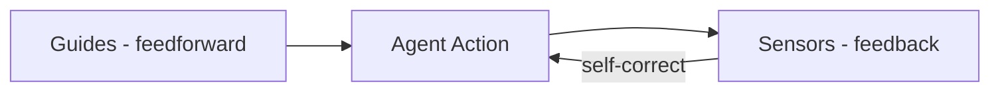

---
tags:
  - agent
  - harness
  - controls
  - feedforward
  - feedback
type: note
status: draft
source: "Martin Fowler - Harness engineering for coding agent users"
parent_note: "[[AI Agent Fundamentals - MOC]]"
created: "2026-04-23"
updated: ""
---

# Guides vs Sensors — Harness Control Taxonomy

> สรุปจาก Birgitta Böckeler บน martinfowler.com

---

## หลักการ

harness ที่ดีทำ 2 อย่าง:
1. **เพิ่มโอกาสที่ agent จะทำถูกตั้งแต่แรก**
2. **สร้าง feedback loop ให้ agent แก้ไขตัวเองก่อนถึงมือคน**

ถ้ามีแค่ feedback → agent ทำผิดซ้ำ ๆ แล้วค่อยแก้
ถ้ามีแค่ feedforward → agent มี rules แต่ไม่รู้ว่า rules ทำงานหรือเปล่า

---

## 2 ทิศทาง x 2 ประเภท

### Guides (Feedforward Controls)

คาดการณ์พฤติกรรมของ agent แล้ว **steer ก่อนที่มันจะทำ**

### Sensors (Feedback Controls)

สังเกตหลัง agent ทำแล้ว **ช่วยให้มัน self-correct**

ทั้ง guides และ sensors แบ่งเป็น 2 ประเภทตามวิธี execute:

| | Computational | Inferential |
|---|---|---|
| **ลักษณะ** | deterministic, fast, CPU | semantic, slower, GPU/NPU |
| **ตัวอย่าง Guides** | AGENTS.md, bootstrap scripts, OpenRewrite recipes | Skills, LLM-generated instructions |
| **ตัวอย่าง Sensors** | tests, linters, type checkers, ArchUnit | AI code review, LLM-as-judge |
| **ความน่าเชื่อถือ** | สูง (deterministic) | ปานกลาง (non-deterministic) |
| **ต้นทุน** | ต่ำ | สูงกว่า |

---

## Timing: Keep Quality Left

เหมือน CI/CD ที่ต้องกระจาย checks ตาม cost/speed/criticality:

| เมื่อไร | ทำอะไร | ตัวอย่าง |
|---|---|---|
| **ก่อน commit** | fast checks ที่รันได้เร็ว | linters, fast test suites, basic code review agent |
| **หลัง integration (CI)** | checks ที่แพงกว่า + ทำซ้ำ fast checks | mutation testing, broad code review |
| **Continuous (นอก change lifecycle)** | ตรวจ drift ที่สะสมทีละน้อย | dead code detection, dependency scanners, SLO monitoring |

---

## 3 Regulation Categories

harness ควบคุม codebase ใน 3 มิติ:

### 1. Maintainability Harness

ควบคุม internal code quality:
- computational sensors จับได้ดี: duplicate code, complexity, missing coverage, style violations
- inferential sensors จับได้บางส่วน: semantically duplicate code, brute-force fixes
- **ยังจับไม่ได้ดี**: misdiagnosis, overengineering, misunderstood instructions

### 2. Architecture Fitness Harness

ควบคุม architecture characteristics:
- skills ที่ feed forward performance requirements
- performance tests ที่ feed back ว่า improve หรือ degrade
- logging standards + debugging instructions

### 3. Behaviour Harness

ควบคุม functional correctness — **ยากที่สุด**:
- feedforward: functional specification (ระดับ detail ต่าง ๆ)
- feedback: AI-generated test suite + manual testing
- ปัญหา: ต้องเชื่อ AI-generated tests ซึ่งยังไม่ดีพอ

> "We still have a lot to do to figure out good harnesses for functional behaviour." — Martin Fowler

---

## Harnessability

ไม่ใช่ทุก codebase ที่ harness ได้ง่ายเท่ากัน:

| ปัจจัย | ช่วย harness | ขาดแล้วยาก |
|---|---|---|
| Strongly typed language | type-checking เป็น sensor ฟรี | ไม่มี type safety |
| Clear module boundaries | ArchUnit-style rules ได้ | boundaries ไม่ชัด |
| Framework abstractions | ลดสิ่งที่ agent ต้องกังวล | ต้องจัดการเอง |
| Greenfield | bake harnessability ตั้งแต่ต้น | — |
| Legacy + tech debt | — | harness จำเป็นที่สุดแต่สร้างยากที่สุด |

---

## Harness Templates

องค์กรที่มี service topologies ซ้ำ ๆ (API service, event processor, dashboard) อาจสร้าง **harness templates** — bundle ของ guides + sensors สำหรับ topology เฉพาะ

ปัญหาเดียวกับ service templates: เมื่อ instantiate แล้วจะ drift จาก upstream

---

## บทบาทของคน

> "A good harness should not necessarily aim to fully eliminate human input, but to direct it to where our input is most important." — Martin Fowler

คนมีสิ่งที่ agent ไม่มี:
- social accountability
- aesthetic judgment ("300-line function ไม่ดี")
- organizational memory ("เราไม่ทำแบบนี้ที่นี่")
- ความเข้าใจว่า convention ไหน load-bearing vs แค่ habit

harness พยายาม externalize สิ่งเหล่านี้ แต่ทำได้แค่บางส่วน

---

## ความสัมพันธ์กับโน้ตอื่น

- [[02 AI Systems/AI Agent Fundamentals/Core/08 - Harness Engineering|Harness Engineering]] — definition และ components ของ harness
- [[02 AI Systems/AI Agent Fundamentals/Core/07 - รูปแบบ Agent Architectures|Agent Architectures]] — patterns ที่ harness implement
- [[02 AI Systems/Guardrails/Guardrails - MOC|Guardrails]] — constraints/guardrails เป็น subset ของ guides
- [[02 AI Systems/Evals/Evals - MOC|Evals]] — evaluation เป็น sensor ประเภทหนึ่ง
- [[02 AI Systems/Evals/Core/09 - Observability and Feedback Loops|Observability]] — feedback loops เป็น sensor infrastructure
- [[03 Tools/Claude Code/Reference/09 - Permissions และ Settings|Permissions]] — permission system เป็น computational guide
- [[03 Tools/Claude Code/Core/25 - Context Compaction Pipeline|Context Compaction]] — compaction เป็น computational guide สำหรับ context management
- [[02 AI Systems/AI Agent Fundamentals/AI Agent Fundamentals - MOC|AI Agent Fundamentals - MOC]]

---

## References

- Martin Fowler - Harness engineering for coding agent users: https://martinfowler.com/articles/harness-engineering.html
