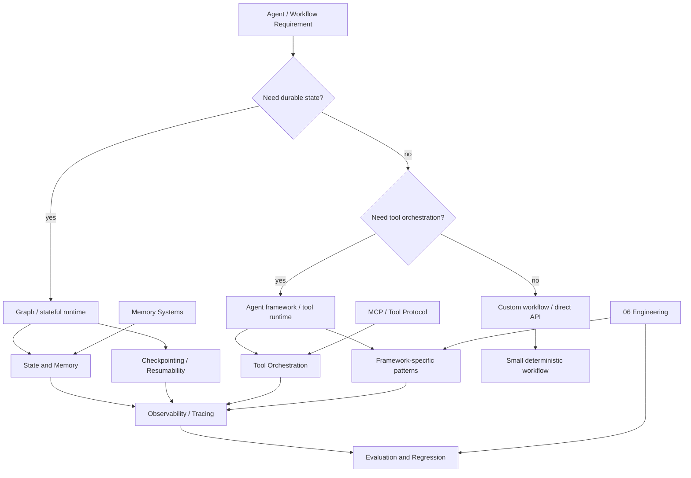

---
tags:
  - agents
  - frameworks
  - moc
type: moc
status: evergreen
source: ""
parent_note: "[[Home]]"
---

# Agent Frameworks - MOC

> โครงความรู้สำหรับ framework ที่ใช้สร้าง agents, workflows, และ orchestration systems

---

## ขอบเขต

หมวดนี้ใช้เปรียบเทียบ framework และแนวทาง implementation ของ agent systems เช่น orchestration, memory, tool use, graph execution, และ observability

หมวดนี้เป็น canonical home ของการเลือก framework และ framework-level tradeoffs  
รายละเอียด implementation เชิง tool/runtime จริงให้ดู `06 Engineering/Frameworks` แทน
เรื่อง memory architecture, taxonomy, และ policy ระดับเนื้อหาให้ดู `Memory Systems` เป็น canonical home แทน; หมวดนี้เก็บเฉพาะ state/memory ในมุมของ framework runtime
ถ้าเป็นเรื่อง architecture อธิบายระดับ concept ให้เก็บที่หมวดนี้; ถ้าเป็น code, recipe, หรือ framework-specific implementation ให้ไป `06 Engineering` แทน

กติกาการอ่าน:
- ไฟล์ที่มีเลข `01, 02, 03...` คือ core learning path
- ไฟล์ใน `06 Engineering/Frameworks/` คือ implementation notes และหัวข้อเฉพาะ framework

---

## Framework Selection Map

ภาพนี้ใช้เลือก framework จากความต้องการของระบบก่อน ไม่เริ่มจากชื่อ library ถ้าระบบต้องการ state, checkpoint, tool orchestration, observability, หรือ eval gates มากขึ้น น้ำหนักจะค่อย ๆ ขยับจาก custom workflow ไปสู่ framework/runtime ที่ชัดเจนกว่า.

---

## แผนที่โน้ต

- [[02 AI Systems/Agent Frameworks/Core/01 - Landscape|ภาพรวมของ landscape]]
- [[02 AI Systems/Agent Frameworks/Core/02 - Framework vs Custom Build|Framework เทียบกับ custom build]]
- [[02 AI Systems/Agent Frameworks/Core/03 - State and Memory|การจัดการ state และ memory]]
- [[02 AI Systems/Agent Frameworks/Core/04 - Tool Orchestration|การ orchestration ของ tools]]
- [[06 Engineering/Frameworks/Framework - OpenAI Agents and Responses Patterns|รูปแบบ OpenAI agents และ Responses]]
- [[02 AI Systems/Agent Frameworks/Core/06 - Evaluation and Observability|การประเมินผลและ observability]]
- [[02 AI Systems/Agent Frameworks/Core/07 - Checkpointing and Resumability|Checkpointing และ resumability]]
- [[02 AI Systems/Agent Frameworks/Core/08 - Harness Patterns|Harness Patterns]]
- [[06 Engineering/Frameworks/Framework - LangGraph|LangGraph]]
- [[06 Engineering/Frameworks/Framework - LangChain Agents|LangChain agents]]
- [[06 Engineering/Frameworks/Framework - AutoGen vs CrewAI|AutoGen / CrewAI]]

---

## โน้ตที่เกี่ยวข้อง

- [[02 AI Systems/AI Agent Fundamentals/Core/04 - สถาปัตยกรรม Agent_ Model + Tools + Orchestration]]
- [[02 AI Systems/AI Agent Fundamentals/Core/07 - รูปแบบ Agent Architectures]]
- [[02 AI Systems/MCP/Bridge/14 - Tools_ การออกแบบและทำงาน]]
- [[02 AI Systems/MCP/MCP - MOC]]
- [[03 Tools/Claude Code/Claude Code - Multi-Agent MOC]]
- [[04 Synthesis/Bridge/Synthesis - LLM to Agent Stack]]
- [[04 Synthesis/Bridge/Synthesis - Memory in Agents]]
- [[06 Engineering/Decisions/Decision - Choose a Framework]]
- [[06 Engineering/README]]

---

## เส้นทางการอ่าน

### 1. พื้นฐานก่อน Frameworks

1. [[02 AI Systems/AI Agent Fundamentals/Core/04 - สถาปัตยกรรม Agent_ Model + Tools + Orchestration]]
2. [[02 AI Systems/AI Agent Fundamentals/Core/07 - รูปแบบ Agent Architectures]]
3. [[02 AI Systems/MCP/Bridge/14 - Tools_ การออกแบบและทำงาน]]

### 2. แนวคิดหลักของ Framework

1. [[02 AI Systems/Agent Frameworks/Core/01 - Landscape]]
2. [[02 AI Systems/Agent Frameworks/Core/02 - Framework vs Custom Build]]
3. [[02 AI Systems/Agent Frameworks/Core/03 - State and Memory]]
4. [[02 AI Systems/Agent Frameworks/Core/04 - Tool Orchestration]]
5. [[06 Engineering/Frameworks/Framework - OpenAI Agents and Responses Patterns]]
6. [[02 AI Systems/Agent Frameworks/Core/06 - Evaluation and Observability]]
7. [[02 AI Systems/Agent Frameworks/Core/07 - Checkpointing and Resumability]]
8. [[02 AI Systems/Agent Frameworks/Core/08 - Harness Patterns]]

### 3. ลิงก์ข้ามระบบ

1. [[02 AI Systems/MCP/MCP - MOC]]
2. [[04 Synthesis/Bridge/Synthesis - Memory in Agents]]
3. [[05 Use Cases/Decision/Use Cases - Choose an Agent Framework]]
4. [[04 Synthesis/Bridge/Synthesis - LLM to Agent Stack]]

### 4. โน้ตเชิง Implementation

1. [[06 Engineering/Frameworks/Framework - LangGraph]]
2. [[06 Engineering/Frameworks/Framework - LangChain Agents]]
3. [[06 Engineering/Frameworks/Framework - AutoGen vs CrewAI]]

---

## โน้ตที่ควรสร้างต่อ

- [[Knowledge Topic Registry]]
