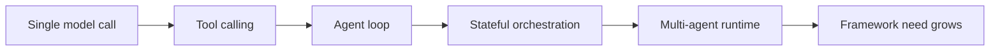
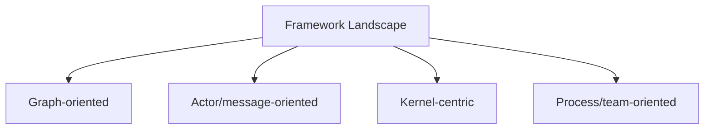

---
tags:
  - agents
  - frameworks
  - landscape
type: note
status: evergreen
source: "LangGraph Docs · AutoGen Docs · Semantic Kernel Agent Framework Docs · CrewAI Concepts Docs · llm-engineer-toolkit (KalyanKS-NLP)"
parent_note: "[[Agent Frameworks - MOC]]"
---

# Agent Frameworks - Landscape

## ภาพรวม

framework ต่างกันที่ abstraction, runtime model, state model, orchestration style, observability, และความยืดหยุ่นในการเชื่อม tools

---

## ขอบเขต

- ทำไมต้องใช้ framework
- framework vs custom build
- selection criteria
- common architecture patterns

---

## ทำไม agent frameworks ถึงเกิดขึ้น

เมื่อระบบ agent โตเกิน prompt + tool call ธรรมดา จะเริ่มมีปัญหาเรื่อง:
- orchestration
- state persistence
- multi-step execution
- human-in-the-loop
- observability
- retries and recovery

frameworks จึงยกระดับจาก “เรียก model เป็นครั้ง ๆ” ไปสู่ runtime สำหรับ agent systems

---

## แกนที่ใช้มอง landscape ของ framework

### 1. ระดับ abstraction

framework บางตัวอยู่ระดับ low-level orchestration primitives
บางตัวอยู่ระดับ high-level workflows หรือ ready-made agent teams

คำถามสำคัญ:
- ต้องการ control มากแค่ไหน
- ต้องการ build custom runtime หรือแค่ prototype เร็ว

### 2. รูปแบบ runtime

บาง framework เป็น graph runtime
บาง framework เป็น actor/message runtime
บาง framework เป็น process/task orchestration model

นี่มีผลต่อ:
- composability
- resumability
- debugability
- scaling

### 3. โมเดล state และ memory

framework ต่างกันมากตรง:
- เก็บ transient state ยังไง
- persist execution ยังไง
- รองรับ checkpoint หรือไม่
- เชื่อม long-term memory ยังไง

### 4. โมเดลของ tools และ integration

ดูว่า framework:
- มอง tools เป็น first-class citizens หรือไม่
- รองรับ plugins / MCP / external APIs อย่างไร
- คุม permission boundaries ได้แค่ไหน

### 5. Observability และการควบคุม

ดูว่า framework:
- trace execution ได้ไหม
- debug step-by-step ได้ไหม
- interrupt / resume / approve ได้ไหม

---

## รูปแบบสถาปัตยกรรมที่พบใน landscape

### แบบ Graph-Oriented

เช่น LangGraph
เหมาะกับระบบที่ต้องการ:
- explicit nodes and edges
- branching
- checkpoints
- long-running stateful flows

### แบบ Actor / Message-Oriented

เช่น AutoGen Core
เหมาะกับ:
- distributed systems
- event-driven communication
- multi-agent messaging
- runtime-level scaling

### แบบ Middleware / Kernel-Centric

เช่น Semantic Kernel
เหมาะกับ:
- plugin-centric integration
- enterprise service composition
- model/tool abstraction in one central kernel

### แบบ Process / Team-Oriented

เช่น CrewAI
เหมาะกับ:
- task delegation
- sequential or hierarchical processes
- explicit crew/task structures

---

## กลุ่ม framework ที่ใช้จริง

### LangGraph

official docs ระบุว่าเป็น low-level orchestration framework สำหรับ controllable agents และเน้น persistence, human-in-the-loop, และ customizable architectures

### AutoGen

official docs ระบุ Core ว่าเป็น event-driven, distributed, scalable agent framework และ AgentChat เป็นชั้นที่ง่ายขึ้นสำหรับ conversational single/multi-agent apps

### Semantic Kernel

Microsoft docs วางตำแหน่ง Semantic Kernel เป็น lightweight development kit / middleware ที่มี kernel เป็นศูนย์กลางของ services และ plugins

### CrewAI

official docs วางจุดเด่นที่ processes เช่น sequential และ hierarchical process สำหรับ crew/task orchestration

---

## เลือก framework จากอะไร

ควรถามก่อนว่า use case ต้องการอะไร:

### ถ้าต้องการ explicit control สูง

มักเอนไปทาง graph or low-level runtime

### ถ้าต้องการ distributed multi-agent messaging

มักเอนไปทาง actor/message runtime

### ถ้าต้องการ enterprise integration and plugins

มักเอนไปทาง kernel-centric middleware

### ถ้าต้องการ task orchestration เข้าใจง่าย

มักเอนไปทาง process/team-oriented frameworks

---

## สิ่งที่ framework ไม่ได้แก้ให้เอง

แม้ใช้ framework แล้ว ยังต้องออกแบบเองเรื่อง:
- evaluation
- guardrails
- permission boundaries
- memory write policies
- tool semantics
- source grounding

framework ช่วยเรื่อง orchestration แต่ไม่ได้แทน system design

---

## Failure Modes

### 1. เลือกจากความนิยมอย่างเดียว

เลือก framework จากกระแส ไม่ใช่ runtime needs

### 2. ยึดติดกับ abstraction ของ framework เกินไป

พยายามบีบ problem ทุกแบบให้เข้ากับ abstraction เดียว

### 3. สับสน framework กับ architecture

คิดว่าใช้ framework แล้ว architecture ดีโดยอัตโนมัติ

### 4. มองข้ามความต้องการเชิงปฏิบัติการ

เลือก framework โดยไม่ดู traceability, resumability, approval flow

---

## หลักออกแบบ

- เริ่มจาก runtime needs ก่อนชื่อ framework
- แยก orchestration concern ออกจาก model/tool concern
- มอง framework เป็น biasing layer ไม่ใช่ architecture สำเร็จรูป
- ถ้างานต้องการ control สูง ให้เลือก framework ที่ abstraction ต่ำพอ
- ถ้างานยังเล็ก อย่ารีบแบก framework หนักเกินความจำเป็น

---

## ความสัมพันธ์กับโน้ตอื่น

- [[02 AI Systems/Agent Frameworks/Core/02 - Framework vs Custom Build]]
- [[02 AI Systems/Agent Frameworks/Core/03 - State and Memory]]
- [[02 AI Systems/AI Agent Fundamentals/Core/04 - สถาปัตยกรรม Agent: Model + Tools + Orchestration]]
- [[02 AI Systems/Evals/Core/09 - Observability and Feedback Loops]]
- [[Agent Frameworks - MOC]]

---

## โน้ตที่เกี่ยวข้อง

- [[02 AI Systems/Agent Frameworks/Core/02 - Framework vs Custom Build]]
- [[02 AI Systems/Evals/Core/09 - Observability and Feedback Loops]]
- [[Agent Frameworks - MOC]]
- [[06 Engineering/Decisions/Decision - Choose a Framework]]

---

## แหล่งอ้างอิงทางการ

- LangGraph Overview: https://langchain-ai.github.io/langgraphjs/reference/modules/langgraph.html

---

## Extended Landscape: Agent Libraries

> section นี้เสริมจาก llm-engineer-toolkit (KalyanKS-NLP) — เป็น catalog reference สำหรับ libraries ที่อยู่ใน agent/orchestration space

นอกจาก 4 frameworks หลักข้างบน ยังมี libraries อื่นที่น่าสนใจในแต่ละ architecture pattern:

### Agent Frameworks เพิ่มเติม

| Library | แนวทาง | จุดเด่น |
|---|---|---|
| **Agno** (เดิมชื่อ Phidata) | full-featured agent framework | memory, knowledge, tools, reasoning, Agent UI |
| **OpenAI Agents SDK** | official OpenAI agent framework | context, tools, handoffs ระหว่าง specialized agents |
| **Smolagents** (HuggingFace) | lightweight agent library | สร้าง agents ด้วย code น้อยบรรทัด |
| **PydanticAI** | type-safe agent framework | production-grade, Pydantic-based validation |
| **CAMEL** | multi-agent framework | role-playing, toolkits หลากหลาย |
| **BeeAI** | production multi-agent | IBM-backed, production-ready |

### Orchestration และ Coordination

| Library | แนวทาง | จุดเด่น |
|---|---|---|
| **Swarms** | enterprise multi-agent orchestration | production-ready swarm patterns |
| **Swarm** (OpenAI) | educational multi-agent | lightweight, ergonomic orchestration patterns |
| **Langroid** | multi-agent framework | agent-as-message-transformer paradigm |
| **AgentStack** | agent scaffolding | fastest way to build robust agents |

### Agent Infrastructure

| Library | แนวทาง | จุดเด่น |
|---|---|---|
| **Composio** | tool integration platform | production-ready toolset สำหรับ agents |
| **Browser Use** | web automation for agents | ทำให้ websites accessible สำหรับ AI agents |
| **Archgw** | intelligent gateway | gateway layer สำหรับ agents |
| **AgentOps** | agent monitoring SDK | observability สำหรับ AI agents |

### Memory Libraries

| Library | แนวทาง | จุดเด่น |
|---|---|---|
| **mem0** | memory layer for AI apps | short/long-term memory API |
| **Letta (MemGPT)** | stateful LLM framework | advanced reasoning + transparent long-term memory |
| **Memoripy** | AI memory with clustering | semantic clustering + optional memory decay |

> หมายเหตุ: ตารางนี้เป็น landscape reference ไม่ใช่ recommendation — การเลือก framework ควรเริ่มจาก runtime needs ตามหลักการใน section ข้างบน ไม่ใช่จากชื่อ library
> ดูเพิ่มที่ [[05 Use Cases/Decision/Use Cases - Choose an Agent Framework|Choose an Agent Framework]] สำหรับ decision framework
