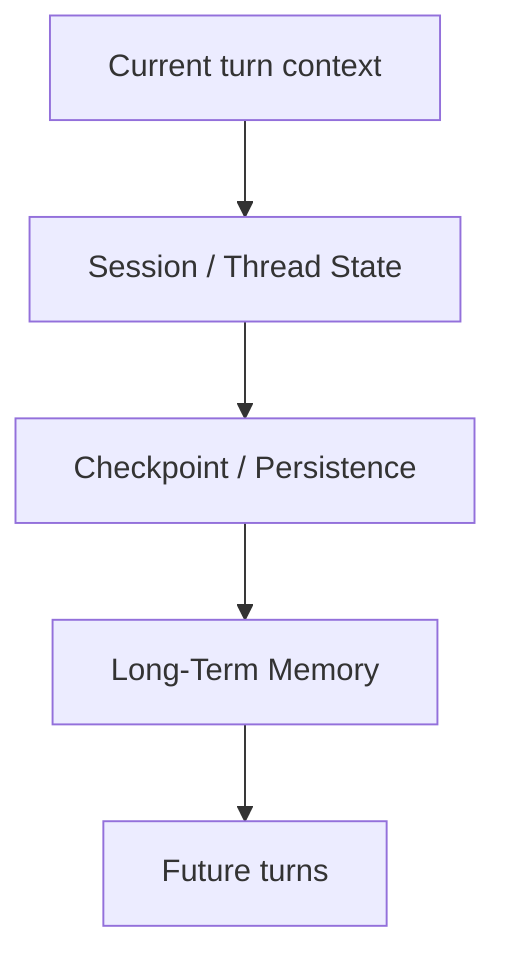

---
tags:
  - agents
  - frameworks
  - state
  - memory
type: note
status: draft
source: "LangGraph Persistence Docs · Google ADK Sessions and Memory Docs · AutoGen Core Docs · Semantic Kernel Agent Framework Docs"
parent_note: "[[Agent Frameworks - MOC]]"
---

# Agent Frameworks - State and Memory

## Summary

framework แตกต่างกันมากตรงวิธีเก็บ state, resume execution, checkpoint, และ external memory integration ซึ่งมีผลโดยตรงต่อความสามารถในการทำ long-running workflows, approvals, retries, และ personalization

---

## Scope

- transient state
- persistent state
- checkpointing
- resumability
- memory interfaces

---

## ทำไม state and memory เป็นแกนสำคัญ

agent systems ที่ซับซ้อนแทบทุกระบบต้องตอบคำถาม 5 ข้อ:
- state ตอนนี้อยู่ที่ไหน
- state นี้อยู่ได้แค่ turn เดียวหรือข้าม thread ได้
- resume จากจุดเดิมได้ไหม
- memory ระยะยาวเชื่อมเข้ามายังไง
- ใครเป็นคนควบคุม lifecycle ของ state

frameworks จึงต่างกันมากตรงนี้ เพราะ state model คือหัวใจของ runtime

---

## แยก State ออกจาก Memory ก่อน

ในกรอบของ vault นี้:

- `working memory` = current context
- `session state` = ข้อมูลที่ต้องคงอยู่ใน thread/runtime เดิม
- `long-term memory` = persistent recallable knowledge ข้าม sessions

framework หลายตัวรองรับสองอย่างแรกชัดเจน แต่ long-term memory มักต้อง integrate เพิ่ม

Google ADK แยก `Session`, `State`, และ `Memory` อย่างชัดเจน  
LangGraph docs เน้น persistence และ cross-thread memory/store  
AutoGen docs เน้น stateful agents และ runtime/message lifecycles  
Semantic Kernel วาง kernel เป็นศูนย์กลางของ services/plugins ที่ agent ใช้เข้าถึง stateful capabilities

---

## Transient State

transient state คือ state ที่มีค่าเฉพาะระหว่าง execution ปัจจุบัน เช่น:
- current plan step
- intermediate tool outputs
- local variables
- temporary reasoning artifacts

สิ่งนี้มักไม่ควรถูกเก็บเป็น long-term memory

framework ที่ดีต้องทำให้ transient state:
- เข้าถึงง่าย
- reset ได้
- debug ได้

---

## Persistent State

persistent state คือข้อมูลที่ยังต้องมีอยู่แม้ execution จะข้าม turn หรือข้าม process boundary

ตัวอย่าง:
- thread history
- workflow state
- pending tasks
- approval status
- partially completed execution

LangGraph docs เน้น persistence สำหรับ long-running workflows  
AutoGen Core เน้น runtime/lifecycle/message-driven execution  
นี่ชี้ว่าพอระบบยาวขึ้น state layer จะกลายเป็น requirement ไม่ใช่ optional extra

---

## Checkpointing และ Resumability

checkpointing และ resumability เป็นหัวข้อสำคัญมากพอที่จะดูแยกเฉพาะ  
ถ้าต้องการดูเรื่องนี้แบบเต็ม ให้ดู [[07 - Checkpointing and Resumability]]

---

## State Models ที่พบบ่อย

### Thread-Centric State

state ผูกกับ conversation thread หรือ session

เหมาะกับ:
- assistants
- support flows
- in-thread planning

### Graph / Node State

state ผูกกับ graph execution และ transitions

เหมาะกับ:
- branching workflows
- stepwise orchestration
- explicit execution control

### Actor / Message State

state กระจายตาม agents และ messages

เหมาะกับ:
- distributed systems
- asynchronous messaging
- multi-agent communication

### Kernel / Middleware State

state ถูกเข้าถึงผ่าน central kernel/services/plugins

เหมาะกับ:
- enterprise integrations
- plugin-rich architectures

---

## Memory Interfaces ใน Frameworks

framework ต่างกันตรงว่ามอง memory เป็นอะไร:

### Built-in Persistence Primitive

เช่น thread/store/checkpoint abstraction

### External Store Integration

framework เปิด interface ให้เชื่อม vector store, DB, profile store, หรือ custom memory service

### Memory as Service

บาง framework หรือ ecosystem แยก memory ออกเป็น service layer ชัด

> Design rule: framework ที่ดีไม่จำเป็นต้อง “มี memory ครบทุกแบบ” แต่ควรมี interface ที่ทำให้ memory integration ไม่เป็น afterthought

---

## State and Memory Tradeoffs

### More Persistent State

ข้อดี:
- resume ได้ดี
- continuity สูง
- richer workflows

ข้อเสีย:
- complexity สูง
- debugging ยากขึ้น
- storage and privacy burden เพิ่ม

### More External Memory

ข้อดี:
- personalization
- long-term continuity

ข้อเสีย:
- retrieval complexity
- stale memory risk
- scope and retention challenges

### Less State

ข้อดี:
- simpler
- easier to reason about

ข้อเสีย:
- limited workflow sophistication

---

## Choosing a Framework from State Needs

### ถ้าต้องการ long-running, controllable execution

ให้มอง framework ที่มี persistence/checkpoint model ชัด

### ถ้าต้องการ distributed multi-agent messaging

ให้มอง runtime/message model ก่อน UI abstraction

### ถ้าต้องการ plugin-centric enterprise integration

ให้มอง kernel/service-centric model

### ถ้าต้องการ simple task orchestration

อาจไม่ต้องใช้ heavy state model ตั้งแต่แรก

---

## Failure Modes

### 1. Confuse Session State with Long-Term Memory

คิดว่า thread persistence = memory architecture ครบแล้ว

### 2. No Checkpoints for Long Tasks

workflow ยาวแต่ restart ทุกครั้งเมื่อหลุด

### 3. Over-Persist Everything

persist state ทุกอย่างจน debug และ privacy ยาก

### 4. Hidden State

framework จัดการ state ให้หมดจนทีมไม่เห็น execution semantics จริง

### 5. No Memory Interface

framework ใช้งานได้ใน demo แต่ต่อ long-term memory หรือ external store ยากมาก

---

## Design Rules

- แยก working context, session state, และ long-term memory ให้ชัด
- เลือก framework จาก state requirements ไม่ใช่แค่ popularity
- ถ้างานต้อง pause/resume ได้ ให้คิด checkpointing ตั้งแต่ต้น
- อย่า persist ทุกอย่างโดยไม่มี lifecycle policy
- memory integration ควรถูกมองเป็น interface problem ไม่ใช่ prompt trick

---

## ความสัมพันธ์กับโน้ตอื่น

- [[02 AI Systems/Memory Systems/Core/01 - Working Memory vs Long-Term Memory]] — memory layers หลัก
- [[02 AI Systems/Memory Systems/Application/04 - Agent Memory Patterns]] — รูปแบบการประกอบ memory ใน runtime
- [[02 AI Systems/Agent Frameworks/Core/01 - Landscape]] — landscape ของ runtime models
- [[02 AI Systems/Agent Frameworks/Core/02 - Framework vs Custom Build]] — tradeoffs ด้าน state complexity
- [[02 AI Systems/Agent Frameworks/Core/07 - Checkpointing and Resumability]] — execution continuity และ recovery
- [[02 AI Systems/Evals/Core/09 - Observability and Feedback Loops]] — stateful systems ต้อง trace ได้
- [[Agent Frameworks - MOC]]

---

## Related Notes

- [[04 Synthesis/Synthesis - Memory in Agents]]
- [[02 AI Systems/Memory Systems/Memory Systems - MOC]]
- [[07 - Checkpointing and Resumability]]
- [[Agent Frameworks - MOC]]

---

## Official References

- LangGraph Overview: https://langchain-ai.github.io/langgraphjs/reference/modules/langgraph.html
- LangGraph Cross-thread Persistence: https://langchain-ai.github.io/langgraphjs/how-tos/cross-thread-persistence-functional/
- AutoGen Core: https://microsoft.github.io/autogen/stable/user-guide/core-user-guide/index.html
- AutoGen Agents: https://microsoft.github.io/autogen/stable/user-guide/agentchat-user-guide/tutorial/agents.html
- Google ADK Sessions: https://google.github.io/adk-docs/sessions/session/
- Google ADK Memory: https://google.github.io/adk-docs/sessions/memory/
- Semantic Kernel Agent Framework: https://learn.microsoft.com/en-us/semantic-kernel/frameworks/agent/
