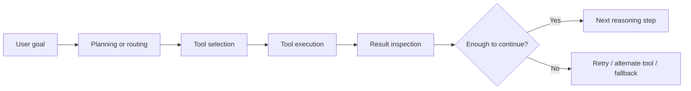
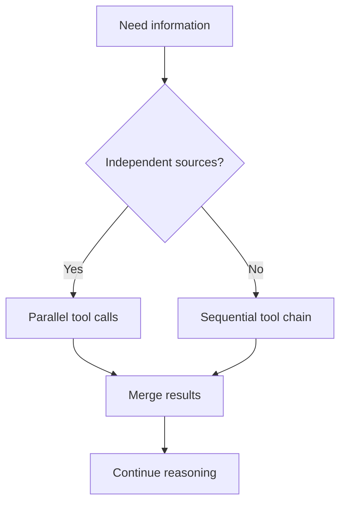

---
tags:
  - agents
  - frameworks
  - tools
  - orchestration
type: note
status: draft
source: "LangGraph Docs · AutoGen Docs · Semantic Kernel Docs · OpenAI Tools Docs"
parent_note: "[[Agent Frameworks - MOC]]"
---

# Agent Frameworks - Tool Orchestration

## ภาพรวม

tool orchestration คือชั้นที่คุมว่า agent จะเลือก, เรียก, ลำดับ, ตรวจผล, และสลับระหว่าง tools อย่างไร มันคือจุดตัดระหว่าง reasoning, execution, guardrails, และ state management ของ framework

---

## ขอบเขต

- tool selection
- execution sequencing
- parallel vs sequential calls
- retries and recovery
- tool results in agent loops

---

## ทำไม tool orchestration ถึงสำคัญ

การมี tools เฉย ๆ ยังไม่พอ สิ่งที่ยากจริงคือ:
- จะเรียก tool ไหนก่อน
- จะเรียกหลายตัวพร้อมกันหรือไม่
- จะใช้ผลจาก tool ก่อนหน้าอย่างไร
- ถ้า tool fail ควร retry, fallback, หรือเปลี่ยนแผน

ดังนั้น framework ต่างกันไม่ใช่แค่ “รองรับ tools ไหม” แต่ต่างกันที่ orchestration model ของ tools

---

## แกนของ Tool Orchestration

### 1. การเลือก tool

ระบบต้องตัดสินใจว่า tool ไหนเหมาะกับ task นี้

รูปแบบที่พบบ่อย:
- model chooses tool directly
- framework routes by policy
- developer defines deterministic step order

### 2. ลำดับการ execute

tools บางตัวต้องเรียกก่อน-หลังกัน เช่น:
- search -> retrieve -> summarize
- inspect -> propose -> mutate

framework ที่ดีต้อง represent sequencing ได้ชัด

### 3. การจัดการผลลัพธ์

tool result ไม่ใช่แค่ data แต่เป็น input ให้ reasoning รอบถัดไป

ดังนั้นต้องตอบว่า:
- จะ inject result เข้าบริบทอย่างไร
- จะ trust result มากแค่ไหน
- จะ screen result หรือไม่

### 4. การ recover และควบคุม

เมื่อ tool fail ระบบต้องมี path เช่น:
- retry
- fallback tool
- ask user
- abort

---

## รูปแบบของ orchestration

### Deterministic orchestration

step order ถูกกำหนดไว้ล่วงหน้า

เหมาะกับ:
- reliable workflows
- regulated paths
- low-ambiguity tasks

ข้อดี:
- predictable
- debug ง่าย

ข้อเสีย:
- flexible น้อย

### Model-led orchestration

model เลือก tools และลำดับเองมากขึ้น

เหมาะกับ:
- open-ended tasks
- exploratory workflows

ข้อดี:
- flexible สูง

ข้อเสีย:
- harder to debug
- ต้องมี guardrails มากขึ้น

### Hybrid orchestration

framework หรือ developer คุมกรอบใหญ่ ส่วน model ตัดสินใจในบางจุด

มักเป็นแนวทางที่ practical สุดสำหรับ production

---

## การใช้ tool แบบลำดับและแบบขนาน

### แบบลำดับ

เรียกทีละตัวตาม dependency chain

เหมาะกับ:
- tasks ที่ผลลัพธ์ขึ้นต่อกัน
- inspection before action

### แบบขนาน

เรียกหลาย tools พร้อมกันเพื่อลด latency หรือ gather evidence หลายแหล่ง

เหมาะกับ:
- independent lookups
- multi-source retrieval

tradeoff:
- parallelism ช่วย latency
- แต่เพิ่ม result-merging complexity

---

## Tool Orchestration กับชนิดของ framework

### แบบ Graph-Oriented

เหมาะกับ:
- explicit tool chains
- branching logic
- checkpointed execution

### แบบ Actor / Message-Oriented

เหมาะกับ:
- delegated tool use
- multi-agent coordination
- asynchronous orchestration

### แบบ Kernel / Middleware-Centric

เหมาะกับ:
- tool abstraction ผ่าน services/plugins
- enterprise integration

### แบบ Process / Team-Oriented

เหมาะกับ:
- role-based tool usage
- task delegation pipelines

---

## สิ่งที่ต้องตัดสินใจในระบบจริง

- tool selection model อยู่ที่ model หรือ policy layer
- tool outputs ต้องผ่าน validation หรือไม่
- อะไรคือ stopping condition
- จะใช้ retries แบบไหน
- tools ไหนเรียกได้แบบ autonomous
- tools ไหนต้อง confirmation

นี่ทำให้ tool orchestration เชื่อมกับ:
- guardrails
- permissions
- observability
- evals

---

## Failure Modes

### 1. orchestration ถูกซ่อนไว้ใน prompt

ลำดับการใช้ tools ถูกฝังใน prompt อย่างเดียวจน trace ยาก

### 2. ไม่แยก planning ออกจาก acting

model วางแผนและ execute ทันทีโดยไม่มี control point

### 3. มองไม่เห็นผลลัพธ์ของ tool

รับผลจาก tool มาใช้ต่อโดยไม่ validate หรือ inspect

### 4. tool ที่อัตโนมัติเกินไป

เปิดให้ model ตัดสินใจทุกอย่างเองโดยไม่มี guardrails

### 5. ไม่มีทาง recover

tool fail แล้ว runtime ไม่มี retry/fallback strategy

---

## หลักออกแบบ

- แยก tool selection, execution, และ result handling ออกจากกันใน mental model
- sequential vs parallel ควรตัดสินใจจาก dependency structure ไม่ใช่ความสะดวก
- tool outputs ต้องถูกมองเป็น runtime input รอบถัดไป ไม่ใช่ ground truth อัตโนมัติ
- high-impact tools ควรมี orchestration checkpoints
- เลือก framework จาก orchestration needs จริง ไม่ใช่จากชื่อ tool integrations

---

## ความสัมพันธ์กับโน้ตอื่น

- [[02 AI Systems/AI Agent Fundamentals/14 - Tools: การออกแบบและทำงาน]] — ความเข้าใจพื้นฐานของ tools
- [[02 AI Systems/Guardrails/Core/03 - Tool Safety]] — orchestration ที่ดีต้องอยู่ในขอบเขตความปลอดภัย
- [[02 AI Systems/Guardrails/Core/05 - Fallback Policies]] — recovery paths เมื่อ tool fail
- [[02 AI Systems/Agent Frameworks/Core/01 - Landscape]] — framework families ต่างกันที่ orchestration model
- [[02 AI Systems/MCP/MCP - MOC]] — MCP เป็น integration surface ของ tools หลายแบบ
- [[Agent Frameworks - MOC]]

---

## โน้ตที่เกี่ยวข้อง

- [[02 AI Systems/AI Agent Fundamentals/14 - Tools: การออกแบบและทำงาน]]
- [[02 AI Systems/Guardrails/Core/03 - Tool Safety]]
- [[Agent Frameworks - MOC]]

---

## แหล่งอ้างอิงทางการ

- OpenAI - Using Tools: https://platform.openai.com/docs/guides/tools
- OpenAI - Function Calling: https://platform.openai.com/docs/guides/function-calling
- LangGraph Overview: https://langchain-ai.github.io/langgraphjs/reference/modules/langgraph.html
- AutoGen Core: https://microsoft.github.io/autogen/stable/user-guide/core-user-guide/index.html
- Semantic Kernel Overview: https://learn.microsoft.com/en-us/semantic-kernel/overview/
