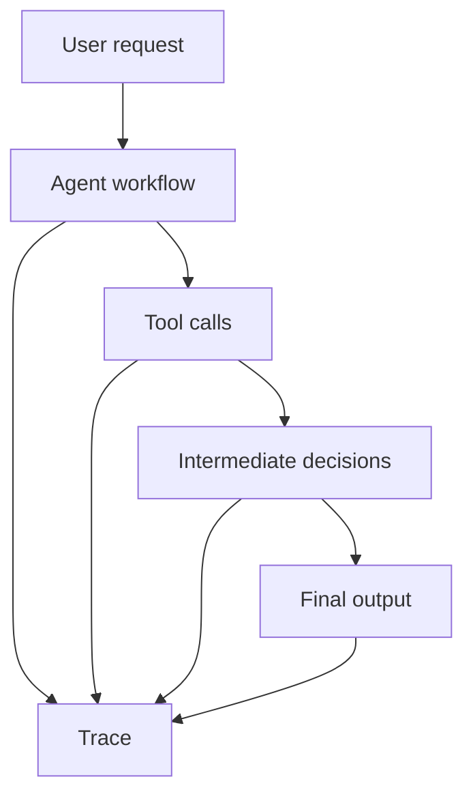
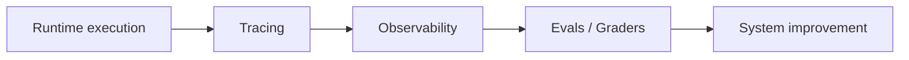

---
tags:
  - agents
  - frameworks
  - evals
  - observability
type: note
status: evergreen
source: "OpenAI Agent Evals · OpenAI Trace Grading · Azure Monitor Agent Observability"
parent_note: "[[Agent Frameworks - MOC]]"
---

# Agent Frameworks - Evaluation and Observability

## ภาพรวม

framework ที่ดีไม่ได้ช่วยแค่ orchestration แต่ต้องช่วยให้ระบบ `trace`, `inspect`, `evaluate`, และ `improve` ได้ด้วย

---

## ขอบเขต

- traces
- workflow visibility
- trace grading
- observability signals
- eval integration

---

## ทำไมเรื่องนี้เป็นแกนของ framework

หน้า `Agent evals` และ `Trace grading` ของ OpenAI ชี้ชัดว่า workflow-level systems ต้องถูกวัดเกินกว่าคำตอบสุดท้าย เพราะ trace มีทั้ง:
- decisions
- tool calls
- reasoning steps
- workflow behavior

ถ้า framework ไม่เปิด visibility ระดับนี้ การแก้ปัญหา agent จะกลายเป็น black-box debugging

---

## ชั้น 1: มองเห็น runtime

ขั้นต่ำ framework ควรทำให้เห็น:
- step boundaries
- tool calls
- tool outputs
- retries
- handoffs
- termination conditions

ในเชิงสถาปัตย์ นี่คือพื้นฐานของ observability ไม่ใช่ optional feature

---

## ชั้น 2: การตรวจ trace

OpenAI อธิบายว่า trace คือ end-to-end log ของ decisions, tool calls, และ reasoning steps ของ agent  
เมื่อระบบซับซ้อนขึ้น trace มีค่ามากกว่า final output เพราะช่วยบอกได้ว่า:
- fail เพราะเลือก tool ผิด
- fail เพราะลำดับ steps ผิด
- fail เพราะ retry policy แย่
- fail เพราะ context assembly ไม่พอ

---

## ชั้น 3: Trace Grading และ Agent Evals

OpenAI ระบุว่า:
- trace grading ใช้ structured scores/labels กับ trace
- trace evals ช่วย benchmark changes, identify regressions, และ validate improvements
- agent evals ใช้ reproducible evaluations เพื่อวัดคุณภาพของ agents

ดังนั้นในเชิง framework:
- observability ที่ดีควร feed เข้าสู่ eval system ได้
- traces ไม่ควรจบแค่ log viewer

---

## ชั้น 4: การมอนิเตอร์ใน production

Microsoft Learn ฝั่ง `Monitor AI agents with Application Insights` อธิบายแนวคิด unified monitoring สำหรับ AI agents โดยรวม telemetry, diagnostics, token usage, cost analysis, และ error troubleshooting เข้าด้วยกัน

มุมนี้ชี้ว่า observability ของ agents ควรครอบ:
- performance
- cost
- errors
- behavioral anomalies

ไม่ใช่ดู correctness อย่างเดียว

---

## คำถามเรื่อง framework ที่สำคัญ

เวลาเลือกหรือประเมิน framework ควรถามว่า:
- trace model เป็นแบบไหน
- step-level logs ดูได้แค่ไหน
- tool call visibility ละเอียดพอไหม
- export telemetry ได้หรือไม่
- eval hooks หรือ graders ผูกเข้าระบบง่ายไหม
- failures จาก production แปลงเป็น regression cases ได้ไหม

---

## ข้อสรุปเชิงสถาปัตยกรรมสำหรับ vault นี้

framework maturity ในมุมของ vault นี้ดูได้ 4 ชั้น:
1. run workflows ได้
2. inspect traces ได้
3. evaluate traces / outputs ได้
4. close the loop back to system improvement ได้

ถ้าขาดชั้น 2-4 framework นั้นยังเหมาะกับ prototype มากกว่า long-term production system

---

## Failure Modes

- framework ซ่อน orchestration จน trace ไม่ชัด
- เห็น final output แต่ไม่เห็น trajectory
- เก็บ logs ได้แต่ใช้ทำ eval ไม่ได้
- มี observability แต่ไม่มี feedback loop เข้าสู่ regression suite

---

## หลักออกแบบ

- อย่าเลือก framework จาก orchestration features อย่างเดียว
- ให้ trace model เป็น first-class concern ตั้งแต่ต้น
- ผูก observability เข้ากับ eval strategy เสมอ
- ถ้าระบบมี tools หรือ multi-step logic ให้คิดเรื่อง trace grading ตั้งแต่แรก
- แยก correctness, safety, latency, และ cost เป็นคนละ signal

---

## ลิงก์ที่เกี่ยวข้อง

- [[02 AI Systems/Evals/Core/09 - Observability and Feedback Loops]]
- [[02 AI Systems/Evals/Application/08 - Agent Evals]]
- [[02 AI Systems/Guardrails/Operations/06 - Monitoring and Incidents]]
- [[02 AI Systems/Agent Frameworks/Core/04 - Tool Orchestration]]
- [[04 Synthesis/Synthesis - Safety, Reliability, and Evals]]
- [[Home]]

---

## แหล่งอ้างอิงทางการ

- OpenAI Agent Evals: https://platform.openai.com/docs/guides/agent-evals
- OpenAI Trace Grading: https://platform.openai.com/docs/guides/trace-grading
- Microsoft Learn - Monitor AI Agents with Application Insights: https://learn.microsoft.com/en-us/azure/azure-monitor/app/agents-view
