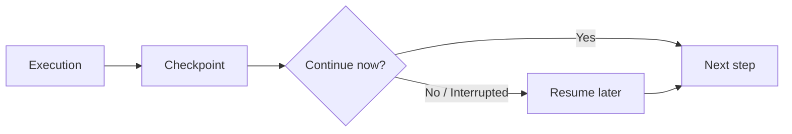

---
tags:
  - agents
  - frameworks
  - checkpointing
  - resumability
type: note
status: evergreen
source: "Microsoft Learn, Google ADK"
parent_note: "[[Agent Frameworks - MOC]]"
---

# Agent Frameworks - Checkpointing and Resumability

> โน้ตเสริมสำหรับอธิบายว่า checkpointing, pause/resume, และ resumability เป็น capability สำคัญของ agent runtimes อย่างไร

---

## ภาพรวม

เมื่อระบบ agent ต้องทำงานยาว, รอ human approval, หรือมีหลาย steps ข้ามเวลา state อย่างเดียวไม่พอ ต้องมีความสามารถในการ:
- บันทึก execution state
- กลับมาทำต่อจากจุดเดิม
- recover จาก failures

Microsoft Agent Framework อธิบาย checkpoints ไว้ชัดว่าใช้เก็บ workflow state ณ จุดหนึ่งและ resume ได้ภายหลัง  
Google ADK แยก `Session`, `State`, และ `Memory` เป็นคนละชั้น ซึ่งช่วยให้เห็นว่า resumability ไม่ใช่แค่ “เก็บ memory” แต่เป็นเรื่อง execution continuity ด้วย

---

## ขอบเขต

โน้ตนี้เน้น:
- checkpoints
- pause / resume
- long-running execution continuity
- inspection และ recovery

ไม่เน้น implementation syntax ของ framework ใด framework หนึ่ง

---

## Checkpointing คืออะไร

checkpointing คือความสามารถในการบันทึก execution state เพื่อกลับมาทำต่อจากจุดเดิม

สิ่งนี้สำคัญเมื่อมี:
- long-running tasks
- human approvals
- external failures
- step-by-step workflows

framework ที่รองรับ checkpointing ดีจะช่วย:
- recover หลัง failure
- pause / resume
- inspect intermediate state
- re-run from partial points

---

## Checkpoint เก็บอะไรบ้าง

Microsoft Agent Framework อธิบายว่า checkpoint สามารถ capture state ที่เกี่ยวข้องกับ workflow execution เช่น:
- current executor state
- pending messages for the next step
- pending requests/responses
- shared state

มุมสำคัญคือ checkpoint ไม่ได้เก็บแค่ “ข้อความล่าสุด” แต่เก็บสิ่งที่จำเป็นต่อการดำเนิน execution ต่อ

---

## Resume ไม่เท่ากับ Memory Recall

resume จาก checkpoint ต่างจาก memory recall:
- checkpointing = continuity ของ execution state
- memory recall = retrieval ของ prior knowledge หรือ prior interactions

ดังนั้นถ้าระบบต้อง “ทำงานต่อจากจุดเดิม” ให้คิดเรื่อง checkpoints  
ถ้าระบบต้อง “จำสิ่งที่เคยรู้หรือเคยเกิด” ให้คิดเรื่อง memory systems

---

## เมื่อเรื่องนี้สำคัญ

checkpointing/resumability สำคัญเป็นพิเศษเมื่อ:
- workflow ยาวเกินหนึ่ง request-response cycle
- มี human approval gates
- มี external tools ที่อาจ fail หรือ timeout
- ต้องการ auditability ของ intermediate state
- ต้องการ migrate or resume execution across environments

---

## หลักออกแบบ

- แยก execution continuity ออกจาก knowledge continuity
- ถ้าระบบมี long-running workflow ให้ถามตั้งแต่ต้นว่าจะ checkpoint ตรงไหน
- checkpoint ควรเก็บสิ่งที่จำเป็นต่อการ resume จริง ไม่ใช่เก็บทุกอย่างแบบไม่คัด
- อย่าคิดว่า memory หรือ conversation history จะแทน resumability ได้
- ถ้าระบบมี approval gates หรือ external dependencies ให้ถือว่า checkpointing เป็น first-class concern

---

## โน้ตที่เกี่ยวข้อง

- [[03 - State and Memory]]
- [[02 AI Systems/Memory Systems/Core/01 - Working Memory vs Long-Term Memory]]
- [[02 AI Systems/Memory Systems/Application/04 - Agent Memory Patterns]]
- [[04 Synthesis/Synthesis - Agent Runtime Layers]]

---

## แหล่งอ้างอิงทางการ

- Microsoft Agent Framework Workflows - Checkpoints  
  https://learn.microsoft.com/en-us/agent-framework/user-guide/workflows/checkpoints
- Google ADK: Sessions  
  https://google.github.io/adk-docs/sessions/
- Google ADK: State  
  https://google.github.io/adk-docs/sessions/state/
