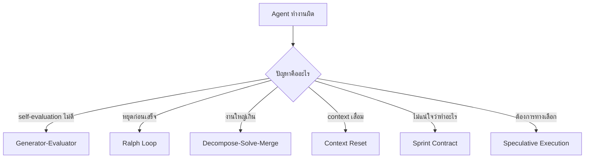

---
tags:
  - agents
  - harness
  - patterns
  - orchestration
type: note
status: evergreen
source: "Anthropic Harness Design · OpenAI Harness Engineering · LangChain Anatomy of Agent Harness · MindStudio Harness Engineering"
parent_note: "[[Agent Frameworks - MOC]]"
created: "2026-04-23"
updated: ""
---

# Harness Patterns

> patterns ที่ใช้ใน harness engineering สำหรับ long-running agent systems

---

## ภาพรวม

harness patterns คือ recurring solutions สำหรับปัญหาที่เกิดเมื่อ agent ทำงานนานขึ้น ซับซ้อนขึ้น หรือต้องการ quality สูงขึ้น

แต่ละ pattern ตอบปัญหาเฉพาะ:

---

## 1. Generator-Evaluator Loop

> ที่มา: Anthropic (harness-design-long-running-apps)

**ปัญหา**: เมื่อถาม agent ว่างานดีไหม มักตอบว่าดีเสมอ แม้คุณภาพจะแย่ — โดยเฉพาะงาน subjective เช่น design

**วิธีแก้**: แยก agent ที่ทำงาน (generator) ออกจาก agent ที่ตัดสิน (evaluator)

| Agent | หน้าที่ |
|---|---|
| Planner | ขยาย prompt สั้น ๆ เป็น full spec |
| Generator | implement ทีละ feature ตาม spec |
| Evaluator | ใช้ Playwright ทดสอบ app จริง แล้วให้คะแนนตาม criteria |

หลักการสำคัญ:
- evaluator ต้อง calibrate ให้ skeptical — ปรับง่ายกว่าทำให้ generator วิจารณ์ตัวเอง
- evaluator ควร interact กับ output จริง (เช่น navigate web page) ไม่ใช่แค่อ่าน code
- generator ตัดสินใจหลังแต่ละ evaluation: refine ต่อ หรือ pivot ทิศทางใหม่
- Anthropic ทดสอบ 5-15 iterations ต่อ generation, บาง run ใช้เวลา 4 ชั่วโมง

**ผลลัพธ์**: Anthropic พบว่า harness run สร้าง app ที่ feature ครบกว่า, polish ดีกว่า, และ core functionality ทำงานจริง เทียบกับ solo run ที่ feature หลักพัง

→ ดูเพิ่มที่ [[04 Synthesis/Bridge/Synthesis - Safety, Reliability, and Evals|Safety, Reliability, and Evals]] สำหรับ generator-evaluator separation ในมุม eval

---

## 2. Ralph Loop (Continuation Loop)

> ที่มา: OpenAI (harness-engineering), LangChain

**ปัญหา**: agent หยุดทำงานก่อนเสร็จ (early stopping) โดยเฉพาะเมื่อ context ยาวขึ้น

**วิธีแก้**: harness intercept ตอน agent พยายามหยุด แล้ว reinject original prompt ใน clean context window บังคับให้ทำต่อ

กลไก:
1. agent ทำงานจนเต็ม context หรือพยายามหยุด
2. hook intercept exit attempt
3. harness สร้าง clean context window ใหม่
4. reinject original prompt + state จาก filesystem
5. agent อ่าน state แล้วทำต่อจากจุดเดิม

filesystem เป็น key — แต่ละ iteration เริ่มด้วย fresh context แต่อ่าน state จาก iteration ก่อนหน้า

OpenAI ใช้ pattern นี้ใน Codex: agent review changes → request agent reviews → respond to feedback → iterate จนทุก reviewer พอใจ

---

## 3. Decompose-Solve-Merge

> ที่มา: Anthropic (sprint construct), MindStudio, dev.to

**ปัญหา**: งานใหญ่เกินกว่า agent เดียวจะจัดการได้ดีใน session เดียว

**วิธีแก้**: planner agent แตกงานเป็น subtasks → แต่ละ subtask ถูก solve โดย agent เฉพาะทาง → integration agent รวมผล

| Phase | Agent | หน้าที่ |
|---|---|---|
| Decompose | Planner | แตก goal เป็น subtasks |
| Solve | Specialized agents | แต่ละตัวทำ subtask ด้วย scoped context |
| Merge | Integrator | รวม outputs, resolve conflicts |

Anthropic ใช้ sprint construct: generator ทำทีละ feature จาก spec, evaluator ตรวจทีละ sprint

dev.to ใช้ 6-agent pipeline: Orchestrator → PO-Spec → Feature Design → Tech Lead → Build → QA

---

## 4. Sprint Contract

> ที่มา: Anthropic (harness-design-long-running-apps)

**ปัญหา**: spec ระดับสูงไม่ชัดพอสำหรับ implementation → agent สร้างสิ่งที่ไม่ตรง spec

**วิธีแก้**: ก่อนแต่ละ sprint, generator และ evaluator **negotiate** ว่า "done" หมายถึงอะไร

กลไก:
1. generator เสนอว่าจะ build อะไร + success criteria
2. evaluator review ว่า criteria ครอบคลุมพอไหม
3. iterate จนตกลงกัน
4. generator build ตาม contract
5. evaluator ตรวจตาม contract criteria

Anthropic พบว่า Sprint 3 เดียวมี 27 criteria สำหรับ level editor — evaluator ตรวจทีละข้อผ่าน Playwright

---

## 5. Context Reset vs Compaction

> ที่มา: Anthropic

**ปัญหา**: context rot — agent เริ่มทำงานแย่ลงเมื่อ context window เต็ม + context anxiety — agent เริ่มรีบสรุปงานเมื่อรู้สึกว่าใกล้ limit

| วิธี | กลไก | ข้อดี | ข้อเสีย |
|---|---|---|---|
| **Compaction** | สรุป history เก่าใน context เดิม | รักษา continuity | context anxiety ยังอยู่ |
| **Context Reset** | ล้าง context ทั้งหมด + handoff state ไป agent ใหม่ | clean slate, หาย anxiety | ต้องมี handoff artifact ดีพอ, เพิ่ม latency + tokens |

Anthropic พบว่า Sonnet 4.5 มี context anxiety รุนแรงจน compaction ไม่พอ → ต้องใช้ context resets
Opus 4.5 ลด context anxiety ได้เอง → ไม่ต้อง resets อีก → harness ถูก simplify

> นี่คือตัวอย่างของ harness assumptions ที่ go stale เมื่อ model ดีขึ้น

→ ดูเพิ่มที่ [[03 Tools/Claude Code/Core/25 - Context Compaction Pipeline|Context Compaction Pipeline]] สำหรับ 5-layer compaction ของ Claude Code

---

## 6. Speculative Execution

> ที่มา: MindStudio

**ปัญหา**: ไม่แน่ใจว่า approach ไหนดีที่สุด

**วิธีแก้**: รัน multiple solutions ขนานกัน แล้วเลือก best result ตาม evaluation criteria (test pass rate, code coverage, complexity metrics, หรือ agent assessment)

แพงกว่า แต่คุ้มสำหรับ high-stakes problems ที่ cost ของ suboptimal solution สูงกว่า cost ของ parallel runs

---

## เลือก Pattern อย่างไร

| สถานการณ์ | Pattern ที่เหมาะ |
|---|---|
| Agent ชมตัวเอง ไม่จับ bugs | Generator-Evaluator |
| Agent หยุดก่อนเสร็จ | Ralph Loop |
| งานใหญ่ ต้องแบ่ง | Decompose-Solve-Merge |
| Spec ไม่ชัด ต้องตกลงก่อน | Sprint Contract |
| Context เสื่อม / anxiety | Context Reset |
| ต้องการทางเลือกหลายทาง | Speculative Execution |

patterns เหล่านี้ **compose ได้** — Anthropic ใช้ Decompose + Sprint Contract + Generator-Evaluator ร่วมกันใน harness เดียว

---

## ความสัมพันธ์กับโน้ตอื่น

- [[02 AI Systems/AI Agent Fundamentals/Core/08 - Harness Engineering|Harness Engineering]] — definition และ components
- [[02 AI Systems/AI Agent Fundamentals/Core/09 - Guides vs Sensors|Guides vs Sensors]] — control taxonomy
- [[02 AI Systems/AI Agent Fundamentals/Core/07 - รูปแบบ Agent Architectures|Agent Architectures]] — agent patterns ที่ harness patterns implement
- [[02 AI Systems/Agent Frameworks/Core/02 - Framework vs Custom Build|Framework vs Custom Build]] — framework ให้ primitives สำหรับ patterns เหล่านี้
- [[03 Tools/Claude Code/Core/03 - Orchestrator Pattern|Orchestrator Pattern]] — Claude Code implementation ของ delegation patterns
- [[03 Tools/Claude Code/Core/25 - Context Compaction Pipeline|Context Compaction Pipeline]] — compaction side ของ Context Reset vs Compaction
- [[02 AI Systems/Agent Frameworks/Agent Frameworks - MOC|Agent Frameworks - MOC]]

---

## References

- Anthropic - Harness design for long-running apps: https://www.anthropic.com/engineering/harness-design-long-running-apps
- OpenAI - Harness engineering: https://openai.com/index/harness-engineering/
- LangChain - The Anatomy of an Agent Harness: https://www.langchain.com/blog/the-anatomy-of-an-agent-harness
- MindStudio - What Is Harness Engineering?: https://www.mindstudio.ai/blog/what-is-harness-engineering-ai-coding
