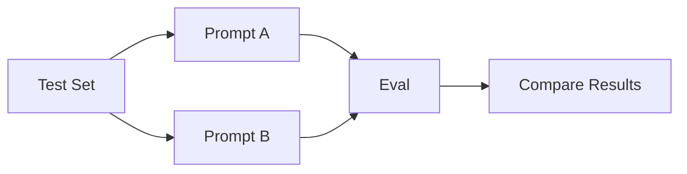

---
tags:
  - evals
  - prompting
type: note
status: draft
source: "OpenAI Evals Guide · OpenAI Evaluation Best Practices"
parent_note: "[[Evals - MOC]]"
---

# Evals - Prompt Evals

## Summary

prompt eval ใช้ตรวจว่าคำสั่ง, examples, และ output constraints ทำงานตรงเป้าหมายสม่ำเสมอแค่ไหน

---

## Scope

- exact-match / rubric evaluation
- format adherence
- hallucination checks
- adversarial inputs
- regression sets

---

## Prompt Evals คืออะไร

prompt eval คือการวัดว่า prompt, examples, schema constraints, และ instructions ให้พฤติกรรมที่สม่ำเสมอและตรงเป้าหมายหรือไม่

OpenAI docs แนะนำให้ใช้ evals เพื่อวัด performance ของ prompt variants อย่างเป็นระบบ โดยเฉพาะเมื่อมีการเปลี่ยน prompt หรือ model

---

## สิ่งที่มักวัดใน Prompt Evals

### 1. Exact Match / Rule Match

เหมาะกับงานที่คำตอบมี expected output ชัด

### 2. Format Adherence

เช่น:
- JSON schema adherence
- required fields ครบไหม
- markdown structure ถูกไหม

### 3. Hallucination / Unsupported Output

โดยเฉพาะ prompt ที่สั่งให้ยึด context หรือสั่งว่า “ถ้าไม่รู้ให้บอกไม่รู้”

### 4. Adversarial Robustness

ดูว่าพังง่ายไหมเมื่อ input กำกวม, ยาว, หรือมี prompt injection style content

### 5. Regression

prompt ใหม่ดีขึ้นจริงไหม หรือทำของเดิมพัง

---

## Regression Sets

regression set คือชุดตัวอย่างที่ต้องรันซ้ำเมื่อมีการเปลี่ยน:
- prompt wording
- examples
- schema
- model version

ประโยชน์:
- ป้องกันการ “แก้ตรงนี้พังตรงนั้น”
- เก็บ institutional memory ของ failure cases

---

## Prompt Variants

prompt evals มักใช้ compare:
- baseline prompt
- revised prompt
- prompt + examples
- prompt + structured outputs

---

## What Good Prompt Evals Look Like

prompt evals ที่ดีควร:
- มี success criteria ชัด
- มี representative test set
- มี adversarial cases
- มี regression cases
- วัดทั้ง quality และ format adherence

---

## Failure Modes

### 1. Test Set Too Narrow

prompt ดูดีแต่ใช้จริงพัง

### 2. Overfitting to Eval Set

prompt ถูก optimize จนดีเฉพาะ test cases เดิม

### 3. Ignore Format Failures

ตอบถูกแต่ใช้ downstream ไม่ได้

### 4. No Regression Discipline

prompt ใหม่ดีขึ้นบางจุดแต่พังของเดิม

---

## Design Rules

- ทุก prompt ที่สำคัญควรมี regression set
- eval ต้องวัดทั้ง content และ format
- เก็บ adversarial cases ไว้เสมอ
- ใช้ pairwise comparison เมื่อ optimize prompt variants
- ถ้า task ซับซ้อนเกิน exact match ให้ใช้ rubric-based grading อย่างมีเกณฑ์

---

## ความสัมพันธ์กับโน้ตอื่น

- [[01 Foundations/Prompt Engineering/05 - Evaluation และ Failure Modes]] — foundations ของ prompt evaluation
- [[01 Foundations/Prompt Engineering/07 - Structured Generation และ Output Formats]] — format adherence สำคัญกับ prompt evals
- [[02 AI Systems/Evals/Core/01 - Success Criteria]] — prompt eval ต้องมี success criteria ก่อน
- [[02 AI Systems/Evals/Core/03 - LLM-as-Judge]] — ใช้ judge model กับ subjective prompt outputs ได้
- [[05 Use Cases/Use Cases - Improve Prompt Reliability]] — มุมใช้งานจริง
- [[Evals - MOC]]

---

## Related Notes

- [[05 Use Cases/Use Cases - Improve Prompt Reliability]]
- [[Evals - MOC]]

---

## Official References

- OpenAI Evals Guide: https://platform.openai.com/docs/guides/evals
- OpenAI Evaluation Best Practices: https://platform.openai.com/docs/guides/evaluation-best-practices
- OpenAI Getting Started with Datasets: https://platform.openai.com/docs/guides/evaluation-getting-started
