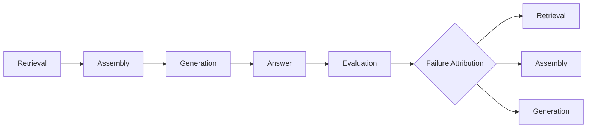

---
tags:
  - evals
  - rag
type: note
status: evergreen
source: "OpenAI Retrieval Docs · Google Cloud Grounding / Evaluation Docs"
parent_note: "[[Evals - MOC]]"
---

# Evals - RAG Evals

## Summary

RAG eval ต้องแยกชั้น retrieval, context, และ answer quality เพื่อรู้ว่าปัญหาอยู่ตรง retrieval หรือ generation

---

## Scope

- retrieval recall / precision
- grounding quality
- answer faithfulness
- citation quality
- retrieval-vs-generation diagnosis

---

## RAG Evals ต้องแยกเป็นชั้น

RAG เป็นระบบหลายชั้น:
- retrieval
- reranking / selection
- context assembly
- generation

ดังนั้น RAG eval ที่ดีต้องตอบให้ได้ว่าปัญหาเกิดที่ชั้นไหน  
OpenAI retrieval docs และ Google grounding docs ต่าง reinforce แนวทางนี้ว่า answer quality อย่างเดียวไม่พอ ต้องดู grounding และ evidence path ด้วย

---

## Retrieval Metrics

RAG eval ชั้นแรกคือดูว่า retrieval หา evidence ที่ควรเจอได้ไหม

สิ่งที่มักวัด:
- recall@k
- precision@k
- hit rate
- ranking quality

จุดสำคัญ:
- ถ้า relevant evidence ไม่อยู่ใน candidate set downstream จะช่วยได้จำกัดมาก
- retrieval metrics ควรจับคู่กับ question slices ไม่ใช่ดู aggregated score อย่างเดียว

---

## Grounding Quality

Google docs ฝั่ง grounding ระบุชัดว่าควรแยก groundedness หรือ support ออกจาก quality ของคำตอบ

สิ่งที่ควรวัด:
- answer อิงกับ evidence จริงไหม
- claim แต่ละส่วนมี supporting evidence ไหม
- citation ตรงกับ claim หรือไม่

นี่ต่างจากการวัด “ตอบดีไหม” เพราะ answer อาจอ่านดีแต่ไม่ grounded

---

## Answer Faithfulness

faithfulness หรือ factual faithfulness คือการที่ answer ไม่เติม facts นอก evidence ที่ retrieval ส่งมา

RAG system อาจพลาดได้แม้ retrieval ดี ถ้า:
- model เติมเกิน
- summarize ผิด
- combine evidence ผิด

ดังนั้น faithfulness เป็นชั้น generation-side eval ที่สำคัญ

---

## Citation Quality

citation quality ถามว่า:
- cite source ถูกไหม
- cite ตรง claim ไหม
- citation ครอบทุก claim สำคัญไหม

RAG ที่ใช้งานจริง โดยเฉพาะใน enterprise หรือ research settings มักต้องวัดมิตินี้แยก

---

## Retrieval-vs-Generation Diagnosis

ปัญหาที่ต้องแยกให้ออก:

### 1. Retrieval Miss

ไม่มี evidence ที่ควรอยู่ใน top-k

### 2. Selection / Assembly Error

retrieval เจอ evidence แล้ว แต่ final context เลือกไม่ดี

### 3. Generation Error

evidence ถูกแล้ว แต่ answer ยัง hallucinate หรือ summarize ผิด

### 4. Citation Error

answer ถูกบางส่วน แต่ mapping ไป source ผิด

---

## Good RAG Eval Set

eval set ที่ดีควรมีหลายชนิดของคำถาม เช่น:
- exact lookup
- multi-hop synthesis
- date-sensitive
- entity-heavy
- ambiguous natural language
- adversarial or noisy queries

ถ้าไม่ slice แบบนี้ ระบบอาจดู “โอเค” ในคะแนนรวม แต่พังหนักใน query class สำคัญ

---

## Design Rules

- แยก retrieval, grounding, และ answer quality ออกจากกัน
- วัด citation quality ถ้า system ต้องอธิบายแหล่งที่มา
- ใช้ question slices เพื่อไม่ให้คะแนนรวมหลอก
- debug จาก failure attribution ไม่ใช่ดู final score อย่างเดียว
- เอา operational metrics เช่น latency/cost มาประกอบด้วยเมื่อ compare pipelines

---

## ความสัมพันธ์กับโน้ตอื่น

- [[02 AI Systems/RAG/Evaluation/08 - Evaluation]] — มุมมอง evaluation ฝั่ง RAG โดยตรง
- [[02 AI Systems/Evals/Core/01 - Success Criteria]] — success criteria สำหรับ RAG systems
- [[02 AI Systems/RAG/Core/07 - Grounding and Citation]] — grounding กับ citation quality
- [[02 AI Systems/RAG/Core/01 - Retrieval Basics]] — retrieval metrics เริ่มจาก retrieval layer
- [[Evals - MOC]]

---

## Related Notes

- [[02 AI Systems/RAG/Evaluation/08 - Evaluation]]
- [[Evals - MOC]]

---

## Official References

- OpenAI Retrieval Guide: https://platform.openai.com/docs/guides/retrieval
- Google Cloud - Ground responses using RAG: https://cloud.google.com/vertex-ai/generative-ai/docs/grounding/ground-responses-using-rag
- Google Cloud - Check grounding with RAG: https://cloud.google.com/generative-ai-app-builder/docs/check-grounding
- Google Cloud - Evaluation Overview: https://cloud.google.com/vertex-ai/generative-ai/docs/models/evaluation-overview
