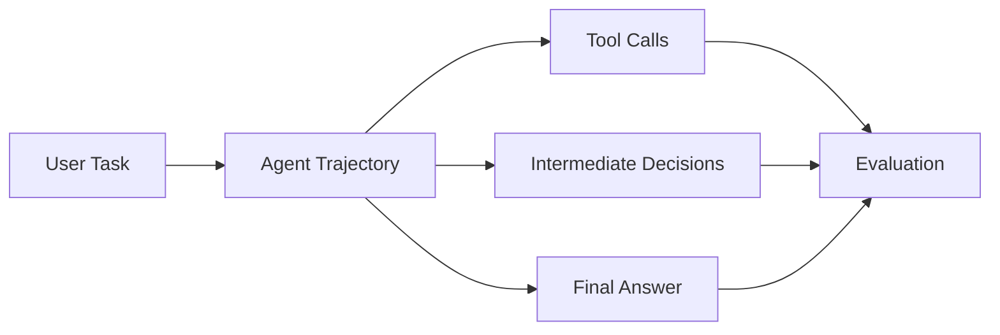

---
tags:
  - evals
  - agents
type: note
status: evergreen
source: "OpenAI Agent Evals Guide · OpenAI Evals Guide"
parent_note: "[[Evals - MOC]]"
---

# Evals - Agent Evals

## Summary

agent eval ไม่ควรวัดแค่ final answer แต่ต้องดู planning, tool selection, retries, safety, และ cost/latency ด้วย

---

## Scope

- task completion
- tool correctness
- trajectory quality
- safety and policy adherence
- cost and latency tradeoffs

---

## Agent Evals ต่างจาก Model Evals อย่างไร

agent eval ไม่ได้วัดแค่ final answer แต่ต้องวัด behavior ของทั้ง workflow

OpenAI agent evals docs แนะนำให้มอง evals ในระดับ workflow และใช้ trace grading เพื่อ identify errors ที่เกิดขึ้นใน trajectory

ดังนั้น agent eval มักต้องมอง:
- planning
- tool choice
- tool execution
- retries
- stopping behavior
- final answer

---

## Task Completion

คำถามแรกของ agent eval คือ “งานสำเร็จไหม”

ตัวอย่าง:
- agent หาข้อมูลครบไหม
- ทำ multi-step workflow จบไหม
- คืนผลลัพธ์ที่ downstream ใช้ได้ไหม

แต่ task completion อย่างเดียวไม่พอ เพราะ agent อาจ “จบงาน” แบบเสี่ยงหรือเปลืองเกินเหตุ

---

## Tool Correctness

ต้องวัดว่า agent:
- เลือก tool ถูกไหม
- ใส่ arguments ถูกไหม
- ใช้ tool เกินจำเป็นไหม
- จัดการ errors ถูกไหม

agent ที่ตอบถูกแต่เรียก tool ผิด pattern บ่อย ยังมีความเสี่ยงสูงใน production

---

## Trajectory Quality

trajectory quality ดูว่าเส้นทางที่ agent ใช้ “สมเหตุสมผลไหม”

สิ่งที่ควรดู:
- unnecessary steps
- loops
- recovery behavior
- retries
- branch choice

OpenAI agent evals docs แนะนำ trace grading สำหรับงานประเภทนี้ เพราะ final answer อย่างเดียวบอกไม่ได้ว่า workflow-level behavior ดีหรือไม่

---

## Safety And Policy Adherence

agent eval ต้องรวม:
- policy adherence
- confirmation behavior
- permission boundaries
- harmful tool use

เพราะ agent มี action surface มากกว่า plain LLM app

---

## Operational Metrics

นอกจาก quality แล้ว agent eval ควรดู:
- latency
- cost
- number of tool calls
- failure recovery rate
- escalation rate

นี่สำคัญมากใน systems จริง เพราะ agent ที่ “เก่ง” แต่แพงหรือช้าเกินไปอาจใช้จริงไม่ได้

---

## Failure Modes

### 1. Final-Answer-Only Evaluation

มองแค่ output แล้วไม่เห็น workflow errors

### 2. No Trace Visibility

วัด planning หรือ tool quality ไม่ได้

### 3. Safety Ignored

task สำเร็จแต่ policy พัง

### 4. Cost Blindness

agent ใช้ steps มากเกินแต่ไม่มีใครจับ

---

## Design Rules

- ประเมินทั้ง final outcome และ trajectory
- ใช้ trace grading เมื่อ workflow ซับซ้อน
- แยก task success, tool correctness, safety, และ operational metrics ออกจากกัน
- อย่าปล่อยให้ “answer ถูก” กลบปัญหาเรื่อง cost หรือ safety
- ถ้ามี high-stakes tools ต้องมี human spot checks หรือ explicit safety evals

---

## ความสัมพันธ์กับโน้ตอื่น

- [[02 AI Systems/AI Agent Fundamentals/Core/05 - วงจร Perceive-Think-Act-Check]] — มอง agent เป็น loop
- [[02 AI Systems/MCP/Bridge/14 - Tools: การออกแบบและทำงาน]] — tool correctness เป็นมิติ eval สำคัญ
- [[02 AI Systems/Evals/Core/01 - Success Criteria]] — ต้องกำหนด task success ก่อน
- [[02 AI Systems/Evals/Core/03 - LLM-as-Judge]] — judge model ใช้ประเมินบางมิติของ trajectory ได้
- [[02 AI Systems/Guardrails/Guardrails - MOC]] — safety และ policy adherence
- [[Evals - MOC]]

---

## Related Notes

- [[02 AI Systems/AI Agent Fundamentals/Core/05 - วงจร Perceive-Think-Act-Check]]
- [[Evals - MOC]]

---

## Official References

- OpenAI Agent Evals Guide: https://platform.openai.com/docs/guides/agent-evals
- OpenAI Evals Guide: https://platform.openai.com/docs/guides/evals
- OpenAI Evaluation Best Practices: https://platform.openai.com/docs/guides/evaluation-best-practices
