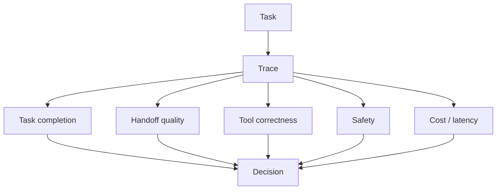

---
tags:
  - evals
  - multi-agent
  - evaluation
  - traces
  - reliability
  - derived
type: note
status: draft
source: "https://platform.openai.com/docs/guides/agent-evals · https://platform.openai.com/docs/guides/trace-grading · https://platform.openai.com/docs/guides/evals · https://platform.openai.com/docs/guides/evaluation-best-practices · https://docs.langchain.com/oss/javascript/langgraph/persistence · https://docs.crewai.com/en/concepts/flows"
parent_note: "[[Evals - MOC]]"
---

# Evals - Multi-Agent Evals

## Summary

multi-agent evals must measure more than answer quality. They need to measure how well agents coordinate, hand off tasks, recover from failures, and stay within policy and budget.

OpenAI explicitly recommends trace grading for workflow-level errors, and its agent eval docs position trace grading as the right tool when you need to identify where an agent or workflow went wrong.

---

## What To Measure

### 1. Task Completion

- did the full workflow finish
- did all required subtasks complete
- did the system produce a usable final result

### 2. Handoff Quality

- did the right agent receive the right task
- was the payload complete
- was ownership unambiguous
- did the next agent continue without rework

### 3. State Consistency

- did all agents observe the same task state
- did interrupts or resumes preserve correctness
- did persisted state reflect the latest valid update

### 4. Tool Correctness

- were the right tools used
- were arguments valid
- were side effects authorized
- were failures handled correctly

### 5. Safety And Policy Adherence

- were permission boundaries respected
- did the workflow avoid unsafe actions
- did the team remain robust to prompt injection and untrusted inputs

### 6. Operational Cost

- number of tool calls
- number of retries
- latency per handoff
- token cost per completed task

---

## Why Final-Answer Eval Is Not Enough

In multi-agent systems, the final answer can look correct while the system still:
- wasted steps
- took unsafe actions
- lost state between agents
- routed through the wrong specialist
- recovered from failure incorrectly

Trace grading is useful because it evaluates the actual trace of decisions and actions rather than only the end output.

---

## Evaluation Layers

### Layer 1: Example-Level Scoring

Score a single run:
- pass / fail
- rubric score
- LLM-judge score

### Layer 2: Trace Grading

Grade the sequence of actions:
- route choice
- intermediate decisions
- retries
- handoffs
- completion behavior

### Layer 3: Regression Testing

Compare current behavior to previous behavior:
- did coordination degrade
- did retries increase
- did latency jump
- did safety regress

### Layer 4: System Benchmarks

Run repeated tasks across multiple scenarios:
- typical cases
- edge cases
- adversarial cases
- interrupted runs

---

## Multi-Agent Specific Test Cases

1. **Correct handoff**
   - one agent finishes, another consumes the result without losing context

2. **Broken handoff**
   - the next agent receives incomplete or stale state

3. **Interrupted run**
   - workflow pauses and resumes after human approval or failure

4. **Routing ambiguity**
   - multiple specialists are plausible and the router must choose

5. **Tool failure**
   - one agent’s tool call fails and the system must recover

6. **Prompt injection exposure**
   - untrusted input enters one agent and is forwarded downstream

7. **Budget pressure**
   - the team must finish within latency or cost constraints

---

## Recommended Metrics

- task success rate
- handoff success rate
- state consistency rate
- retry count per completed task
- median / p95 latency
- tool-call count
- escalation rate
- safety violation count

---

## Design Rules

- evaluate the trace, not just the answer
- make handoffs explicit in the test set
- include resume and interrupt cases
- include unsafe / adversarial cases
- measure cost and latency alongside quality
- keep a regression corpus for the actual workflow topology

---

## Cross Links

- [[02 AI Systems/Evals/Application/08 - Agent Evals]]
- [[02 AI Systems/Evals/Core/09 - Observability and Feedback Loops]]
- [[04 Synthesis/Synthesis - Multi-Agent Failure Modes]]
- [[06 Engineering/Architecture to Code/Architecture - Multi-Agent Infrastructure]]
- [[06 Engineering/Patterns/Pattern - Sync vs Async Agent Communication]]
- [[06 Engineering/Patterns/Pattern - Retry and Backoff]]
- [[Home]]

---

## References

- OpenAI Agent Evals: https://platform.openai.com/docs/guides/agent-evals
- OpenAI Trace Grading: https://platform.openai.com/docs/guides/trace-grading
- OpenAI Evals: https://platform.openai.com/docs/guides/evals
- OpenAI Evaluation Best Practices: https://platform.openai.com/docs/guides/evaluation-best-practices
- LangGraph Persistence: https://docs.langchain.com/oss/javascript/langgraph/persistence
- CrewAI Flows: https://docs.crewai.com/en/concepts/flows

