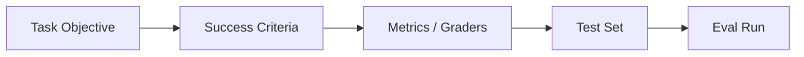

---
tags:
  - evals
  - success-criteria
type: note
status: evergreen
source: "OpenAI Evals Guide · OpenAI Evaluation Best Practices · Google Cloud Evaluation Overview"
parent_note: "[[Evals - MOC]]"
---

# Evals - Success Criteria

## Summary

eval ที่ดีเริ่มจากการนิยามว่า “สำเร็จ” คืออะไร ถ้า success criteria ไม่ชัด metric ที่ตามมาจะหลอกได้ง่าย

---

## Scope

- task objective
- acceptance criteria
- measurable outcomes
- pass/fail thresholds
- business vs technical metrics

---

## Success Criteria มาก่อน Metrics

OpenAI evaluation docs วางลำดับชัดว่า:
1. อธิบาย task ที่ต้องการให้ระบบทำ
2. รัน eval กับ test inputs
3. วิเคราะห์ผลและปรับปรุงระบบ

นั่นแปลว่า eval ที่ดีต้องเริ่มจากการกำหนดว่า “งานนี้สำเร็จหมายถึงอะไร” ก่อนค่อยเลือก grader หรือ metric

---

## Task Objective

success criteria ที่ดีต้องเริ่มจาก objective ที่ชัด เช่น:
- ตอบคำถามได้ถูกต้อง
- ยึดรูปแบบ output ที่กำหนด
- grounded กับ retrieved facts
- ใช้ tool อย่างปลอดภัย
- ตอบภายใน latency budget

ถ้า objective กว้างเกินไป เช่น “ตอบดี” หรือ “ฉลาด” metric ที่ตามมาจะหลอกได้ง่าย

---

## Acceptance Criteria

acceptance criteria คือเงื่อนไขที่ใช้ตัดสินว่า output “ผ่าน” หรือ “ไม่ผ่าน”

ตัวอย่าง:
- ต้องตอบครบทุก required field
- ต้องไม่ใช้ข้อมูลนอก source
- ต้อง cite หลักฐานเมื่อเป็นคำตอบเชิง factual
- ต้องไม่เรียก tool ที่ไม่ได้รับอนุญาต
- ต้องไม่เกิน threshold ของ latency/cost

หลักคือ:
- criteria ต้องอ่านแล้วตัดสินได้
- ต้อง trace กลับไปยัง use case จริง

---

## Measurable Outcomes

criteria ที่ดีควรแปลงเป็นสิ่งที่วัดได้ เช่น:
- exact match
- pass/fail rubric
- score 0–1
- pairwise preference
- latency percentile
- cost per task

Google Cloud evaluation docs reinforce แนวคิดนี้ว่าควร define evaluation goal และเลือก metric ให้สอดคล้องกับ objective ก่อน

---

## Pass/Fail Thresholds

threshold ใช้ตอบคำถามว่า “ดีพอหรือยัง”

ตัวอย่าง:
- format adherence ≥ 99%
- groundedness ≥ 0.9
- task completion ≥ 95%
- p95 latency < 2s

ถ้าไม่มี threshold:
- ทีมจะเถียงกันเรื่องคุณภาพโดยไม่มีเกณฑ์ร่วม
- regression จะจับได้ยาก

---

## Business Metrics vs Technical Metrics

technical metrics:
- exactness
- format adherence
- groundedness
- tool correctness

business metrics:
- task success
- human review load
- escalation rate
- SLA / latency
- cost per successful outcome

eval ที่ดีควรเชื่อมสองฝั่งนี้เข้าด้วยกัน ไม่ใช่วัดแต่ model score

---

## Failure of Bad Success Criteria

### 1. Objective Too Broad

คำว่า “ตอบดี” วัดไม่ได้จริง

### 2. Criteria Don’t Match Use Case

คะแนนดีแต่ไม่ช่วยงานจริง

### 3. No Threshold

เปรียบเทียบ run ต่อ run ไม่ได้

### 4. Ignore Operations

คุณภาพดีแต่ latency/cost ใช้งานจริงไม่ได้

---

## Design Rules

- เริ่มจาก task objective ก่อน metric
- เขียน success criteria ให้ตัดสินได้จริง
- กำหนด thresholds เสมอ
- แยก technical metrics ออกจาก business outcomes แต่ต้องเชื่อมกัน
- ถ้า criteria ยังเถียงกันอยู่ อย่าเพิ่งรีบทำ eval implementation

---

## ความสัมพันธ์กับโน้ตอื่น

- [[01 Foundations/LLM Foundations/Core/13 - Evaluation Foundations]] — foundations ของ evaluation
- [[02 AI Systems/Evals/Core/03 - LLM-as-Judge]] — grader ต้องยึด criteria ที่ชัด
- [[02 AI Systems/Evals/Application/06 - Prompt Evals]] — prompt evals ต้องมี success criteria ก่อน
- [[02 AI Systems/Evals/Application/08 - Agent Evals]] — agent evals ต้องมีทั้ง task และ operational criteria
- [[Evals - MOC]]

---

## Related Notes

- [[01 Foundations/Prompt Engineering/Core/05 - Evaluation และ Failure Modes]]
- [[Evals - MOC]]

---

## Official References

- OpenAI Evals Guide: https://platform.openai.com/docs/guides/evals
- OpenAI Evaluation Best Practices: https://platform.openai.com/docs/guides/evaluation-best-practices
- Google Cloud Evaluation Overview: https://cloud.google.com/vertex-ai/generative-ai/docs/models/evaluation-overview
- Google Cloud Determine Evaluation Metrics: https://cloud.google.com/vertex-ai/generative-ai/docs/models/determine-eval
