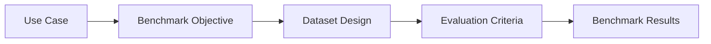

---
tags:
  - evals
  - benchmark
type: note
status: evergreen
source: "OpenAI Evaluation Best Practices"
parent_note: "[[02 AI Systems/Evals/Evals - MOC|Evals - MOC]]"
---

# Evals - Benchmark Design

## Summary

benchmark design คือการออกแบบชุดตัวอย่างและเกณฑ์วัดที่ทำให้ eval สะท้อนงานจริง ไม่ใช่แค่คะแนนสวยบนชุดทดสอบที่ง่ายหรือเอนเอียง

---

## Scope

- benchmark objective
- representative datasets
- slices and edge cases
- benchmark drift
- benchmark anti-patterns

---

## Benchmark ไม่ใช่แค่ชุดคำถาม

benchmark ที่ดีต้องกำหนดให้ชัดว่า:
- วัดอะไร
- วัดกับงานประเภทไหน
- วัดกับ distribution แบบใด
- วัดด้วยเกณฑ์แบบใด

OpenAI evaluation best practices ชี้ชัดว่าการออกแบบ eval dataset ต้องสะท้อน production traffic จริง และควรมีทั้ง typical cases, edge cases, และ adversarial cases

---

## Benchmark Objective

benchmark ทุกชุดควรมี objective เดียวที่ชัดพอ เช่น:
- วัด groundedness ของ RAG
- วัด format adherence ของ structured output
- วัด tool correctness ของ agents

ถ้า benchmark หนึ่งชุดพยายามวัดทุกอย่างพร้อมกัน:
- วิเคราะห์ยาก
- เทียบ version ยาก
- debug ยาก

---

## Representative Datasets

benchmark ที่ดีควรครอบ:
- common cases
- difficult cases
- edge cases
- adversarial cases
- prior failures

ถ้า dataset ไม่ represent งานจริง benchmark score จะหลอกได้ง่าย

---

## Slices

การแบ่ง benchmark เป็น slices สำคัญมาก เช่น:
- multilingual
- long context
- exact lookup
- multi-hop reasoning
- safety-sensitive
- format-sensitive

score รวมอาจดูดี แต่บาง slice อาจพังหนัก

---

## Benchmark Drift

benchmark ที่ดีวันนี้อาจไม่ดีในอีกไม่กี่เดือน เพราะ:
- product use case เปลี่ยน
- user behavior เปลี่ยน
- system architecture เปลี่ยน
- failure modes ใหม่เกิดขึ้น

ดังนั้น benchmark ต้องโตตามระบบจริง ไม่ใช่สร้างครั้งเดียวแล้วค้าง

---

## Anti-Patterns

### 1. Benchmark Too Easy

คะแนนสูงแต่ใช้งานจริงพัง

### 2. Overfitting to Benchmark

optimize จนเก่งเฉพาะชุด benchmark

### 3. No Edge Cases

ไม่เห็น failure modes สำคัญ

### 4. No Update Loop

เจอ failure ใหม่แต่ benchmark ไม่โตตาม

---

## Design Rules

- benchmark ต้องสะท้อนงานจริง
- แยก benchmark ตาม objective
- มี slices เสมอ
- เก็บ prior failures เข้า benchmark
- ทบทวน benchmark เป็นระยะ ไม่ใช่ static asset

---

## ความสัมพันธ์กับโน้ตอื่น

- [[02 AI Systems/Evals/Core/01 - Success Criteria]] — benchmark ต้องผูกกับ success criteria
- [[02 AI Systems/Evals/Core/05 - Regression Testing]] — benchmark หลายชุดจะกลายเป็น regression suite
- [[02 AI Systems/Evals/Application/06 - Prompt Evals]] — prompt benchmark
- [[02 AI Systems/Evals/Application/07 - RAG Evals]] — retrieval/grounding benchmark
- [[02 AI Systems/Evals/Application/08 - Agent Evals]] — task benchmarks สำหรับ agents
- [[02 AI Systems/Evals/Evals - MOC|Evals - MOC]]

---

## Official References

- OpenAI Evaluation Best Practices: https://platform.openai.com/docs/guides/evaluation-best-practices
